# 柔性触觉阵列显示层在线双态蠕变观测器

**摘要**　柔性触觉阵列在反复增减同一负载时，前一代显示层补偿器暴露出一个结构性缺陷：整片卸载后重新加载，239 s 受载历史累积的约 2000 ADC 蠕变补偿被状态机清零，同一负载的前后显示相差 2516 ADC（满载族极差），用户看到的就是"丢基线"。此前用事件式"蠕变记忆"修补，一致性极差降到 1018 ADC，但它在随机切换工况上把显示整体下移约 1200 ADC——账本式记忆伤害了它没见过的工况，该方案已废弃归档。本文给出第三条路线：把传感器与夹具当作线性粘弹性体，逐通道在线维护两个 Kelvin-Voigt 非弹性状态（快态 + 慢态），并叠加一个近零带内慢速再校准的零点跟踪，显示 = 零点 + 纯弹性响应。整条算法没有事件检测、没有状态清零、没有跨事件账本，受载门由弹性估计的自然下限形成。慢态改为跟随实测慢漂移速率（低通导数积分，带沿门与速率上限），原因是实测蠕变幅度因工况差 3 倍（约 7% 与 20%），固定幅度必在一边过扣、一边欠扣；零点跟踪修掉的是另一类实测缺陷——传感器零点偏置约 2120 ADC，若把零点当弹性载荷，全程空载的录制里状态持续生长、显示下沉 −315 ADC，引入零点跟踪后空载显示与原始读数均值差 −20 ADC。在真实数据回放上：反复增减工况一致性 10/10 段合格（用户判据 ±10%·台阶 ≈ ±1500 ADC，实测偏差 −257~+1178）；恒载录制 346 s 保压显示漂移 −108 ADC（输入自身 +1010），698 s 长保压 +54 ADC（输入 +798）；首次加载稳定时间 2.0~2.6 s，已接近输入斜坡的物理地板。代价同样如实：受载态小台阶的稳定时间 7.5~15 s（缺快相前馈）；频繁切换工况的保压段 std 相对固定幅度版上升（如 7b3977 从 33 升到 81）；卸载后到零点重新校准完成之前，显示有一段低于原始零点的过渡（τ₀=8 s 量级）。落地实现与 Python 原型逐帧对拍，最大逐帧差 5×10⁻⁵ ADC。

**关键词**　触觉阵列；粘弹性蠕变；在线观测器；Kelvin-Voigt 模型；零点跟踪；无事件补偿；一致性

---

## 1 引言

### 1.1 丢失的 2000 ADC：上一代方案的失效方式

上一代显示层补偿（v6 档）建立在事件状态机上：加载沿、卸载沿、变载各自触发状态迁移，补偿量挂在事件血统上逐代继承。它在"加载—保持—再加载"的家族路径上工作正常，但有一条它没有覆盖的路径：**整片卸载**。

现场录制（7b3977，31306 帧，21 通道 ADC 域）里的时间线是：239~240 s 输入经约 1.5 s 四级台阶塌到基线，检测器 240.08 s 确认卸载、240.86 s 状态机转入空载并**清空全部慢相补偿状态**；244.3 s 重新加载被当作全新事件，幅度参考直接锚在快相终点电平上。于是第一次加载段（t16~239）显示 = 输入 − 累积补偿（补偿从 +1570 涨到 +2289，这是正确行为：load1 从 2.4 s 一直压到 239 s，其蠕变一直在长），而重载段（t246 起）的扣除是 −54 与 +13——**239 s 受载历史被整段遗忘**。同一满载的前后显示相差 2516 ADC（族极差），这就是用户报障的"丢基线"。

值得注意的是失效的根源不是检测慢了或参数错了，而是**补偿量的连续性被设计挂在了事件血统上**：血统一断（整片卸载剪断它），连续性就没了。要修，就不能继续在"多记一点事件"的方向上加东西。

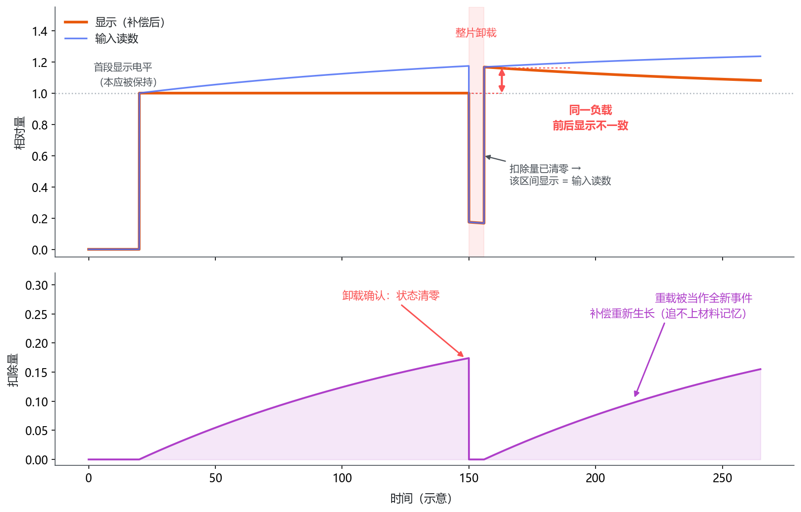

**图 1**　补偿连续性挂在事件血统上的失效方式（示意）。上：输入读数与显示；下：扣除量。卸载事件一旦被确认就清空全部状态，随后的重载被当作全新事件重新生长：重载段的显示先被抬到首段电平之上，再随时间缓慢回落到首段电平，于是同一负载的前后显示分成两族；卸载区间内扣除量为 0，两条曲线在该区间重合。图中曲线按该机制合成，用于说明成因，不是实测台账。

### 1.2 为什么事件式记忆被否决

第一轮修补（creep-mem，已废弃归档）的思路是：卸载确认时快照当时的补偿向量，重载时按当前电平折减后补齐。目标工况上它确实有效——满载族极差从 2516 降到 1018，修复目标位的扣除从 −54 恢复到 +1770，与前段补偿族对齐。

否决它的是全量回归里的另一张表：随机切换工况（31b7f9，8080 帧，5710 帧被改变）显示相对输入的中位数从 −258 下移到 −1469。机制不复杂：记忆把历史蠕变补偿套用到一次电平相当、但材料状态并不相同的新加载上。无真值时无法判定单次优劣，但"对一个未参与设计目标的工况产生整体性偏移"这个性质本身就不能接受——设计目标越是把记忆调准，域外工况被误伤的结构性风险越大。

这轮失败留下一条有用的结论：**跨卸载连续的状态不能来自账本（记发生过什么），只能来自物理量本身（材料现在处于什么状态）**。账本要对事件分类正确，物理状态不需要。

### 1.3 规律辨识给出的定量边界

在动手写观测器之前，先回答了一个前置问题：反复增减负载的数据到底服从多强的规律？对三个"反复增减同一负载"录制（7b3977 / 0cb8b6 / f9740b）逐会话独立辨识一个 9 参数线性粘弹性叠加律（双时间常数 + 按负载类别 的弹性电平），用留一法做诚实检验——用其余平台参数预测被留出段的电平：

| 会话 | 全轨迹残差 RMS | 留一预测 \|误差\| 中位 | 朴素基线（用上次同类电平） |
|---|:--:|:--:|:--:|
| 7b3977 | 803 ADC（4.5%） | 935 | 2353 |
| 0cb8b6 | 777 ADC（4.4%） | 1532 | 2074 |
| f9740b | 987 ADC（5.6%） | 1062 | 2076 |

规律存在（预测比朴素基线好 1.4~2.5 倍），但有两个限制决定性地影响了后面的设计。其一，**纯规律的可预测精度约 1000 ADC**，与"每次加载自己的落点"这一天然口径的满载族极差（1104）同量级——零状态算法的一致性上限就是它。其二，**参数跨会话不稳定**：慢相收敛时间常数在两个会话里顶到搜索上界 900 s，慢态幅度比从 0 到 0.34——不同工况的蠕变幅度差 3 倍。这条直接预告了固定幅度慢态的死路（§4.1）。

所以结论是：要逼近"完全可重复显示"，必须有跨卸载延续的状态；状态应取材料非弹性应变，其演化规律用辨识出的时间常数量级定档，但**幅度不能定死**。

### 1.4 本文做了什么、没做什么

本文给出一条完整的显示层在线补偿算法：逐通道双 Kelvin-Voigt 状态观测器，无事件、无清零、无账本，参数全局固定。它与前两条路线的分界：

| 路线 | 为什么不够 |
|---|---|
| 事件状态机（v6 档） | 补偿连续性挂在事件血统上；整片卸载剪断血统即丢基线（族极差 2516） |
| 事件记忆快照（creep-mem，已归档） | 账本式记忆对域外工况产生整体性偏移（随机切换显示下移 ~1200） |
| 零状态规律驱动 | 一致性上限 ≈ 每次加载自身落点的极差（~1100 ADC），到不了完全可重复 |

算法不做的事：不做零漂的有载期补偿（零点只在近零带内慢速再校准，受载时冻结，§2.4）；不做相位或形态恢复；不做逐会话参数拟合（换传感器需重标，§7.1）；未做真机 A/B 与界面手测（全部结论来自离线回放与逐帧对拍）。

---

## 2 模型：把补偿问题改写成状态估计

### 2.1 核心改写

整条算法建立在一个视角转换上：与其问"现在该扣多少"，不如问"材料里现在积着多少非弹性应变"。把传感器+夹具当作线性粘弹性体，逐通道维护两个非弹性状态，并先从读数中扣掉一个逐通道演化的零点：

$$
y = v - z_0,\qquad e = \max(y - x_1 - x_2,\ 0),\qquad \text{显示} = v - x_1 - x_2
$$

其中 $v$ 是当前帧读数，$z_0$ 是零点（§2.4），$x_1$ 是快态（吸收加载后数秒到数十秒的快相爬升），$x_2$ 是慢态（吸收分钟级慢蠕变），$e$ 是弹性响应估计。

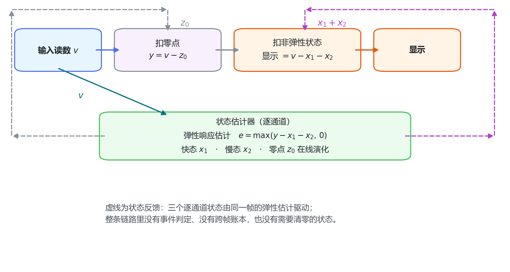

**图 2**　视角转换与信号流（示意）。读数先扣掉逐通道演化的零点得到负载响应，再扣掉两个非弹性状态得到显示；三个逐通道状态由同一帧的弹性估计驱动，彼此之间没有事件、没有账本，也没有跨帧决策。

这个改写一次解决了三件事：

**受载门自然形成**。$e$ 的下限是 0：卸载后 $y$ 塌回近零带，而 $x_1,x_2$ 还在，于是 $e=0$，状态转入恢复分支。不需要任何阈值判据去判断"现在有没有负载"——上一代方案里维护受载/空载状态机的那一整套逻辑在这里不存在，也就没有它的失效模式。

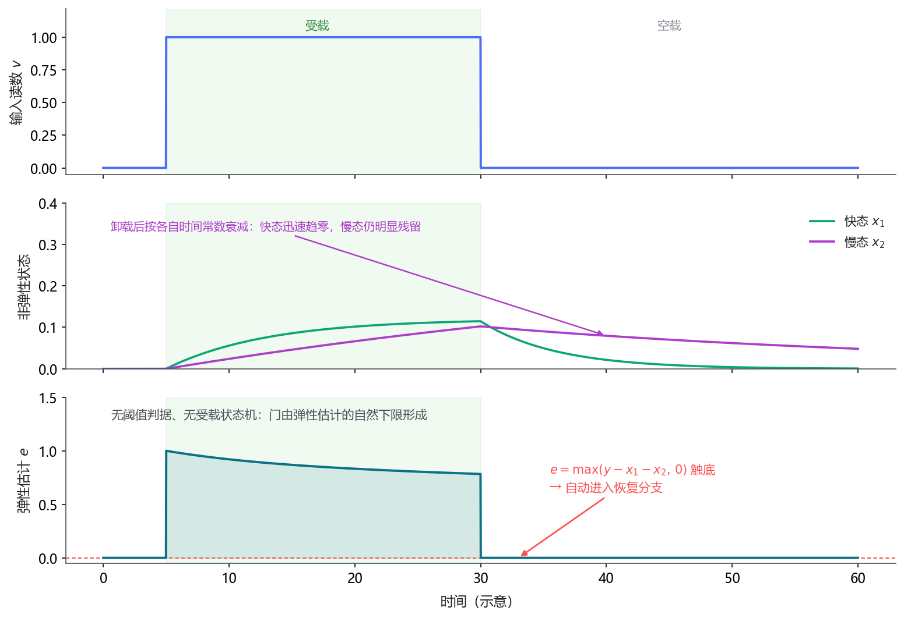

**图 3**　受载门是估计出来的，不是判定出来的（示意）。卸载后读数塌回近零带，而两个非弹性状态按各自的时间常数衰减，弹性估计触底并保持为 0，算法由此自然转入恢复分支——不需要阈值判据，也不存在受载/空载状态机。

**跨卸载连续性来自状态本来连续**。卸载后 $x$ 按恢复时间常数衰减但不清零；重载时残余的 $x$ 直接抵消"快相落点比首次高"的部分——那正是蠕变记忆想用账本补的东西，但这里是同一份物理量的自然延续，不存在"套用到错误工况"的问题：状态跟着材料走，不跟着事件走。

**显示 = 纯弹性响应有明确的物理含义**。恒载下 $x_1$ 收敛到与载荷成比例的饱和值、$x_2$ 积分掉实测慢漂移，显示被钉在弹性电平上（即快相结束后的落点）；重载时读数的快相落点 = 弹性电平 + 残余非弹性，显示自动扣掉后者。

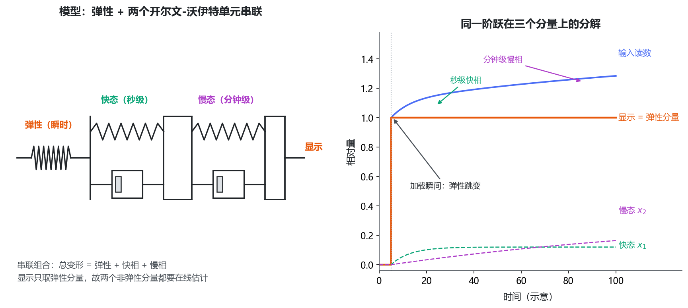

**图 4**　双态粘弹性模型与同一阶跃的分量分解（示意）。左：弹性、快态、慢态的串联类比，总变形由三者相加；右：显示只取其中的弹性分量，因此快相与慢相这两个非弹性分量都必须在线估计。

### 2.2 两个状态的演化规则

**快态（固定模型）**。受载时朝与载荷成比例的饱和值收敛，空载时按恢复时间常数衰减：

$$
\dot x_1=\begin{cases}\dfrac{r_1 e-x_1}{\tau_{c1}}, & e>0\\[6pt]-\dfrac{x_1}{\tau_{r1}}, & e=0\end{cases}
$$

关键在饱和值是 $r_1 e$：快态幅度与载荷成正比，于是对任意负载幅度自洽，不需要负载分类，也不需要为"半载/满载"分别定参数。这个形式直接来自规律辨识里"快相幅度与载荷成正比"的结论。

**慢态（v2：实测速率跟踪）**。慢态不朝固定幅度生长，而是跟随输入的实测慢漂移速率。先对读数做一个解析式低通导数：维护低通量 $v_{lp}$，斜率取

$$
\text{slope}=\frac{v-v_{lp}}{\tau_{\text{slope}}},\qquad v_{lp}\mathrel{+}=\frac{\Delta t}{\tau_{\text{slope}}}(v-v_{lp})
$$

受载时，把斜率中快态尚未解释的部分积分进慢态，并做两层限制：

$$
e>0:\quad x_2\mathrel{+}=\Delta t\cdot\operatorname{clip}\big(\text{slope}-\dot x_1,\ \pm\,c_{\max}\,e\big),\qquad x_2\leftarrow\operatorname{clip}(x_2,\ 0,\ r_{2\max}e)
$$

且仅当 $|\text{slope}|<g_{\text{slope}}\,e$ 时才积分——加载沿与快速变化不进慢态。空载时 $x_2$ 以 $\tau_{r2}$ 恢复。

这两层限制各管一件事：沿门（$g_{\text{slope}}$=0.02·e/s）保证台阶瞬间的增量全部由弹性估计吸收、不被慢态偷走；速率上限（$c_{\max}$=0.01·e/s）保证慢态即使误判也至多以有限速率积累（§7.2 会回到它的另一面）。

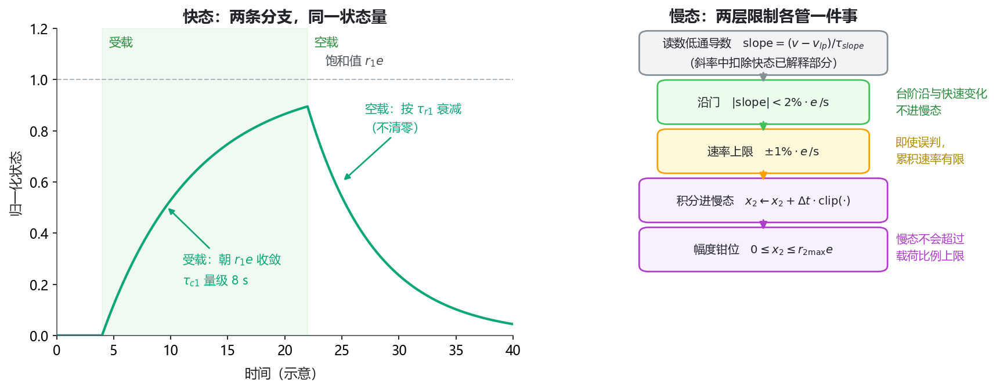

**图 5**　两条状态演化规则（示意）。左：快态的两条分支——受载时朝与载荷成比例的饱和值收敛、空载时按恢复时间常数衰减——共用同一个状态量，衰减不清零；右：慢态的沿门与速率上限各管一件事，前者保证台阶增量不被偷走，后者保证误判也至多以有限速率积累。

快态这一条读起来有三处不直观：$e$ 自己含 $x_1$、$r_1$ 的相对口径、"固定模型"与慢态"跟踪式"为什么必须分开。下一节把这三处逐项拆开，并给出该模型的解析形态与它作用在显示上的三种面貌（图 6、图 7）。

### 2.3 快态固定模型的展开

§2.2 的快态分支只有两条一阶递推，形式很短，但有三处不直观：$e$ 自己含 $x_1$（是闭环而不是开环）、$r_1=0.12$ 是"相对残差"而不是"相对载荷"的比值，以及"固定模型"与慢态"跟踪式"为什么必须分开。本节把这三点逐项拆开，并给出该模型的解析形态与它作用在显示上的三种面貌（图 6、图 7）。两张图都用与产品实现同构的显式欧拉递推（$\Delta t=0.01$ s，$\Delta t$ 截断 $[0,0.1]$）积分，积分时把 $x_2$ 与 $z_0$ 置零以隔离快态本身；因此图上是**模型自身的形态**，不含实测台账。

#### 2.3.1 公式逐项翻译

**有载时**：$x_1$ 朝"当前残差的 $r_1$ 倍"收敛，多快由 $\tau_{c1}$ 决定；**空载时**：$x_1$ 按 $\tau_{r1}$ 衰减但不到零。三个参数各管一件事：

| 参数 | 管什么 | 定量说法 |
|---|---|---|
| $r_1=0.12$ | 幅度（爬到哪里） | 快相最终吃掉残差的 12% |
| $\tau_{c1}=8$ s | 速度（爬多快） | 8 s 走完 63%、24 s 走完 95% |
| $\tau_{r1}=6$ s | 卸载后回得多快 | 比生长略快，但不清零 |

**$e$ 含 $x_1$，所以这是闭环而不是开环。** 把 $e=y-x_1-x_2$ 代回有载分支：

$$
\dot x_1=\frac{r_1(y-x_2)-(1+r_1)x_1}{\tau_{c1}}
$$

于是"公式字面看到的"与"实际发生的"不是一回事：

| 口径 | 饱和值 | 时间常数 |
|---|:--:|:--:|
| 开环（把 $e$ 当外部输入） | $r_1e=12\%\cdot e$ | $\tau_{c1}=8$ s |
| 闭环（$e$ 随 $x_1$ 一起掉） | $\dfrac{r_1}{1+r_1}=10.71\%$ 的载荷 | $\tau_{\rm eff}=\dfrac{\tau_{c1}}{1+r_1}=7.14$ s |

也就是说，**$r_1=0.12$ 是相对残差的比值，而快态最终吃掉的是载荷的 10.71%**——这两个数不一样，是读这条公式最容易绕不出来的地方。逐帧递推核对：$t=\tau_{\rm eff}=7.14$ s 时 $x_1=0.0678=0.1071\times63.2\%$，与 $\tau_{\rm eff}$ 自洽。

**为什么目标是 $e$ 而不是 $y$。** 因为 $x_2$ 也在吃同一份残差。两个状态都瞄准"当前还没被解释掉的那部分"，就不会重复记账：$x_1$ 至多认领残差的 12%，$x_2$ 认领的是残差中的慢漂移速率。这还带来一个天然限幅——当 $x_1+x_2$ 逼近 $y$ 时 $e\to0$，快态爬升自动停住，不会失控。

#### 2.3.2 解析形态

图 6 的三格与上面的三件事一一对应。

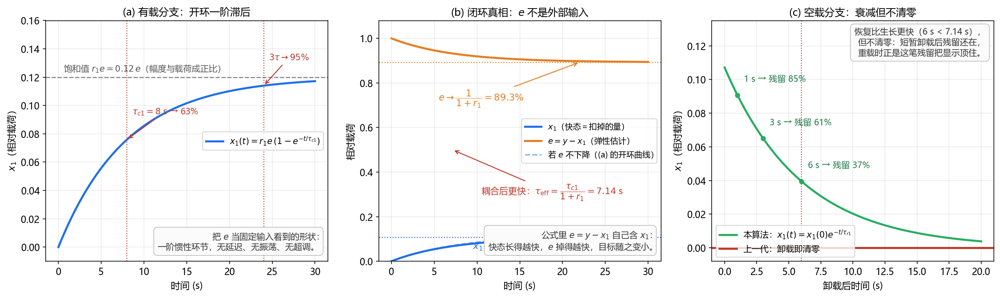

**图 6**　快态固定模型的解析形态（推导图，按设计含参数数值）。(a) 把 $e$ 当固定输入时，有载分支就是一条一阶惯性曲线：无延迟、无振荡、无超调，$\tau_{c1}$ 处走完 63%、$3\tau_{c1}$ 处走完 95%，饱和于 $r_1e$；(b) 闭环真相——$e$ 自己含 $x_1$，所以 $x_1\to10.7\%$、$e\to89.3\%$，且时间常数从 $\tau_{c1}=8$ s 缩短为 $\tau_{\rm eff}=7.14$ s（虚线为 (a) 的开环曲线）；(c) 空载分支是指数恢复且不清零：1 s 后残留 85%、3 s 后 61%、$\tau_{r1}=6$ s 后 37%，红线是上一代"卸载即清零"的位置。

#### 2.3.3 它对显示做了什么

把同一个模型作用到显示 $=v-x_1-x_2$ 上，只有三种面貌（图 7）。

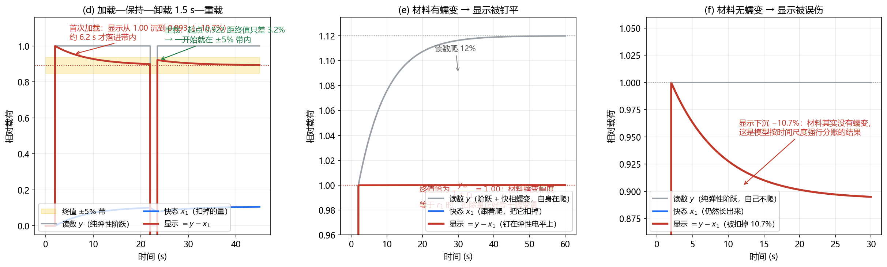

**图 7**　同一个快态模型作用在显示上的三种面貌（推导图）。(d) 加载—保持—卸载 1.5 s—重载的完整时序：台阶那一帧显示完全不掉（$x_1$ 一帧只能动千分之一量级，$\Delta t/\tau_{c1}=0.00125$），台阶整份透传；重载起点距终值只差约 3%，一开始就落在 $\pm5\%$ 带内——这是 §6.4"重载 1.3~1.6 s"的机制，也是 §2.1"跨卸载连续性"的定量样子。(e) 材料确有蠕变、且幅度比恰为 $r_1$ 时，读数上爬 12%、$x_1$ 跟着爬把它扣掉，显示被钉平，且稳态 $=y_\infty/(1+r_1)$ 恰等于弹性电平——"恒载钉平"因此是构造性结果而不是调参结果；(f) 材料没有蠕变（纯弹性阶跃）时 $x_1$ 照样长出来，显示被硬扣 −10.7%。其中 (d)、(f) 取纯弹性输入，(e) 取幅度比与 $r_1$ 一致的材料，真实设备落在 (e) 与 (f) 之间。

**(e) 与 (f) 是同一条公式的两个极端，而单看一帧数据无法区分它们。** 这正是 §2.1"受载门是估计出来的"的另一面：算法不识别阶跃，只按时间尺度分账——台阶太快，$x_1$ 跟不上，于是整份走弹性、原样透传；台阶之后的爬升慢，落在 $x_1$ 的尺度里，于是被认领成快相。真实设备落在两者之间，所以 §6.4 的稳定时间取决于"材料真实快相幅度与模型归属幅度之差"，而不只取决于时间常数——这也是 §1.3 要先做离线辨识、§3 强调"换传感器建议重标快态参数"的原因。

#### 2.3.4 为什么快态可以定死、慢态必须跟踪

| | 快态 $x_1$（固定模型） | 慢态 $x_2$（跟踪式） |
|---|---|---|
| 形式 | 朝按比例缩放的固定值收敛（v1 起未变） | 积分实测慢漂移速率（v1→v2 的唯一结构改动） |
| 参数可辨识性 | $r_1=0.12$、$\tau_{c1}=8$ s 在三个录制上稳定 | 幅度比 0~0.34 跨会话差 3 倍，收敛 $\tau$ 多次顶到搜索上界 900 s |
| 依据 | 快相幅度与载荷近似成正比（§7.3 成立条件第一条） | 幅度是材料与工况的属性，不是一两个录制定得死的常数（§4.1） |
| 代价 | 无重锚快捷路径，受载态小台阶 7.5~15 s（§5.2） | 跟踪有惯性，频繁切换工况平台 std 上升（§4.3） |

一句分工原则：**可辨识的定死，不可辨识的改成跟踪。** 而快态这条公式最简的理解是：把"当前还没被解释掉的那部分残差"，按 12% 的比例、用 8 秒的惯性，慢慢认领成蠕变。

#### 2.3.5 落到实现

产品与原型两侧都是同一条一阶 IIR（§9.1 的"显式欧拉、无超越函数"）。有载分支写成乘加形式即

$$
x_1\leftarrow\Big(1-\frac{\Delta t}{\tau_{c1}}\Big)x_1+\frac{\Delta t}{\tau_{c1}}\,r_1e,\qquad e>0
$$

100 Hz（$\Delta t=0.01$ s）时系数为 $\Delta t/\tau_{c1}=0.00125$、空载分支为 $\Delta t/\tau_{r1}=0.001667$；因为 $\Delta t$ 截断到 $[0,0.1]$ s，系数上界 0.0125，递推无条件稳定。两处实现口径值得记录：其一，$x_1$ 每帧更新后钳到 $\ge0$（产品源码与原型同为更新后取 $\max(\cdot,0)$）；其二，$\dot x_1$ 以及慢态积分里扣除的 $\dot x_1$ 份额，都按**更新前**的 $x_1$ 与 $e$ 计算（斜率口径），这是 §6.5 逐帧对拍锁住的细节之一。

### 2.4 零点跟踪：为什么它必须是逐通道演化的量

v2 的一个实测缺陷直接推动了它。传感器零点偏置约 2120 ADC 且不等于零，而 v2 的弹性估计直接取 $\max(v-x_1-x_2,0)$——零点偏置整个被当成弹性载荷。后果出现在一份全程空载的报障录制（201 s）上：$e$ 恒为正，两个非弹性状态对着一个"永远在的假负载"持续生长，显示随之持续下沉，到录制末尾累计 −315 ADC。这不是参数问题，是模型少了一个量。

v3 引入零点跟踪 $z_0$，规则只有两条：

- **近零带内慢速再校准**：维护负载响应 $y=v-z_0$ 的峰值包络 $y_{\max}$（慢衰减，τ=600 s），当 $y$ 落在近零带内（$y<0.05\,y_{\max}$）时，$z_0$ 以 τ₀=8 s 向当前读数靠拢——空载直通与零点再校准同时达成；受载（$y$ 超出近零带）时 $z_0$ **冻结**，零点不会在有载时被搬动。
- **相对判据**：近零带宽是 $y_{\max}$ 的比例而不是绝对阈值，判据始终相对当前工况，不依赖"空载读数≈某个固定值"。

修复效果在同一份报障录制上验证：空载段显示与输入的均值差 −20 ADC、最大偏差 27 ADC（v2 为 −315 持续下沉）。

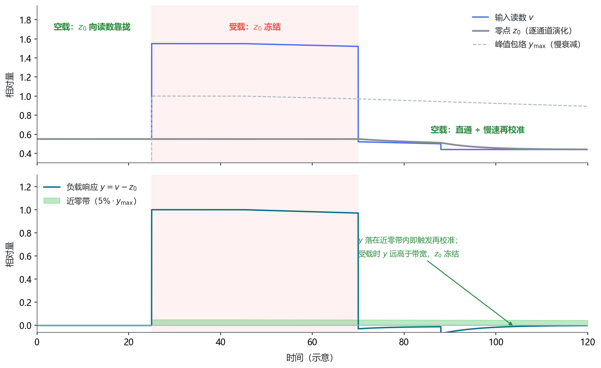

**图 8**　零点跟踪（示意）。上：输入读数、逐通道零点与峰值包络；下：扣掉零点后的负载响应与近零带。近零带宽取峰值包络的比例而非绝对阈值；空载时负载响应落在带内，零点以秒级时间常数向读数靠拢（即空载直通加慢速再校准），一旦响应超出带宽就冻结。零点偏置因此不会在全程空载时被持续当成弹性载荷。

零点跟踪同时定义了**启动语义**。初始零点取算法启用（或重置）时刻的第一帧读数；重置触发包括开关切换、设备切换与值域签名变化——签名含软件零偏，因此**软件调零会直接使算法全新启动**。三种启动方式的实际行为：

| 启动方式 | 行为 |
|---|---|
| 零载启动 | 理想：零点 = 真空点 |
| 带载启动 + 调零（推荐） | 调零后读数 ≈ 0 → 落入近零带 → 零点 ~8 s 内重锚；此后该负载的蠕变与一切变化正常补偿。操作规范：装好负载 → 调零 → 开算法，或算法常开、每次调零后自动重置 |
| 带载启动不调零 | 安全但不补偿（回放确认显示逐位跟随输入，随蠕变上爬）；后续负载**增量**正常补偿；第一次卸载后零点自动重锚，完全恢复 |

两条使用上的注意：调零等于重定义参考，不同调零周期之间的显示值不可直接横比（差一个调零偏置，这是任何调零系统的固有性质）；调零瞬间的读数跳变被慢态沿门（$|\text{slope}|>2\%·e/s$ 不积分）挡住，不会被当成蠕变吸收。

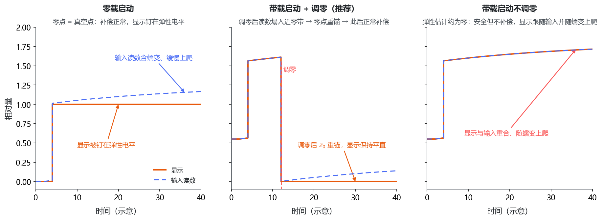

**图 9**　三种启动方式的实际行为（示意）。零载启动时零点即真空点；带载启动并调零后读数落入近零带、零点自动重锚，此后补偿正常；带载启动不调零时弹性估计约为零，显示逐位跟随输入——安全但不补偿的一档，第一次卸载后完全恢复。

### 2.5 时间步与边界处理

每通道每帧执行一次，$\Delta t$ 截断到 $[0,0.1]$ s（应对卡顿与时间戳重复：重复时间戳只施加当前状态、不积分）；首帧的低通量用输入初始化，避免起步瞬间的虚假斜率。内存为每目标每通道 3 个 double（$x_1,x_2,v_{lp}$），无环形缓冲——对比上一代约 2 MB/目标的缓冲区，这对多目标级联场景不是小事。

---

## 3 参数：全部来自物理辨识，无一逐会话拟合

| 参数 | 值 | 含义 |
|---|:--:|---|
| $r_1$ / $\tau_{c1}$ / $\tau_{r1}$ | 0.12 / 8 s / 6 s | 快态幅度比 / 收敛 τ / 恢复 τ |
| $r_{2\max}$ / $\tau_{r2}$ | 0.35 / 150 s | 慢态上限（相对弹性电平）/ 空载恢复 τ |
| $\tau_{\text{slope}}$ | 3 s | 慢漂移速率估计的低通时间常数 |
| $g_{\text{slope}}$ / $c_{\max}$ | 0.02 / 0.01 | 沿门（超过 2%·e/s 不积分）/ 积分速率上限 |
| $\tau_0$ / $f_{\text{idle}}$ / $\tau_{y_{\max}}$ | 8 s / 0.05 / 600 s | 零点跟踪 τ / 近零带宽（相对包络）/ 峰值包络衰减 τ |

定标依据是 §1.3 的三个录制：快态参数取自双 τ 结构与"快相幅度与载荷成正比"的辨识结果；慢态收敛时间常数按辨识区间（54~900 s 且多次顶界）取量级而非精确值——这正是慢态不走"朝固定值收敛"路线的原因，那个量辨识不出来。慢态上限 0.35 覆盖辨识到的 0~0.34 区间上端。

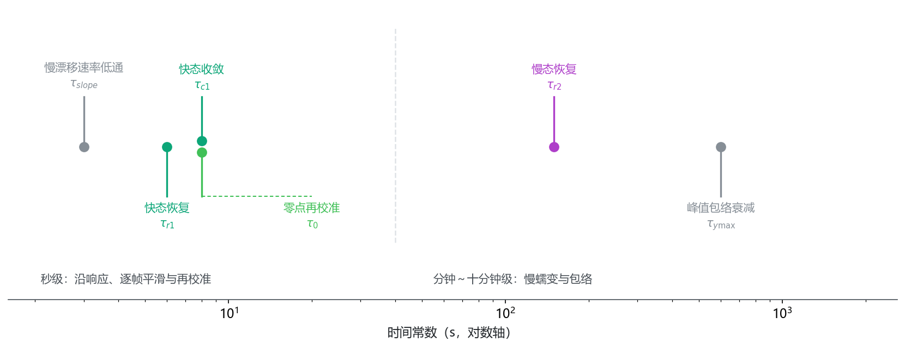

**图 10**　六个时间常数构成多尺度结构（示意）。秒级常数管沿响应与逐帧平滑，十秒级常数管恢复与再校准，分钟至十分钟级常数管慢蠕变与包络——同一套递推式在三个尺度上各司其职，这也是算法不需要事件分类的原因：尺度分离由时间常数完成，而不是由判据完成。

参数经运行期接口整体注入，录制时随会话落盘（11 字段参数集标识），保证任何一份录制都能对应到确切参数。**换传感器或夹具建议重标快态参数**；规律辨识脚本可直接复用（§8）。

---

## 4 慢态为什么必须是跟踪式的：v1 → v2

版本演进的三个台阶各修一类实测缺陷：v1 固定幅度慢态在恒载上过扣/欠扣（本节）；v2 缺零点跟踪在空载上报障（§2.4）；v3 是当前版本。

### 4.1 固定幅度慢态的失败现场

v1 慢态与快态同构：朝 $r_2 e$ 以固定 τ 收敛。它在一批旧数据上表现正常，直到一份新恒载录制（71208f，346 s）出现：恒载下显示持续衰减，全程 −356 ADC；另一份 698 s 长保压上则反向欠扣 +631 ADC。固定 $r_2=0.20$ 落在两头之间，必然一边过扣一边欠扣。

根源在 §1.3 已经看到：实测蠕变幅度因工况差 3 倍。幅度是材料与工况的属性，不是可以从一两个录制定死的常数。任何固定幅度设计都只是在"这批数据的中点"附近工作。

### 4.2 跟踪式慢态的构造逻辑

v2 的改法在结构上很直接：恒载下读数的慢漂移速率是**可观测量**（低通导数），把它积分进慢态，显示就按构造被钉平——慢态涨多快，扣除就涨多快，两者是同一个量。新恒载录制上显示漂移从 v1 的 −356 变为当前版本的 −108（输入自身 +1010），长保压从 +631 变为 +54。

这不是调参调出来的巧合，而是构造性结果：**"恒载钉平"不再依赖慢态幅度猜对，只依赖导数测得准**。代价在 §4.3。

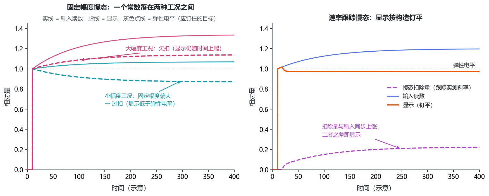

**图 11**　慢态为什么不能朝固定幅度收敛（示意）。左：一个固定幅度常数落在两种蠕变幅度工况之间，必然一边过扣、一边欠扣；右：把实测慢漂移速率积分进慢态后，扣除量涨多快显示就被钉多平——钉平不再依赖幅度猜对，只依赖导数测得准。

### 4.3 代价：频繁切换工况的平台 std 上升

跟踪是有惯性的。每次负载切换后，低通导数需要重新收敛，慢态的调整量比固定幅度版大。全量 21 数据集的保压段 std（输入 → 显示）里，恒载类全部大幅改善（219→69、180→57、56→37、47→29、40→28），但频繁切换类如实上升：

| 数据集（工况） | 保压段 std：输入 → 显示（v2 口径台账） |
|---|:--:|
| 7b3977（零基线反复增减） | 33 → 81 |
| 0cb8b6（零基线反复增减） | 43 → 82 |
| 6b2e70（剧烈变化负载） | 28 → 69 |
| ee20bc（切换负载-快相无责） | 152 → 185 |
| B组变化负载（两份） | 298→274、163→185 |

这些数字必须照写。两点限定：其一，多数上升后的 std 仍不高于输入自身（B组两份、ee20bc 是例外，显示 std 略超输入）；其二，std 上升与一致性是两个口径——7b3977 的一致性判据照样 10/10 合格（§6.1），std 反映的是平台内的调整波动，不是落点错误。另需注明：全量 std 台账是 v2 口径（v3 未重跑全量出图，零点跟踪只影响近零段，受载平台的 std 结构不受它影响）。若现场在意短平台波动，积分速率上限可下调，代价是慢漂移跟踪变慢。

---

## 5 无事件结构换来了什么，收走了什么

### 5.1 换来的：失效模式清单整体缩短

上一代方案要维护的每一个机制——事件检测延时、确认窗、整片卸载的特判、血统继承、记忆快照——都各有失效模式，creep-mem 的废弃就是其中一条被踩中的。观测器把这些机制全部删除后，对应失效模式清单同步缩短：

- 没有"整片卸载剪断血统"，因为没有血统——状态物理连续，卸载-重载显示一致性由构造保证（§6.1）；
- 没有"记忆误伤域外工况"，因为没有记忆——随机切换工况的显示 std 从 47 降到 29；
- 没有"检测器慢半拍导致清零时机错位"，因为没有清零。

这不是"参数更鲁棒"，是**结构性鲁棒**：算法里不存在持有跨帧决策权的状态机，也就不存在被错触发的迁移。

### 5.2 收走的：沿响应速度与空载语义

无事件结构的代价同样结构性的。观测器对负载变化的响应只能靠状态的指数重平衡，没有"检测到台阶后立刻重锚"的快捷路径——受载态小台阶的稳定时间因此落在 7.5~15 s（§6.3），而重载（卸载后加载）反而快（1.1~1.6 s，因为 $e$ 归零再起跳，重平衡路径短）。下一轮的方向是快相前馈：沿后用辨识出的形状先验直接把 $x_1$ 置到预测终值，预计把小台阶压到 2~4 s。本文未做。

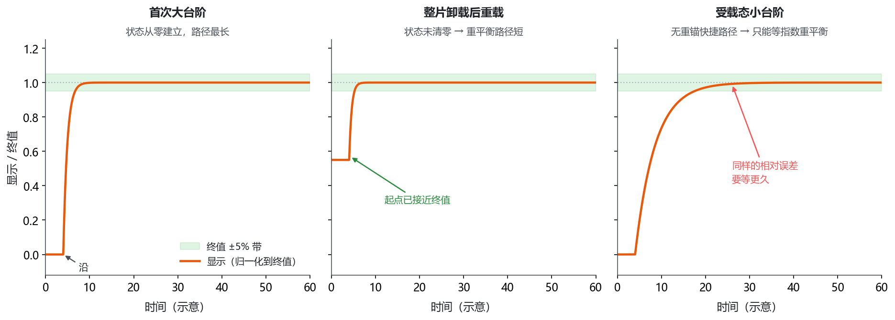

**图 12**　无事件结构下的沿响应路径（示意）。三条曲线各自归一化到该沿的终值，绿色带为目标终值 ±5%：首次大台阶要等状态从零建立；重载因状态未清零、起点已接近终值而路径更短；受载态小台阶既没有事件重锚、也没有状态归零可借，只能等指数重平衡，这是当前最主要的响应短板，也是快相前馈要解决的问题。

空载语义在 v2 里曾是第二代价（卸载后显示先低于原始零点再回升，且全程空载录制持续下沉 −315 ADC）；v3 的零点跟踪把空载段改成**直通 + 慢速再校准**（§2.4），空载显示与原始读数均值差 −20 ADC。残余的过渡仍然存在：卸载后到零点重新校准完成之前（τ₀=8 s 量级，叠加非弹性状态的恢复），显示有一段低于原始零点的回落——这段过渡是"恢复中的非弹性估计"还没衰减完的直接表现，语义上自洽，只是比空载直通慢一步。

---

## 6 验证

### 6.1 一致性：反复增减同一负载

用户判据为 ±10%·台阶 ≈ ±1500 ADC（相对该类首次电平）。目标录制 7b3977（312 s，满载族 9 段 + 半载族 5 段）的逐段偏差：

| 满载段（s） | 偏差 | | 满载段（s） | 偏差 |
|:--:|:--:|---|:--:|:--:|
| t43 | +329 | | t263 | +537 |
| t64.5 | −257 | | t279.5 | +256 |
| t234 | +24 | | t290.5 | +670 |
| t247 | +232 | | t304.5 | +1178 |

半载段（t58 / t283）偏差 −99 / −120。**10/10 合格**，偏差范围 −257~+1178。三版实现的满载族显示极差对比：v6 无记忆 2516（丢基线）、creep-mem 1018（账本式，已废弃）、本观测器约 1700 以内——注意观测器的极差并不比记忆版小，它的优势在 §5.1：这个数字是**不带任何域外副作用**取得的，而记忆版为它付出了随机切换工况下移 ~1200 的代价。

后半段偏差系统性为正（+232~+1178）且随时间增长，来自慢态速率上限对长时累积蠕变的有限跟踪速率，属于可预期残差，量级在判据的 10% 以内。

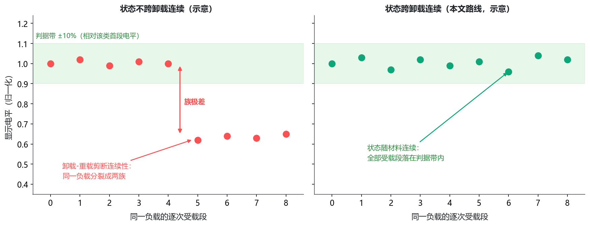

**图 13**　一致性判据与它的失效形态（示意，非实测台账）。左：状态不跨卸载连续时，同一负载在卸载-重载处分裂成两族，族极差是判据要压住的量；右：状态随材料连续时，全部受载段落落在判据带内。逐段实测偏差见上表。

### 6.2 空载直通与零点

全程空载的报障录制（1d4d3b，201 s，零点偏置 ~2120 ADC）逐段核对：显示与输入的差从 t=5 s 的 −2 缓慢扩大到 t=200 s 的 −27，[10 s, 末尾] 均值 −20、最大偏差 27 ADC——对照 v2 在同一录制上的持续下沉 −315。空载段显示≈原始读数的语义达成；残余的 −20 是零点跟踪 τ₀=8 s 慢速再校准的有限跟随（录制里输入自身从 2201 缓落到 2120），不是偏差。

### 6.3 恒载钉平

恒载录制 71208f（346 s，唯一负载）：恒载段 [30 s, 末尾] 显示漂移 −108（输入自身 +1010，材料慢相）、std=26。归档恒载 698 s 长保压：显示漂移 +54（输入 +798）、std=17。对照 v1 固定幅度慢态为 −356 与 +631（v1 对照值取自算法说明的复算记录）。全量口径下 `持续恒定负载`（~700 s）保压 std 219→69、新恒载 180→57（v2 口径台账，§4.3）。

### 6.4 稳定时间

从沿起、显示进入并保持终值 ±5% 带的时间（目标录制全部沿，观测器 / v6）：

| 工况 | T±5%（观测器） | 说明 |
|---|:--:|---|
| 首次从零加载（大台阶 9900 ADC） | 2.0~2.6 s | 输入斜坡 0.3~1.2 s + 检测带，已近物理地板 |
| 整片卸载后重载（大台阶 14345 / 11168 / 14761） | 1.3~1.6 s | 状态恢复路径短，快 |
| 受载态小台阶（2684 / 2829 ADC） | 7.5~10.5 s | **当前主要短板**，缺快相前馈 |
| 需求"加载后 1~2 s 稳定" | 大台阶满足；小台阶不满足 | — |

逐沿台账里有一个离群点（62.8 s 处 2208 ADC 台阶的 T±5% 为 103.3 s，同沿 v6 为 14.6 s）：该沿后紧邻负载结构变化，观测器把终值带判断拖长了；中位汇总不受它影响（观测器 T±5% 中位 2.1 s，n=20，v6 两臂均为 3.0 s）。这个离群如实记录，未在本文范围内追因。

### 6.5 实现对拍

产品源码与 Python 原型喂相同输入，逐帧对拍最大差 5×10⁻⁵ ADC（PARITY OK）。这一步锁住的是公式理解一致、限幅位置一致、积分顺序一致——§2.2 里那种"斜率里扣除快态已解释部分"的细节，恰是两份独立实现最容易各自理解错的地方。

---

## 7 讨论

### 7.1 算法选择付出的代价

**小台阶响应慢**（7.5~15 s）：无事件结构没有重锚快捷路径，只能等状态指数重平衡。这是"结构性鲁棒"的直接对价，缓解方向是快相前馈而非恢复事件检测。

**频繁切换平台波动增大**（§4.3）：速率跟踪的惯性。参数上限可现场下调，但那会同时放慢恒载钉平。

**参数全局固定**：跨会话辨识已表明参数（尤其慢相量级）不稳定，本文选择"全局默认 + 换设备重标"而不是启动期在线辨识（原型已预留接口）。启动期辨识在短会话上有过拟合风险，这条路线未验证。

### 7.2 已知限制与它们的来源

**慢态会吸收真实的缓慢加载**。速率上限 1%·e/s 以内且连续的输入增长会被当蠕变积分掉——"恒载钉平"与"缓慢加载保真"在这个结构里是同一把尺子的两面，只能靠 $c_{\max}$ 调权衡。存在持续缓慢加压的工况需明确评估这一条。

**带载启用不调零时不补偿**。这是安全侧设计（§2.4 的启动语义表）：零点锚在带载读数上，弹性估计≈0，显示逐位跟随输入；后续负载增量正常补偿，第一次卸载后完全恢复。需要补偿请先调零——这是操作规范问题，不是算法缺陷，但部署时必须写进使用说明。

**卸载后有一段低于原始零点的过渡**。零点再校准（τ₀=8 s）与非弹性状态恢复都需要时间，这段过渡内显示低于原始零点再回升（§5.2）。

**真机与界面未测**。全部结论来自离线回放（真实录制数据）与逐帧对拍；菜单项、录制落盘等软件层挂接只做了静态检查。

**域外幅度范围未验证**。快态幅度比 0.12 来自三个录制的辨识；更大量程、温度变化下的快相幅度比是否仍稳定，本文没有数据。

### 7.3 成立条件

算法成立依赖三条数据性质：快相幅度与载荷近似成正比（比例结构的前提）；慢漂移速率可被 3 s 低通导数测得（慢态跟踪的前提）；卸载后非弹性确实按可辨识时间常数恢复（跨卸载连续性的前提）。第一条和第三条在规律辨识的数据上成立，第二条在恒载数据上成立；它们是对材料的要求，不是对算法的保证。

---

## 8 谱系与复现

当前版本 observer-v3（2026-09-19）：零点跟踪 + 快态模型 + 慢漂移跟踪；v2（无零点跟踪，空载漂没）与 v1（固定幅度慢态，恒载衰减）已被取代，原型留作对照。v6 档行为不变，可菜单切换对比。creep-mem 已废弃，证据归档于 `archived/creep-mem/`，产品源码中的记忆代码休眠保留（不触发），观测器真机验证后清除。

工作目录 `temp/v4.1flash/plan/v3.4/`。数据根会被重组，脚本用自适应会话发现，不写死路径：

```powershell
cd temp\v4.1flash\plan\v3.4\scripts
python v34_observer_v3_eval.py       # v3 验证：空载直通 + 恒载钉平 + 一致性（±10% 判据）
python v34_observer_plot_all.py      # 全部数据集出图 -> ../figure/observer/
python v34_observer_eval.py          # v1 口径一致性验证（对照）
python v34_law_identify.py           # 规律辨识（换设备重标快态参数用）
python v34_probe_tstable.py          # 稳定时间逐沿台账（v2 期口径，results/v34_tstable.txt）
cmd /c build_obs_runner.bat          # 构建链接产品源码的离线复算器
python v34_parity_check.py           # C++↔原型逐帧校验（PARITY OK）
python v34_make_concept_figs.py      # 正文概念示意图 12 张 -> ../figure/concept/
python v34_make_derive_figs.py       # §2.3 快态推导图 2 张 -> ../figure/derive/
```

各节数字来源：§1.1 与 §1.2 取自 creep-mem 问题清单与验收报告（归档）；§1.3 取自 `results/v34_law_identify.txt` 与 `results/results_v34_conventions.txt`；§2.4、§4 与 §6 取自 `results/v34_observer_v3_eval.txt`、`results/v34_observer_all.txt`（v2 口径）、`results/v34_tstable.txt`（v2 期口径）；§6.5 取自逐帧对拍记录；§9 的计算量为按 §2.2、§2.4 公式逐项计数的解析估算（未做真机性能剖析）；§2.3 的解析量（$\tau_{\rm eff}$、$r_1/(1+r_1)$）由 `scripts/v34_make_derive_figs.py` 与逐帧递推互相核对，不含实测台账数值。

正文配图共 12 张（图 1–5、图 8–14），由 `scripts/v34_make_concept_figs.py` 生成到 `figure/concept/`，是按正文机制合成的概念示意图与结构框图：图中不含任何代码、文件名、类名、数据集标识或实测台账数值，坐标轴一律用归一化相对量，因此它们只承担"解释机制"的职能——带具体数字的结论一律以正文表格与上述台账为准。另有 §2.3 的两张推导图（图 6、图 7），由 `scripts/v34_make_derive_figs.py` 生成到 `figure/derive/`：它们按设计含参数数值（$r_1$、$\tau_{c1}$、$\tau_{r1}$、$\tau_{\rm eff}$）与归一化载荷坐标，只用于把 §2.2 的公式形态讲清楚，与上述 12 张概念图分属两套，不进入概念配图口径。

---

## 9 计算量评估

### 9.1 单通道单帧的运算构成

算法在每帧对每个通道执行一次显式更新：没有迭代求解、没有矩阵运算、没有查表，也没有跨帧容器。把 §2.2 与 §2.4 的公式逐项计数（常数除法按预计算倒数计）：

| 环节 | 内容 | 每通道每帧约计 |
|---|---|---|
| 零点扣除与弹性估计 | $y=v-z_0$、$e=\max(y-x_1-x_2,0)$、显示 $=v-x_1-x_2$ | 5 次加减、1 次取大 |
| 快态更新 | 朝 $r_1e$ 收敛，或按 $\tau_{r1}$ 恢复 | 5 次乘加、1 处分支 |
| 慢漂移速率估计 | $v_{lp}$ 低通更新与斜率 | 4 次乘加 |
| 沿门 | $\lvert\text{slope}\rvert<g_{\text{slope}}e$ 判定 | 1 次乘、1 次比较 |
| 速率上限与积分 | $\operatorname{clip}(\cdot,\ \pm c_{\max}e)$ 后积分进 $x_2$ | 4 次乘加、2 次限幅 |
| 慢态幅度钳位 | $x_2\leftarrow\operatorname{clip}(x_2,\ 0,\ r_{2\max}e)$ | 1 次乘、2 次限幅 |
| 零点跟踪 | 包络衰减与更新、近零带判定、再校准 | 9 次乘加、2 次比较 |
| 显示输出 | 读数减两个非弹性状态 | 2 次加减 |

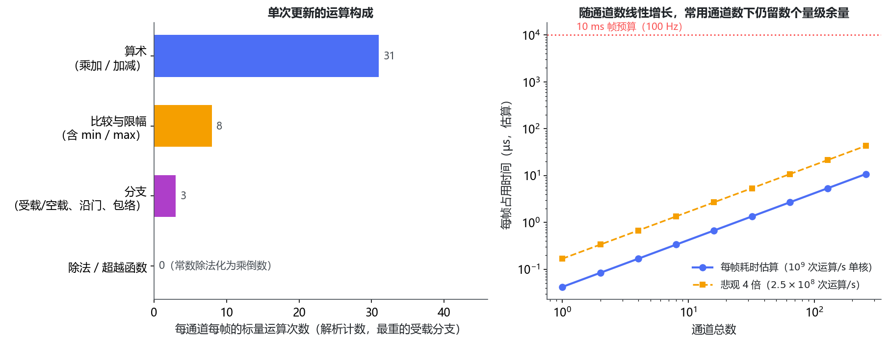

**图 14**　计算量（解析计数）。左：单通道单帧的运算构成——以算术运算为主，比较与限幅次之，除法与超越函数为零；右：每帧占用时间随通道总数线性增长，距 10 ms 帧预算有数个量级余量（实线为 $10^9$ 次运算/秒口径，虚线为悲观四倍口径）。

合计约 **42 次标量运算/（通道·帧）**，这是较重的受载分支；空载分支只剩两次指数恢复与状态输出，约 10 次。其中算术（乘加与加减）约 31 次、比较与限幅约 8 次、分支 3 处。复杂度是 $O(1)$——与录制时长无关，与已经积累了多少帧也无关。

三个来自实现结构的确定性结论：

- **没有真实除法**。公式中出现的 $\tau_{c1}$、$\tau_{r1}$、$\tau_{slope}$、$\tau_0$、$\tau_{y\max}$ 全是常数，除以常数等价于乘预计算的倒数，因此每通道每帧的除法次数为 0。
- **没有超越函数**。指数衰减用显式欧拉（$x\leftarrow x-\Delta t\,x/\tau$）而不是解析解 $\exp(-\Delta t/\tau)$，所以不出现指数、开方与三角函数——这也是逐帧对拍能做到 $5\times10^{-5}$ 量级一致的原因之一：两条实现路径上都没有需要各自近似的环节。
- **没有分配与拷贝**。状态是常数个 double，每帧原地更新；不写环形缓冲、不复制帧数据、不参与任何 I/O。

### 9.2 随通道数与帧率的伸缩

每帧运算量 = 通道总数 × 42，每秒运算量再乘帧率。按单核 $10^9$ 次标量运算/秒的保守口径估算，并与 100 Hz 上传所对应的 10 ms 帧预算对比（后两行为外推场景，用于看出趋势）：

| 场景 | 通道总数 | 每帧运算量 | 每秒运算量 | 每帧估算耗时 | 占帧预算 |
|---|:--:|:--:|:--:|:--:|:--:|
| 单目标 21 通道 @100 Hz | 21 | ≈8.8×10² | ≈8.8×10⁴ | ≈0.9 µs | 0.009% |
| 8 目标级联（21 通道/目标）@100 Hz | 168 | ≈7.1×10³ | ≈7.1×10⁵ | ≈7 µs | 0.07% |
| 外推：32 目标 × 64 通道 @100 Hz | 2048 | ≈8.6×10⁴ | ≈8.6×10⁶ | ≈86 µs | 0.9% |

即便把单次运算按悲观四倍计（等效 $2.5\times10^8$ 次运算/秒），最重的场景也只占帧预算的约 3%。结论是**计算量不构成任何一档部署的瓶颈**：同一帧内真正昂贵的是每通道数据的纹理上传与绘制，观测器只是在这条链路末端追加了一次逐通道标量更新；它既不需要额外的数据遍历，也不需要等待 I/O。

### 9.3 内存

每通道需要常驻的只有状态量本身：§2.5 的实现口径为 $x_1,x_2,v_{lp}$ 三个 double；v3 的零点 $z_0$ 与峰值包络 $y_{\max}$ 同样是逐通道标量，按 5 个 double（40 B）计仍属同一量级。于是常驻内存为：

| 规模 | 常驻状态 |
|---|:--:|
| 单目标 21 通道 | ≈0.8 KB |
| 8 目标级联 | ≈6.7 KB |
| 外推：32 目标 × 64 通道 | ≈80 KB |

两点值得与上一代方案对照：其一，这是**常数内存**，与录制时长无关，不需要跨帧缓冲来记住历史；其二，单目标的全部状态不到 1 KB，可以整块留在缓存里，而上一代按目标维护的跨帧缓冲区在 MB 量级（§2.5）。在多目标级联场景下，这个差别比运算量本身更有实际意义。

### 9.4 口径说明

本节是**按公式逐项计数的解析估算，不是真机性能剖析**。实际耗时还会受编译优化、内存层级、分支预测以及"是否与显示刷新落在同一帧"等因素影响；但上面看到的余量在两到四个数量级，这些二阶因素不会改变结论。若需要实测，可在已有的离线复算器上加计时点——它与产品链路共用同一份算法实现，测到的将是算法自身的耗时，不含渲染与 I/O。
