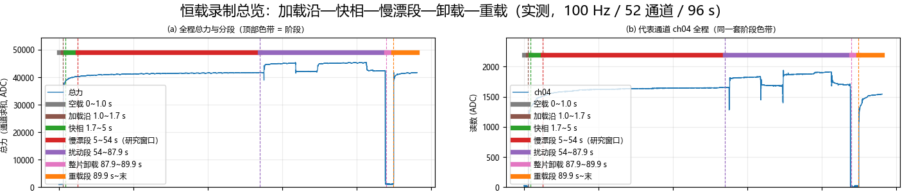
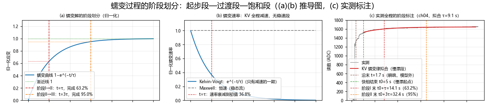
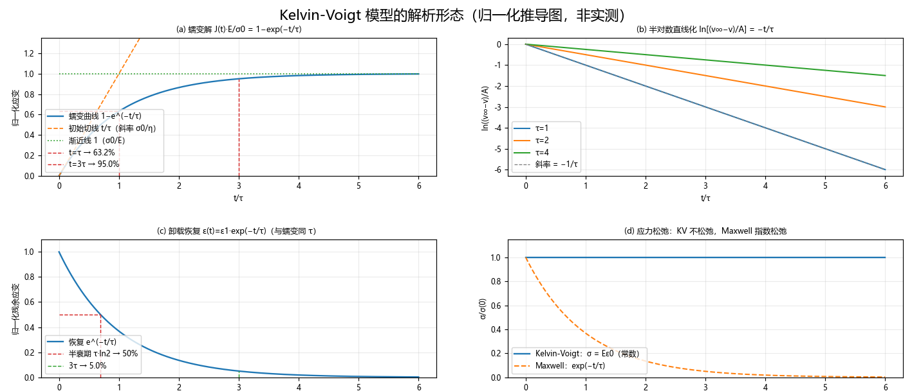
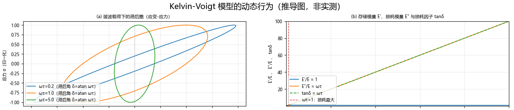
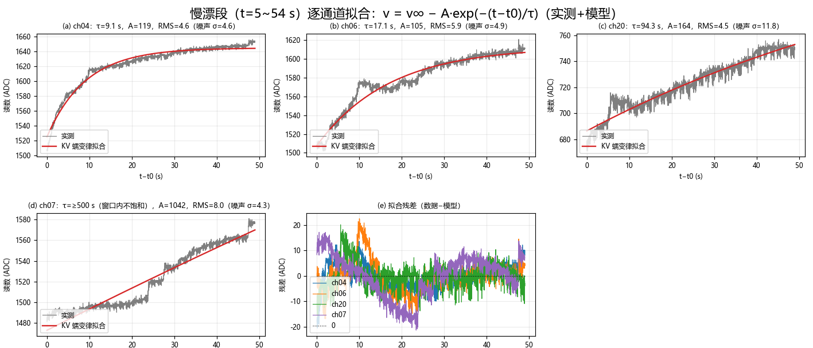
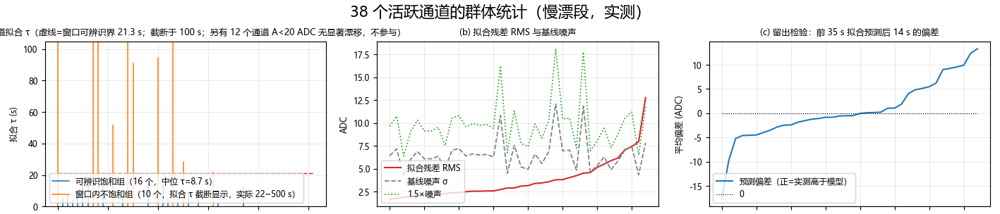
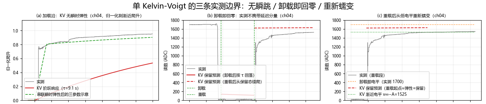

# Kelvin-Voigt 模型：恒载慢漂的最小粘弹性描述

**摘要**　恒定载荷下，某种传感器的通道读数并不停在加载完成时的电平上，而是继续缓慢爬升——慢漂。描述它的最小粘弹性模型是 Kelvin-Voigt 元件（弹簧与阻尼器并联）：本构 $\sigma=E\epsilon+\eta\dot\epsilon$，唯一时间常数 $\tau=\eta/E$。本文把模型自身讲清：恒载蠕变解 $\frac{\sigma_0}{E}\left(1-e^{-t/\tau}\right)$ 有界饱和，初始斜率 $\sigma_0/\eta$ 与渐近值 $\sigma_0/E$ 在 $t=\tau$ 处相接；卸载后按同一 $\tau$ 恢复、无永久形变；恒应变下应力不松弛；动态下 $\tan\delta=\omega\tau$。在一套 52 通道、约 100 Hz、96 s 的恒载录制上只取慢漂段演算：38 个活跃通道中，16 个可被单条蠕变律完好描述（$\hat\tau$ 中位 8.7 s，残差与噪声同量级），12 个无显著慢漂，10 个窗口内不饱和、$\tau$ 只能给下界。两条实测边界同样用数据钉死：加载沿瞬时跃升占终值 53%~88%，而模型给不出瞬跳，需串联弹簧补足；卸载后读数立即回到零基线，而模型预测延迟分量应保留 68~1038 ADC——读数携带的是与载荷同在的应力侧响应、不是应变记忆，模型适用于恒载段的载荷—读数方向。

**关键词**　粘弹性；Kelvin-Voigt 模型；蠕变；蠕变柔量；延迟弹性；参数辨识

---

## 1 现象与模型定位

### 1.1 恒载慢漂：要被描述的现象

把一个恒定负载压到某种传感器上，理想读数应当在加载完成后保持常数。实测不是：加载后的最初一两秒内读数快速到位（快相，本文不处理），随后仍以数秒到数十秒的时间尺度单调爬升，几十秒内累计可达加载电平的百分之几到百分之十几；卸载后读数回落，再次加载后蠕变重新出现。图 1 给出一套实测录制（52 通道、约 100 Hz、96 s）的全貌：加载沿 1.0~1.7 s，快相到约 5 s，随后 5~54 s 是一段 49 s 干净的恒载慢漂段，87.9 s 整片卸载、89.9 s 重新加载。

**图 1**　恒载录制总览（实测，52 通道 / 约 100 Hz / 96 s）。两块面板顶部用**七段彩色色带**标注全程阶段，每段一种颜色、边界竖线与色带同色：灰＝空载（0~1.0 s）、棕＝加载沿（1.0~1.7 s）、绿＝快相（1.7~5 s）、**红＝慢漂段（5~54 s，本文研究窗口）**、紫＝扰动段（54~87.9 s）、粉＝整片卸载（87.9~89.9 s）、橙＝重载段（89.9 s~末）。(a) 全程总力；(b) 代表通道全程读数。本文只研究慢漂段；沿与快相属于模型的边界问题（§5.1），卸载—重载用于检验模型的恢复分支（§5.2）。

对慢漂现象，工程上要回答三个问题：它会不会停下来（有界还是流动）、停在哪里（幅度）、多快停（时间常数）。回答这三个问题的最小模型就是 Kelvin-Voigt 元件。

### 1.2 三个基本单元与两种最小组合

后文的公式反复用到几个字母，先一次说清（表 1）——只有七个，记住之后每条公式都能读出声来。

**表 1**　符号速览（白话版；附录 A 给出正式口径）

| 符号 | 白话含义 | 直观理解 |
|---|---|---|
| $\sigma$ | 应力：单位面积上受到的力 | "压得多狠"，就是压强的概念 |
| $\epsilon$ | 应变：相对形变量（无单位） | "被压扁了百分之几" |
| $\dot\epsilon$ | 应变速率：应变随时间变化的快慢 | "此刻还在以多快的速度继续变形" |
| $E$ | 弹性模量：弹簧的刚度 | "多大力压出多少形变"，越大越硬 |
| $\eta$ | 粘度：阻尼器的流阻 | "变形越快阻力越大"，越大越"黏" |
| $\tau=\eta/E$ | 迟豫时间：材料反应过来的时间尺度 | "要等几秒才趋稳"，由上两个共同决定 |
| $\omega$、$\delta$ | 交变载荷的角频率；应变落后应力的相位角 | 只在 §3.3（动态行为）用到 |

线性粘弹性理论只有两个基本单元，各自只有一条定律：

- **Hooke 弹簧**：$\sigma=E\epsilon$——应力与应变成正比：压多狠就**瞬间**形变多少，无任何时间行为；
- **Newton 阻尼器**：$\sigma=\eta\dot\epsilon$——应力与应变速率成正比：只扛"变形的快慢"、不扛"变形本身"，恒力下只会匀速地"流"，无任何刚性。

二者各自都描述不了蠕变：弹簧没有时间、阻尼器在恒载下只会匀速流动。把一个弹簧和一个阻尼器组合，只有两种最小接法：

- **串联（Maxwell 模型）**：两元件承受同一应力、应变相加。恒载下阻尼器匀速流变，应变线性增长、永不饱和；
- **并联（Kelvin-Voigt 模型）**：两元件经历同一应变、应力相加。恒载下弹簧随应变增大而承担越来越多的应力，阻尼器承受的份额随之减少，应变速率逐渐衰减——应变趋于一个有界饱和值。

### 1.3 Kelvin-Voigt 给出什么、不给出什么

| 构件 | 本构 | 恒载蠕变 | 恒应变松弛 | 瞬时应变 |
|---|---|---|---|---|
| Hooke 弹簧 | $\sigma=E\epsilon$ | 无（瞬时到位） | 无 | 有 |
| Newton 阻尼器 | $\sigma=\eta\dot\epsilon$ | 线性流动，不饱和 | 应力瞬间跌至零 | 无 |
| Maxwell（串联） | $\dot\epsilon=\sigma/\eta+\dot\sigma/E$ | 瞬跳 + 线性流动 | 指数松弛 | 有 |
| **Kelvin-Voigt（并联）** | $\sigma=E\epsilon+\eta\dot\epsilon$ | **延迟弹性，饱和** | **无** | **无** |

读表的方式：每一行都是一个两参数（或一参数）模型，没有谁能全占。"瞬时应变"与"恒应变松弛"两列是 Kelvin-Voigt 的结构性缺口——它给不出加载瞬间的跳变，也给不出恒应变下的应力衰减；而 Maxwell 恰好在这两列上占、却给不出有界蠕变。**选 Kelvin-Voigt 还是 Maxwell，取决于要做的是蠕变实验（恒载，关心读数怎么爬）还是松弛实验（恒形变，关心应力怎么掉）**。本文面对的是恒载慢漂，所以选并联。

---

## 2 模型与本构方程

### 2.1 结构与本构

Kelvin-Voigt 元件是一根弹簧（模量 $E$）与一个阻尼器（粘度 $\eta$）**并联**：两元件被迫经历同一应变 $\epsilon$，总应力是两者之和：

$$
\sigma \;=\; \sigma_E+\sigma_\eta \;=\; E\,\epsilon \;+\; \eta\,\dot\epsilon .
$$

白话翻译：材料此刻感到的力 = 弹簧那份（刚度 $E$ × 当前形变 $\epsilon$）+ 阻尼器那份（粘度 $\eta$ × 形变快慢 $\dot\epsilon$）。"并联"的物理含义全在这一句里：两份力**同时**承担外载、经历**同一**形变。

这是一条关于 $\epsilon$ 的一阶线性常微分方程。整理成标准形式后，两个参数只以一种方式出现：

$$
\dot\epsilon+\frac{E}{\eta}\,\epsilon=\frac{\sigma}{\eta},
\qquad\tau\equiv\frac{\eta}{E},
$$

$\tau$ 是模型唯一的时间常数。**三参数 $E,\eta,\tau$ 只有两组自由度**——知道 $E$ 与 $\tau$，粘度就是 $\eta=E\tau$。这一点决定了后文全部辨识口径。

**命名注记**　"Kelvin"与"Voigt"是两个人，不是两个构件：W. Thomson（Lord Kelvin，1824~1907）1865 年用这一并联结构刻画金属的弹性后效，W. Voigt（1850~1919）在 19 世纪 90 年代的固体内摩擦与晶体物理工作中系统使用并推广了它。两人先后独立用了**同一个结构**，模型因而并称，文献中亦称 Kelvin 模型、Voigt 模型或 Voigt-Kelvin 体。名字不指任何级联——元件内部只有"并联"一种接法；把多个这样的元件接起来是 §6 的推广（广义 Kelvin 模型），不是本模型自身。

### 2.2 蠕变解：恒应力阶跃

恒应力 $\sigma_0$（载荷压上后一直保持不变，$\sigma_0$ 就是它折算到单位面积上的大小）于 $t=0$ 施加、初应变 $\epsilon(0)=0$（材料从零形变起步），方程的解是

$$
\boxed{\;\epsilon(t)=\frac{\sigma_0}{E}\Bigl(1-e^{-t/\tau}\Bigr),\qquad \tau=\frac{\eta}{E}\;}
$$

它有三个可相互推导的读法（图 2a）：

- **初始斜率**：$\dot\epsilon(0)=\sigma_0/\eta$——起步快慢完全由粘度决定，弹簧尚未受力；
- **渐近值**：$\epsilon(\infty)=\sigma_0/E$——终点完全由弹簧决定，阻尼器在稳态不再受力；
- **几何关系**：从原点出发的切线 $(\sigma_0/\eta)\,t$ 恰好在 $t=\tau$ 处到达渐近线 $\sigma_0/E$——因为 $(\sigma_0/\eta)\,\tau=\sigma_0/E$。初始斜率与终值不是两个独立性质，它们被同一个 $\tau$ 锁在一起。

特征完成度照指数律：$t=\tau$ 完成 $63.2\%$，$2\tau$ 完成 $86.5\%$，$3\tau$ 完成 $95.0\%$，$5\tau$ 完成 $99.3\%$（据此的阶段划分见 §2.3）。写成蠕变柔量（单位应力产生的应变）：

$$
J(t)=\frac{\epsilon(t)}{\sigma_0}=\frac{1}{E}\Bigl(1-e^{-t/\tau}\Bigr).
$$

两个边界值各有明确含义：$J(0^+)=0$——**Kelvin-Voigt 没有瞬时弹性**，应力阶跃产生的应变从零连续起步；$J(\infty)=1/E$——长期行为是纯弹性的。前者是它与实测加载沿的第一个结构性张力（§5.1）。

### 2.3 蠕变过程的阶段划分

蠕变速率 $\dot\epsilon(t)=\frac{\sigma_0}{\eta}\,e^{-t/\tau}$ 随时间单调指数衰减，据此把蠕变过程划成三段（图 3a、图 3b）：

| 阶段 | 区间 | 速率 | 完成度 |
|---|---|---|:--:|
| **I 起步段** | $0\le t\le\tau$ | 从最大值 $\sigma_0/\eta$ 衰减到 36.8% | 63.2% |
| **II 过渡段** | $\tau<t\le3\tau$ | 36.8% → 5.0% | 到 95.0% |
| **III 饱和段** | $t>3\tau$ | 残余量每过一个 $\tau$ 再乘 $e^{-1}$ | 工程上视为到位 |

绝大部分蠕变量集中在阶段 I——一个 $\tau$ 就完成六成多；阶段 II 只是收尾，却要再等两个 $\tau$；阶段 III 里曲线与渐近线的差已小于 5%。

两点结构事实随之而来。其一，**Kelvin-Voigt 的蠕变从头到尾都是减速的"一期蠕变"**：速率曲线没有平台（图 3b 蓝线对照 Maxwell 的恒速灰线——稳速的"二期"是稳态流的形态，属于串联结构），更没有加速的三期。其二，阶段边界只由 $\tau$ 一个数决定：把 §4.2 辨识出的 $\hat\tau$ 代回去，就能在实测读数上标出全程阶段（图 3c）——加载沿的瞬跳在模型外（§5.1），秒级的快相是比慢漂更快的一个分量（§6.2 的广义模型把它收进来），随后的慢漂自身依次经历起步、过渡与趋饱和；慢漂段的窗口可辨识性（§4.4）问的正是"窗口有没有盖住阶段 III"。

**图 3**　蠕变过程的阶段划分。(a) 归一化蠕变解：红色虚线 $t=\tau$ 分开起步段与过渡段（该处完成 63.2%），橙色虚线 $t=3\tau$ 分开过渡段与饱和段（完成 95.0%），点线为对应完成度；(b) 蠕变速率 $e^{-t/\tau}$：单调指数衰减、无稳速平台，对照 Maxwell 的恒速稳态流（灰虚线），$t=\tau$ 处已衰减到初值的 36.8%；(c) 实测通道全程的阶段标注：用慢漂段拟合的 $\hat\tau=9.1$ s（通道 04）换算阶段边界 $t_0+\hat\tau=14.1$ s、$t_0+3\hat\tau=32.4$ s——加载沿的瞬跳在模型外，快相是另一个更快的分量，慢漂自身走完起步—过渡—趋饱和三段（红线为慢漂段拟合）。(a)(b) 为推导图，(c) 为实测。

### 2.4 恢复解：卸载

$t=t_1$ 时刻撤去应力，此后 $\sigma=0$，方程变为齐次，解为

$$
\epsilon(t)=\epsilon(t_1)\,e^{-(t-t_1)/\tau},\qquad t\ge t_1 .
$$

残余应变按**同一个** $\tau$ 指数回落（图 2c），半衰期 $\tau\ln 2=0.693\tau$，$3\tau$ 后只剩 $5\%$。极限 $\epsilon(\infty)=0$：**无永久形变**——模型里没有阻尼器单独承载的通道（那是 Maxwell 的稳态流），全部应变最终都存在弹簧里、也最终都能还回去。蠕变与恢复共用一个时间常数，是"只有一个钟"的直接后果；实测若表现出恢复快于蠕变（或慢于），单 Kelvin-Voigt 无法同时照顾两端（§5.2 将给出实测反例）。

### 2.5 无应力松弛

恒应变实验（$t=0$ 瞬时施加 $\epsilon_0$ 并保持）：$\dot\epsilon=0$，本构退化为

$$
\sigma(t)=E\,\epsilon_0=\text{常数}.
$$

应力不松弛（图 2d）。衡量松弛行为的标准量叫**松弛模量** $E_r(t)$——把形变固定住，看应力随时间掉到满值的几分之几；对 Kelvin-Voigt 它是常数 $E_r(t)=E$，一点不掉。真实材料在恒形变下应力总会缓慢衰减，因为微观上总存在迟豫机制；Kelvin-Voigt 把全部迟豫都放进了"应变滞后于应力"这一个通道，于是"应力滞后于应变"的通道就空了。**它天然是蠕变侧的模型，不是松弛侧的**。这一点不是缺陷清单上的一条注脚，而是选用它的先决条件：对恒载慢漂问蠕变，它答得上；对恒形变问应力衰减，它结构性失语。

### 2.6 任意载荷历史：斜坡响应与叠加积分

线性粘弹性理论里，知道了蠕变柔量 $J(t)$ 就知道了对任意应力历史的响应（Boltzmann 叠加）：

$$
\epsilon(t)=\int_0^{t} J(t-\xi)\,\frac{\mathrm{d}\sigma}{\mathrm{d}\xi}\,\mathrm{d}\xi ,
\qquad \xi\ \text{为积分哑变量（对加载历史各时刻求和）}.
$$

白话读法：把任意形状的载荷拆成一连串小阶跃，每个小阶跃各自贡献一条 §2.2 那样的指数蠕变，全部加起来就是总响应。把它应用于线性缓升的加载——应力以速率 $k$（每秒增加多少应力）匀速爬升，到 $t_r$ 时刻到达满值并停住，即 $\sigma=kt$（$t\le t_r$）——显式积出：

$$
\epsilon(t)=\frac{k}{E}\Bigl[t-\tau\bigl(1-e^{-t/\tau}\bigr)\Bigr],
\qquad
\dot\epsilon(t)=\frac{k}{E}\Bigl(1-e^{-t/\tau}\Bigr)\;\xrightarrow{t\to 0^+}\;0 .
$$

斜坡响应是一条 S 形曲线：**起点处应变速率为零**，先随载荷加速、载荷停止后指数趋稳。无论 $\tau$ 取多少、无论载荷以多有界的方式施加，纯 Kelvin-Voigt 元件的应变都不存在瞬时跳变——这是 $J(0^+)=0$ 的时域直接后果，也是 §5.1 用实测加载沿钉死模型边界的理论依据。

---

## 3 解析性质

本节给出三条性质与一个对照，图 2、图 4 给出同参数下的数值印证；两张图均为合成推导图，非实测。

### 3.1 初始斜率—终值耦合：参数的可辨识结构

§2.2 的三个读法串起来是一条辨识链。在蠕变曲线上能直接量到三个量：初始斜率 $s_0=\sigma_0/\eta$、渐近值 $e_\infty=\sigma_0/E$、以及任一特征时间（如半幅时间 $t_{1/2}=\tau\ln2$）。三者的关系是

$$
e_\infty=s_0\cdot\tau,\qquad t_{1/2}=\tau\ln 2 .
$$

于是辨识有两条独立路线：(一) 全曲线拟合，$E$ 与 $\eta$ 联合定出；(二) 两点法——量初始斜率与渐近值，$\hat\tau=e_\infty/s_0$，无需拟合器。两条路线在无噪声数据上恒等；在实测数据上，全曲线拟合对噪声更稳健，两点法对渐近值的估计误差更敏感（渐近值本身在窗口不足时不可辨识，见 §4.4）。

### 3.2 半对数直线化：可辨识性的几何像

把蠕变解改写为

$$
\ln\bigl(v_\infty-v(t)\bigr)=\ln A-\frac{t-t_0}{\tau},
$$

其中 $A=v_\infty-v(t_0)$ 是窗口起点处的剩余爬升量。在半对数坐标下，Kelvin-Voigt 蠕变是一条直线，斜率 $-1/\tau$（图 2b）。这个变换把"曲线像不像单指数"变成"直线直不直"，是检验单时间常数假设最直接的目测工具：实测数据若在半对数图上系统性上凸，说明存在更慢的第二分量（§4.3、§6.2）。

### 3.3 动态响应：复模量、损耗因子与滞后圈

这一小节换到交变载荷的视角：应力不再恒定，而是按正弦规律来回变化，$\sigma=\sigma_0\sin\omega t$，其中 $\omega$ 是角频率（载荷每秒变化的快慢，周期 $=2\pi/\omega$）。描述这种响应要先认识四个动态量，白话含义如下——

- **复模量 $E^*(\omega)$**：交变下的"动态刚度"，即应力幅值÷应变幅值；写成复数，是因为应变总比应力**落后一拍**（相位差 $\delta$），虚部正是用来携带这层滞后的；
- **存储模量 $E'$**：$E^*$ 中像弹簧那样可逆回充的部分——每个周期存进去又还回来的能量由它负责；
- **损耗模量 $E''$**：$E^*$ 中像阻尼器那样耗散掉的部分——每个周期变成热耗掉的能量由它负责；
- **损耗因子 $\tan\delta=E''/E'$**：两者之比，每周期"吃掉"的能量份额的度量，越大越"滞"。

对 Kelvin-Voigt，把 $\sigma=\sigma_0\sin\omega t$ 代入本构方程即可解出：

$$
E^*(\omega)=E+i\omega\eta
\quad\Longrightarrow\quad
E'=E,\qquad E''=\omega\eta=\omega\tau E,\qquad \tan\delta=\frac{E''}{E'}=\omega\tau .
$$

三条性质（图 4）：

- **存储模量恒为 $E$**：与频率无关。Kelvin-Voigt 没有玻璃态—橡胶态转变，低频下照样"硬"——这又是它作为理想化构件的标记；
- **损耗因子 $\tan\delta=\omega\tau$ 无上界**：低频下接近纯弹性（$\omega\tau\ll1$，应变几乎跟上应力、滞后圈压成一条线），高频下接近纯粘性（$\omega\tau\gg1$，应力几乎全部落在阻尼器上）；
- **单位周期能量耗散**：滞后圈（图 4a 的椭圆）面积为

$$
W=\pi\sigma_0^2\,\frac{1}{E}\cdot\frac{\omega\tau}{1+(\omega\tau)^2},
$$

在 $\omega\tau=1$ 处取极大——**耗散最强的激励周期恰好等于模型的迟豫时间**。这给出一个独立的实验定标途径：扫频找损耗峰，峰位即 $\tau$（本文数据只有恒载段，此途不通，仅列为性质）。

### 3.4 与 Maxwell 模型的对偶

（读表提示：$J(0^+)$ 是"载荷刚加上那一瞬间的柔量"——瞬时弹性；$J(\infty)$ 是"等到完全趋稳后的柔量"；$E_r(t)$ 即 §2.4 的松弛模量。）

| 性质 | Kelvin-Voigt（并联） | Maxwell（串联） |
|---|---|---|
| 蠕变柔量 $J(t)$ | $\dfrac{1}{E}\left(1-e^{-t/\tau}\right)$，有界 | $\dfrac{1}{E}+\dfrac{t}{\eta}$，无界流动 |
| 松弛模量 $E_r(t)$ | $E$，不松弛 | $E\,e^{-t/\tau}$，指数松弛 |
| 瞬时柔量 $J(0^+)$ | $0$ | $1/E$ |
| 长期柔量 $J(\infty)$ | $1/E$ | $\infty$ |
| $\tan\delta$ | $\omega\tau\to\infty\ (\omega\to\infty)$ | $1/(\omega\tau)\to 0\ (\omega\to\infty)$ |
| 恒载长期行为 | 弹性（弹簧承载） | 流动（阻尼器承载） |

两列几乎逐行互补：一列的强项恰是另一列的空档。这不是巧合——并联把迟豫放进应变通道、串联把迟豫放进应力通道，线性一阶结构只有这两种放法。实测材料通常两者都有（既有有界蠕变又有应力松弛），所以二者都只是"最小"而非"完备"（§6）。

**图 2**　Kelvin-Voigt 模型的解析形态（归一化推导图，非实测）。(a) 蠕变解 $1-e^{-t/\tau}$：初始切线 $t/\tau$ 在 $t=\tau$ 处触及渐近线 1；$t=\tau$ 完成 63.2%，$t=3\tau$ 完成 95.0%；(b) 半对数直线化：$\ln[(v_\infty-v)/A]$ 对 $t$ 是斜率 $-1/\tau$ 的直线，三条线对应三个 $\tau$；(c) 卸载恢复 $e^{-t/\tau}$：与蠕变共用同一 $\tau$，半衰期 $0.693\tau$，$3\tau$ 后剩 5%；(d) 恒应变下的应力松弛：Kelvin-Voigt 为常数（不松弛），Maxwell 指数松弛——两条曲线的差别就是"蠕变侧模型"与"松弛侧模型"的分界。

**图 4**　Kelvin-Voigt 模型的动态行为（推导图，非实测）。(a) 谐波载荷下的应变—应力滞后圈（椭圆）：$\omega\tau=0.2$ 时近似一条线（近弹性），$\omega\tau=1$ 时圈最胖（耗散最大），$\omega\tau=5$ 时应变幅值缩小、相位滞后趋于 90°；(b) 存储模量 $E'/E=1$ 与频率无关、损耗模量 $E''/E=\omega\tau$ 随频率线性增长、损耗因子 $\tan\delta=\omega\tau$ 在 $\omega\tau=1$ 处穿过 1（红色虚线）——单位周期能量耗散在此处取极大。

---

## 4 恒载慢漂上的参数辨识（实测演算）

### 4.1 数据与慢漂段定义

数据来自某种多通道传感器的一次恒载录制：52 通道，采样约 100 Hz（实测 100.7 Hz），全长 96.3 s，9698 帧。一次加载—保持—卸载—再加载（图 1）。全程各段：加载沿 1.0~1.7 s（机械斜坡约 0.7 s），快相 2~5 s，**慢漂段 5~54 s**（49 s 恒载窗口，本文唯一的研究对象），87.9 s 整片卸载，89.9 s 重载，录制约 6 s 后终止。通道筛选标准：慢漂段平均读数 >200 ADC 的为活跃通道，共 38 个。

慢漂段的读数形态与 §2.2 的蠕变解同构：起步快、随后减速、趋于平台。按模型的读数像直接写出拟合式：

$$
v(t)=v_\infty-A\,e^{-(t-t_0)/\tau},\qquad t_0=5\ \text{s},
$$

其中 $v_\infty$ 是窗口内渐近电平、$A$ 是 $t_0$ 时刻的剩余爬升量、$\tau$ 即模型时间常数。三参数用带边界非线性最小二乘拟合（$\tau$ 上界 500 s），每个通道用四个不同初值各拟一遍、取残差最小者，避免初值落点影响结论。

一个必须先说清的口径：**这套数据没有力值标定，读数是 ADC**。因此可辨识的是 $\tau$（时间）与 $A$（读数单位）——即归一化蠕变柔量的时间常数与幅度；$E$ 与 $\eta$ 只能合并成 $\tau=\eta/E$ 定出，单独的模量和粘度不可分。下文全部数字都在读数域。

### 4.2 逐通道结果：三群划分

38 个活跃通道按两条物理判据分成三群（图 5、图 6a、表 2）：

- **判据一（有无信号）**：拟合幅度 $A<20$ ADC（与读数噪声同量级，基线噪声中位 6.4 ADC）的通道，慢漂信号本身不可辨，谈 $\tau$ 无意义——**12 个通道**；
- **判据二（窗口够不够）**：49 s 窗口内模型最多能完成总爬升的 $1-e^{-49/\tau}$。要完成九成，需要 $\tau\le 49/\ln 10=21.3$ s。据此把其余 26 个通道分为**可辨识饱和群**（$\hat\tau\le 21.3$ s，16 个）与**窗口内不饱和群**（$\hat\tau>21.3$ s，10 个）。

**表 2**　三群划分（38 个活跃通道，慢漂段 5~54 s）

| 群 | 判据 | 数量 | 关键数字 |
|---|---|:--:|---|
| 无显著慢漂 | $A<20$ ADC | 12 | 信号在噪声量级以下 |
| 可辨识饱和 | $A\ge20$ ADC，$\hat\tau\le21.3$ s | 16 | $\hat\tau$ 中位 **8.7 s**，IQR 5.1~14.2 s；$A/v_\infty$ 中位 **5.2%**（1.6%~12.3%） |
| 窗口内不饱和 | $A\ge20$ ADC，$\hat\tau>21.3$ s | 10 | $\hat\tau$ 21.5 s ~ ≥500 s（5 个顶到搜索上界），只能给下界 |

**表 3**　代表通道拟合明细（覆盖三种可辨识形态；位置见图 5）

| 通道 | $v(t_0)$ | $A$ | $v_\infty$ | $\hat\tau$ | 拟合 RMS | 基线噪声 $\sigma$ |
|---|:--:|:--:|:--:|:--:|:--:|:--:|
| 04 | 1507 | 119 | 1644 | **9.1 s** | 4.6 | 4.6 |
| 06 | 1509 | 105 | 1613 | **17.1 s** | 5.9 | 4.9 |
| 20 | 673 | 164 | 851 | **94 s**（边缘可辨识） | 4.5 | 11.8 |
| 07 | 1484 | 1042 | 2515 | **≥500 s**（窗口内近线性） | 8.0 | 4.3 |
| 总力 | 40228 | 1304 | 41665 | **14.6 s** | 52 | — |

四个代表通道各有职责：通道 04 是"教科书式"可辨识通道（$\tau$ 在窗口内、残差与噪声同量级）；通道 06 稍慢仍可辨识；通道 20 落在窗口边缘（$\hat\tau\approx1.9$ 倍窗口长，拟合对窗口起点敏感，见 §4.4）；通道 07 在窗口内近乎匀速爬升，拟合给出 $\hat\tau\ge500$ s 与外推 $v_\infty=2515$（远超窗口内实测范围）——**窗口内曲线贴合良好（RMS 8.0）与外推量无意义并存**，这是"近线性群"的标准画像：模型形式没被否定，但参数不可辨识。

**图 5**　慢漂段（$t=5\sim54$ s）逐通道拟合（实测 + 模型）。(a~d) 四个代表通道：灰线为实测、红线为 $v=v_\infty-A\,e^{-(t-t_0)/\tau}$ 拟合，面板标题给出 $\hat\tau$、$A$、拟合 RMS 与该通道基线噪声；(e) 四条残差曲线：可辨识通道（a、b）的残差是白噪声样；近线性通道（d）的残差幅度与噪声相当但含剩余斜率——单指数吃不满匀速爬升；(c) 通道 20 介于两者之间。数据来源：实测录制，慢漂段。

**图 6**　38 个活跃通道的群体统计（慢漂段，实测）。(a) 逐通道 $\hat\tau$ 茎状图：蓝为可辨识饱和群（16 个，$\hat\tau$ 全部落在 21.3 s 红色虚线之下），橙为窗口内不饱和群（10 个，$\hat\tau$ 截断显示于 100 s，实际 21.5~≥500 s）；另有 12 个通道 $A<20$ ADC 无显著慢漂，不参与 $\tau$ 估计；(b) 拟合残差 RMS（红）与基线噪声 $\sigma$（灰）、$1.5\sigma$（绿）按通道排序的对比：残差中位 3.0 ADC，低于噪声中位 6.4 ADC，36/38 个通道 RMS $\le1.5\sigma$；(c) 留出检验（用前 35 s 拟合、预测后 14 s）：偏差中位 −0.5 ADC，90 分位 |偏差| 9.8 ADC，|偏差|/$A$ 中位 8.4%。

### 4.3 群体统计

三条口径合起来说明"单 Kelvin-Voigt 蠕变律对慢漂段的描述已到测量地板"：

- **残差对噪声**：全部 38 个通道的拟合 RMS 中位 3.0 ADC、最大 12.8 ADC；基线噪声中位 6.4 ADC。36/38（94.7%）的通道 RMS $\le 1.5\sigma_{\text{noise}}$——残差里已经没有多少超出噪声的结构可挖；
- **留出检验**：只用前 35 s 拟合、外推预测后 14 s，预测偏差中位 −0.5 ADC、90 分位 9.8 ADC，相对幅度 $\lvert$偏差$\rvert/A$ 中位 8.4%——参数不是过拟合的产物；
- **第二时间常数的边际收益**：对幅度最大的前 18 个通道另拟"双 Kelvin-Voigt 串联"（两条指数之和），残差 RMS 相对单指数的比值中位 0.92、最好 0.55——多数通道只压掉 8% 左右的残差，与残差已近噪声水平一致；个别通道（如通道 04 类形态）能压掉 45%，提示其慢漂确有第二分量，但它在窗口内是小头。

**总力口径**（52 通道求和）：$\hat\tau=14.6$ s、$A=1304$ ADC、$v_\infty=41665$，49 s 内爬升 1512 ADC，拟合 RMS 52 ADC（爬升量的 3.5%）——$\hat\tau$ 落在逐通道可辨识群中位（8.7 s）与不饱和群（≥21.5 s）之间，与"总力里快慢两类通道混在一起"的结构一致。

### 4.4 窗口可辨识性与参数稳定性

§4.2 的判据二是可辨识性的核心：**窗口长度 $T$ 与 $\tau$ 的比值决定能定出什么**。

$$
\frac{T}{\tau}\ge\ln 10\approx2.3\ \Longrightarrow\ \text{窗口内完成九成，}\ \tau \text{ 可辨识；}
\qquad
\frac{T}{\tau}\ll1\ \Longrightarrow\ \text{近线性，只能给 }\ \tau\gtrsim T/\ln 10 \text{ 与初始速率。}
$$

两条经验核对：把拟合窗口起点从 5 s 平移到 6.5 s（窗口缩短 1.5 s），可辨识通道的 $\hat\tau$ 只动 7%~23%（9.1→11.2 s、17.1→18.2 s），边缘通道翻倍（94→192 s）、近线性通道不动（≥500 s）——参数稳定性本身就是可辨识性的实测像。反之，近线性群（10 个通道）的 $v_\infty$ 与 $\hat\tau$ 在窗口内高度相关、单独无意义，能诚实报告的只有：慢漂仍以 $A/\hat\tau$ 量级的速率持续、$\tau$ 不小于窗口量级。**把 21.3 s 这条判据线画在图 6a 上而不是把 10 个近线性通道硬塞进一个 $\hat\tau$，是本文与"全部通道都有个 $\tau$"式报告的区别。** 用阶段划分（§2.3）说同一句话：可辨识性问的就是"窗口有没有盖住阶段 III"——盖住了，$\hat\tau$ 是估计；没盖住，只能报速率与下界。

---

## 5 模型的边界（实测反例定位）

一条模型的适用边界要用数据钉，不能靠声明。本节给出三条实测边界，每条都有闭式预测与实测对照。

### 5.1 无瞬时弹性：加载沿的缺口

§2.6 已证：有界速率载荷下纯 Kelvin-Voigt 的应变速率从零起步，任何参数都给不出瞬时跳变。实测加载沿：0.7 s 斜坡结束时，读数已达到其最终爬升量的 53%~88%（表 4）。把各通道慢漂段辨识出的 $\hat\tau$ 代回模型的阶跃响应（载荷视作 $t=1.0$ s 的阶跃），沿末只能给出终值的 0.1%~7.4%——**缺口达一个数量级以上，且不是调参能补的**（图 7a）。

**表 4**　加载沿（$t=1.0\sim1.7$ s）瞬时跃升占比：实测 vs 模型

| 通道 | 沿末已达终爬升比例（实测） | Kelvin-Voigt 阶跃响应（用 $\hat\tau$） | 缺口 |
|---|:--:|:--:|:--:|
| 04 | 80.5% | 7.4%（$\hat\tau=9.1$ s） | 11× |
| 06 | 87.7% | 4.0%（$\hat\tau=17.1$ s） | 22× |
| 20 | 69.1% | 0.7%（$\hat\tau=94$ s） | 99× |
| 07 | 53.4% | 0.1%（$\hat\tau\ge500$ s） | ≥380× |

补上这个缺口的最小改动是**串联一根弹簧**（§6.1）：瞬时跳变由串联弹簧承担、延迟爬升由 Kelvin-Voigt 承担——图 7a 的绿色示意线（瞬跳占比取实测值）正是三参数标准线性固体的形态，与实测沿的贴合是结构性的。

### 5.2 卸载即回零：读数不携带延迟分量

87.9 s 整片卸载、89.9 s 重载，卸载窗口 2.0 s。模型的预测毫不含糊：卸载瞬间弹性分量消失，**延迟分量按 $e^{-2.0/\tau}$ 保留**——对 $\hat\tau=9.1$ s 的通道 04，保留 80%，即卸载窗口内读数应停在 $A\cdot e^{-2/\tau}\approx95$ ADC 上再缓慢回落；对 12 个最大漂移通道，保留比例 75%~99.6%，保留量 68~1038 ADC。实测：全部通道在卸载后 0.4 s 内回到零基线，卸载窗口内读数减基线为 **−6.4~+5.4 ADC**（噪声量级，图 7b）——与预测相差一到两个数量级（13~205×）。

重载段给出同样的反证：若延迟状态跨卸载存续，重载后读数应从"弹性+保留分量"起步、接近卸载前电平并近乎走平。实测相反——重载后读数跳到 1436（远低于卸载前的 1700），随后以 $\hat\tau\approx1.7$ s 的快蠕变重新爬升（图 7c），**形态与首次加载完全一致**（跳变+快相；录制在其慢相展开前终止）。

这条边界的物理解释只有一句话：**实测读数映射的是与载荷同在的应力侧响应，不是可跨卸载存续的应变记忆**。蠕变来自载荷路径中某个粘弹性环节的应力重分布——载荷在，重分布就在读数上表现为爬升；载荷撤，读数立即归零。对模型使用方式的含义要分清：在恒载段，"读数—载荷"关系仍由 §2.2 的蠕变律完好描述（§4 的全部拟合成立）；但模型的**恢复分支与跨卸载连续性不适用于读数本身**。把 Kelvin-Voigt 用在读数侧时，它是"载荷—读数柔量"的单向模型，不是读数的历史记忆模型。

**图 7**　单 Kelvin-Voigt 的三条实测边界（实测 + 模型预测，通道 04）。(a) 加载沿：归一化实测（灰）在 0.7 s 斜坡末已达终爬升的 80%，而用慢漂段 $\hat\tau=9.1$ s 的模型阶跃响应（红）沿末只到 7.4%；绿色虚线为串联瞬时弹簧后的三参数示意（瞬跳占比取实测值）——缺口由结构补，不由参数补；(b) 卸载窗口（87.9~89.9 s）：实测（灰）0.4 s 内回到零基线，模型预测（红实线）延迟分量应按 $e^{-2/\tau}$ 保留在 95 ADC 量级缓慢回落；(c) 重载段：实测从 1436 重新"跳变+蠕变"（与首次加载同形态），而模型的状态保留预测（红虚线）要求起点接近卸载前电平（橙色点线 1700）。

### 5.3 单一时间常数与群体差异

三群划分（表 2）本身是单一时间常数假设的边界：可辨识饱和群的 $\hat\tau$ 跨 2.5~17.9 s（中位 8.7 s），近线性群 ≥21.5 s——**同一片器件上并行通道的蠕变时间常数相差一个数量级以上**。单 Kelvin-Voigt 作为"逐通道模型"仍然成立（每个通道各自有自己的 $\tau$），但作为"整个器件一个模型"不成立。此外，多数通道的双时间常数对照只压掉 8% 残差、个别通道压掉 45%（§4.3），说明单 $\tau$ 对多数通道是主导近似、对少数通道是显式欠定。

### 5.4 线性、时不变与温度

本文全部推导建立在线性（叠加积分成立）与时不变（$\tau$ 是常数）假设上。实测慢漂段的单指数贴合（§4）支持窗口内、单一载荷水平下的线性近似；但不同载荷水平、不同温度下的 $E,\eta$ 一般不同，模型没有内建任何温度或幅度依赖。本文数据只有一个载荷水平，线性叠加的跨水平检验未做，如实记为未验证项。

---

## 6 从 Kelvin-Voigt 出发的推广

### 6.1 串联弹簧：三参数标准线性固体

补 §5.1 的缺口的最小结构改动：一根弹簧 $E_0$ 与一个 Kelvin-Voigt 元件（$E_1,\eta_1$）**串联**。恒载 $\sigma_0$ 下：

$$
\epsilon(t)=\underbrace{\frac{\sigma_0}{E_0}}_{\text{瞬时}}
+\underbrace{\frac{\sigma_0}{E_1}\Bigl(1-e^{-t/\tau}\Bigr)}_{\text{延迟}},\qquad \tau=\frac{\eta_1}{E_1}.
$$

瞬时跳变与延迟爬升各归其位；恒应变下它也能松弛（应力从 $(E_0+E_1)\epsilon_0$ 衰减到 $E_0\epsilon_0$，仍不归零）。用 §4 的数字估阶：通道 04 沿末瞬跳占 80%、延迟占 20%，即 $E_0$ 承担的稳态应变约为 Kelvin-Voigt 支路的 4 倍。实测沿的形态（图 7a）与该结构一致；本文数据窗口内快相与慢漂分界清晰，两支路参数原则上可分（快相拟合属本文范围外，未做）。

### 6.2 多个 Kelvin-Voigt 串联：广义 Kelvin 模型

把 $N$ 个 Kelvin-Voigt 元件串联，蠕变柔量是各元件之和：

$$
J(t)=J_0+\sum_{i=1}^{N}\frac{1}{E_i}\Bigl(1-e^{-t/\tau_i}\Bigr),
$$

其中 $J_0$ 是外加串联弹簧贡献的瞬时柔量（不串弹簧则取 0），每个元件各带自己的刚度 $E_i$ 与迟豫时间 $\tau_i$——即"一串钟"。实测的快相（数秒）+ 慢漂（十秒级到不饱和）恰好是 $N=2$ 的形态；§4.3 的双指数对照（残差中位再降 8%、个别 45%）就是 $N=1\to2$ 的边际收益实测。方向明确：加元件拟合永远更好，但每个新元件都带来与 §4.4 相同的可辨识性问题——窗口不长于 $\ln 10\cdot\tau_N$ 时，第 $N$ 个元件的参数就是自由参数。**选择不在"哪个模型正确"，在"窗口能供几个钟"**。

### 6.3 谱系定位与方法论小结

| 模型 | 参数 | 给得出 | 给不出 |
|---|:--:|---|---|
| Hooke / Newton | 1 | 理想弹性 / 理想流动 | 全部时间行为 |
| Maxwell | 2 | 瞬跳、应力松弛 | 有界蠕变 |
| **Kelvin-Voigt** | 2 | **有界蠕变、完全恢复、闭式全解** | 瞬跳、应力松弛 |
| 标准线性固体 | 3 | 瞬跳+有界蠕变+部分松弛 | 单参数不可辨时退化 |
| 广义 Kelvin | $2N{+}1$ | 任意谱 | 参数可辨识性 |

把本文的做法收成三条：

1. **先用现象选结构，再用数据定参数**。恒载慢漂问的是"爬升有界吗、多快停"，并联结构是这个问题的最小答案；串联（Maxwell）在第一步就被淘汰，与数据无关。
2. **参数的值与它的可辨识性一起报告**。$\hat\tau=9.1$ s 与 $\hat\tau\ge500$ s 是两类陈述：前者是估计，后者是界。窗口/对数判据（$T/\tau\ge\ln10$）给了机械的分界线，近线性通道只报速率与下界。
3. **每条适用边界配一个闭式预测与一个实测对照**。无瞬跳（$\dot\epsilon(0)=0$）对沿末占比 11~380× 的缺口；延迟保留（$e^{-2/\tau}$）对卸载即回零的 13~205× 反差——边界因此是可以被任何人复核的事实，不是免责声明。

---

## 附录 A　符号表

| 符号 | 含义（白话） | 单位（本文口径） |
|---|---|---|
| $\sigma,\sigma_0$ | 应力 / 恒定应力（单位面积上受到的力） | 力单位（未标定，仅作比值） |
| $\epsilon,\dot\epsilon$ | 应变（相对形变量）/ 应变速率（形变的快慢） | 无量纲 / 1/s |
| $E$ | 弹性模量：弹簧刚度，多大力压出多少形变 | 力/应变 |
| $\eta$ | 粘度：阻尼器流阻，变形越快阻力越大 | 力·时间/应变 |
| $\tau=\eta/E$ | 迟豫时间：材料趋稳所需的时间尺度 | s |
| $J(t)$ | 蠕变柔量：单位应力压出的应变（刚度的倒数，越大越"软"） | 1/模量 |
| $E_r(t)$ | 松弛模量：形变固定后应力保持的能力（§2.4） | 力/应变 |
| $\omega$ | 角频率：交变载荷变化的快慢（周期 $=2\pi/\omega$） | rad/s |
| $E^*,E',E''$ | 复模量（动态刚度）及其存储（可回充）/ 损耗（被耗散）分量 | 力/应变 |
| $\delta,\tan\delta$ | 损耗角（应变落后应力的相位差）/ 损耗因子 | rad / 无量纲 |
| $k,t_r$ | 斜坡加载的速率 / 到达满值的时刻（§2.5） | 力/(面积·s) / s |
| $v(t)$ | 通道读数 | ADC |
| $v_\infty,A,t_0,\hat\tau$ | 拟合式参数（渐近电平、剩余爬升量、窗口起点、估计的 $\tau$） | ADC / ADC / s / s |

## 附录 B　数据与数值口径

- **数据**：某种多通道传感器的一次恒载录制，52 通道、约 100 Hz（实测 100.7 Hz）、96.3 s、9698 帧；加载—保持—整片卸载—重载各一段（图 1）。本文只使用恒载慢漂段（5~54 s）做参数辨识，使用加载沿与卸载—重载段做边界对照（§5）。
- **通道筛选**：慢漂段平均读数 >200 ADC 为活跃（38/52）；无显著慢漂判据 $A<20$ ADC；窗口可辨识判据 $\hat\tau\le 49/\ln 10=21.3$ s。
- **拟合**：非线性最小二乘，$\tau\in[0.5,500]$ s 边界，每通道四组初值取最优；总力口径相同。残差 RMS 与基线噪声（加载前 0.9 s 的逐通道标准差）对比；留出检验为前 35 s 拟合、后 14 s 预测。
- **单位**：读数量纲为 ADC；无力值标定，故 $E,\eta$ 不单独报告，全部演算落在 $\tau$ 与读数域幅度上。
- **图件**：图 2、图 4 为闭式解的合成推导图（非实测）；图 3 的 (a)(b) 为归一化推导图、(c) 为实测标注；图 1、图 5~7 为实测数据与模型预测的对照，由统一绘图管线渲染。
