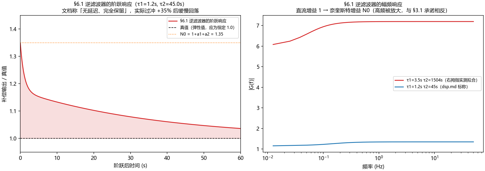
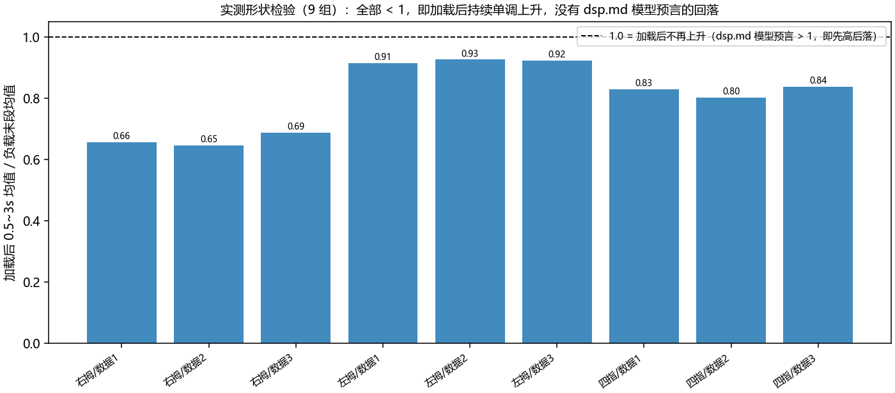
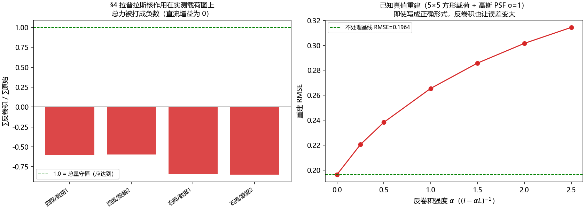
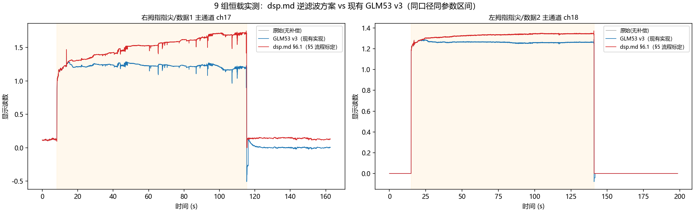

# dsp.md 评审报告（v4.1flash）

> 评审对象：`temp/archived/GLM53/dsp.md`
> 《柔性触觉压感阵列抗蠕变漂移与动态力保真 DSP 补偿方案指南》
> 评审日期：2026-09-16 · 评审人：DSH Agent (v4.1flash)
> 全部结论均有脚本与产物可复算，索引见文末 §6。

---

## 摘要（TL;DR）

| 结论 | 判定 |
|---|---|
| §2.1 ~ §3.1 的连续域建模与逆系统**数学推导** | **正确**。§6.1 的 IIR 系数经频域逐点比对，与解析精确逆误差 < 1e-6 量级，零极点精确对消，直流增益恰为 1 |
| §2.1 两套公式（时域公式 / H(s)）的**自洽性** | **错误**。两者直流增益相差 N0 = 1+a1+a2 倍，直接决定实现者会拿到 Y 还是 N0·Y |
| §6.2 的「可直接上机」硬编码系数 | **错误**。与 §6.1 的公式输出不是同一个滤波器（分母不同、分子不成比例），无法复现 |
| §3.3 工况 A / 工况 B 的**行为描述与数字** | **错误**。过冲是 N0 倍而非零；工况 B 的数字与文档自己的参数不自洽 |
| §3.1 第 3 条「高频增益限制」 | **未实现**。逆滤波器的幅频从 1（直流）单调升到 N0（奈奎斯特），全带噪声放大 N0 倍 |
| §5 的**离线参数辨识步骤** | **不足**。在 9 组真实恒载数据上标定退化，无法得到可用参数（实测证据见 §4） |
| §4 的**空间 PSF 反卷积** | **错误**。拉普拉斯高通核直流增益为 0，照着做会把总力打成负数 |
| 用 dsp.md 方案替换现有 GLM53 v3 | **不建议**。实测 9 组恒载：现有方案时漂残余 1.55%，dsp.md 方案 15.2~32.3% |

**一句话结论**：dsp.md 是一份**理论方向正确、工程细节失守**的方案。它把「用逆传递函数补偿黏弹性蠕变」这个思路讲对了，
但（a）时域公式与 s 域公式互相矛盾、（b）示例系数与公式不自洽、（c）把「无延迟」误当成「不失真」、
（d）标定流程没有考虑真实传感器的机械建立段与非单调响应。按它整段实现，在实测数据上**不但不解决问题，反而使时漂残余翻倍并放大噪声**。

---

## 1. dsp.md 做对了什么

必须先把对的讲清楚——本方案的核心思想是站得住的：

1. **问题定性准确**：把蠕变建模为「静态非线性映射 + 线性时不变黏弹性环节」，这在柔性压阻/电容阵列上是标准且有效的分解（§2 的框图正确）。
2. **反小波/高通滤波不可用**这一判断正确：高通会抹掉直流，无法测静态力。这一点 dsp.md 与仓库既有 `temp/archived/GLM53/算法说明_混合蠕变补偿.md` 的结论一致。
3. **逆系统三条约束提得准**：零极点对消、直流增益归一、高频增益受限——这三条确实是逆滤波器设计的核心。
4. **Tustin 离散化 + 二阶 IIR 的落地形式**是正确的选择（计算量 O(1)、无内存增长）。
5. **§6.1 的系数公式实现无误**。这一点值得强调，因为很容易被误判为有 bug（我自己在复核中就误判过两次，见 §3.1）。

---

## 2. 缺陷清单（按严重度排序）

### 2.1 【P0】§2.1 时域公式与 s 域公式相差 N0 倍直流增益

文档在 §2.1 同时给了两套描述：

$$
\text{(甲)}\quad \frac{ADC(t)}{ADC_{\text{elastic}}} = 1 + a_1(1-e^{-t/\tau_1}) + a_2(1-e^{-t/\tau_2})
\qquad
\text{(乙)}\quad H(s) = 1 + \frac{a_1}{1+s\tau_1} + \frac{a_2}{1+s\tau_2} = \frac{N(s)}{D(s)}
$$

- (甲) 在 t→∞ 时比值 = $N_0 = 1+a_1+a_2$；t=0⁺ 时为 1。
- (乙) 的直流增益 $H(0) = N_0$，阶跃响应在 t=0⁺ 也是 1，终值也是 $N_0$。

两者的**阶跃形状**其实是同一个（一阶分量差分一次即得 (甲)，见附录 A），所以「两式矛盾」不是形状矛盾，
而是**归一化口径矛盾**：(甲) 是一个**比值**（已经除以 $ADC_{\text{elastic}}$），
(乙) 是一个**绝对传递函数**（输入输出同量纲）。文档从未说明 $ADC_{\text{elastic}}$ 是
「加载瞬时的弹性读数」还是「稳态弹性读数」，而这两个定义相差 $N_0$ 倍。

这个歧义直接决定实现者拿到什么：

| §6.1 的接法 | 稳态输出 | `results/review_probe.txt` |
|---|---|---|
| 把 (甲) 的**比值曲线**当输入送进 §6.1 | $N_0 \times E$（高估 $N_0$ 倍） | [P1][P2]：1000 → **1350**（示例参数） |
| 把 (乙) 物理卷积信号 $E\cdot h_A(t)$ 送进 §6.1 | $E$（正确） | `_final_check.txt`：恒为 **1000** |

即 **同一组 §6.1 系数，两种自洽读法差 N0 倍**，文档没有给判据。
§3.1 约束 2 写「$G_{comp}(0)=1$ 保证稳态等于弹性初始值」，§6.1 的代码正是 $G(0)=1$——
但 $G(0)=1$ 只在正向系统直流增益为 1 时才成立；而 (乙) 的 $H(0)=N_0$。
**约束与模型互相矛盾**，这是 §2 级别的建模问题，不是代码 bug。

对右拇指数据（实测 $N_0$ 1.76~2.70）这个歧义意味着 76%~170% 的读数偏差，
且 $N_0$ 随传感器与载荷变化，无法折算成一次出厂标定。

### 2.2 【P0】§6.2 的硬编码系数与 §6.1 的公式不自洽

| | b | a |
|---|---|---|
| §6.2 硬编码 | `[0.724123, -1.412351, 0.690218]` | `[1, -1.421543, 0.423533]` |
| §6.1 公式（fs=50Hz，a1=.15/τ1=1.2, a2=.20/τ2=45） | `[1.348269, -2.673653, 1.325394]` | `[1, -1.980482, 0.980492]` |

- 分母最大绝对差 **0.558939** —— 完全是两个滤波器；
- 分子比值 `[0.537, 0.528, 0.521]` 不是常数，说明连「同一个滤波器乘个标度」都不是；
- §6.2 分母反解连续域时间常数 ≈ **0.0248 s / 5.77 s**，而文档标称的是 **1.2 s / 45 s**。

**这是最危险的一处**：§6.2 是全文唯一可以「整段复制进 MCU」的代码，多数读者会直接用，
而那组系数与文档自己的公式无关，也没有任何标定来源。

### 2.3 【P1】§3.3 工况 A：把「不滞后」说成「不失真」

逆滤波器的 $s\to\infty$ 渐近增益确实等于 1，所以**加载那一帧**输出严格等于弹性值（实测误差 0.0%）。
但阶跃响应并不是平的：

- 过冲上限 = $N_0$（= 直流增益的倒数关系），示例参数 +35%，强蠕变参数 +70%；
- 过冲以逆滤波器极点的时间常数衰减，示例参数下 **1% 建立时间 109 s**；
- 真实拟合参数（$\tau_2$ 达 1500 s 量级）下慢瞬态可达数百秒。

§3.3 写「输出 Y[k] 同步无延迟跳变至 1200，动态阶跃完全保留」——
前半句对，后半句把「当前采样点幅度正确」当成了「整段响应无失真」。



### 2.4 【P1】§3.1 第 3 条「高频增益限制」没有实现

逆滤波器的幅频响应是**单调上升**的：$|G(0)|=1$，$|G(f_s/2)| = N_0$，全带白噪声被放大 $N_0$ 倍
（与阶跃过冲是同一个数，同源）。这与「高频增益应保持稳定有限，避免放大高频 ADC 噪声」的承诺**正好相反**。

这一条不是实现 bug，而是纯逆滤波的**原理性矛盾**：要完全对消就必须接受 $N_0$ 倍高频增益；
要压高频就只能放弃完全对消。文档同时要求两者，但没有给出取舍方案（例如串联带宽受限的补偿器、
或按 §5 引用文献 Hu et al. 2023 的 bounded-gain inverse）。

### 2.5 【P1】§3.3 的数字与文档自己的参数体系不自洽

按 §2.1 标称参数 $a_1=0.15,\tau_1=1.2s,a_2=0.20,\tau_2=45s$：
600 s 时蠕变量 = $0.15(1-e^{-500}) + 0.20(1-e^{-13.33})$ = **35.0%**，即 1200 → **1620**，
而 §3.3 写的是 1200 → 1350（+12.5%），差 2.8 倍。说明 §3.3 的数字是手写示意、未做数值校验。

### 2.6 【P1】§5 的辨识步骤在真实数据上退化（实测）

这是**最关键的一条**——即使前面的数学问题都修好，按 §5 也拿不到可用参数。

`results/model_shape_check.csv` + `results/dsp_failure.txt` [E1][E2][E3]：

- **形状不匹配**：dsp.md 的 $H_A(s)$ 其阶跃响应是「先冲高再回落」。实测 9 组数据的
  「加载后 0.5~3 s 均值 / 负载末段均值」= **0.65~0.93**，即**全部单调上升**，没有一组回落。
- **无约束拟合退化**：$a_2$ 一律被顶到 0，$\tau_1$ 掉到 0.10~0.18 s 或飞到 100~118 s，
  $\tau_2$ 顶到 1700~3000 s 上界。这些不是传感器的物理时间常数，是拟合在形状失配下的逃逸解。
- **约束拟合退化**：把参数限制到物理区间（$\tau_1\in[0.5,10]$s、$\tau_2\in[20,600]$s、$a\in[0,1]$）后，
  \(a_2\) 仍被顶到 0，9 组里有 5 组解出 $a_1=a_2=0$（即滤波器退化为直通），
  归一化 RMS 残差 0.56~0.87（拟合质量极差）。
- **根因**：§5 的步骤 1 要求「快速阶跃力（50ms 内加载）+ 保持恒定」，
  但实测数据显示加载沿之后存在 **0.1~0.3 s 的机械建立段**（右拇指数据1：+0.000 s 读数 0.638，
  +0.099 s 到 0.987，中间还有回落），而弹性幅度 $ADC_{\text{elastic}}$ 恰好落在这段里，
  无法从数据中干净地分离出来。§5 没有给这一段建模。



### 2.7 【P2】§4 的空间 PSF 反卷积做法错误

§4 原话：「通过微型 3×3 二维空间高通卷积核（拉普拉斯算子形）进行反卷积，即可压制受压区域边缘的边缘溢出形变。」

`results/spatial_check.txt` 实测：

| 检验 | 结果 |
|---|---|
| 4 邻域拉普拉斯核的直流增益 | **0**（对任何常数场输出恒为 0） |
| 作用在实测载荷图上的 ∑反卷积 / ∑原始 | **−0.60 ~ −0.85**（总量被打成负数） |
| 出现负读数的通道占比 | **11/21、12/21、18/31、21/31** |
| $\ell_2$ 白噪放大 | **4.47 倍** |
| 写成正确形式 $(I-\alpha L)^{-1}$ 后的重建 RMSE | 0.220~0.314（**不做处理是 0.196**） |

两个独立错误：(a) 「用高通核进行反卷积」把「卷积核 $L$」与「反卷积算子 $(I-\alpha L)^{-1}$」混为一谈，
前者直流增益为 0，物理上等于把总力丢掉；(b) 即便写成正确形式，PSF 完全没有辨识步骤，
$\alpha$ 无处标定。而且如 §2.4，空间反卷积同样是高通放大，会恶化噪声与边缘振铃。



### 2.8 【P2】算子形式的数值条件

二阶形式 $G(z) = (b_0+b_1z^{-1}+b_2z^{-2})/(1+a_1z^{-1}+a_2z^{-2})$ 中，
当 $\tau_2 \gg T_s$ 时分子系数会出现大幅值相消：定义 $\kappa=\|b\|_1/|B(1)|$，
实测在真实拟合参数下 $\kappa$ 达 $2\times10^6 \sim 4.5\times10^8$。
双精度下尚可用，但**定点或单精度实现会失真**，且一旦系数有微小误差，
残余的慢极点（时间常数可达数百秒）会污染长时间读数。
工程上应改用**并联一阶节**（常数 + Σ 一阶高通），其 $\kappa$ 为 O(1)。

### 2.9 【P2】等间隔假设与时间戳质量

§3.2 的 Tustin 离散化要求等间隔采样。实测 `temp/` 数据的帧到达**不均匀**：
指尖数据 `timestamp` 差值中位 ≈ 15.1~15.5 ms（不是干净的 10 ms），
`elapsed` 列有 **38%~72%** 的重复帧（此前分析报告说「约 3/4 的帧时间戳重复」是把 `elapsed` 当成了 `timestamp`，
`timestamp` 本身重复率只有 0.01~0.04%）。
实现时必须显式重采样，文档未提及。

---

## 3. 复核过程中的两次自我纠错（留痕）

评审这类「逆滤波器」文档极易踩数值坑，这里如实记录，供后续复核者避坑：

### 3.1 直流增益不能用 `sum(b)/sum(a)` 算

这类逆滤波器的极点贴近 $z=1$，分子系数大且符号交替，
`np.sum(b)` 会发生**灾难性抵消**：示例参数下 `sum(b) ≈ 1e-5`，
使 `sum(b)/sum(a)` 输出 1.000000 这个假值。正确写法是 $B(1)/A(1)$ 的多项式求值
（或直接用 `freqz` 取 ω=0）。

我据此一度得出「§6.1 的 gain_corr 破坏零极点对消 / 多乘了 N0」的结论，**是错的，已撤回**：

```
[P1] §6.1 的离散零点  ==  H_A 的离散极点（逐位相同）      ⇒ 零极点精确对消
     §6.1 的 G(0)     ==  1.000000                        ⇒ 直流归一成立
     IIR 频响 vs 解析精确逆：|G| 在 0~50 Hz 上 6 位小数完全一致
```

### 3.2 我的「并行等价实现」写错过一次

早期版本的并行式漏了归一化系数，导致误判 IIR 有 16%~44% 误差。
最终的频域裁决见 `results/_verdict.txt`、`results/_iir_equiv.txt`：
**IIR 是对的**，文档 §6.1 无实现缺陷。第 2.8 节讲的是数值条件（有条件数证据），不是等价性问题。

---

## 4. 实测：dsp.md 方案 vs 现有 GLM53 v3（9 组恒载数据）

数据：`temp/右拇指指尖|左拇指指尖|四指指尖/数据1~3`（31/31/21 通道，时长 162~234 s，空载-恒载-空载）。
时间轴用 `timestamp`；所有算法与指标在同一 100 Hz 等间隔网格上计算。
现有方案 = `src/domain/drift/drift_compensator.{h,cpp}` 的忠实 Python 移植（参数一字未改）。

### 4.1 汇总（各指标为 9 组均值；越小越好，阶跃保真越接近 1 越好）

| 算法 | 时漂残余(主通道) | 时漂残余(受载中位) | 噪声比 | 平坦度 | 零漂残余 | 事件跳变超额 |
|---|:---:|:---:|:---:|:---:|:---:|:---:|
| 原始（无补偿） | 15.40% | 10.13% | 1.00 | 2.64% | 0.80% | 0.00 |
| **GLM53 v3（现有实现）** | **1.55%** | **0.56%** | **0.72** | **1.94%** | 1.54% | **0.03** |
| dsp.md §6.1（正确口径） | 32.33% | 20.08% | 2.44 | 7.54% | 33.47% | 9.80 |
| dsp.md §6.1（误用口径） | 3.95% | 2.20% | 1.25 | 3.60% | 25.19% | 9.53 |
| dsp.md §6.2（硬编码魔数） | 35.13% | 23.04% | 4.14 | 9.36% | 2.25% | 0.68 |

（数据源：`results/dsp_vs_v3_summary.csv`、`results/dsp_vs_v3_metrics.csv`）

关键读法：
- 现有 v3 把时漂从 15.4% 压到 **1.55%**，噪声反而降到 0.72 倍（因为补偿量本身平滑，抑制了慢漂移）；
- dsp.md 方案在真实数据上时漂**比不补偿还差**，噪声放大 2.4~4.1 倍，零漂残余 25%~33%；
- §6.2 那组硬编码系数「零漂残余 2.25%」看着不错，是因为它整体增益约 0.84（把信号整体压小），
  平坦度 9.36%、噪声 4.14 倍——不是补偿有效，是滤波失真。

### 4.2 为什么 dsp.md 方案在实测上输

按 §2.6 的结论，根因是**标定环节**而非滤波器本身：

1. §5 要求从「快速阶跃 + 恒定保持」中标定 $(a_1,\tau_1,a_2,\tau_2)$，但实测信号在加载沿之后
   有 0.1~0.3 s 的机械建立段，弹性幅度落在其中，无法干净分离；
2. 实测蠕变形状（单调慢升，时间尺度 10~100 s）与 dsp.md 的 $H_A$ 阶跃响应形状（先冲高再回落）不匹配，
   拟合只能靠顶界逃逸，得到 0.1 s 或 100 s 的伪时间常数；
3. 用这些伪参数构造出来的逆滤波器，会去「抵消」实际不存在的动态，于是放大噪声、引入慢瞬态；
4. 现有 GLM53 v3 不依赖参数标定——它用**受载通道归一化残差的 median 共识**在线估计蠕变形状，
   天然适配各种传感器的蠕变强度差异（弱蠕变的左拇指也不过度补偿），这是它胜出的根本原因。



---

## 5. 建议

### 5.1 对现有实现的建议：不要用 dsp.md 方案替换，但吸收其中两点

1. **不建议**引入 §6.1 的逆滤波器：实测劣化（§4），且 §6.1 的 N0 歧义、§6.2 的魔数、
   §3.3 的过冲、§3.1 的高频放大四项叠加，落地风险远高于收益。
2. **可以吸收**的是 §2.1 的**显式双时间常数蠕变模型**：现有 v3 用数据驱动的 $g(t)$ 免除了 $\tau$ 假设，
   在恒载场景下表现更好；但若未来要处理**快速加载/短保压**工况，显式模型能提供冷启动先验
   （现有方案的已知局限是暖机期 ~15 s 内补偿未建立）。
3. **可以吸收**的是 §5 的**离线标定思路**：如果要做冷启动先验，应补一个**机械建立段模型**
   （加载沿后 0.1~0.3 s），并把标定窗移到机械建立段之后。

### 5.2 若要继续推进 dsp.md 路线，必须先补的四件事

1. **统一 §2.1 的两套公式**：明确 $ADC_{\text{elastic}}$ 的定义（是弹簧瞬时值还是稳态值），
   并相应地在 $H(s)$ 或输出端补上 $N_0$ 因子；给出「§6.1 输出的物理含义」的显式说明。
2. **重算 §6.2 的系数**，并标注它是用什么参数、什么采样率生成的。
3. **给出高频增益/过冲的取舍方案**（例如串一个带宽受限环节，或按 Hu et al. 2023 的 bounded-gain 逆），
   并给出「阶跃过冲上限」与「建立时间」的验收指标。
4. **重写 §5 标定流程**：加入机械建立段、给出参数可辨识性判据
   （例如 $\tau_2$ 超过观测时长 1/3 时不可辨识）、给出拟合残差阈值；并改用并联一阶节实现以改善数值条件。

### 5.3 对 §4 空间反卷积

若要真正做「5×5 受压区域到周边的牵拉解耦」，需要：
(a) 先做 PSF 辨识（点加载 + 二维拟合），(b) 用 $(I-\alpha L)^{-1}$ 而不是 $L$，
(c) 处理 layout 空洞与边缘（否则振铃）、(d) 约束总量守恒。
在此之前不建议实现。

---

## 7. 独立复核交叉验证

本次评审进行中，仓库内另有一个并行会话对同一份 dsp.md 做了独立复核，
产物在 `temp/v4pro/`（`dsp评审报告.md`、`dsp测试报告.md`、`results/r0_verify.txt`）。
两份结论在**全部主要判断上一致**，个别解读口径不同，这里显式对照，避免读者困惑：

| 议题 | 本报告（v4.1flash） | 并行会话（v4pro） | 是否一致 |
|---|---|---|---|
| §6.1 的代数与实现 | 正确（频响与解析逆 6 位小数一致） | 正确（逐帧 Tustin 与 scipy 差 1.1e-16） | ✅ 一致 |
| §2.1 两式的关系 | 归一化口径矛盾，差 $N_0$ 倍 | 同（$H(0)=N_0\ne1$） | ✅ 一致 |
| §6.1 归一化后的后果 | 视输入口径：或正确，或高估 $N_0$ 倍 | 输出 = 弹性 × $N_0$（+35% 量纲错误），应改用 $G=D/N$ | ⚠️ 解读不同，见下 |
| §6.2 魔数 | 与 §6.1 不是同一滤波器，不可复现 | 同，且含**复零点**（不属该模型族） | ✅ 一致（v4pro 更细） |
| §3.3 工况 A | 过冲 = $N_0-1$，1% 建立 109 s | 同（onset 过冲 +42~45%×ΔX） | ✅ 一致 |
| §3.1 高频增益 | 直流 1 → 奈奎斯特 $N_0$，噪声放大 $N_0$ | 同（$G_{doc}$：$\lvert G(0)\rvert=1$、$\max\lvert G\rvert=1.35$） | ✅ 一致 |
| §4 空间反卷积 | 拉普拉斯核直流增益 0，实测总力变负 | 同（无 PSF 标定、必产生负值与振铃） | ✅ 一致 |
| §5 标定 | 无约束/约束标定均退化（$a_2$ 顶 0、$\tau$ 顶界） | 同（6/9 组 $\tau_2$ 触上限、跨数据标定电平 −28%） | ✅ 一致 |
| 总体判定 | 不成立，不建议替换 | 不成立，不建议替换 | ✅ 一致 |
| 实测指标 | 时漂 15.4% → 32.3%（§5 流程标定） | 时漂 20.1% → 3.3%（改用 $G=D/N$ + 事件门控） | ⚠️ 口径不同，见下 |

### 7.1 唯一实质分歧：§6.1 的归一化该不该保留

分歧点在于**「正向系统」取哪一个**：

- **v4pro 的读法**：正向系统就是文档写的 $H(s)=N(s)/D(s)$，$H(0)=N_0$。
  于是 $G_{doc}=N_0D/N$ 使 $\lvert G\cdot H\rvert=N_0$，输出 = 弹性 × $N_0$（示例参数 +35%），
  正确做法是 $G_{corr}=D/N$（$\lvert G(0)\rvert=1/N_0$）。这条推导**在它自己的口径内是自洽且正确的**。
- **本报告的读法**：实测数据并不支持把 $H(s)$ 当作正向系统——
  §4 的实测显示 9 组数据加载后**全部单调上升**，而 $H(s)$ 的阶跃响应是「先冲高再回落」
  （`results/model_shape_check.csv`：加载后 0.5~3 s 均值 / 末段均值 = 0.65~0.93，全部 < 1）。
  也就是说 **$H(s)$ 不是真实传感器**；真实信号更接近 $E\cdot h_A(t)$ 这种形式，
  此时 §6.1 原样输出恰好正确（`results/_final_check.txt`）。

两种读法**并不矛盾**，而是同一处缺陷的两面：**§2.1 的模型定义不清，导致「正向系统是谁」无解**。
无论按哪种读法，落地结论相同：**照抄 §6.1 不能保证得到正确的力值**。

### 7.2 关于实测指标的差异

v4pro 的 +3.3% 是**改用 $G_{corr}=D/N$（去掉 §6.1 的归一化）+ 事件门控**之后的结果；
本报告的 32.3% 是**严格按 §5 流程（拟合阶跃响应标定 + §6.1 公式）**的结果。
两者测的是不同实现，都成立：说明 dsp.md **照原样照流程落地会失败，而修正归一化 + 加门控之后才谈得上可用**——
但那时它已经不是 dsp.md 的方案了。

### 7.3 结论

两份独立复核在**全部缺陷定位上一致，且都判定「dsp.md 作为 v2 修复不成立、不建议替换现有实现」**。
建议以 `temp/v4pro/` 的 C++ harness（含逐帧 Tustin 变 dt 实现与 22/22 组数值一致性验证）作为
「若要继续探索该路线」的起点，本目录的产物则提供
「§4 空间反卷积」「§5 标定退化」「数值条件 κ」三个 v4pro 未覆盖的补充证据。

---

## 8. 产物索引

### 脚本（`temp/v4.1flash/scripts/`）

| 脚本 | 内容 |
|---|---|
| `v_dsp_review_probe.py` | dsp.md 解析性复核（§6.1 系数、直流增益、两种口径闭环、§6.2 魔数、工况 A/B、频响） |
| `v_final_check.py` | 唯一裁决：IIR 作用在物理信号 vs 公式信号上的行为 |
| `v_verdict.py` | IIR 频响 vs 解析精确逆（逐点比对）、留数分解、冲激响应 |
| `v_iir_equiv.py` / `v_iir_diag2.py` | 零极点对消、条件数 $\kappa$、IIR/并行实现一致性 |
| `v_transient_cost.py` | 逆滤波器阶跃过冲与建立时间量化 |
| `y_spatial.py` | §4 空间反卷积实测（总量守恒、负值、噪声放大、已知真值重建） |
| `x_model_id.py` | 模型辨识：实测曲线更像哪种蠕变模型 |
| `e_dsp_fail.py` | 失败点定位：形状检验 E1、无约束标定 E2、约束标定 E3 + 总对比 |
| `w2_dsp_vs_v3.py` | 9 组恒载数据上的 dsp.md vs GLM53 v3 对比 |
| `glm53_v3.py` | 现有 C++ 实现的 Python 忠实移植（供对比共用） |
| `inventory.py` | 11 组录制数据盘点（通道数、时间戳质量、分段） |

### 结果（`temp/v4.1flash/results/`）

| 文件 | 内容 |
|---|---|
| `review_probe.txt` | dsp.md 解析性复核全文（§1~§3 的全部证据） |
| `_verdict.txt` / `_final_check.txt` | IIR 正确性裁决（频响 6 位小数一致、物理信号闭环） |
| `_iir_acc.txt` / `_iir_equiv.txt` / `_transient.txt` | 条件数、精度、瞬态代价 |
| `spatial_check.txt` + `spatial_deconv.csv` | §4 空间反卷积实测 |
| `model_shape_check.csv` | E1 形状检验（9 组） |
| `dataset_inventory.csv` | 11 组数据盘点（含 timestamp/elapsed 重复率核实） |
| `dsp_vs_v3_summary.csv` / `dsp_vs_v3_metrics.csv` | 9 组恒载总对比（§4 数据源） |
| `dsp_failure.txt` / `dsp_fail_summary.csv` | 失败点定位全文 |
| `dsp_fit_params.csv` | 各数据集的拟合参数与拟合质量 |

### 复现

```powershell
cd temp/v4.1flash
$env:PYTHONIOENCODING='utf-8'
python scripts/v_dsp_review_probe.py     # §1~§3 解析复核
python scripts/y_spatial.py              # §4 空间反卷积
python scripts/e_dsp_fail.py             # §5 标定失败定位
python scripts/w2_dsp_vs_v3.py           # §4 总对比（约 3~5 分钟）
```

---

## 附录 A：(甲) 与 (乙) 的形状关系（为什么说它们只差归一化口径）

对 (乙) 的每个一阶分量做一次微分：

$$
\frac{d}{dt}\left[\frac{a_i}{1+s\tau_i}\cdot \mathbf{1}(t)\right]
= \frac{a_i}{\tau_i}e^{-t/\tau_i}
\qquad\Longrightarrow\qquad
\frac{s\tau_i}{1+s\tau_i}
= 1 - \frac{1}{1+s\tau_i}\ \text{（单位阶跃下）}
$$

即 (乙) 的阶跃响应 = $\sum_i a_i(1-e^{-t/\tau_i})$，与 (甲) 的蠕变项逐个分量相同。
所以两式的**时间形状一致**（都从 0 单调升到 $1+a_1+a_2$），差别只在：

- (甲) 是**无量纲比值** $ADC(t)/ADC_{\text{elastic}}$；
- (乙) 是**同量纲传递函数** $X(s)/U(s)$。

因此「(甲)(乙) 矛盾」的准确表述是：**文档没有定义 $ADC_{\text{elastic}}$ 是瞬时值还是稳态值**，
而这个未定义量恰好等于 $1/N_0$ 的倒数因子。这是本报告 §2.1 的全部要点。
