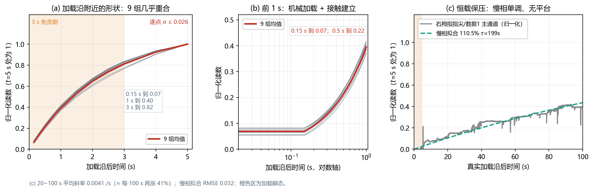
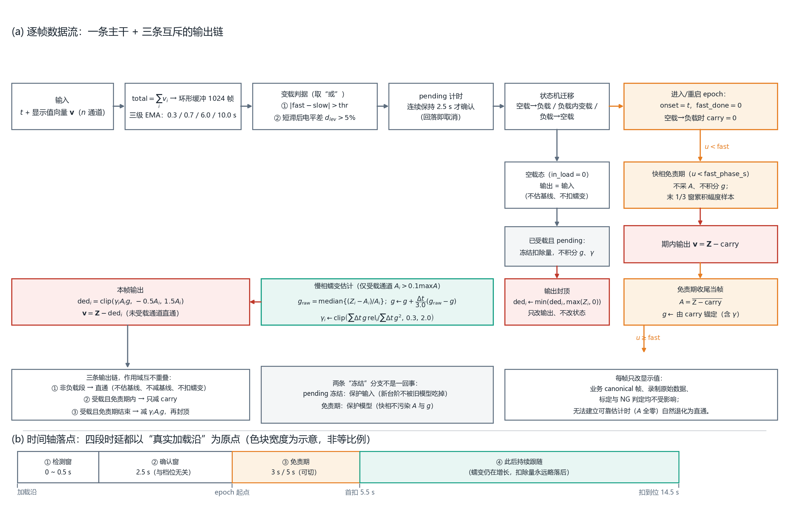
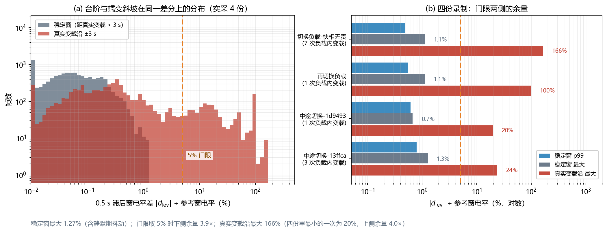
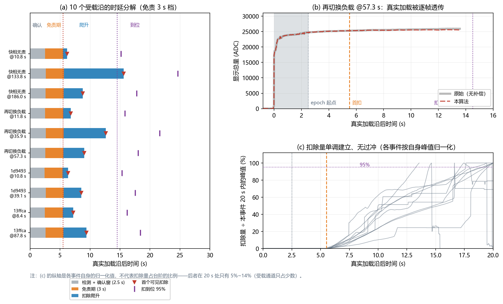
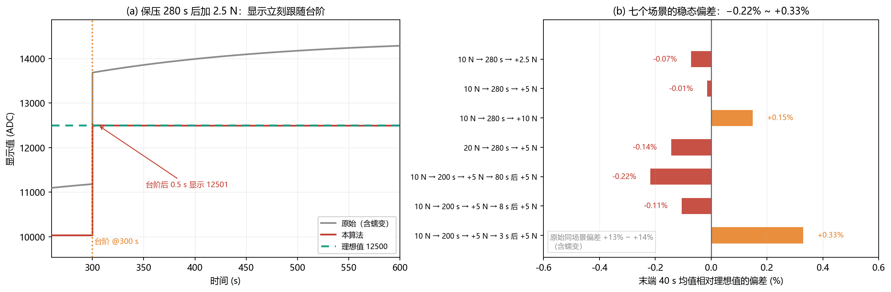
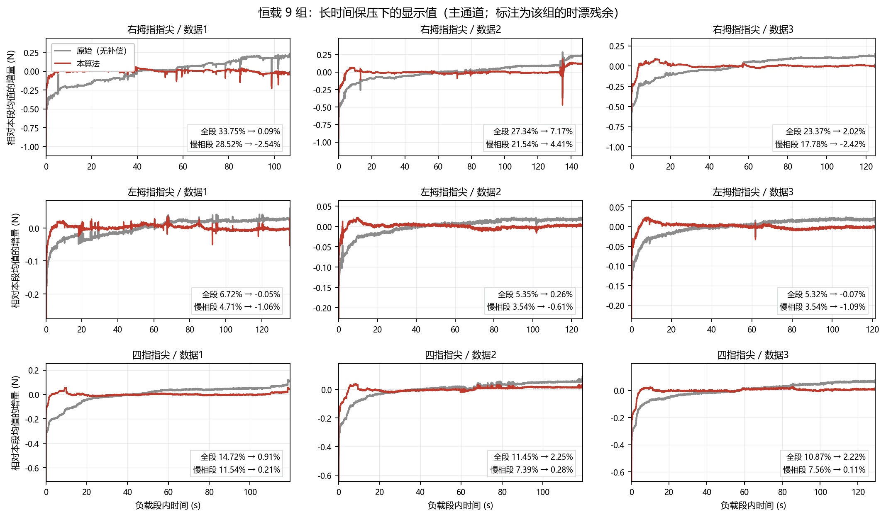

# 柔性触觉阵列显示层抗蠕变漂移补偿算法

**摘要**　柔性压阻触觉阵列在恒定压力下会出现与载荷成比例的缓慢读数上升（黏弹性蠕变，本文称时漂）。9 组恒载录制中，负载段内（107~147 s）的原始漂移占幅度的 5.32%~33.75%（\|值\| 均值 15.43%），且到负载段结束仍未收敛。本文给出一条严格因果的在线补偿算法：先用"短滞后电平差"判据以约 30 倍的信噪余量识别真实载荷变化，再用"快相免责期"把加载后的确定性瞬态排除在蠕变估计之外，最后用一个负载比例的蠕变场与逐通道增益构成补偿量。算法在 4 份实采录制与 9 组恒载录制上把慢相段的时漂残余从 11.79% 压到 1.41%，把变载台阶的透传比做到中位 0.96，并用独立参考实现的逐帧对拍确认落地实现与原型逐帧相等。代价同样明确：从真实加载沿到扣除量到位约需 17.7 s，其中 2.5 s 用于抵抗瞬态误判、3 s 用于隔离快相，其余用于过程平滑。

**关键词**　触觉阵列；黏弹性蠕变补偿；在线估计；变载检测；鲁棒中位；因果滤波

---

## 1 引言

### 1.1 一个必须与载荷成比例处理的量

柔性触觉阵列的零点与灵敏度都会缓慢变化。这类变化在工程上通常被笼统称作"漂移"，但其中至少有两种性质完全不同的东西：

- **零漂**——无负载时读数偏离零点，属加性基线偏移，随环境与装配变化；
- **时漂（蠕变）**——恒定压力下读数持续缓慢上升，来自压敏材料的黏弹性蠕变，其增量与当前载荷成比例，不具备可加的基线形式。

把两者当成同一个量处理，会得到一个看起来能跑、但在两者主导区间互相破坏的补偿器：用基线估计去治蠕变，会在保压段把蠕变当成基线抬走，从而系统性欠报；用比例模型去治零漂，则会在空载段凭空产生补偿量。本文只处理后者，并把前者的处理明确留给采集与标定环节。

这个选择有一个直接后果，写在算法语义的第一条：**非负载段的输出等于输入**。不估基线、不减基线、不扣蠕变，零点保持传感器当前读数。这与"空载必须显示 0"的常见期望相反，因此需要显式声明，也需要在验收时用"零负载段输出逐帧等于输入"这条断言把它锁住。

### 1.2 保压过程的两段结构与它的工程含义

对加载后读数做分段斜率统计，可以看到一个形状很稳定的过程。图 1(a)(b) 给出 9 组恒载录制（三种指尖位置，各 3 次）在真实加载沿附近的归一化轮廓：0.15 s 到 0.07，1 s 到 0.39，3 s 到 0.81，4 s 时约完成 92%，5 s 归一化为 1。9 条曲线的逐点标准差最大 0.026、均值 0.016，且 9 组的主通道幅度从 1.27 N 到 1.89 N（差 49%），曲线仍几乎重合。也就是说，这一段的形状**不随幅度变化**，是可复现的确定性响应，而不是需要在线学习的随机过程。

图 1(c) 给出一次恒载保压的 100 s 记录（右拇指指尖/数据1 的主通道，以加载沿 +5 s 处归一化）。这段曲线在 100 s 内从 0 涨到约 1.1，单调、没有出现平台；它在 20~100 s 的平均斜率为 0.0041 /s（每 100 s 再涨约 41%）。也就是说，**在本实验的时间尺度内慢相并没有走完，也看不到饱和**——这直接决定了补偿器只能"跟随"而不是"扣完"，第 7.3 节会回到这一点。

这里需要说明慢相参数的来源限制。实采变化负载录制不能用来拟合慢相：在 20~120 s 这个尺度上，主导因素是操作者的移动与指位调整（在 13ffca 录制里，10~15 s 之间出现过相对 5 s 电平 +40% 的跳变）。恒载录制从头到尾只有一次加载，是唯一能干净看到慢相的场合，本文合成场景用的蠕变律参数就来自这一批录制（见 §8.1 的口径说明）。

两段结构在物理上并不神秘：加载瞬间是机械加压与接触建立的组合过程，随后才是材料蠕变。但它对辨识问题的影响很大：**在 0~4 s 内，任何在线算法都无法从数据里把"机械加载"和"材料快相"分开**，而在 4 s 之后信号是单调光滑的，建模难度下降一个数量级。这就给出一条很具体的路：与其在混叠区硬做辨识，不如把这一段时间整体划出去，让问题从"两个时间尺度混叠"退化为"单尺度平滑跟踪"。

值得注意的是，后面各项常数的取值都可以追溯到这个形状上，而不是调参调出来的：4 s 完成 92% 决定了免责期的量级，归一化轮廓的单调性决定了"不扣比乱扣安全"，轮廓的低标准差决定了这一段具备出厂标定的可能（本文不做）。



**图 1：加载过程的两段结构。** (a) 9 组恒载录制在真实加载沿附近按"$t$=5 s 处置 1"归一化后的读数；灰线为各组，红线为均值，橙色区为本文的 3 s 免责期，右上角给出 9 条曲线的逐点标准差。(b) 前 1 s 的对数时间轴细节：0.15 s 已达 7%，说明机械加载与接触建立是同一段过程。(c) 一次恒载保压的 100 s 记录（右拇指指尖/数据1 主通道，同一归一化口径）与单时间常数慢相拟合（$\tau_2$=199 s）；橙色区为加载瞬态，拟合参数与残差见该子图下方的说明行。数据来源：`temp/右拇指指尖|左拇指指尖|四指指尖/数据1~3`（均为力值域）。结论：快相形状不随幅度变化（9 组主通道幅度差 49%，曲线仍重合，逐点 $\sigma\le0.026$）；5 s 之后只剩一个单调的慢相，且到 100 s 仍未走完（该子图纵轴口径到 100 s 时约为 1.1）——前者是免责期的取值依据，后者决定补偿器只能是"跟随"而不是"扣完"。

### 1.3 在线变载识别为什么是前置条件

如果载荷在某段时间内真的恒定，蠕变估计并不困难。使问题变难的是一条所有在线方法都会遇到的路径：**模型用旧参数去解释新输入**。

设 epoch 的幅度参考为 $A$、蠕变场为 $g$，补偿量为 $\gamma_iA_ig$。当载荷在负载内发生一次阶跃、而算法尚未确认时，新台阶的增量仍然会被 $g$ 的更新吸收：

$$
g_{\text{raw}}=\operatorname{median}\Big\{\tfrac{Z_i-A_i}{A_i}\Big\} > 0
$$

扣除量因此继续增长，直到把整个台阶吃掉。显示值被"拉回"到原电平附近，而原始读数明明已经跳上去了。实测这个效应可以很大：在一份录制里，一次 $+5254$ ADC 的变载（占前级电平 0.26）因未被识别，扣除量冲到 9241 ADC，显示欠报 36% 并持续到卸载。

这类失败不能靠加大平滑或收紧限幅来救，因为它不是噪声问题，而是模型状态被污染。所以本文算法的第一个模块不是估计器，而是变载检测与三种状态迁移（空载→负载、负载内变载、负载→空载）。

### 1.4 本文做了什么、没做什么

本文给出一条完整的显示层补偿算法，并给出它与四个传统思路的分界：

| 思路 | 为什么不够 |
|---|---|
| 空载归零（基线跟踪） | 只能处理加性零漂；保压段会把蠕变当基线抬走，反而制造欠报 |
| 高通/慢速差分（去掉慢趋势） | 不区分载荷变化与蠕变，且引入群延迟；真实加载也会被"去掉" |
| 逆滤波/标定扣除 | 需要蠕变核可辨识；本文数据中快相与慢相在频域不可分，且加载沿不精确可知 |
| 只在恒载上工作的蠕变模型 | 变载即失效（§1.3），而现场数据里空载↔负载切换是常态 |

算法不做的事同样要写清楚：不补偿零漂；不做相位或形态恢复；不接受非因果输入；不修改任何业务数据，只改最终显示值。第 9 节会把每一条限制对应到产生它的机制上。

---

## 2 算法总体结构

算法对每一帧执行一次，输入是时间戳 $t$（秒，单调递增）与 $n$ 通道显示值向量 $\mathbf v$，输出是同维向量的就地覆盖值。图 2 给出逐帧数据流与三条输出链的关系。

整帧处理可以拆成三段互相独立的链路（图 2(a)）：

1. **空载链路**：$\text{in\_load}=0$ 时直接返回输入，不做任何补偿；
2. **免责期链路**：本 epoch 已受载但 $u<\text{fast\_phase\_s}$（$u$ 为自 epoch 起点计的时间）时，不采幅度、不积分蠕变场，输出 $v_i=Z_i-\text{carry}_i$；
3. **慢相链路**：本 epoch 已受载且免责期结束、且该通道受载（$A_i>0$）时，输出 $v_i=Z_i-\gamma_iA_ig$ 的限幅与封顶结果。

三条链路的作用域不重叠，因此可以分别构造测试用例。这一点在工程上比"指标好看"更重要：一旦某条链路失效，指标会以特定方式退化，而不会表现为整体略微变差。

需要说明一个实现层面的约定：因为不估空载基线，参与补偿计算的读数向量恒有 $\mathbf Z=\mathbf v$。本文保留符号 $Z$ 是为了让公式与代码逐字对应。时间步长按如下规则取：$\Delta t\le0$（时间戳重复或回退）时本帧只跳过状态更新、不做任何快照，$\Delta t>0.1$ s 时截断为 0.1 s（应对卡顿与暂停）。



**图 2：逐帧数据流与时间轴落点。** (a) 本帧的处理顺序：总量与四级平滑 → 变载判据（发散量或电平差，取"或"）→ pending 计时与状态机迁移 → 免责期分支 → 幅度参考与蠕变场估计 → 扣除与输出封顶。免责期分支画在状态机之后，是"免责期内仍能识别卸载"的实现依据。(b) 四段时延相对真实加载沿的落点；色块宽度为示意，不代表等比例时间，但色块边界与下方刻度对齐（首扣 = 加载沿 + 5.5 s，扣到位 ≈ +14.5 s）。结论：三条输出链（空载直通 / 免责期内只减 `carry` / 慢相扣除）作用域互不重叠，可以分别构造用例验证。

---

## 3 符号、状态与常量

### 3.1 符号

| 符号 | 含义 |
|---|---|
| $t$ | 当前帧时间戳（s） |
| $\mathbf v,\ \mathbf Z$ | 当前帧显示值向量与参与计算的读数向量（本算法中 $\mathbf Z=\mathbf v$） |
| $\text{total}$ | 阵列总量 $\sum_i v_i$（变载判据只用总量） |
| $A_i$ | 幅度参考：本 epoch"触面已建立"后的逐通道电平 |
| $g$ | 蠕变场共识（无量纲），受载通道归一化残差的中位 |
| $\gamma_i$ | 逐通道增益（器件间蠕变差异修正） |
| $\text{carry}_i$ | epoch 起点时已生效的逐通道扣除（免责期连续性锚） |
| $\text{loaded}_i$ | 受载通道指示，$A_i>0.10\max_jA_j$ |
| $u$ | 本 epoch 内的时间 $t-\text{onset\_ts}$ |
| $\rho$ | 门控比较容差 $10^{-6}(1+|\text{max\_ts}|)$，兼容空载总量恰为 0 |

### 3.2 状态量

| 状态 | 类型 | 说明 |
|---|---|---|
| `ts_smooth_, fast_, slow_, level_ref_` | double | 总量的四级平滑（$\tau$ = 0.3 / 0.7 / 6.0 / 10.0 s） |
| `min_ts_, max_ts_` | double | `ts_smooth_` 的历史最小 / 最大（门限尺度基准） |
| `pending_, pending_ts_` | bool, double | 变载候选与起算时刻（需持续 2.5 s 才确认） |
| `in_load_, onset_ts_` | bool, double | 是否处于负载段、本 epoch 起点 |
| `hold_, hold_comp_` | bool, VectorXd | pending 期扣除量冻结标志与冻结值 |
| `a_new_acc_, a_new_frames_` | VectorXd, int | pending 期读数累加器（供变载重捕获） |
| `A_, loaded_, a_captured_` | VectorXd, vector&lt;char&gt;, bool | 幅度参考及其捕获状态 |
| `g_, g2_acc_, g_rel_acc_, gamma_` | double, double, VectorXd, VectorXd | 蠕变场、归一化累加器、逐通道增益 |
| `scratch_` | vector&lt;double&gt; | 中位计算工作区（`nth_element`），复用无分配 |
| `lev_ts_, lev_v_, lev_n_` | 定长数组 | 总量电平环形缓冲（1024 帧） |
| `lev_latched_, lev_latch_, lev_thr_` | bool, double, double | 电平差判据的锁存状态、锁存参考电平与当次门限 |
| `fast_done_, carry_, exempt_acc_, exempt_frames_` | bool, VectorXd, VectorXd, int | 免责期是否结束、连续性锚、幅度采集累加器与帧数 |

### 3.3 常量

| 常量 | 值 | 作用 |
|---|:--:|---|
| `kTauTotalSmoothS` | 0.3 s | 阵列总量平滑 || `kTauFastS` / `kTauSlowS` | 0.7 / 6.0 s | 变载检测双 EMA |
| `kTauLevelRefS` | 10.0 s | 近期电平参考 |
| `kTauCreepSmoothS` | 3.0 s | $g(t)$ 平滑（记为 $\tau_g$） |
| `kOnsetRel` | 0.5 | 空载→负载的发散阈（相对 `slow_`） |
| `kStepRel` | 0.18 | 负载内变载的发散阈（相对 `slow_`） |
| `kStepAbsFrac` | 0.01 | 绝对下限（相对历史最大电平） |
| `kStepPersistS` | 2.5 s | 变载确认持续时长（瞬态拒绝） |
| `kStepSuppressS` | 6.0 s | epoch 起点后负载内变载判定的抑制窗 |
| `kUnloadFastS` | 3.0 s | 快速卸载判定的最小 $u$ |
| `kIdleFrac` / `kUnloadMinRatio` | 0.10 / 1.5 | 卸载判据：电平 < 10% 电平参考，或 < 1.5×历史最小 |
| `kPendingResetFrac` | 0.5 | 发散回落至此比例即取消待确认 |
| `kLoadedFrac` | 0.10 | 受载通道入选阈 |
| `kGammaMin` / `kGammaMax` | 0.3 / 2.0 | 逐通道增益限幅 |
| `kCreepLoFrac` / `kCreepHiFrac` | −0.5 / 1.5 | 蠕变扣除限幅（相对 $A_i$） |
| `kGEnable` | 0.02 | 增益更新门槛 |
| `kAWindowStartS` / `kAWindowEndS` | 1.0 / 3.0 s | 幅度兜底采集窗（默认档下被免责期覆盖） |
| `kLevFastS` / `kLevLagS` | 0.3 / 0.5 s | 近期窗 / 滞后窗长度 |
| `kLevRel` / `kLevAbsFrac` | 0.05 / 0.01 | 电平差的相对门限 / 绝对下限 |
| `kLevHistN` | 1024 | 电平环形缓冲帧数 |
| `kFastPhaseDefaultS` / `kFastPhaseAltS` | 3.0 / 5.0 s | 免责期两档（运行期可切换） |
| `kFastPhaseWinRatio` | 3.0 | 幅度窗 = 免责期 / 3 |

免责期长度的两个派生量由它自动决定：幅度采集窗长度 `exempt_awin_s_ = fast_phase_s_ / 3`，电平判据武装延时 `lev_arm_s_ = fast_phase_s_`。这是刻意的：这两个量的物理含义都绑在"快相走完了没有"上，让它们跟着免责期一起动，比提供三个独立旋钮更不容易被配错。

### 3.4 计算与存储代价

每帧运算是 $O(n)$：中位用 `nth_element`（$O(n)$），整帧含 3~4 次中位。常驻内存是电平环形缓冲 $1024\times2$ 个 double（约 16 KB/实例）加若干 $O(n)$ 向量；稳态**零动态分配**（中位工作区在通道数变更时预留，环形缓冲为定长数组）。全部运算都是正向滤波（EMA + 中位 + 凸组合），没有逆滤波器、没有大规模相消，对定点与单精度运算友好——这一点比绝对计算量更值得关注，因为它决定算法能否下移到成本更低的平台上。

**信号通路零群延迟**：EMA 与各级平滑只影响状态估计，不进入直通路径，任意时刻的输出都只用当前帧的读数。补偿量本身的建立才是有延迟的过程（$\tau_g$=3 s），这个延迟属于估计收敛，不属于信号通路。

---

## 4 变载判据

### 4.1 单纯的双 EMA 发散判据有一个被放大 1.5 倍的门限

负载内变载检测最初用的是快慢两个指数滑动平均的发散量：

$$
\text{div}(t)=|\text{fast}(t)-\text{slow}(t)|,\qquad \tau_f=0.7\ \text{s},\ \tau_s=6.0\ \text{s}
$$

判据写作 $\text{div}>\text{thr}$，$\text{thr}=0.18\max(\text{slow},\rho)$。

问题出在这个式子的**有效**门限上。对一次幅度 $\Delta$ 的阶跃，双 EMA 的响应为

$$
\text{div}(t)=\Delta\left(e^{-t/\tau_s}-e^{-t/\tau_f}\right),\qquad
\max_t\text{div}=0.665\,\Delta\ \ (t\approx1.70\ \text{s})
$$

（$0.665=\big(\tfrac{\tau_s}{\tau_f}\big)^{-\tau_f/(\tau_s-\tau_f)}-\big(\tfrac{\tau_s}{\tau_f}\big)^{-\tau_s/(\tau_s-\tau_f)}$）

也就是说，名义 18% 的门限对应的**最小可识别台阶约为 $0.18/0.665\approx27\%$ 电平**。低于这个比例的加载不会被识别，只会被蠕变模型当成慢相增量积分掉。

这条推断有实测台账支持。一份录制里，占前级电平 0.24 的 $+4672$ ADC 台阶在 8 s 内原始走 +4900，显示只走 +1937（41%）；另一份录制里占电平 0.256 的 $+5254$ ADC 台阶导致扣除量冲到 9241 ADC、欠报 36%。这两个台阶的比例都落在 0.18~0.29 之间，恰好在"名义门限以下、有效门限以下"。三条录制合并的负载内变载台账显示：台阶/电平比 $\ge0.29$ 的 2 个全部识别，$<0.29$ 的 2 个全部漏检。

### 4.2 短滞后电平差：直接测电平台阶

修补不是把 0.18 改小——改成 0.10 只会让有效门限变成 15%，同时开始被蠕变斜坡与操作抖动触发。问题在于判据本身经过了一个增益为 0.665 的"隐身放大"，因此本文改成直接测电平差：

$$
d_{\text{lev}}(t)=\underbrace{\overline{\text{total}}_{(t-0.3,\,t]}}_{\text{近期窗}}-\underbrace{\overline{\text{total}}_{(t-0.8,\,t-0.3]}}_{\text{参考窗}},
\qquad
\text{thr}(t)=\max\big(0.05\,|lv_{\text{ref}}|,\ 0.01\,\text{max\_ts}\big)
$$

判据为 $|d_{\text{lev}}|>\text{thr}$。这个门限就是它字面上的 5%，不再有隐含增益。

**0.5 s 滞后差分为什么能分开台阶与斜坡**：实测最快的蠕变斜坡也只到约 1%/s，0.5 s 内的变化约 0.5%，远低于 5%；而砝码台阶是一次性跳变，全额呈现在该差分里。用 3 s 长窗做不到——它会把快相与快速蠕变误判为台阶，把一段恒载切成多个 epoch。

### 4.3 门限取 5% 的实测余量

图 3 给出 4 份实采录制上 $|d_{\text{lev}}|$ 相对参考窗电平的分布。这里需要给"稳定窗"一个不依赖判据本身的定义，否则会自证。本文采用：**前后 ±3 s 内总量平滑电平的滑动标准差 < 0.5% × 该帧电平**的帧。这个定义只看电平是否在动，与判据无关，因此快相尾巴、加载/卸载沿、手指调整、以及未被事件检测器标出的轻微变载都会被排除在外。

结果（表 1）：

| 录制 | 稳定窗帧数 | 稳定窗 p99 | 稳定窗最大 | 真实变载沿最大 | 分离倍数 |
|---|:--:|:--:|:--:|:--:|:--:|
| 切换负载-快相无责 | 13653 | 0.49% | 1.14% | 166% | 336× |
| 再切换负载 | 1930 | 0.55% | 1.12% | 100% | 180× |
| 中途切换-1d9493 | 1689 | 0.62% | 0.67% | 20% | 32× |
| 中途切换-13ffca | 4224 | 0.79% | 1.27% | 24% | 30× |

稳定窗的最大电平波动不超过 1.27%（相当于 177~374 ADC），而真实变载沿一侧最小也有 20%。取 5% 时下侧余量 3.9 倍、上侧余量 4 倍。**判据两侧没有重叠**，这是把它作为"或"条件加入现有发散判据的依据。



**图 3：同一个 0.5 s 滞后差分上，台阶与蠕变斜坡的分布是分开的。** (a) 4 份实采录制逐帧的 $|d_{\text{lev}}|$ ÷ 参考窗电平（对数横轴、对数纵轴），灰色为稳定窗（前后 ±3 s 内电平滑动标准差 < 0.5% × 电平，定义与判据无关），红色为真实变载沿 ±3 s；橙色虚线是 5% 门限。(b) 逐录制的门限两侧余量：蓝条为稳定窗 p99，灰条为稳定窗最大，红条为真实变载沿最大（只给灰、红两类条标注数值）。数据来源：4 份实采变化负载录制。结论：稳定窗最大 1.27%、真实变载沿最大 20%~166%，5% 门限落在两者之间的空档里，单份录制的最坏分离度为 30 倍。

### 4.4 锁存与武装窗

判据命中后必须**锁存**"变化前的参考电平"。原因是参考窗会被台阶本身逐步占据：若每帧重算 $|lv_{\text{now}}-lv_{\text{ref}}|$，差值会在约 1.5 s 后掉回门限以下，而确认需要连续 2.5 s，于是**大台阶反而漏检**。锁存后的判定改为

$$
|lv_{\text{now}}-lv_{\text{latch}}|>0.5\,\text{thr},
$$

不再满足即解锁，回到重新比较的路径。

另一个条件是武装窗：只有 $u>\text{fast\_phase\_s}$ 之后判据才武装。它避免在快相与上一 epoch 的暂态里重复触发——这一段本来就不参与蠕变估计，重复触发只会多切一个 epoch。

判据组合为**或**（只增敏不降敏）：$\text{step\_now}=(\text{div}>\text{thr})\ \text{or}\ (|d_{\text{lev}}|>\text{thr})$。待确认状态的取消则要求"未锁存"且"发散回落到 $0.5\,\text{thr}$ 以下"两个条件同时成立。

### 4.5 其余判据细节

**只用总量**。$\text{total}=\sum_iv_i$ 对单通道噪声不敏感，而载荷变化本来就是整阵事件。

**方向门只加在空载侧**。空载态的判据额外要求 `fast_ > slow_`。这不是为了增加灵敏度，而是为了压掉一类假事件：卸载后快 EMA 比慢 EMA 更快回落，此时 $\text{slow}>\text{fast}$ 的发散与加载形态相同，若不设方向门会被判为一次新的加载，其连带的重捕获会把状态搞乱。负载内侧维持双向检测，因为加重与减轻都真实存在。

**确认时长 2.5 s**。手指调整、短暂磕碰引起的发散会在 1~2 s 内回落，因此确认窗把它们挡在外面。这段等待与免责期长度无关，是"从真实加载沿到 epoch 起点"的固定时延。

**首帧已带载**。若算法启动时总量已经超过门控容差，直接进入负载段（空载时无害：$A$ 即空载偏置且 $g\approx0$），此后不再走首帧路径，避免微小空载域抖动触发迁移。

**卸载判据**：

$$
\text{idle}=\Big(\text{ts\_smooth}<0.10\max(\text{level\_ref},\rho)\Big)\ \text{or}\
\Big(\text{ts\_smooth}<1.5\,\text{min\_ts}+\rho\Big)
$$

两个条件取或：前者对高电平负载灵敏，后者兜底近零空载域（此时"10% 电平参考"本身趋零，单独用会失效）。$u>3$ s 即可判定（不等发散），而 $u>6$ s 之内的第二次变化只能冻结、不能重捕获（抑制窗）。

---

## 5 快相免责期

### 5.1 语义

免责期是本算法的核心选择：**epoch 起点后的一段时间内不做蠕变补偿**。默认 3 s，运行期可切 5 s。

进入免责期后，逐帧执行的是：

1. `a_captured_=false`、幅度累加器清零、$g=0$——不采幅度、不积分蠕变场；
2. 若 $u\ge\text{fast\_phase\_s}-\text{exempt\_awin\_s}$（即免责期最后 1/3），把 $Z_i-\text{carry}_i$ 累积进幅度采集累加器；
3. 输出 $v_i=Z_i-\min(\text{carry}_i,\max(Z_i,0))$ 后直接返回。

同时**保持不动**的是 $\gamma_i$、`g2_acc_`、`g_rel_acc_`。$\gamma$ 是器件属性而不是 epoch 属性，一旦重置，紧随其后的任何一次台阶都会把 $\gamma$ 一帧拉飞（实测把两档间隔 8 s 的场景做坏到 −10.9%）。

免责期分支插在状态机**之后**，而不是在它之前。这一点看起来只是代码顺序，实际决定了一个能力边界：状态机（变载判定、卸载判定、pending 期样本累积）在免责期内照常运行，因此**免责期内的算法不会失明**——卸载与再次变载仍能被识别。如果按更直觉的写法把免责期放在前面并提前返回，整段状态机被跳过，卸载就识别不到了。

### 5.2 epoch 起点已生效的扣除必须被保留

免责期内输出不是 $Z$，而是 $Z-\text{carry}$，其中 `carry_` 是 epoch 起点那一刻已经生效的逐通道扣除量：

- **空载→负载**：空载态没有任何扣除量，$\text{carry}=0$，输出即 $Z$；
- **负载内变载**：`carry_ = γ_iA_i g`（`CurrentDeduction()`），于是变载瞬间显示**不跳变**，且旧载已累积的蠕变继续被扣。

第二条是变载工况能用的前提。若免责期内把扣除量清零，显示会在台阶处额外跳一个"已扣除量"，而这个跳变与真实载荷无关。

### 5.3 幅度参考为什么必须绑在免责期末端

免责期长度同时决定了 $A$ 的采集时刻：$A$ 取自 epoch 起点后 $[\text{fast\_phase\_s}-\text{exempt\_awin\_s},\ \text{fast\_phase\_s}]$，即免责期的后 1/3。而 epoch 起点 = 真实台阶 + 2.5 s（确认滞后）。3 s 档下 $A$ 落在真实台阶后 4.5~5.5 s，5 s 档下落 5.83~7.5 s。实测两档窗内电平分别占本段幅度的 0.803 与 0.812，相差 1.1%。

这个绑定关系必须显式写出来，因为它有一个危险的失效模式。算法里另有一条兜底路径，用 epoch 起点后 $[1.0,3.0]$ s 的窗口采 $A$；而默认档的免责期恰好是 3 s，兜底窗**整段落在免责期内，会被冻结逻辑跳过**。若实现时依赖兜底窗而不绑定免责期末端，$A$ 将永远捕获不到，于是 $\text{loaded}$ 全为 0，补偿恒为 0——算法静默退化为直通。而"无补偿"在恒载指标上表现为"没有副作用"，在变载指标上表现为"台阶完整透传"，两者都不会报警。第 9 节的验收断言第一、二条就是为这件事准备的。

### 5.4 免责期与 pending 冻结不是同一件事

两者都表现为"一小段时间内不产生新扣除"，容易被合并理解。它们在实现里是两处独立分支，在"负载内变载"工况里接力工作。

| | pending 冻结 | 免责期 |
|---|---|---|
| 触发条件 | 变载判据命中**且已处于负载态**（尚未确认） | 变载**已确认**、进入新 epoch（`fast_done_=false`） |
| 时长 | 不定：$\ge2.5$ s，直到确认或被瞬态取消 | 固定 3 s 或 5 s |
| 期内动作 | 不积分 $g$、$\gamma$；扣除量冻结；同时累积 pending 期读数供重捕获 | 不采 $A$、不积分 $g$；输出 $Z-\text{carry}$ |
| 防的是什么 | **过期模型解释新输入** | **快相污染模型** |
| 一句话 | 保护输入（跟得上真实载荷变化） | 保护模型（压得住虚假漂移） |

在"首次加载"这一个工况下两者效果重合（都表示不扣，显示都等于原始）：空载态本来就没有扣除量，也不会进入 pending 冻结分支。但在"负载内变载"上它们接力：pending 冻结负责台阶后 0~2.5 s 停住旧扣除，免责期负责 2.5 s 之后不扣新段、同时保留 `carry`。

去掉任何一个都会在各自的场景里出事。去掉 pending 冻结，首次加载毫无变化，但变载处会"用旧幅度继续扣新载荷"，扣除量持续增长直到吃掉整个台阶；把免责期压到 0，pending 冻结仍在，但算法会在台阶后约 2.5 s 就开始扣，$A$ 采在快相中途，真实加载被系统性欠报。

---

## 6 慢相估计与扣除

### 6.1 蠕变场共识

设受载通道集合 $\mathcal L=\{i:\ \text{loaded}_i,\ A_i>\rho\}$。免责期结束后的每一帧，逐通道归一化残差为

$$
\text{rel}_i=\frac{Z_i-A_i}{A_i},\qquad i\in\mathcal L,
$$

蠕变场共识取它们的中位数：

$$
g_{\text{raw}}=\operatorname{median}_{i\in\mathcal L}\big\{\text{rel}_i\big\},
\qquad
g\ \leftarrow\ g+\frac{\Delta t}{\tau_g}\left(g_{\text{raw}}-g\right),\quad \tau_g=3.0\ \text{s}
$$

取中位而不是均值有两个理由。其一，器件间蠕变差异是乘性的，残差分布有长尾，均值会被个别通道拉走；中位数只要求"多数通道一致"，天然是鲁棒统计。其二，$n$ 只有 13~23，中位的计算成本与均值同量级（`nth_element`，$O(n)$），没有理由为了省这一点点去换鲁棒性。

量纲上，$g$ 是"受载通道平均涨了百分之几"，与整体缩放无关。这也是算法对 ADC 域与力值域都适用的原因：所有门限都是相对量，整个输入乘一个常数不改变任何判定结果。

### 6.2 逐通道增益：一个在线最小二乘

$g$ 描述的是全体一致的成分，器件之间的差异用一个乘性增益吸收：

$$
\text{creep}_i(t)=\gamma_i\,A_i\,g(t)
$$

$\gamma_i$ 的更新是一个过原点的增量最小二乘。在第 $k$ 帧，目标是最小化

$$
J_i=\sum_k w_k\left(\text{rel}_i^{(k)}-\gamma_i\,g^{(k)}\right)^2,
$$

其闭式解为

$$
\gamma_i=\frac{\sum_k w_k\,g^{(k)}\text{rel}_i^{(k)}}{\sum_k w_k\,\big(g^{(k)}\big)^2}.
$$

实现时把两个累加器在线滚动：

$$
\texttt{g2\_acc}\leftarrow\texttt{g2\_acc}+\Delta t\,g^2,\qquad
\texttt{g\_rel\_acc}_i\leftarrow\texttt{g\_rel\_acc}_i+\Delta t\,g\,\text{rel}_i,
\qquad
\gamma_i\leftarrow\operatorname{clip}\!\left(\frac{\texttt{g\_rel\_acc}_i}{\texttt{g2\_acc}},\,0.3,\,2.0\right)
$$

并且只在 $g>0.02$（`kGEnable`）时更新，避免用近乎零的蠕变场去估增益。$\gamma$ 以 0.3 与 2.0 限幅，抑制个别通道的异常放大。

这里有一个容易被忽略的细节：$\gamma_i$ 的更新不重置、也不随 epoch 清零。第 5.1 节已经讲过重置的后果。代价是"多通道 $\gamma$ 在频繁变载下不易收敛"——若载荷每约 10 s 变一次，$\gamma$ 可能长时间停在 1.00。这是保输入优先的取舍的另一面。

### 6.3 扣除、限幅与输出封顶

单通道扣除量为

$$
\text{ded}_i=\operatorname{clip}\big(\gamma_iA_ig,\ -0.5A_i,\ +1.5A_i\big),
$$

下界允许 −0.5$A_i$ 是因为蠕变估计存在过冲与回落，允许小幅负向扣除比硬性禁止更平滑；上界 1.5$A_i$ 保证单通道扣除不超过幅度的 150%。未受载通道（$\text{loaded}_i=0$ 或 $A_i\le\rho$）扣除量取 0，直接透传。

最后一步是**输出封顶**：

$$
v_i=Z_i-\min\big(\text{ded}_i,\ \max(Z_i,0)\big)
$$

它只作用于写回的那一步，不参与 $g$、$\gamma$、$A$、`carry` 的任何计算。加入它的原因在显示流水线里：后续的阈值处理会把 $v<\max(0,\text{min\_show},\text{阈值})$ 一律置 0（默认阈值 0），因此负值在界面上表现为**硬 0**，看起来像"零点塌陷进 0"。封顶后显示停在 0 而不是负值，内部状态不受影响。

### 6.4 免责期收尾当帧的锚定

免责期结束时（$u$ 首次达到 `fast_phase_s_`），同一帧要完成三件事：

1. 捕获幅度参考：

$$
A_i=\max\left(\frac{1}{N_{\text{ex}}}\sum_{k}\big(Z_i^{(k)}-\text{carry}_i\big),\ 0\right)
$$

其中求和遍历免责期最后 1/3 窗内的 $N_{\text{ex}}$ 帧；若该窗无样本，退化为 $A_i=\max(Z_i-\text{carry}_i,0)$。

2. 重算受载通道集合：$\text{loaded}_i=(A_i>0.10\max_jA_j)$。
3. **用 `carry` 锚定 $g$**，保证扣除量连续：

$$
g=\operatorname{clip}\!\left(\operatorname{median}_{i\in\mathcal L}\left[\frac{\text{carry}_i}{\gamma_iA_i}\right],\ 0,\ 1\right),\qquad
\text{carry}\leftarrow\mathbf 0
$$

锚定的目的是：让 $\gamma_iA_ig$ 在新帧等于免责期内一直维持的 $\text{carry}_i$，从而显示不跳变。**分母必须含 $\gamma_i$**，因为扣除量的定义就是 $\gamma_iA_ig$。漏掉 $\gamma$ 会在 $\gamma\ne1$ 时引入 $(\gamma-1)\cdot\text{carry}$ 的偏差——这个错误在两份独立实现的逐帧对拍里表现为 15.5 ADC（0.10%）的差异，单看任何一侧的指标都发现不了。

### 6.5 负载内变载时的幅度重捕获

变载确认后，幅度参考由 pending 期累积的读数均值给出，$g$ 按同样的连续性方式锚定（式同 6.4，只是 $\text{carry}$ 换成 `hold_comp_`）。但这里必须多做一步修正：

$$
A_i^{\text{new}}=\max\left(\overline{Z_{\text{pending},i}}-\text{comp}_i,\ 0\right)
$$

其中 $\text{comp}_i$ 是本 epoch 已生效的逐通道扣除量。理由不复杂：pending 期的 $Z$ 里**仍然含有旧载已累积的蠕变**。若直接令 $A_i=\overline{Z_{\text{pending},i}}$，这部分蠕变会被当成新幅度参考的一部分，此后永不再被扣除。于是每次变载都留下一个约等于已累积蠕变的永久正偏——实测 +5%~+8%。

修正式的正确性可以直接验证。设旧载已累积蠕变为 $c$，则 $A_i^{\text{new}}=\text{新电平读数}-c$ 是"无蠕变参考"，而 $Z$ 里的 $c$ 还在，于是

$$
g_{\text{raw}}=\frac{Z_i-A_i^{\text{new}}}{A_i^{\text{new}}}\approx\frac{c}{A_i^{\text{new}}}>0
$$

扣除量自然继续维持在 $c$ 附近：显示既不跳变，也不留下 $c$ 的永久偏移。这一步对应的验收断言是"变载/免责期收尾前后逐通道扣除量之差 ≤ 该通道幅度的 5%"；若 `carry` 恒为 0，说明该修正未生效，会退回正偏。

### 6.6 扣除量建立过程实测分解

把一次变载事件按四个阶段拆开，可以看到三段机制的接力（图 4(c)、表 2）。以 13ffca 录制 @18.68 s（台阶 +6405，占前级电平 0.40）为例：

| 阶段 | 时刻 | 扣除量 | $g$ | 说明 |
|---|:--:|:--:|:--:|---|
| ① 检测窗 | 0 → 0.12 s | 622 → 841（Δ+218） | 0.0236 → 0.0288 | 旧模型仍在吸收台阶增量 |
| ② pending 冻结 | 0.13 → 2.63 s | 852 → 852（**Δ0**） | 0.0288 → 0.0288 | 冻结生效：一帧没动 |
| ③ 免责期 | 2.64 → 5.63 s | 879 → 906（Δ+27） | 0 → 0 | 已重捕获 $A$，`carry` 基本不变 |
| ④ 重建期 | 5.64 → 17.6 s | 909 → 1518（Δ+609） | 0.022 → 0.047 | 按新幅度重新建立扣除 |

另有两次事件呈同构结构（1d9493 @20.95 s：②Δ0、③Δ+26、④+1007；切换负载 @71.79 s：②Δ−26、③Δ−51、④+339）。可以读出两点：①段的损耗取决于检测速度，检测越快损耗越小；③段的 $\Delta$ 很小但不为零，来自 $A$ 重捕获后 `carry` 与新的 $\gamma_iA_ig$ 之间的微小不一致——这正是输出封顶之外唯一允许的扣除量阶跃，实测在 5% 幅度以内。

---

## 7 系统时延

### 7.1 四段时延

以**真实加载沿**（物理上加压那一刻）为原点，全文所有时延都以它为基准，而不是以算法认账的时刻。从加载沿到扣除量到位是四段：

| # | 段 | 物理含义 | 数值 |
|:--:|---|---|:--:|
| ① | 检测窗 | 判据要看够数据才置 `pending`（电平判据需 0.3 s 近窗 + 0.5 s 滞后窗） | 0 ~ 0.5 s |
| ② | 确认窗 | `kStepPersistS` = 2.5 s 连续保持 → **epoch 起点** | 2.5 s |
| ③ | 免责期 | epoch 起点后不碰快相；其末端即首扣 | 3 s / 5 s |
| ④ | 扣除爬升 | $g$ 从 0 起一阶平滑（$\tau_g$=3 s） | +3 s → 63%，+9 s → 95% |

在 4 份录制的 10 个"空载→负载"沿上实测（图 4(a)），检测窗中位 0.06 s（最小 −0.09 s，最大 0.14 s；负值来自电平判据的短窗均值比事件检测器给出的沿更早越过阈值），确认窗实测 2.41~2.64 s，**首个可见扣除**（阈值取 0.5% × 台阶）中位 8.67 s，扣到位 95% 中位 17.67 s。

理论首扣是 5.5 s，实测可见首扣 8.67 s，多出的约 3.0 s 就是 ④段：$g$ 从 0 爬到"看得见"所需的量。两者之差本身也是一个稳定的量，说明扣除量确实按一阶规律建立。



**图 4：时延分解与扣除量的建立过程。** (a) 4 份录制 10 个"空载→负载"沿的时延梯形：浅灰为 2.5 s 确认窗，橙为 3 s 免责期，蓝为扣除爬升；红三角为首个可见扣除（阈值 0.5% × 台阶），紫竖线为扣到位 95%。(b) 一次大台阶（再切换负载 @57.3 s，台阶 25171 ADC）的显示总量：灰线为原始，红虚线为本算法，台阶被完整透传。(c) 每个事件的扣除量按自身 20 s 内的峰值归一化后的建立过程，全部单调、无过冲。数据来源：4 份实采录制。结论：首次加载的响应由"检测 + 确认 + 免责期"决定（中位 5.5 s 起扣、8.67 s 可见），之后进入一阶建立，扣到位约在加载沿后 17.7 s；负载内变载则在台阶瞬间即跟随真实载荷（见 (b)）。注意 (c) 的纵轴是各事件自身的归一化值，不代表扣除量占台阶的比例——后者在 20 s 处只有 5%~14%（受载通道只占少数）。

### 7.2 两种工况的时间线不同

**首次加载（零基线→恒压）**：$\text{carry}=0$，因此 0~5.5 s 显示等于原始（快相全部透传），5.5 s 起才开始回调。

**负载内变载**：台阶瞬间 `carry` 已非零，且台阶本身全额透传（输出 $Z-\text{carry}$），显示**立刻跟随真实台阶**，首扣只决定"新幅度下重新建仓"的起点。合成砝码场景实测：+2.5 N 台阶后 0.5 s，显示已达 12482（理想 12500）。

这两条时间线必须分开看。把变载工况的响应速度与首次加载的响应速度混在一个指标里，会得到互相矛盾的结论。

### 7.3 三段的代价性质

①②是**认知代价**：不看够不敢动，2.5 s 的等待换来的是瞬态拒绝能力。③是**选择代价**，不是能力不足：它不是去"稳住跃升"，而是"不碰跃升"，让快相原样透传，为的是让 $A$ 落在"触面已建立"之后。它有一个可预期的副作用——"全段时漂残余"这一列偏大，因为快相增量没被扣。④是**平滑代价**：扣除量必须慢慢长，否则噪声直接进显示。

还有一条容易被误读的性质：恒压下蠕变是**持续增长**的信号，补偿器永远在追、永远略落后，因此本算法**没有"回调完成"这个事件**，只有「开始扣 → 看得见 → 曲线走平」三个可观测点。

---

## 8 验证

### 8.1 数据与口径

验证用两组数据。**恒载 9 组**：三种指尖位置（右拇指、左拇指、四指）各 3 次录制，31/31/21 通道，负载段时长 107~147 s，显示域为力值；§8.2 合成场景用的蠕变律就是在这批录制的保压段上拟合的（0.00%·$\tau$=42.6 s + 15.64%·$\tau$=199 s，归一化残差 0.035）。**实采变化负载 4 份**：21 通道，时长 63.9~255.7 s，显示域为 ADC，含多次加载/卸载与负载内变载。时间轴一律取录制文件里严格递增的 `timestamp` 列（15.1~15.5 ms/帧），不用量化后的 `elapsed` 列。合成数据只用于覆盖真实数据里没有的组合。

主要指标定义：**时漂残余** =（负载段末 10% 均值 − 首 10% 均值）÷ 幅度，慢相段口径从 `onset+5 s` 起算；**台阶捕获比** = 事件后 6 s 内显示增量 ÷ 原始增量；**变载窗最大偏差** = 事件 ±(1~12) s 内 $\max|\text{显示}-\text{原始}|$。

### 8.2 合成砝码场景

蠕变律取自同一批恒载录制的保压段拟合（0.00%·$\tau$=42.6 s + 15.64%·$\tau$=199 s），基础 10 N 对应 10000 ADC，构造 7 个场景，每场景 600 s、100 Hz（图 5）。拟合出的慢相时间常数 199 s 与图 1(c) 直接读到的"100 s 内未走完"一致。

| 场景 | 理想 | 原始（含蠕变） | 本算法 | 偏差 |
|---|:--:|:--:|:--:|:--:|
| 10 N → 280 s → +2.5 N（台阶 25%） | 12500 | 14265 | 12491 | −0.07% |
| 10 N → 280 s → +5 N（台阶 50%） | 15000 | 17060 | 14998 | −0.01% |
| 10 N → 280 s → +10 N（台阶 100%） | 20000 | 22650 | 20030 | +0.15% |
| 20 N → 280 s → +5 N（台阶 12.5%） | 22500 | 25735 | 22468 | −0.14% |
| 10 N → 200 s → +5 N → 80 s 后 +5 N | 20000 | 22714 | 19957 | −0.22% |
| 10 N → 200 s → +5 N → 8 s 后 +5 N | 20000 | 22772 | 19979 | −0.11% |
| 10 N → 200 s → +5 N → 3 s 后 +5 N | 20000 | 22775 | 20066 | +0.33% |

偏差范围 −0.22%~+0.33%（|偏差| 中位 0.14%），而同一批场景的原始偏差为 +13.6%~+28.8%。后三行特意把第二次变载的间隔压到 80 s、8 s、3 s：间隔 3 s 时第二次台阶落在第一个 epoch 的抑制窗内，偏差因而最大（+0.33%），但仍在 0.5% 以内。

逐帧轨迹（图 5(a)，+2.5 N 场景，台阶在 $t$=300 s）：原始在 295 s 为 11171（含 10 N 已累积蠕变 1171），此后持续上漂到 595 s 的 14279；本算法在 300.5 s（台阶后 0.5 s）即达 12482，此后稳定在 12491±10。



**图 5：合成砝码场景的稳态保真度。** (a) 10 N 保压 280 s 后加 2.5 N 的逐帧显示值：灰线为原始（含蠕变），红线为本算法，绿色点线为理想值 12500；橙色点线标出台阶时刻 300 s，箭头给出台阶后 0.5 s 的显示值。(b) 7 个场景末端 40 s 均值相对理想值的偏差，条末数字为逐场景偏差。数据来源：蠕变律参数取自实采保压段拟合（0.00%·$\tau$=42.6 s + 15.64%·$\tau$=199 s），场景由砝码叠加构造，100 Hz、600 s。结论：末端偏差落在 −0.22%~+0.33% 之间（|偏差| 中位 0.14%），同场景原始偏差为 +13.6%~+28.8%；负载内变载时显示立刻跟随真实台阶，不需要等免责期结束。

### 8.3 恒载 9 组：长时间保压漂移

图 6 给出 9 组负载段的显示曲线。原始读数在 107~147 s 的保压里继续上涨，|时漂残余| 从 5.32% 到 33.75%，均值 15.43%；本算法把 |时漂残余| 压到均值 1.67%，逐组范围为 −0.07%~+7.17%。慢相段口径（从 `onset+5 s` 起算，排除免责期故意放过的快相增量）的 |残余| 均值从 11.79% 降到 1.41%。

值得单独说明的是右拇指/数据2 这一组：全段残余 +7.17%、慢相段 +4.41%，明显高于其余 8 组（多数在 ±2% 内）。它的 $\gamma$ 分布跨越了限幅区间（0.52~1.91），$A_{\max}=1.52$ 也偏大，因此这一组的残余更可能来自器件自身的蠕变形态偏离共识（中位）而非算法缺陷；但本文没有做逐通道蠕变核的独立标定，无法把它与"共识估计在该组偏小"区分开，这里只作为事实记录。



**图 6：恒载 9 组的长时间保压漂移。** 每格为该组受载主通道在负载段内的显示值，纵轴画的是**相对本段均值的增量**（这样两条曲线的分离才看得出来），灰线为原始（无补偿），红线为本算法；每格右下角标注该组的时漂残余（原始 → 本算法，全段与慢相段两个口径，仍按"末 10% − 首 10% 除以幅度"的原始口径计算），左上角子图的左上角给出图例。各格横轴长度即该组的负载段时长（107~147 s），因此不完全相同；纵轴按 0.5%/99.5% 分位收紧，个别单帧的瞬时尖峰会顶到画面边缘（属真实瞬态，不参与本图结论）。数据来源：`temp/右拇指指尖|左拇指指尖|四指指尖/数据1~3`，每组一次加载，显示域为力值。结论：原始 |时漂残余| 均值 15.43%（5.32%~33.75%），本算法压到 1.67%；慢相段口径从 11.79% 降到 1.41%。

另一个需要解释的口径问题：**全段口径天然奖励"扣得多"**。免责期故意不扣的快相增量占 16%~33%，因此"扣得越多全段越好看"；而真实加载欠报也随之下加大。用全段一列单独选档会得到错误结论，第 8.5 节会用两档对比说明这一点。

### 8.4 实采变化负载：变载跟随与稳定窗残余

**台阶捕获比**（只统计 $|$台阶$|\ge2000$ ADC 的负载内变载，共 10 个事件）：

| 录制（时长） | 全程最大偏差 | 占峰值 | 有效事件 | 捕获比 中位/最小 | 变载窗偏差 中位 |
|---|:--:|:--:|:--:|:--:|:--:|
| 切换负载-快相无责（255.7 s） | 2672 | 9.0% | 6 | 1.00 / 0.80 | 969 |
| 中途切换-1d9493（63.9 s） | 1827 | 6.5% | 1 | 0.92 / 0.92 | 1827 |
| 中途切换-13ffca（120.6 s） | 1952 | 6.0% | 3 | 0.96 / 0.89 | 1560 |
| 再切换负载（70.9 s） | 1292 | 5.0% | 0 | — | — |

4 份合计：捕获比中位 0.96、最小 0.80；全程最大偏差中位 1889 ADC（占峰值 6.3%）；变载窗偏差中位 1560 ADC。最难的四次负载内变载（台阶占前级电平 0.15~0.40）捕获比在 0.89~0.98 之间。

**慢相稳定窗残余**（窗内无真实变载，共 6 个窗）：原始 |残余| 均值 1.91%，本算法 0.07%（逐窗 −1.25%~+0.95%）。这里必须用"窗内无真实变载"的窗：若把含真实变载的窗也纳入"末 10% − 首 10%"的时漂口径，那会奖励"把真实加载扣掉"的行为，指标与设计目标反向。

**输出封顶与空载段行为**：非负载段输出逐帧等于输入；零负载段不出现负值；写回前 $\text{ded}_i\le\max(Z_i,0)$；卸载沿后 0.5 s 的显示总量（原始 22~100 ADC）为 0~43 ADC。

### 8.5 免责期长度两档对比

| 指标 | 3 s（默认） | 5 s | 谁更好 |
|---|:--:|:--:|:--:|
| 恒载 9 组 时漂残余 全段（绝对值均值） | **1.67%** | 2.80% | 3 s |
| 恒载 9 组 时漂残余 慢相段（绝对值均值） | 1.41% | **1.20%** | 5 s |
| 实录 台阶捕获比 中位 / 最小 | 0.96 / 0.80 | **0.99 / 0.81** | 5 s |
| 实录 变载窗最大偏差 中位（ADC） | 1426 | **512** | 5 s |
| 实录 全程最大偏差 中位（ADC / 占峰值） | 1889 / 6.3% | **880 / 3.3%** | 5 s |
| 首次可见回调时刻 | **5.5 s** | 7.5 s | 3 s 更快 |

前两行在两档下用同一口径重算（同一段负载、同样退掉末端卸载沿），可以直接对比；后四行的实录指标与回调时刻取自标准口径的复算，未随免责期长度重算末端截断位置，因此它们的绝对值与前两行不同源，但两档之间的比较仍是同一口径。

机理是实测而不是推测：免责期长度**同时决定起扣时刻**，起扣越早，越多"还没走完的快相"被当成蠕变扣掉（台阶后 3.5 s 起扣时快相只完成约 85~87%）。于是长保压口径（全段）在 3 s 下更好看，变载跟踪在 5 s 下更好（全程最大偏差只有 3 s 档的 47%）。两档的 $A$ 采集窗电平只差 1.1%，所以这个差异**不是**"$A$ 偏小"造成的，而是起扣时刻的差异。

选型取决于验收主口径：以长保压时漂为主 → 3 s；以变载跟随与绝对偏差为主 → 5 s。切换只需要一个运行期接口，不需要重新标定其他参数。

### 8.6 与参考实现的逐帧对拍

算法另有一份独立实现（C++，直接编译为小工程），与 Python 原型喂完全相同的合成信号。3 种台阶 × 2 档免责期共 6 组，40000 帧内最大逐帧差均为 $5.0\times10^{-7}$；末端值如 +2.5 N 场景两侧均为 12491.6。这不是"结果差不多"，而是逐帧相等——它把"公式理解一致、限幅位置一致、锚定分母含 $\gamma$"这几件事一起锁住了。§6.4 提到的漏 $\gamma$ 错误就是在这条对拍里被抓到的。

### 8.7 验收断言

以下断言在 4 份录制与 9 组恒载上全部通过，且被写成自检：

1. 免责期结束后 $A$ 非零（实录 4 份的 $A_{\max}$ = 3007 / 3015 / 3254 / 3521）；
2. 受载通道数 > 0（实录 12 / 14 / 13 / 13；恒载 13~23）；
3. $g$ 随慢相非恒 0；
4. 变载/免责期收尾后逐通道扣除量与 `carry` 之差 ≤ 该通道幅度的 5%；
5. 空载段输出逐帧等于输入，且任何一帧输出不小于 0。

前三条是必须的：一旦 $A$ 捕获不到，算法会静默退化为直通，症状是"变化负载上增益恰好 1.000、恒载上时漂与原始完全相同"，看起来像没有副作用。

---

## 9 讨论

### 9.1 算法选择付出的代价

**响应时延**。从真实加载沿到扣除量到位约 17.7 s。其中约 3.0 s 是扣除量从 0 爬到"看得见"（$\tau_g$=3 s 的一阶建立），2.5 s 是确认窗，3 s 是免责期。缩短总时延只有三个旋钮：减小 `kStepPersistS`（换来更多瞬态误判）、用更短的免责期（把快相尾巴当蠕变扣掉）、减小 $\tau_g$（噪声进入扣除量）。三者都不是免费的。

**补偿能力的取舍**。$\gamma$ 不随 epoch 重置，换来的是"任何一次台阶都不会把 $\gamma$ 一帧拉飞"；代价是在载荷每约 10 s 变一次的场景里，$\gamma$ 可能长时间停在 1.00，逐通道差异实际上没有被修正。这是"保输入优先"的直接后果。

**参数标定范围**。全部常数在 4 份 ADC 域录制 + 9 组力值域录制上标定，其中快相轮廓来自 1.27~1.89 N 的主通道幅度范围。若快相形状随载荷量级显著变化，免责期长度与幅度窗需要重新标定。本文没有做跨载荷量级与跨温度的验证，因此无法排除这种可能。

### 9.2 已知的限制与它们的来源

**低于 5% 电平的变载仍会被当成蠕变**。这是门限的直接后果，不是实现缺陷。继续下调 `kLevRel` 需要同时接受快速蠕变与操作抖动引起的 epoch 重启。若现场需要更小的加载被看见，更合适的方向是引入载荷来源的先验（例如设备侧的下压信号），而不是继续压低门限。

**免责期内读数高出真值约快相增量（16%~33%）**。这是设计选择。该增量平滑、单调、形状可复现（逐点 $\sigma\le0.026$），因此它具备被前馈抵消的条件：把归一化快相曲线做成出厂标定的前馈项即可，本文没有做。

**卸载瞬间约 0.7 s 的显示为 0**。松手后读数瞬时塌到空载，而状态机判定卸载需要 $u>3$ s 且 `idle`（`idle` 基于 $\tau$=0.3 s 的平滑电平），因此这约 0.7 s 内旧扣除仍按原样参与计算，经输出封顶后显示为 0（而不是负值）。缩短到 1~2 帧需要让"电平判据在下降沿命中且新电平已落进空载带"直接走卸载分支，这条路径会改动已验证的变载判据，需要单独回归。

**零漂不补偿**。"空载不归零"的直接后果。若现场要求"空载必须显示 0"，应在采集/标定侧做零点标定，而不是由显示层算法强制归零——把两件事混在一起会让补偿器在空载段凭空产生扣除量。顺带一提，菜单项的既有名称里仍带有"零漂"字样，与当前算法语义已不一致，这属于接口命名的历史遗留。

**短保压（<5 s）工况未验证**。首次加载后若在免责期内卸载，本次免责期作废；下一次 onset 会重新起免责期，不影响后续。但本文没有对该工况做定量验证。

**未做真机与界面手测**。本文全部结论来自离线复算与逐帧对拍。

### 9.3 这套方案在什么条件下成立

把上述限制合起来看，算法的成立条件可以归结为三条：受载时的读数变化是**整阵事件**（否则总量判据失效）；快相是**确定性、可复现**的（否则免责期只是把一段不可建模的量推迟处理）；慢相是**单调缓慢**的（否则 0.5 s 滞后差分不再能区分台阶与斜坡）。这三条在当前数据上都被验证过，但它们是对数据性质的要求，不是对算法实现的保证。

---

## 附录 A 复现

工作目录 `temp/v4.1flash/`。

```powershell
$env:PYTHONIOENCODING='utf-8'

# 本文的验证数字
python scripts/bv_scenarios_v51.py        # §8.2 合成砝码 7 场景
python scripts/bw_metrics_current.py      # §8.3 / §8.4 恒载 9 组 + 实采 4 份
python scripts/bs_loadedge_latency.py     # §7.1 四段时延逐沿实测
python scripts/bu_pending_vs_exempt.py    # §6.6 pending 冻结 / 免责期 / 重建期分解

# 本文各图（脚本位置 paper/scripts/，输出 paper/figures/ 与 paper/results/）
python paper/scripts/pf1_physical.py      # 图 1 两段结构的物理依据
python paper/scripts/pf2_overview.py      # 图 2 逐帧数据流示意
python paper/scripts/pf3_step_mech.py     # 图 3 变载判据分离度
python paper/scripts/pf4_timeline.py      # 图 4 时延分解
python paper/scripts/pf5_scenarios.py     # 图 5 合成砝码场景
python paper/scripts/pf6_static9.py       # 图 6 恒载 9 组（加参数 5 可复算 5 s 档）
```

Python 侧依赖 3.14 + numpy 2.4.6 / scipy 1.17.1 / pandas 3.0.3 / matplotlib 3.10.9；对拍用的 C++ 小工程为 MSVC + Eigen 5.0.0。

**关于两组口径**：本文引用的恒载 9 组数字有两个来源。图 1(c) 与图 6、以及 §8.3、§8.5 前两行，来自按"退掉负载段末端 0.29 s"重算的一组（为了不让末尾那条与算法无关的掉零竖线出现在图上）；`python scripts/bw_metrics_current.py` 给出的标准口径为全段 15.46%（原始）/ 1.86%（本算法）、慢相段 11.74% / 1.59%、受载中位 10.17% / 0.91%，与上面这组相差不超过 2%（相对），结论不变。§8.4 的实录指标与 §8.5 后四行取自标准口径。
