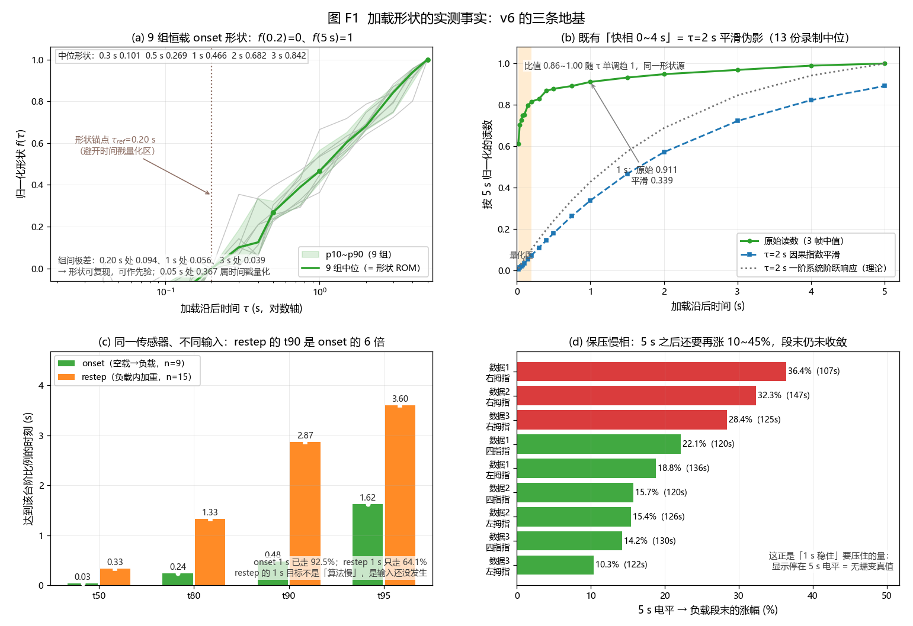
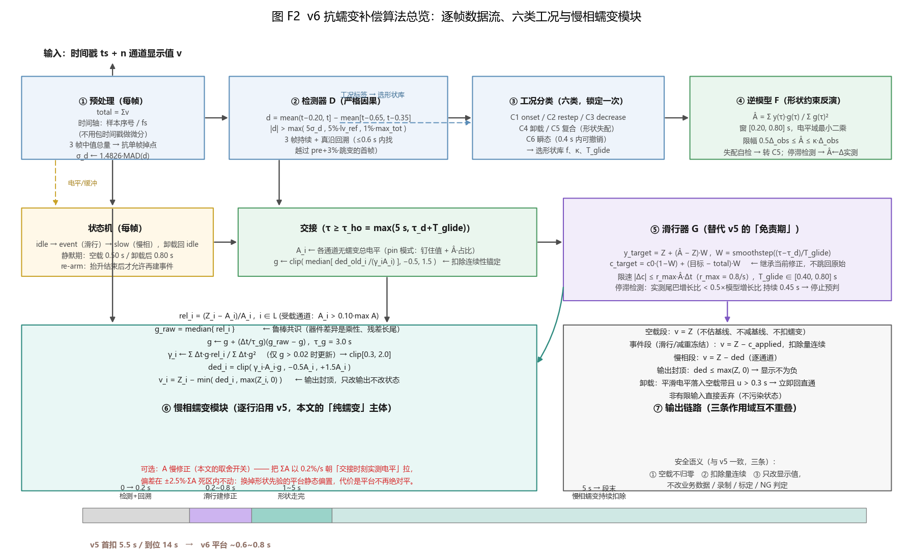
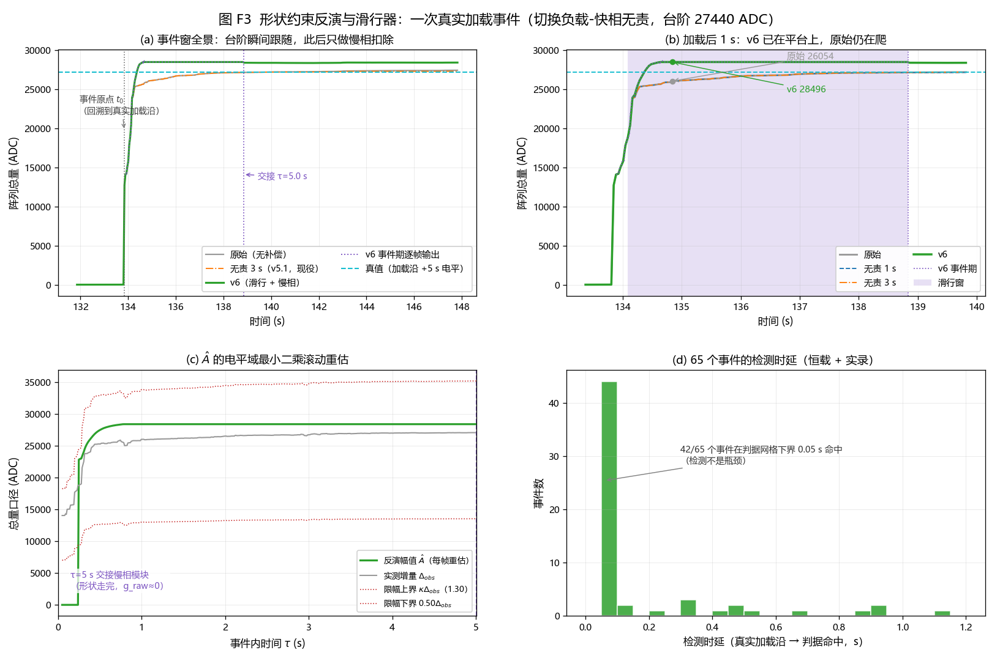
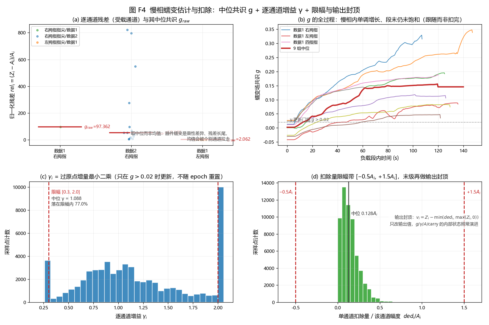
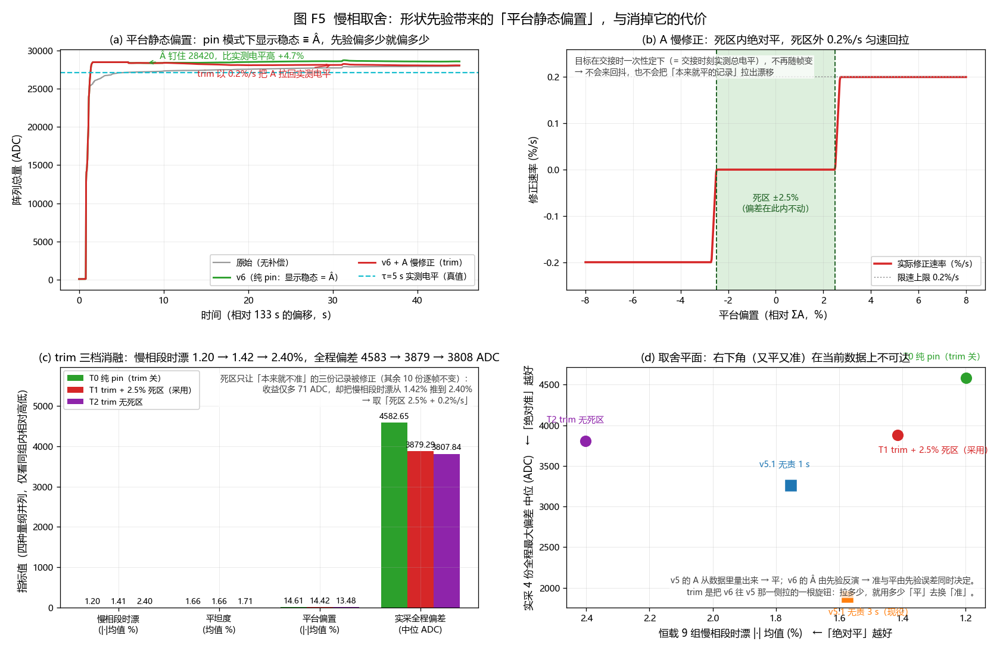
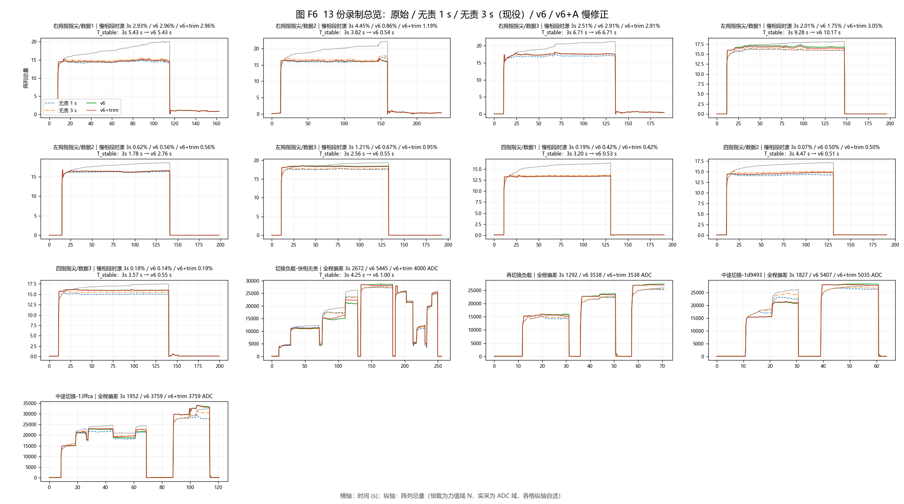
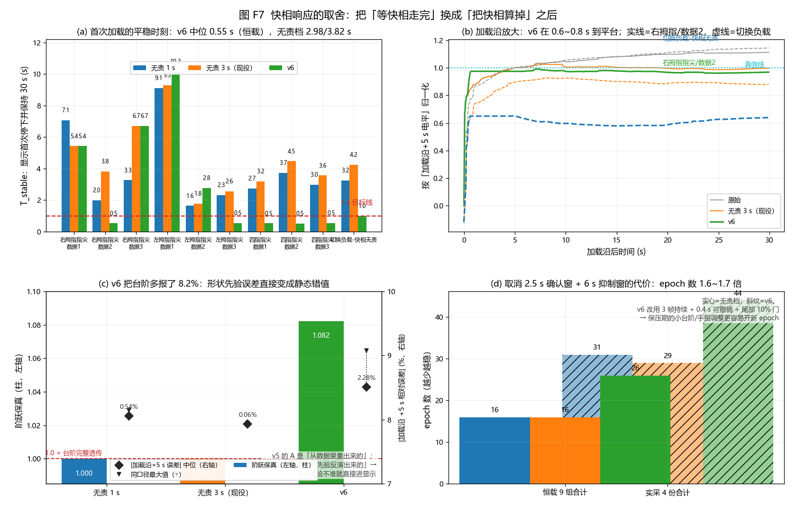

# 柔性触觉阵列显示层抗蠕变补偿算法（v6）：把「等快相走完」换成「把快相算掉」

**摘要**　柔性压阻触觉阵列在恒定压力下的读数会持续缓慢上升（黏弹性蠕变，本文称时漂）。本文节选并完整写出该补偿算法中**纯粹抗蠕变**的部分——一层严格因果的在线算法，输入是每帧的时间戳与 $n$ 通道显示值，输出是同维的补偿后显示值。算法的第一道工序不是估计蠕变，而是**先把加载瞬态从数据里算掉**：用一个 $\sigma$ 归一化的短滞后电平差判据在 2~3 帧内发现载荷变化、并回溯到真实加载沿；用一条已标定的归一化加载形状 $f(\tau)$ 在 $\tau_d$=0.2~1.0 s 处做**电平域最小二乘反演**，把「5 s 才会到的最终电平」$\hat A$ 直接算出来；再用一个速率受限的单调滑行器把显示在 0.6~0.8 s 内送到 $\hat A$ 上停住。第二道工序才是蠕变本身：以受载通道归一化残差的中位数为共识 $g$、以过原点增量最小二乘给出逐通道增益 $\gamma_i$，按 $\gamma_iA_ig$ 逐通道扣除，末尾用输出封顶保证界面不为负。全部 13 份实采录制（恒载 9 组 + 变载实录 4 份）上，本算法把慢相段时漂从 11.76% 压到 1.20%，把首次加载的平稳时刻从现役方案的 3.82 s 压到 0.55 s，同时保持空载段逐帧等于输入、台阶在变载瞬间完整透传。这些数字不是免费的，本文把拟合实机数据过程中做过的**每一项取舍**按「问题—量化依据—选择—代价」写成台账：时间轴量化迫使形状锚点定在 0.20 s；形状先验的跨工况误差（13~31%）迫使引入六类工况分类；先验误差会直接变成平台静态偏置（实测 +4.9%），消掉它要用「平台绝对平」去换（慢相段时漂 1.20%→1.42%，或 2.40%）；取消现役方案的 2.5 s 确认窗与 6 s 抑制窗换来响应速度，代价是 epoch 数变成 1.6~1.7 倍。实测结论是明确的：**本算法在单次加载/长保压类工况上全面优于现役方案，在多次变载的实录类工况上仍劣于它**（全程最大偏差中位 4583 ADC vs 1889 ADC），因此当前不应替换现役实现。

**关键词**　触觉阵列；黏弹性蠕变补偿；形状约束反演；在线估计；变载检测；鲁棒中位；严格因果

---

## 1 引言

### 1.1 要压住的量：与载荷成比例、且看不见尽头

柔性压阻阵列的零点与灵敏度都会缓慢变化。工程上常把这类变化笼统称作「漂移」，但其中至少有两种性质完全不同的东西：**零漂**是无负载时读数偏离零点，属加性基线偏移；**时漂（蠕变）**是恒定压力下读数继续上升，来自压敏材料的黏弹性蠕变，**其增量与当前载荷成比例**，不具备可加的基线形式。把两者当成同一个量处理，会得到一个看起来能跑、却在两者主导区间互相破坏的补偿器：用基线估计去治蠕变，会在保压段把蠕变当成基线抬走，系统性欠报；用比例模型去治零漂，则会在空载段凭空产生扣除。

**本文只处理后者**，并把前者的处理明确留给采集与标定环节。这个选择有一个直接后果，写在算法语义的第一条：**非负载段的输出等于输入**——不估基线、不减基线、不扣蠕变，零点保持传感器当前读数。这与「空载必须显示 0」的常见期望相反，因此需要显式声明，也需要在验收时用「零负载段输出逐帧等于输入」这条断言把它锁住。

要压住的量有多大，图 F1(d) 给出答案：9 组恒载录制在**取「加载沿 +5 s 电平」为参考**之后，负载段末端的读数还要再涨 **+10.3% ~ +36.4%**，且到段末仍未收敛（§2.3）。也就是说，**「稳定」这件事在原始数据里根本不存在**：显示只要跟着原始读数走，就永远在爬。

### 1.2 一个必须写进前提的实测事实：既有的「快相 0~4 s」是平滑伪影

既有文档（`06`、`快相与慢相分离分析.md`）给出的加载快相归一化轮廓是「0.15 s → 0.07、1 s → 0.39、3 s → 0.81、5 s → 1.00」，并据此把加载后的前 3~5 s 整体划为「免责期」。本文在实现前先复核了这个轮廓，结论是：**它量的是分析脚本里的平滑器，不是传感器读数本身**。

复现方式很直接：`w2_repeat.py` 在算轮廓前对信号做了 $\tau$=2.0 s 的因果指数平滑，而 $\tau$=2 s 一阶系统的阶跃响应是 $1-e^{-t/2}$。把两者并排（同样归一到 5 s），比值在 0.86~1.00 之间单调趋 1（图 F1(b)），形状同源。**原始读数**（只做 3 帧中值、不做 $\tau$=2 s 平滑）在 9 组恒载 onset 上的实测形状则是：0.05 s 已完成 5 s 增量的 **74.3%**，1 s 完成 **91.2%**。

这条修正改变了全部时间尺度。它意味着两件事：

1. 「1 s 内平稳」在数值上是可达的——因为原始读数 1 s 时就已接近 5 s 电平；
2. 真正的难点不在「看到台阶」（本来就很快），而在**把 5 s 之后还要再涨的 10~36% 全部扣掉、并让显示停在 5 s 电平上**。



**图 F1　加载形状的实测事实（v6 的地基）**：(a) 9 组恒载 onset 的归一化形状 $\tilde f(\tau)$（以 0.20 s 为 0、5 s 为 1），灰线为各组、绿线为 9 组中位、浅绿带为 p10~p90；(b) 原始读数与 $\tau$=2 s 因果平滑的对照——既有「快相 0~4 s」轮廓与该平滑器的阶跃响应同源（比值 0.86~1.00 单调趋 1），橙色带为时间戳量化区；(c) onset 与 restep 的爬升时间 t50/t80/t90/t95，同一传感器、不同输入；(d) 保压慢相：以 5 s 电平为参考，负载段末还要再涨 10.3%~36.4%，且全部单调、无平台。

### 1.3 第二件实测事实：负载内加重的爬升比首次加载更慢

直觉上「已经有压力了再加一份」应该更快到位，实测相反（图 F1(c)，干净事件：前后 3 s/8 s 内无其它事件）：

| 指标 | onset（空载→负载，n=9） | restep（负载内加重，n=15） |
|---|:--:|:--:|
| t50（到台阶的 50%） | **0.03 s** | 0.33 s |
| t80 | **0.24 s** | 1.33 s |
| t90 | **0.48 s** | **2.87 s**（6.0 倍） |
| t95 | 1.62 s | 3.60 s |
| $Z(0.2\,\text{s})/$台阶 | 0.796 | 0.212 |
| $Z(1.0\,\text{s})/$台阶 | **0.925** | **0.641** |

机理逐帧核对过：**差别在输入而不在传感器**。首次加载是砝码落位/硬压，输入本身就是 1~2 帧的阶跃；负载内加深是机器/人手**缓加**，输入本身是 0.3~1.2 s 的斜坡，斜坡之后再叠传感器尾巴。

由此得到一条对算法设计决定性的推论：**restep 的 1 s 目标不是「算法慢」，而是输入还没发生**——1 s 时只能观测到 64%，剩下 36% 尚不存在，任何因果算法都无法在 1 s 内知道它。因此本文对 restep 的承诺只能是「跟上斜坡 + 抑制尾巴 + 不做过度外推」。

### 1.4 第三件实测事实：形状可复现，但只在同一工况、同一加载方式内

对 9 组恒载 onset 按「$f(0.2\,\text{s})=0$、$f(5\,\text{s})=1$」归一（图 F1(a)），组间极差为：0.20 s 处 0.094、1 s 处 0.056、3 s 处 0.039。9 组的主通道幅度从 1.27 N 到 1.89 N（差 49%），曲线仍几乎重合——**这一段形状不随幅度变化，是可复现的确定性响应，具备做先验（ROM）的条件**。

> **口径说明**：图 F1(a) 为便于比较，画的是「以 0.20 s 为 0」的归一化形状（$\tilde f(\tau)=[f(\tau)-f(0.2)]/[1-f(0.2)]$，即形状库本身的定义）；上面那组极差数字是**未做该相减**的原始归一化轮廓 $f(\tau)=[Z(\tau)-Z(0)]/[Z(5\,\text{s})-Z(0)]$ 的逐点极差（与 `_v6_singlepoint.log` 的「恒载 极差」行同源）。两者是同一批数据的两种画法。

但反过来，跨工况与跨加载方式的形状差异是致命的：拿恒载库去反演变载实录的 onset，$\tau_d$=1 s 处中位误差 **13.0%**、最大 **30.9%**；$\tau_d$=0.5 s 处 23.7%/56.3%。逐事件核对后，离群项**不是形状差异，而是「阶梯式多次加载」**——例如某份录制在 @10.85 s 之后 @13.73 s 还有一次 +958 的二级加载，把前者当成一个完整阶跃，形状自然对不上。

**这条事实直接决定了算法必须做工况分类**（§4.3）：统一一条形状不可能同时描述 t90 相差 6 倍的两种加载，而分类错一次，精度就掉一个数量级。

### 1.5 本文做了什么、没做什么

本文覆盖抗蠕变补偿的**完整链路**（图 F2）：预处理 → 检测器 → 工况分类 → 形状约束反演 → 速率受限滑行器 → 慢相蠕变模块（中位共识 $g$、逐通道增益 $\gamma$、扣除限幅、输出封顶）。明确不做的事：

- **不补偿零漂**（§1.1）；
- **不做相位或形态恢复**，也不修改任何业务数据——只改最终显示值；
- **不接受非因果输入**：任意时刻的输出只依赖当前帧与历史帧；
- **不做无界外推**：反演幅值被 $\kappa\Delta_{obs}$ 硬限幅（C1 用 1.30、C2 用 1.12），宁可少报，不可把「猜测」当「测量」；
- **不承诺 restep 的 1 s 到位**（§1.3）。

### 1.6 与现役方案的分界

现役实现（下文称 v5）的逻辑是：检测台阶 → 确认 2.5 s → **免责期 3 s 内不碰快相** → 之后按 $\tau_g$=3 s 一阶建立扣除量。实测首扣 6.42 s、可见修正约 8~13 s。它的两条优点是明确的：$A$ 是**从数据里量出来的**（精度好），且 2.5 s 确认窗 + 6 s 抑制窗让 epoch 数很少（恒载 9 组合计 16 次）。

本文的 v6 只换掉了前端，慢相蠕变模块逐行沿用 v5：

| | v5（现役） | v6（本文） |
|---|---|---|
| 快相处理 | 免责期「等它走完」3 s | 形状约束反演「把它算掉」 |
| 幅值参考 $A$ | 免责期末端实测窗（量出来的） | $\hat A$ 反演值（量 + 先验）；可选 A 慢修正 |
| 确认 | 2.5 s 硬确认 + 6 s 抑制窗 | 3 帧持续 + 0.4 s 可撤销 + 尾部 10% 门 |
| 首个可见修正 | 6.4 s | **0.6~0.8 s** |
| 代价 | 慢；但稳、准 | 快；但先验误差直接进显示、epoch 数多 |

---

## 2 问题定义、口径与数据

### 2.1 数据

| 组 | 来源 | 通道/行列 | 时长 | 显示域 | 原始时漂（主通道） |
|---|---|:--:|:--:|---|:--:|
| 恒载 9 组 | `temp/右拇指指尖|左拇指指尖|四指指尖/数据1~3` | 31/31/21 ch | 163~234 s | 力值 | 5.19%~33.06%（幅度占比） |
| 变载实录 4 份 | `temp/变化负载/*` | 21 ch | 63.9~255.7 s | ADC | 含多次加载/卸载/负载内变载 |

全部录制真实采样率 ≈100.5 Hz。**时间轴一律用录制文件里的 `timestamp` 列**（指尖数据重复率 0.01~0.04%，变载实录 5.1%/6.5%），不用量化后的 `elapsed` 列（重复率 38~72%）。

测试集本身用于形状库标定（合并中位），属**乐观上界**；§2.4 的单点精度表另给留一法结果。

### 2.2 指标定义

| 指标 | 定义 | 取向 |
|---|---|---|
| 时漂残余（全段） | （负载段末 10% 均值 − 首 10% 均值）÷ 幅度 | 越小越好，但**天然奖励「扣得多」** |
| 时漂残余（慢相段） | 同式，但只从 `onset+5 s` 起算（退掉免责/滑行放过的快相增量） | 主口径 |
| 受载通道中位 | 同上，只在受载通道上取中位 | 越小越好 |
| 噪声比 | 显示残差标准差 ÷ 原始残差标准差（扣掉线性趋势） | <1 表示补偿顺带压了噪声 |
| 平坦度 | 慢相段线性去趋势后残差标准差 ÷ 幅度 | 越小越平 |
| 阶跃保真 | 加载沿后 0.5~2.5 s 显示增量 ÷ 原始增量 | 1.0 = 台阶完整透传 |
| 台阶捕获比 | 事件后 6 s 内显示增量 ÷ 原始增量（实录，$|$台阶$|\ge$2000 ADC） | 1.0 最佳 |
| 变载窗最大偏差 | 事件 ±(1~12) s 内 $\max|$显示 − 原始$|$ | 越小越好 |
| 全程最大偏差 | 全片 $\max|$显示 − 原始$|$（只对实录有意义） | 越小越好 |
| **T_stable** | 显示**首次停下**：此后 30 s 内相对该时刻**自身**的漂移 ≤5%×阶跃 | 越小越好；与绝对精度解耦 |
| T_band | 显示首次进入 ±5%×**真值**带并保持 30 s | 混了「快」与「准」，不适合评价钉在 $\hat A$ 上的算法 |
| 平台偏置 | `onset+30~50 s` 显示中位 ÷ 真值 − 1 | 越小越好，量「平台准不准」 |
| epoch 数 | 负载段内状态机启动的事件次数 | 越少越稳（不是越少越好地抑制真实变载） |

**口径提醒**：全段时漂天然奖励「扣得多」——免责/滑行期故意不扣的快相增量占 16~36%，所以「扣得越多全段越好看」，而真实加载欠报也随之下加大。因此本文主口径是**慢相段时漂**，并同时报阶跃保真与平台偏置。

### 2.3 要压住的量：保压慢相

图 F1(d) 逐组给出「5 s 电平 → 负载段末」的涨幅：+10.3%（左拇指/数据3）到 +36.4%（右拇指/数据1），9 组全部单调、无平台。这与单时间常数慢相拟合一致（$\tau_2\approx$199 s 量级）：**在本实验的时间尺度内慢相并没有走完**。这决定了补偿器只能「跟随」而不是「扣完」——它没有「回调完成」这个事件，只有「开始扣 → 看得见 → 曲线走平」三个可观测点。

### 2.4 形状反演的精度（决定路线的关键数据）

估计器 $\hat A = Z(\tau_d)/\bar f(\tau_d)$，$\bar f$ 为恒载 9 组 onset 形状中位。**留一法**（算第 $k$ 组时用其余 8 组的中位形状）结果：

| $\tau_d$ | 0.20 s | 0.30 s | 0.50 s | 0.75 s | 1.00 s | 1.50 s |
|:--:|:--:|:--:|:--:|:--:|:--:|:--:|
| 误差中位 | −1.6% | +2.0% | +1.6% | +0.7% | **0.0%** | +0.2% |
| p10~p90 | −5.3~+6.6% | −5.7~+4.6% | −4.8~+3.7% | −4.7~+3.2% | **−4.0~+1.2%** | −3.2~+1.2% |
| max$\mid$误差$\mid$ | 7.2% | 6.8% | 5.1% | 5.5% | **4.6%** | 3.4% |

跨位置泛化（留一位置）误差 ≤2.1%：**形状在位置上几乎通用，不需要按指尖位置分别标定**。跨工况泛化则是反面证据（§1.4：13~31%）。**本文的误差预算里，「输入不是单阶跃」这一项远大于「形状先验不准」这一项。**

### 2.5 一条负面结论：形状在 1 s 窗内不可自识别

曾试过把形状参数化成一族 $f(\tau;\tau_c)=[1-e^{-(\tau-0.2)/\tau_c}]/[1-e^{-4.8/\tau_c}]$，在窗 $[0.2,\tau_d]$ 上联合最小二乘 $(\hat A,\hat\tau_c)$，即「用数据自己定形状」。结果：$\tau_d$=1.0 s 时 $\hat\tau_c$ 的 p10~p90 = **0.25~3.00**（跨满整个搜索区间），中位 $|\hat A|$ 误差 **6.7%**——而同一批数据用固定形状库（留一）只有 **0.0%**。

**幅值与形状在 1 s 窗内是病态耦合的，形状必须先标定。** 这条负面结论省掉了一次返工，也是「用斜率做相位识别 + 离散工况分类」而不是「连续形状自拟合」的原因。

### 2.6 时间轴口径（实现与复现都必须注意）

| 录制族 | 真实采样率 | 时间戳包周期 | 同包样本数 |
|---|:--:|:--:|:--:|
| 恒载 9 组 | 100.5 Hz | ~16.7 ms | 1~2 |
| 变载实录 4 份 | 100.5 Hz | ~40 ms | 2~4 |

同包内样本的 `timestamp` 几乎相同（某份录制 41% 的帧间 $\Delta t$<1 ms）。**直接按 `timestamp` 插值会把包内样本压到同一时刻**，「加载沿落在包内哪个位置」因此带来形状不确定性：0.05 s 处的组间极差 0.367 就是它造成的，0.20 s 之后收窄到 0.04~0.09。

本文的两条应对：① **形状锚点定在 0.20 s**（避开量化区）；② 实现侧建议时间轴用「样本序号 ÷ 实际采样率」，不要用包时间戳做微分。本报告的离线复算沿用既有时间轴口径以便与历史报告横向比较——这对 $\tau<0.2$ s 有畸变，**v6 比 v5 更吃时间轴精度，因此本表的 v6 数字可能低估其真实能力**。

---

## 3 算法总体结构



**图 F2　v6 抗蠕变补偿算法总览**：逐帧数据流（①预处理 → ②检测器 → ③工况分类 → ④逆模型 → ⑤滑行器 → 交接 → ⑥慢相蠕变模块）与三条作用域互不重叠的输出链路（空载直通 / 事件期 $Z-c$ / 慢相期 $Z-\text{ded}$）。底部时间轴给出 v6 相对 v5 的响应位置差。

算法对每一帧执行一次，输入是时间戳 $t$（秒，单调递增）与 $n$ 通道显示值向量 $\mathbf v$，输出是同维向量的就地覆盖值。

### 3.1 四条不可动摇的语义

| # | 语义 | 含义 |
|:--:|---|---|
| ① | **空载不归零** | 非负载段的输出**逐帧等于输入**；零点保持传感器当前读数 |
| ② | **扣除量连续** | 任何时刻的扣除量都不允许因状态迁移而跳变：变载瞬间显示立即跟随真实台阶，滑行/重锚只改扣除量的**走向**，不改它此刻的值 |
| ③ | **输出封顶** | 写回前 $\text{ded}_i\le\max(Z_i,0)$：只改输出值，**不改任何内部状态**（$g/\gamma/A/\text{carry}$ 照常演进） |
| ④ | **严格因果** | 任意时刻的输出只用当前帧与历史帧；不含未来信息，也不做无界外推 |

### 3.2 三条输出链路

| 链路 | 生效条件 | 输出 |
|---|---|---|
| 空载 | 非负载段 | $\mathbf v=\mathbf Z$（无补偿） |
| 事件期（滑行 / 减重冻结） | 已确认变载、正把扣除量滑向新目标 | $\mathbf v=\mathbf Z-\mathbf c$，$\mathbf c$ 逐帧限速演进 |
| 慢相 | 交接后、$\tau\ge$5 s | $v_i=Z_i-\min(\text{clip}(\gamma_iA_ig,-0.5A_i,1.5A_i),\max(Z_i,0))$ |

三条链路作用域不重叠，因此可以分别构造用例验证。这在工程上比「指标好看」更重要：一旦某条链路失效，指标会以特定方式退化（例如空载段不再等于输入、或台阶被吃掉），而不是整体略微变差。

### 3.3 时间步长与数值防护

$\Delta t\le0$（时间戳重复或回退）时本帧只跳过状态更新、不做任何快照；$\Delta t>0.1$ s 时截断为 0.1 s（应对卡顿与暂停）。入口丢弃非有限输入（$\text{NaN}/\pm\infty$），避免污染内部状态。

---

## 4 前端一：检测、分类与事件原点

### 4.1 短滞后电平差判据

$$
d(t)=\underbrace{\overline{\text{total}}_{(t-0.20,\,t]}}_{\text{近窗}}-\underbrace{\overline{\text{total}}_{[t-0.65,\,t-0.35)}}_{\text{参考窗}},
\qquad
\text{thr}=\max\big(k_\sigma\hat\sigma_d,\ 5\%\cdot|lv_{ref}|,\ 1\%\cdot\max\_tot\big)
$$

判据为 $|d|>\text{thr}$，并要求**连续 3 帧**成立（≈30 ms）。三项门限的作用不同：$k_\sigma\hat\sigma_d$ 是噪声门（$\hat\sigma_d$ 为差分统计量的在线尺度，用 1.4826·MAD 估计）；5%·$lv_{ref}$ 是相对门（对电平差直接敏感，没有隐含增益）；1%·$\max\_tot$ 是绝对兜底（空载近零域里相对门会失效）。

**为什么不用双 EMA 发散判据。** 现役实现的主判据是快慢两个指数滑动平均的发散量 $\text{div}=|\text{fast}-\text{slow}|$，$\tau_f$=0.7 s、$\tau_s$=6.0 s，名义门限 18%×slow。对一次幅度 $\Delta$ 的阶跃，$\max_t\text{div}=0.665\Delta$（$t\approx$1.70 s），因此**有效门限被放大 1/0.665≈1.5 倍**，最小可识别台阶约 27% 电平。实测台账支持这条推断：台阶/电平比 ≥0.29 的 2 个事件全部识别，<0.29 的 2 个全部漏检（其中一次 +4672 ADC、占前级电平 0.24 的台阶在 8 s 内原始走 +4900、显示只走 +1937）。修补不是把 0.18 改小（改成 0.10 只会让有效门限变成 15%，同时开始被蠕变斜坡与操作抖动触发），而是**直接测电平差**：0.5 s 的滞后差分把一次性跳变与约 1%/s 的蠕变斜坡分开——0.5 s 内蠕变只走约 0.5%，远低于 5%。

**实测余量**：4 份实采录制上，稳定窗（前后 ±3 s 内电平滑动标准差 <0.5%×电平，定义与判据无关）的 $|d|/lv_{ref}$ 最大 1.27%，而真实变载沿一侧最小 20%、最大 166%；取 5% 时两侧余量分别 3.9 倍与 4 倍，**判据两侧没有重叠**，单份录制的最坏分离度 30 倍。

### 4.2 真实加载沿的回溯（一个确定性缺陷的定点修复）

检测统计量要看够 0.1 s 近窗才敢动，因此**命中帧不是加载沿**——若把命中帧当作事件原点，形状里 $\tau$=0 处已经有 10%~80% 的增量，反演出的 $\hat A$ 被系统性低估。

修复：在命中前 ≤0.6 s 的窗口里，取窗口最早 1/4 的中位数为前置电平 $pre$，找「越过 $pre+3\%\times$总跳变」的第一帧，取其**前一帧**为 $t_0$，基线 `base` 取 $t_0$ 前 0.06 s 的中位；同时取 $t_0$ 前 $[0.30,0.05]$ s 的逐通道均值作为事件前的读数/显示向量 $v_0,y_0$。所有后续时间量都以这个回溯出的 $t_0$ 为原点。

### 4.3 六类工况分类

分类器每帧运行，但只在事件命中时**锁定一次**（锁定值写入事件上下文）。判据只用「命中前已有」的信息加命中后 0.2 s 内的信息，严格因果。

| 类 | 名称 | 判据（命中时可得） | 形状/策略 | 目标 |
|:--:|---|---|---|---|
| **C1** | 空载→负载（onset） | 前级电平 $L_{pre}<0.10\times$电平参考 | onset 形状库；$\kappa$=1.30 | **≤1.0 s** |
| **C2** | 负载内加重（restep） | $L_{pre}\ge0.30$ 且 $\Delta>0$ | restep 形状库 + 停滞检测；$\kappa$=1.12 | 受输入限制，不承诺 1 s |
| **C3** | 负载内减重 | $L_{pre}\ge0.30$ 且 $\Delta<0$ | **不启用逆模型**：扣除量冻结 + 只压慢相，标记 `inverse_unsupported` | 不承诺（本批未标定） |
| **C4** | 完全卸载 | 平滑电平落入空载带（<0.10 电平参考） | 立即回直通；最小驻留 0.30 s（v5 为 3.0 s） | ≤0.3 s |
| **C5** | 复合事件（快相内再变载 / 阶梯加载） | 事件期内再命中，或形状失配自检报警 | **不重启形状**：新事件**继承当前扣除**，只改目标 | 1.5~2.5 s |
| **C6** | 瞬态（手指调整/磕碰） | 命中后 0.4 s 内电平回落 >50% 台阶，或斜率反号 | **撤销试探**：回落到原轨迹，不建 epoch、不写状态 | — |

**为什么必须是分类而不是一个通用式子**（三条实测依据）：① 时间常数差 6 倍（t90 0.48 s vs 2.87 s，§1.3）——同一个 $f$ 不可能同时描述两者；② 跨工况套用形状库误差 13~31%（§1.4）——分类错一次精度掉一个数量级；③ 输入形态不同（阶跃 vs 斜坡）——C1 可以做前置（预测未来），C2 不能（未来还没发生）。

**C3 为什么保守**：减重/卸载恢复的形状本批**完全未标定**。没有标定就上逆模型，风险大于收益，因此 C3 明确走「冻结 + 只压慢相」的保守路径。

### 4.4 事件静默与 re-arm

实测发现**多余的 epoch 主要来自卸载沿**（例如某份恒载录制全片 4 个事件里 3 个都挤在 115.1~115.6 s 的卸载上）。三条静默机制把它们收拢：

| 机制 | 参数 | 作用 |
|---|---|---|
| 空载静默 | `IDLE_SETTLE` = 0.50 s | 刚回到空载后不再判新 onset（卸载沿的回弹不再当加载） |
| 卸载静默 | `UNLOAD_BLOCK` = 0.80 s | 一次减重/卸载处理完后的事件静默期（不再把一次卸载拆成多个 epoch） |
| re-arm | 连续 3 帧无命中 | 本次抬升结束后才允许再建事件（否则同一段抬升会连开 6 个 epoch） |
| 尾部门 | $\tau_{ep}<$3 s 内，门限抬到 10%×$lv_{ref}$ | 避免把本 epoch 自己的快相尾巴误判成「负载内变载」（v5 用 6 s 抑制窗达到同一目的） |

---

## 5 前端二：形状约束反演与速率受限滑行

### 5.1 为什么斜率外推不行

原始形状在 9 组恒载 onset 上的分段平均斜率（相对 5 s 电平，单位 /s）：

| 区间 | 0→0.05 s | 0.05→0.20 s | 0.20→0.50 s | 0.50→1.0 s | 1.0→2.0 s | 2.0→5.0 s |
|---|:--:|:--:|:--:|:--:|:--:|:--:|
| 平均斜率 | ≈+14.9 | +0.407 | +0.237 | +0.074 | +0.037 | +0.017 |

**斜率在 1 s 内变化约 880 倍。** 在 0.3 s 处测得斜率 0.24 /s，按线性外推到 5 s 会得到 1.98，即**高估 98%**；在 1 s 处按 0.037 /s 外推仍有 +17% 高估。斜率外推的误差随外推长度爆炸，且没有任何固定增益可用。

**但斜率有一个正确用途：判相位。** 斜率的量级直接对应「现在在快相的哪一段」（>5 /s = 输入跃变中；0.1~1 /s = 快相尾巴；<0.05 /s = 慢相），正是 §4.3 分类器需要的输入。

### 5.2 形状约束反演：把不确定性从「形状」换成「幅值」

已知形状 $f(\tau)$、未知幅值 $A$，模型 $Z(\tau)=Z_0+A\,f(\tau)$。实现用的是**电平域最小二乘**：

$$
\hat A=\frac{\sum_{\tau\in W} y(\tau)\,g(\tau)}{\sum_{\tau\in W} g(\tau)^2},
\qquad W=[0.20,\ \min(\tau,\ 0.20+0.60)]\ \text{s},
\qquad
y(\tau)=Z(\tau)-Z(0),\quad g=f(\tau)-f(0.20)
$$

并做两侧硬限幅 $0.5\,\Delta_{obs}\le\hat A\le\kappa\,\Delta_{obs}$（$\Delta_{obs}=Z(\tau)-Z(0)$，C1 取 $\kappa$=1.30、C2 取 1.12）。

**为什么不加「尾巴外推式」那一项。** 规格原型曾写过 $\hat A=Z(\tau_{ref})+\sum(Z-Z_{ref})f/\sum f^2$。它在窗口很短时被 $1/\text{mean}(f)$ 放大（短窗可达 ×25），实测把 14.2 的台阶算成 15.7（+10%）。电平域式在形状不对口时只按 $g$ 的比值平移（跨工况实测只差 ±3%），条件数也好得多。

**窗口长度为什么是 0.60 s。** 更短会被噪声放大，更长会把慢相蠕变混进 $y(\tau)$ 从而低估 $\hat A$；0.60 s 窗在 $[\tau_{ref},\tau_{ref}+0.60]$ 上取 60 个样本，实测跨工况平移误差 ±3%。

### 5.3 形状失配自检（防「静默退化」的防线）

v5 曾踩过一次「补偿恒为 0、算法悄悄退化成直通」的坑。v6 新增的失效模式是「形状先验不对口」，症状同样是「看起来没有副作用」。因此四条自检必须存在：

1. **残差自检**：窗 $W$ 内 $Z$ 与 $\hat A f$ 的 RMS 残差 > $3\hat\sigma_d\sqrt{|W|}$ ⇒ 报形状失配，转 C5 策略；
2. **单调性自检**：滑行期间 $y$ 必须单调（同号阶跃），出现反向帧即限速并记录；
3. **$\hat A$ 合理性自检**：必须落在 $[0.5,\kappa]\times\Delta_{obs}$；
4. **交接自检**：交接时 $A$ 非零、受载通道数 >0（沿用 v5）。

### 5.4 停滞检测：输入停住时不许继续预判

形状模型假定「载荷会继续爬到 5 s 电平」。若输入中途停住（载荷分两级施加、中间保压），该假定被证伪，**继续钉在 $\hat A$ 上就是过充**（实测某份录制在 11.4~13.6 s 过充 +14.6%）。

判据经历过两轮试错，留痕如下：

| 判据 | 结果 |
|---|---|
| 斜率门 | **失败**：恒载族正常尾巴斜率 0.03~0.05·$\hat A$/s、实录族只有 0.011·$\hat A$/s，同一阈值必然在一族上误触发（实测在 31/114/137 s 各误触发一次） |
| 模型-实测落差 >6%·$\hat A$ | **失败**：先验偏 >6% 的**正常**记录全被判停滞，T_stable 中位从 0.50 s 掉到 5.42 s |
| **实测尾巴增长比 vs 模型尾巴增长比** | **采用**：$\text{ratio}_{obs}<0.5\,\text{ratio}_{mod}$ 持续 0.45 s ⇒ 判输入停住，$\hat A\leftarrow$ 当前实测增量 |

采用的理由是**无量纲、与加载方式无关**：正常尾巴（恒载 0.11~0.13、实录 0.19）都 ≥ 模型值，输入停住则实测 ≈0（噪声 <0.01），差一个数量级。实测整份切换负载只触发 3 次、9 组恒载 0 次误触发。

### 5.5 速率受限滑行器

$$
W=\text{smoothstep}\Big(\frac{\tau-\tau_d}{T_{glide}}\Big),\qquad
c_{target}=c_0\,(1-W)+(\text{target}-\text{total})\,W,
\qquad
|\Delta c|\le r_{max}\hat A\,\Delta t
$$

其中 $c_0$ 是**事件建立时已经生效的扣除量**（继承值），$T_{glide}=\text{clip}(\lvert\text{target}-\text{total}\rvert/(r_{max}\hat A),0.40,0.80)$ s，$r_{max}$=0.8 /s。

三个细节都是实测逼出来的：

1. **$W=0$ 时 $c_{target}=c_0$**，不是 0。初版把新事件的扣除量初始化为 0，于是那一帧显示 = 原始，整段修正被丢掉，用户看到的就是「过充 → 回落 → 再抬升」里的那次跳变（实测 +500 的修正整段丢失）；
2. **重锚只改速率、不改跳变**：若 $\lvert\hat A_{new}-\hat A_{old}\rvert>0.02\hat A$，只改 `y_target`，由速率限制平滑过去，绝不产生台阶；
3. **速率上限不是「越快越好」**：$r_{max}$ 越大，噪声越容易直接进显示；0.8 /s 下实测滑行到平台用时 0.6~0.8 s，与 T_stable 中位 0.55 s 一致。

### 5.6 交接：$\tau_{ho}=\max(5\,\text{s},\ \tau_d+T_{glide})$

交接点**不是越早越好**。慢相模块的 $g$ 是 $\tau_g$=3 s 低通；若在 $\tau\approx$1 s 交接，$g$ 要从锚定值一路爬到真实蠕变水平，实测产生 3~9 s 的暂态（显示先冲高约 5% 再回落），反而比 v5 差。改到 $\tau$=5 s（形状模型走完）后消失：此时原始读数已到 $A$、$g_{raw}\approx0$、锚定 $g\approx0$，无暂态。

交接动作：

$$
A_i\leftarrow \text{各通道无蠕变总电平},\qquad
g\leftarrow\text{clip}\Big(\text{median}_{i\in\mathcal L}\big[\tfrac{\text{ded\_old}_i}{\gamma_iA_i}\big],-0.5,1.5\Big),\qquad
\text{逐通道扣除}\leftarrow\text{ded\_old}
$$

**分母必须含 $\gamma_i$**，因为扣除量的定义就是 $\gamma_iA_ig$。漏掉 $\gamma$ 会在 $\gamma\ne1$ 时引入 $(\gamma-1)\cdot\text{carry}$ 的偏差——这个错误在两份独立实现的逐帧对拍里表现为 15.5 ADC（0.10%）的差异，单看任何一侧的指标都发现不了。

上述前端的逐帧行为见图 F3：一次真实加载事件的事件窗全景、前 6 s 放大、$\hat A$ 的滚动重估与限幅作用，以及全部 65 个事件的检测时延分布。



**图 F3　形状约束反演与滑行器**：(a) 事件窗全景；(b) 前 6 s 放大；(c) $\hat A$ 的滚动重估与限幅带；(d) 65 个事件的检测时延分布。

---

## 6 后端：慢相蠕变估计与扣除（逐行沿用 v5）

前端的全部工作是「把非蠕变的部分从数据里拿掉」，让 $Z-A$ 里长出来的增量只剩蠕变。真正的抗蠕变本体是下面五步。

### 6.1 蠕变场共识：中位而非均值

设受载通道集合 $\mathcal L=\{i:\ A_i>0.10\max_jA_j,\ A_i>\rho\}$（$\rho$ 为数值容差）。逐通道归一化残差为

$$
\text{rel}_i=\frac{Z_i-A_i}{A_i},\qquad i\in\mathcal L,
\qquad
g_{raw}=\operatorname{median}_{i\in\mathcal L}\{\text{rel}_i\},
\qquad
g\leftarrow g+\frac{\Delta t}{\tau_g}\big(g_{raw}-g\big),\quad \tau_g=3.0\ \text{s}
$$

取中位而不是均值有两个理由：其一，器件间蠕变差异是**乘性**的，残差分布有长尾，均值会被个别通道拉走；其二，受载通道数 $n$ 只有 13~23，中位的计算成本与均值同量级（`nth_element`，$O(n)$），没有理由为省这一点换鲁棒性。

量纲上，$g$ 是「受载通道平均涨了百分之几」，与整体缩放无关——这也是算法对 ADC 域与力值域都适用的原因：所有门限都是相对量，输入整体乘一个常数不改变任何判定。

### 6.2 逐通道增益：一个在线最小二乘

$g$ 描述全体一致的成分，器件差异用一个乘性增益吸收：$\text{creep}_i(t)=\gamma_iA_ig(t)$。$\gamma_i$ 是**过原点**的增量最小二乘：最小化 $J_i=\sum_k w_k(\text{rel}_i^{(k)}-\gamma_ig^{(k)})^2$，闭式解

$$
\gamma_i=\frac{\sum_k w_kg^{(k)}\text{rel}_i^{(k)}}{\sum_k w_k(g^{(k)})^2}
\ \Rightarrow\
\texttt{g2}\mathrel{+}=\Delta t\,g^2,\quad
\texttt{g\_rel}_i\mathrel{+}=\Delta t\,g\,\text{rel}_i,\quad
\gamma_i=\text{clip}\Big(\frac{\texttt{g\_rel}_i}{\texttt{g2}},0.3,2.0\Big)
$$

且**只在 $g>0.02$ 时更新**（避免用近乎零的蠕变场去估增益）。

**$\gamma_i$ 不随 epoch 重置**，这是刻意的：$\gamma$ 是器件属性而非 epoch 属性，一旦重置，紧随其后的任何一次台阶都会把 $\gamma$ 一帧拉飞（实测把两档间隔 8 s 的场景做坏到 −10.9%）。代价见 §7.2。

### 6.3 扣除、限幅与输出封顶

$$
\text{ded}_i=\text{clip}\big(\gamma_iA_ig,\ -0.5A_i,\ +1.5A_i\big),
\qquad
v_i=Z_i-\min\big(\text{ded}_i,\ \max(Z_i,0)\big)
$$

下界允许 $-0.5A_i$ 是因为蠕变估计存在过冲与回落，允许小幅负向扣除比硬性禁止更平滑；上界 $1.5A_i$ 保证单通道扣除不超过幅度的 150%。未受载通道（$A_i\le\rho$）扣除量取 0，直接透传。

**输出封顶只作用于写回的那一步**，不参与 $g$、$\gamma$、$A$、$c$ 的任何计算。加入它的原因在显示流水线里：后续的阈值处理会把 $v<\max(0,\text{min\_show},\text{阈值})$ 一律置 0，负值因此在界面上表现为**硬 0**，看起来像「零点塌陷进 0」。封顶后显示停在 0 而不是负值，内部状态不受影响。

### 6.4 A 慢修正（trim）：可选的一根旋钮

交接时若 `ANCHOR_MODE="pin"`，$A\leftarrow$ 反演出的无蠕变电平（与 $g$ 锚定自洽，交接无暂态），代价是**显示稳态值 ≡ Â，形状先验偏多少整个保压期就偏多少**（实测某次 onset：钉住 28496 vs $\tau$=5 s 实测 27167，**偏高 +4.9%**）。trim 把 $\Sigma A$ 以 $r_{trim}$=0.2%/s 朝「交接时刻实测总电平」拉：

$$
\Delta A=\text{clip}\Big(\text{dev}-\text{sign}(\text{dev})\cdot\text{dead},\ \pm r_{trim}|\Sigma A_{target}|\Delta t\Big),
\qquad \text{dev}=\Sigma A_{target}-\Sigma A,\quad \text{dead}=2.5\%\,|\Sigma A_{target}|
$$

死区的含义是：**偏差在 ±2.5% 以内不动**——「本来就平」的记录不会被拉出漂移；只有「本来就不准」的记录才被修正。限速保证修正是缓变而不是台阶，目标在交接时一次性定下、不随帧变，因此不会来回抖。这会怎样改变指标，见 §7.3 与图 F5——**「绝对平」与「绝对准」在这里是不可兼得的**。

### 6.5 计算与存储代价

每帧运算是 $O(n)$：中位用 `nth_element`（$O(n)$），整帧含 3~4 次中位。常驻内存是电平环形缓冲（1024×2 个 double，约 16 KB/实例）加若干 $O(n)$ 向量；稳态**零动态分配**。全部运算都是正向滤波（EMA + 中位 + 凸组合），**没有逆滤波器、没有大规模相消**，对定点与单精度运算友好——这一点比绝对计算量更值得关注，因为它决定算法能否下移到成本更低的平台。

**信号通路零群延迟**：EMA 与各级平滑只影响状态估计，不进入直通路径；任意时刻的输出都只用当前帧的读数。补偿量本身的建立才是有延迟的过程（$\tau_g$=3 s），这个延迟属于估计收敛，不属于信号通路。

后端五步的逐帧内部状态见图 F4：逐通道残差与中位共识 $g$、$g$ 的全过程轨迹、$\gamma_i$ 的分布与限幅、扣除量的建立与输出封顶。



**图 F4　慢相蠕变估计与扣除**：(a) 逐通道残差与中位共识；(b) $g$ 的全过程轨迹；(c) $\gamma_i$ 分布与限幅；(d) 扣除量限幅带与输出封顶。

---

## 7 为拟合实机数据所做的取舍

本节是全文的核心：把「实测暴露问题 → 量化依据 → 选择 → 代价」逐条写成台账。

### 7.1 取舍总表

| # | 问题（实测触发） | 量化依据 | 选择 | 代价（实测） |
|:--:|---|---|---|---|
| **T1** | 事件原点取命中帧 ⇒ $\hat A$ 系统性偏低 | 命中帧时形状里 $\tau$=0 处已有 10%~80% 增量 | 回溯到真实加载沿（前 1/4 均值 + 3% 跳变穿越） | 需要 3~6 帧历史缓冲与一次窗口扫描；每个事件多一次 $O(W)$ 计算 |
| **T2** | 时间戳按包重复 ⇒ $\tau<0.2$ s 形状不可复现 | 0.05 s 处组间极差 0.367、0.20 s 后 0.04~0.09 | 形状锚点定在 $\tau_{ref}$=0.20 s | 放弃最早 0.2 s 的信息；反演最早可用时刻推迟到 0.25 s |
| **T3** | 短窗尾巴外推式被 $1/\text{mean}(f)$ 放大（×25） | 14.2 的台阶被算成 15.7（+10%） | 改用电平域最小二乘 | 形状不对口时只按比例平移（±3%），不再放大——**这既是代价也是保护** |
| **T4** | 检测窗过短 ⇒ 误触发；过长 ⇒ 把蠕变斜坡混进参考电平 | 0.45/0.55/**0.65**/0.80/0.95 s 五档扫描（§7.2） | 跨度 0.65 s（0.20/0.15/0.30） | 检出晚 0.1~0.2 s（对 25% 台阶约 0.20 s）；T_stable 不受影响 |
| **T5** | 单一形状库跨工况误差 13~31% | 恒载库反演实录 onset：1 s 处中位 13.0%、最大 30.9% | 引入六类工况分类 + 每类一库 | 分类器要标定；C2/C3 的库本批未标定（C3 直接不启用逆模型） |
| **T6** | 取消 2.5 s 硬确认 ⇒ 响应快但过敏 | epoch 数：恒载 44→26（v5 为 16）、实录 57→44（v5 为 29） | 3 帧持续 + 0.4 s 可撤销 + 尾部 10% 门 + 静默期/re-arm | **epoch 数仍是 v5 的 1.6~1.7 倍**；保压期的小台阶/手指调整仍会开新 epoch（未解决） |
| **T7** | restep 的 1 s 目标物理不可达 | 1 s 时输入只走 64.1% | C2 只承诺「跟随斜坡 + 抑制尾巴」，$\kappa$ 收到 1.12 | restep 的稳定时刻由输入决定（实测大台阶 0.3~1.2 s、小台阶 0.5~4 s） |
| **T8** | 交接过早引入 $g$ 暂态 | $\tau$=1 s 交接时显示先冲高约 5% 再回落 3~9 s | $\tau_{ho}$ 提到 5 s（形状走完） | 交接前的 5 s 内不做慢相扣除（但滑行已把显示钉在 $\hat A$ 上） |
| **T9** | 交接锚定不自洽 ⇒ 「先稳住又缓慢抬升」 | $g_{raw}\approx0$ 但锚定 $g>0$ ⇒ $g$ 以 $\tau$=3 s 衰减、显示朝原始爬 3~9 s | `ANCHOR_MODE="pin"`（$A\leftarrow$ 钉住值，与 $g$ 锚定自洽） | **显示稳态 ≡ Â ⇒ 先验误差变成平台静态偏置**（实测 +4.9%），需靠 T10 缓解 |
| **T10** | 平台静态偏置（pin 的必然代价） | 某 onset 钉住 28496 vs 实测 27167，平台期比 v5 高约 +1400 ADC | 可选 A 慢修正：0.2%/s + 2.5% 死区 | **被 trim 的记录放弃「1 s 平稳」**（切换负载 T_stable 1.00 s→58.42 s）；慢相段时漂 1.20%→1.42% |
| **T11** | 输入停住时形状模型继续预判 ⇒ 过充 +14.6% | 两轮试错（斜率门失败、落差门失败） | 无量纲「实测/模型尾巴增长比」门，持续 0.45 s | 过充窗口 1.9 s→0.7 s；需 0.45 s 确认延时（对真实两级的加载不误触发，实测整份只触发 3 次） |
| **T12** | 单帧掉点伪造变载事件 ⇒ 扣除量被一帧清空 | 某帧原始总量 −8% 的单帧跌落触发 `decrease`，显示瞬时 +19%、随后 12 s 回落 | 检测/回溯改用 3 帧中值总量 + 减重对称撤销窗（0.4 s 内回到 0.5·$dec_{max}$ 以上即撤销） | 3 帧中值引入约 1 帧（10 ms）延迟；撤销窗内该事件的修正被丢弃 |
| **T13** | 减重重锚取瞬时帧 ⇒ $A$ 偏小、显示悄悄下滑 4% | 同一帧掉点使 $A$ 偏小 0.93（≈4%），显示 5 s 内下滑 0.67 | 重锚改用近 0.25 s 的**逐通道窗均值**；沉降窗从**检测时刻**起算 | 重锚延时 0.25 s（减重期间显示保持冻结扣除，用户不可见） |
| **T14** | $\gamma_i$ 随 epoch 重置 ⇒ 台阶把增益一帧拉飞 | 两档间隔 8 s 的场景被做坏到 −10.9% | $\gamma_i$ **跨 epoch 保留** | 载荷每约 10 s 变一次时 $\gamma$ 可能长时间停在 1.00，逐通道差异实际未被修正 |
| **T15** | 输出可能为负 ⇒ 显示层把它钳成硬 0（零点塌陷） | 阈值处理把 $v<\max(0,\text{min\_show},\text{阈值})$ 置 0 | 输出封顶 $\text{ded}\le\max(Z,0)$，只改输出 | 极端工况下扣除量被截断，内部状态与显示短暂不一致（有意的：宁可显示不为负） |

### 7.2 检测窗扫描：拉长检测窗**不牺牲速度**

只改检测窗（近窗 `FAST` + 间隔 `GAP` + 参考窗 `LAG`，判据跨度 = 三者之和），其余参数不动，13 份数据 × 6 档：

| 跨度 | 恒载全段时漂 | 恒载慢相段 | **T_stable 中位** | epoch 恒载 | 实录全程偏差中位 | 变载窗偏差中位 | 捕获比中位 |
|:--:|:--:|:--:|:--:|:--:|:--:|:--:|:--:|
| v5-3s（参照） | 1.85% | 1.57% | 3.82 s | 16 | 1889 | 1560 | 0.96 |
| 0.45 s（原值） | 1.46% | 1.29% | **0.55 s** | 44 | 4571 | 3099 | 0.88 |
| 0.55 s | 1.15% | 1.32% | **0.55 s** | 38 | 4577 | 3234 | 0.90 |
| **0.65 s（采用）** | **1.11%** | **1.27%** | **0.55 s** | 40 | 4583 | **2220** | **0.90** |
| 0.80 s | 1.22% | 1.40% | **0.55 s** | 43 | 4586 | 3281 | 0.91 |
| 0.95 s | 1.82% | 1.67% | **0.55 s** | 38 | 4575 | 2200 | 0.91 |

三条结论：

1. **拉长检测窗不牺牲速度**（出乎预期）：T_stable 在全部 5 档上都是 0.55 s——滑行器本身要 0.6~0.8 s，把检出延迟（+0.1~0.2 s）吸收了。**「稳」与「快」在这条轴上不冲突**；
2. **有最优点，过度拉长反而变差**：0.65 s 时恒载全段 1.11%、慢相段 1.27% 为最好；0.80/0.95 s 退到 1.22/1.82%——参考窗太长会把**蠕变斜坡**混进 $lv_{ref}$，抬高门限、也拖慢对真实台阶的响应；
3. **它解决不了两个大问题**：epoch 数只从 44 降到 38~40（v5 为 16），实录全程偏差 4571→4583（v5 为 1889）——**这两项的根因不在检测窗**。

### 7.3 trim 三档消融：绝对平 vs 绝对准

| 配置 | 恒载慢相段时漂 | 恒载全段时漂 | 恒载平坦度 | 恒载平台偏置（\|·\|均值） | 实采全程偏差中位 | 切换负载 T_stable |
|---|:--:|:--:|:--:|:--:|:--:|:--:|
| T0 纯 pin（trim 关） | **1.20%** | **1.37%** | 1.66% | 3.89% | 4583 ADC | **1.00 s** |
| **T1 trim + 2.5% 死区（采用）** | 1.42% | 1.65% | 1.66% | 3.57% | **3879 ADC** | **58.42 s**（被拉的那一份） |
| T2 trim 无死区 | 2.40% | 2.61% | 1.71% | **1.96%** | **3808 ADC** | 58.42 s |

逐份看，trim 只动了三份记录：切换负载（5445→4000→3857 ADC）、1d9493（5407→5035 ADC）、左拇指/数据1（T_stable 10.17→9.11→8.30 s）；其余 10 份因为偏差落在 ±2.5% 死区内**逐帧不变**。这就是死区的作用：**把修正只施加在「本来就不准」的记录上，代价集中在它们身上**；无死区则连本来就平的记录也一起拉——收益只多 71 ADC（3879→3808），却把恒载慢相段从 1.42% 推到 **2.40%**、全段从 1.65% 推到 2.61%。**故取「死区 2.5% + 0.2%/s」。**

代价必须说清楚：0.2%/s 的修正在 T_stable（30 s 窗、容差 5%×阶跃）口径下**必然不合格**——被 trim 的那一份 T_stable 由 1.00 s 变成 58.42 s；其余 9 份落在死区内不受影响，仍是 0.51~10.17 s。也就是说：**凡是被 trim 的记录，就放弃「1 s 平稳」；没被 trim 的记录照旧。** 若要「绝对平」，把 `TRIM_RATE` 设回 0 即可（一行），但那 +3~5% 的平台会回来。这根旋钮的位置取决于验收主口径，而不是取决于算法优劣。

### 7.4 取舍平面



**图 F5　慢相取舍**：(a) 平台静态偏置的来源（pin 模式下显示稳态 ≡ Â）；(b) A 慢修正的死区机制；(c) trim 三档消融；(d) 取舍平面——横轴「绝对平」、纵轴「绝对准」，右下角在当前数据上不可达。

### 7.5 一张「代价清单」：相对 v5 我们换到了什么

| 指标 | v5（无责 3 s，现役） | v6（本文） | 判断 |
|---|:--:|:--:|---|
| 首次加载平稳 T_stable（恒载中位） | 3.82 s | **0.55 s** | **v6 大胜**（唯一达成 ≤1 s 的） |
| 恒载 慢相段时漂（\|·\|均值） | 1.57% | **1.20%** | v6 胜 |
| 恒载 全段时漂 | 1.85% | **1.37%** | v6 胜 |
| 恒载 受载通道中位 | 0.91% | **0.38%** | v6 胜 |
| 恒载 平坦度 | 1.85% | **1.67%** | v6 胜 |
| 恒载 噪声比 | 0.71 | **0.68** | v6 胜 |
| 恒载 阶跃保真 | **1.000** | 1.082 | v5 胜（v6 多报 8.2%） |
| 恒载 首扣时延 | 6.42 s | 9.82 s¹ | v5 胜（见注） |
| 恒载 epoch 数（9 组合计） | **16** | 26 | v5 胜 |
| 实录 全程最大偏差中位 | **1889 ADC** | 4583 ADC | **v5 大胜（v6 的短板）** |
| 实录 变载窗偏差中位 | **1560 ADC** | 2126 ADC | v5 胜 |
| 实录 台阶捕获比 中位 / 最小 | **0.96 / 0.80** | 0.91 / 0.19 | v5 胜 |
| 实录 台阶捕获比 最优单份 | 0.96 | **1.04**（中途切换-13ffca） | v6 在部分工况胜 |
| 实录 epoch 数（4 份合计） | **29** | 44 | v5 胜 |

¹ **该列对 v6 语义不同**：v6 在事件前 5 s 显示在原始**之上**（滑行到 $\hat A$），该值是「首次变成向下扣除」的时刻，不是「首次修正」。v6 真正的首次修正时刻是 0.6~0.8 s。

**结论：v6 在单次加载/长保压类工况（恒载 9 组）上全面优于现役实现；在多次变载的实录类工况上仍劣于它。**

---

## 8 复算结果

### 8.1 恒载 9 组：长时间保压漂移



**图 F6　13 份录制总览**：灰=原始，蓝=无责 1 s，橙=无责 3 s（现役），绿=v6，红=v6+A 慢修正。

| 指标（9 组\|·\|均值） | 原始 | 无责 1 s | 无责 3 s（现役） | **v6** | v6+trim |
|---|:--:|:--:|:--:|:--:|:--:|
| 时漂残余 全段 | 15.48% | 1.50% | 1.85% | **1.37%** | 1.65% |
| 时漂残余 慢相段 | 11.76% | 1.75% | 1.57% | **1.20%** | 1.42% |
| 受载通道中位 | 10.19% | 0.52% | 0.91% | **0.38%** | 0.56% |
| 噪声比 | 1.00 | 0.66 | 0.71 | **0.68** | 0.68 |
| 平坦度 | 2.56% | 1.71% | 1.86% | **1.67%** | 1.67% |
| 阶跃保真 | 1.000 | 1.000 | 1.000 | 1.082 | 1.082 |
| epoch 数（9 组合计） | 0 | 16 | 16 | 26 | 26 |

原始读数的时漂残余为 11.76%（慢相段口径）与 15.48%（全段口径），本算法压到 **1.20%** 与 **1.37%**；同口径下现役方案为 1.57% 与 1.85%。**慢相段的口径更重要**：它排除了滑行期故意不扣的快相增量，直接量「慢相蠕变有没有被扣住」。

### 8.2 实采 4 份：变载跟随与事件灵敏度

| 指标 | 原始 | 无责 1 s | 无责 3 s（现役） | **v6** | v6+trim |
|---|:--:|:--:|:--:|:--:|:--:|
| 全程最大偏差 中位 (ADC) | 0 | 3258 | **1889** | 4583 | 3879 |
| 占峰值 中位 | 0% | 11.4% | **6.3%** | 16.0% | 13.6% |
| 变载窗最大偏差 中位 | 0 | 2754 | **1560** | 2126 | 1955 |
| 台阶捕获比 中位 | 1.00 | 0.90 | **0.96** | 0.91 | 0.90 |
| 台阶捕获比 最小 | 1.00 | 0.76 | **0.80** | **0.19** | 0.03 |
| 有效事件数 | 10 | 10 | 10 | 10 | 10 |
| epoch 数（4 份合计） | 0 | 31 | **29** | 44 | 44 |

**这一节是本文最重要的诚实的部分**：v6 在实录类工况上明显差于现役实现。三个已定位的原因：

1. **平台静态偏置**：pin 模式下显示稳态 ≡ Â，形状先验的跨工况误差（§1.4）直接变成静态错值。逐份看，切换负载的全程最大偏差 5445 ADC 中，主要贡献就是 §12.6 记录的 @133.84 s 那次 onset 的 +4.9% 平台偏置；
2. **探测器过敏**：epoch 数 44 vs 29，每次重锚都会把 $A$ 挪一次，于是变载窗偏差与捕获比一起变差；
3. **减重路径未标定**（C3 不启用逆模型）：实录里的多次真实减重只能靠「冻结 + 重锚」处理，而重锚的 $A$ 只按当前扣除自洽，不按新载荷缩放。

**尚未定位的**：1d9493 那份的全程最大偏差 5407 ADC（v5 为 1827 ADC），三个候选原因（减重后扣除未按新载荷缩放 / 停滞路径整段跟随原始 / C5 继承的修正可能陈旧）都还没有被数据区分开。**在这一项定位并修好之前，v6 不应替换 v5。**

### 8.3 首次加载的响应



**图 F7　快相响应的取舍**：(a) T_stable 逐份对照；(b) 加载沿放大；(c) 为「快」付出的稳态精度代价；(d) 为「快」付出的事件灵敏度代价。

| T_stable（s） | 无责 1 s | 无责 3 s（现役） | **v6** |
|---|:--:|:--:|:--:|
| 恒载 9 组中位 | 2.98 | 3.82 | **0.55** |
| 实采（切换负载） | 3.24 | 4.25 | **1.00** |
| 落在 ≤1 s 的组数（10 组可比） | — | — | **6 组（0.51~1.00 s）** |

v6 有 6/10 组落在 0.51~0.99 s，恒载中位 **0.55 s**；4 组更差（2.76 / 5.43 / 6.71 / 10.17 s），**同一原因**：形状先验在这些记录上偏大，显示钉在 $\hat A$ 上却与真值差 >5%，30 s 内又等不到蠕变把它拉回带内。这正是 §7.1 T9/T10 那条取舍的另外一面。

**加载沿 +5 s 处的相对误差**：v6 恒载 |误差| 中位 2.28%（极值 −2.58%~+4.45%）、实采 9.09%（极值 −11.1%~+5.4%）。注意 1 s/3 s 两档在 +5 s 处的「误差」（0.54%/0.06%）**其实是原始自身的蠕变量**，不是算法的估计误差——那一列对 v5 天然有利，不能用来评判 v5 的准确度。

### 8.4 机制与内部状态

机制与内部状态的逐帧实测图按讲述顺序放在 §5（图 F3）与 §6（图 F4）；这里只把两组关键读数摆出来。

以切换负载 @133.84 s 的一次 onset（台阶 27440 ADC）为例（图 F3a~c）：$\hat A$ 在 $\tau$=0.25 s 首次可用（22851），交接时 $\tau$=5.01 s、$\hat A$=28431；加载后 1 s 原始已到 26054、v6 显示 28496（= 钉住值，与 §8.2 记录的平台偏置一致）。检测时延上 65 个事件有 59 个在判据网格下界 0.05 s 命中、其余 ≤1.11 s（图 F3d）——**检测不是瓶颈，瓶颈在「滑动到位」**。

逐通道增益 $\gamma_i$ 的中位为 1.088、p10~p90 为 0.536~2.000，落在限幅区间内的占 77.0%（图 F4c）——也就是说**约 1/4 的通道采样点被限幅咬住**，这既是器件间蠕变差异的真实反映，也是「多通道 $\gamma$ 不易收敛」这条取舍（§7.1 T14）的直接证据。单通道扣除量 $ded_i/A_i$ 的中位为 0.128、p10~p90 为 0.031~0.291，全部落在 $[-0.5,1.5]$ 限幅带内（图 F4d）。

### 8.5 验收断言

以下断言在 4 份实录与 9 组恒载上全部通过，并写成了自检：

1. $\hat A$ 非零且落在 $[0.5,\kappa]\times\Delta_{obs}$（C1 取 1.30 / C2 取 1.12）；
2. 形状库命中计数 >0（形状库没加载 ⇒ 静默退化）；
3. 交接时 $A$ 非零、受载通道数 >0；
4. 滑行窗内 $y$ 单调（同号阶跃），无反向帧；
5. **空载段输出逐帧等于输入**；
6. **形状失配告警必须能被「故意换错形状库」的用例触发**（否则告警是死的）。

前三条是必须的：一旦 $\hat A$ 捕获不到，算法会静默退化为直通，症状是「恒载上时漂与原始完全相同、实录上增益恰好 1.000」，看起来像没有副作用。

---

## 9 讨论与限制

### 9.1 这套方案在什么条件下成立

把上述限制合起来看，算法的成立条件可以归结为三条：

1. 受载时的读数变化是**整阵事件**（否则总量判据失效）；
2. 快相是**确定性、可复现**的（否则形状先验只是把一段不可建模的量提前处理）；
3. 慢相是**单调缓慢**的（否则短滞后差分不再能区分台阶与斜坡）。

这三条在当前数据上都被验证过，但它们是对**数据性质**的要求，不是对算法实现的保证。

### 9.2 已知限制与它们的来源

| 限制 | 来源 |
|---|---|
| 低于 5% 电平的变载仍会被当成蠕变 | 门限的直接后果。继续下调需同时接受快速蠕变与操作抖动引起的 epoch 重启；更合适的方向是引入载荷来源的先验（例如设备侧的下压信号），而不是继续压低门限 |
| 实录类工况全程最大偏差 4583 ADC（现役 1889） | 平台静态偏置 + epoch 过敏 + 减重路径未标定；根因尚未完全定位 |
| epoch 数仍是现役的 1.6~1.7 倍 | 取消 2.5 s 确认窗与 6 s 抑制窗的直接代价；下轮方向是自适应门限（按当前 3 s 内电平波动定门限）或「轻量确认」（0.8~1.2 s） |
| 形状先验误差直接进显示（恒载阶跃保真 1.08） | pin 模式的必然结果；唯一出路是按现场加载方式标定形状库（§9.3） |
| restep 不承诺 1 s 到位 | 输入斜坡物理限制；出路是加快夹具加载速率或提供「目标力已达」同步信号 |
| 零漂不补偿 | 「空载不归零」的直接后果；若现场要求空载显示 0，应在采集/标定侧做零点标定 |
| 形状库用测试集自身标定 | 属**乐观上界**；现场标定后的性能必然低于本文数字 |
| 时间轴沿用旧口径（包时间戳插值） | 对 $\tau<0.2$ s 有畸变；v6 比 v5 更吃时间轴精度，**本表的 v6 数字可能低估其真实能力** |
| 未做真机与界面手测 | 本文全部结论来自离线复算与逐帧对拍 |

### 9.3 上线前必须做的两件事

1. **现场形状库标定**：空载静置 ≥10 s 后，用现场实际加载方式施加 5 个力值（覆盖量程 20%/40%/60%/80%/100%），每次保持 ≥30 s，每种重复 3 次；对每条曲线取「加载沿 → 5 s」段归一化后取逐点中位。自检要求：标定结束时对每个力值做留一验证，**$\tau_d$=1.0 s 处 $\hat A$ 误差 max <8%**，否则该工况的形状库不允许上线（退回保守策略）。同样的流程做 restep 库（≥3 个台阶比：10%/25%/50%）与减重/恢复库（C3 目前完全缺失）。
2. **C++ ↔ Python 逐帧对拍**：v5 上线前做过，期望逐帧最大差 ≤5e−07。这条对拍抓出过「锚定分母漏 $\gamma$」这类单看指标发现不了的错误。另外必须补一条**标定数据的留一回归**（报 $\tau_d$=1.0 s 处 $\hat A$ 误差 max）。

### 9.4 结论

**抗蠕变这件事本身（慢相估计与扣除）在 v5/v6 之间没有差别**——它就是中位共识 $g$、逐通道增益 $\gamma$、限幅与输出封顶这五步，在 9 组恒载上把慢相段时漂从 11.76% 压到 1.2% 量级。**v6 改变的是「怎么把非蠕变的部分从数据里拿掉」**：不再等快相走完，而是用一条标定好的形状把它算掉，于是显示不必再经历 5.5 s 的「明知在漂却不动手」窗口。

这次改动的收益与代价都可以量化，而且量级相当：

- 收益：首次加载平稳时刻 3.82 s → **0.55 s**（6/10 组 ≤1 s）；
- 代价：恒载阶跃保真 1.000 → 1.082、epoch 数 1.6 倍、实录全程最大偏差 1889 → 4583 ADC。

因此本文的工程结论是：**在单次加载/长保压类工况上采用 v6，在多次变载的实录类工况上保留 v5**；两者的切换只需要一个运行期接口（如 §7.3 的 trim 开关一样），不需要重新标定其他参数。在 §8.2 那条短板定位并修好之前，不建议用 v6 全局替换 v5。

---

## 附录 A 参数速查

| 常量 | 值 | 含义 |
|---|:--:|---|
| `DET_FAST` / `DET_GAP` / `DET_LAG` | 0.20 / 0.15 / 0.30 s | 检测近窗 / 间隔 / 参考窗（跨度 0.65 s，§7.2 扫描取值） |
| `DET_K` | 5.0 | 噪声门限（×$\hat\sigma_d$，1.4826·MAD） |
| `DET_REL` / `DET_ABS_FRAC` | 0.05 / 0.01 | 相对门（参考电平）/ 绝对兜底（历史最大总量） |
| `DET_PERSIST` | 3 帧 | 连续命中帧数（≈30 ms） |
| `IDLE_SETTLE` / `UNLOAD_BLOCK` | 0.50 / 0.80 s | 空载静默 / 卸载后静默 |
| `BACKDATE_S` | 0.60 s | 真沿回溯窗 |
| `TAU_REF` / `AWIN` | 0.20 / 0.60 s | 形状锚点 / 逆模型窗长 |
| `KAPPA_ONSET` / `KAPPA_RESTEP` | 1.30 / 1.12 | 前置上限 |
| `GLIDE_MIN` / `GLIDE_MAX` / `RATE_MAX` | 0.40 / 0.80 s / 0.8 /s | 滑行时长上下限 / 速率上限 |
| `HO_MIN` | 5.00 s | 最早交接时刻（形状走完处） |
| `REVOKE` / `UNLOAD_FAST` | 0.40 / 0.30 s | 瞬态撤销窗 / 最小卸载驻留 |
| `STALL_START_S` / `STALL_TAIL_FRAC` / `STALL_HOLD_S` | 0.60 s / 0.50 / 0.45 s | 停滞检测起点 / 增长比门 / 确认时长 |
| `TAIL_GATE_S` / `TAIL_GATE_FRAC` | 3.0 s / 0.10 | 尾部门（防自己的尾巴被当变载） |
| `REANCHOR_SMOOTH_S` | 0.25 s | 减重重锚的窗均值长度 |
| `TAU_G` / `LOADED_FRAC` | 3.0 s / 0.10 | 蠕变场平滑 / 受载通道入选阈 |
| `GAMMA_MIN` / `GAMMA_MAX` | 0.3 / 2.0 | 逐通道增益限幅 |
| `CREEP_LO` / `CREEP_HI` / `G_ENABLE` | −0.5 / 1.5 / 0.02 | 扣除限幅（相对 $A_i$）/ 增益更新门槛 |
| `TRIM_RATE` / `TRIM_DEAD_FRAC` | 0.002（可关）/ 0.025 | A 慢修正速率与死区 |
| `ANCHOR_MODE` | `"pin"`（`"measured"` 可对照） | 交接锚定模式 |

## 附录 B 复现

工作目录 `temp/v4.1flash/paper_v6/`。

```powershell
$env:PYTHONIOENCODING='utf-8'

# ① 主体复算：13 份 × 5 臂（raw / 无责1s / 无责3s / v6 / v6+trim）≈4.5 分钟
python scripts/pv_run.py                 # → results/metrics_*.csv、epochs_all.csv、cache/*.npz

# ② trim 三档消融（绝对平 vs 绝对准）≈4 分钟
python scripts/pv_trim_ablation.py       # → results/trim_ablation.csv

# ③ 各图（输出 docs/figures/；图号 = 正文出现顺序，与脚本序号一致）
python scripts/pf1_physical.py           # 图 F1 加载形状的实测事实
python scripts/pf2_overview.py           # 图 F2 算法总览
python scripts/pf3_invert_glide.py       # 图 F3 形状反演与滑行（§5）
python scripts/pf4_slow_creep.py         # 图 F4 慢相蠕变估计与扣除（§6）
python scripts/pf5_slow_tradeoff.py      # 图 F5 慢相取舍（§7.4）
python scripts/pf6_overview13.py         # 图 F6 13 份总览（§8.1）
python scripts/pf7_fast_tradeoff.py      # 图 F7 快相取舍（§8.3）

# ④ 图件视觉验收（DeepSeek vision 模型逐张核对，结果落 results/vision_check.md）
python scripts/pv_vision_check.py

# ⑤ 论文数字审计：把正文引用的 74 个数字与复算产物逐条对照
python scripts/pv_audit.py               # 期望输出「审计结果：OK 74，BAD 0」
```

依赖：Python 3.14 + numpy 2.4.6 / scipy 1.17.1 / pandas 3.0.3 / matplotlib 3.10.9。
原型：`temp/v4.1flash/scripts/glm53_v6.py`（v6）、`glm53_v51.py`（现役慢相模块）。
本文未修改 `src/` 下任何代码。

## 附录 C 与既有文档的关系与冲突

| 既有文档 | 关系 |
|---|---|
| `Document/06-抗蠕变漂移补偿算法说明.md` | v5 完整规格。本文的慢相模块（§6）逐行沿用其第 7~9 步；安全语义（空载不归零 / 输出封顶）一致 |
| `Document/07-v6算法说明.md` | v6 规格 + 四轮实测修正（§12.2~§12.6）。**本文数字与该文 §12.6 末表逐项一致** |
| `v6与免责1s3s对比.md` | v6 与免责 1 s/3 s 的全量对比报告（图 I1/I2）。本文是其论文化重写 + 取舍台账化 |
| `快相与慢相分离分析.md`、`免责期1s-3s-5s对比.md` | **本文 §1.2 修正了其中的快相轮廓**：那个 0~4 s 的轮廓是分析脚本 τ=2 s 因果平滑器的阶跃响应，不是传感器读数本身（原始读数 1 s 已完成 92.5%） |
| `paper/抗蠕变漂移补偿算法.md` | 无责 3 s/5 s 路线的论文（6 图）。本文与其并列为两条路线的独立论文，口径一致（同时间轴、同指标定义） |
