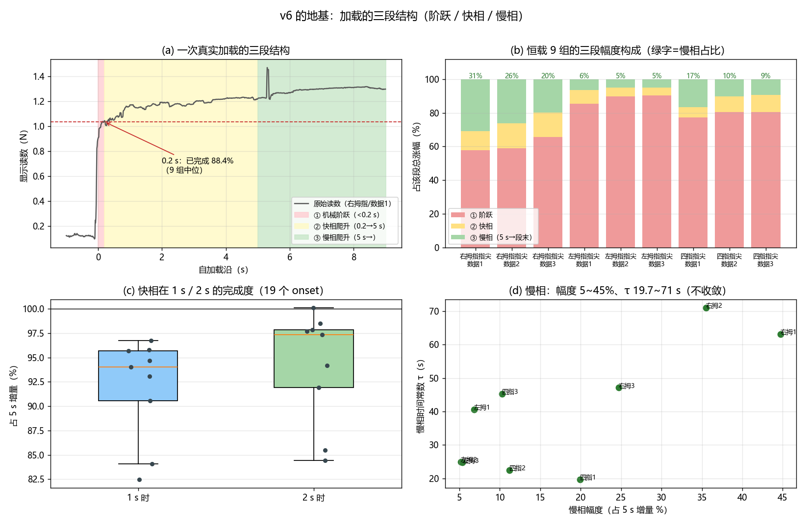
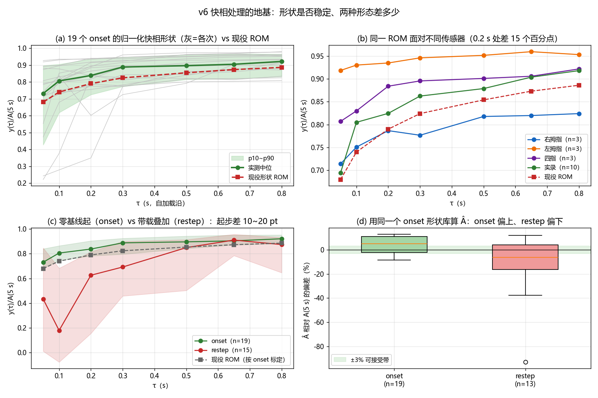
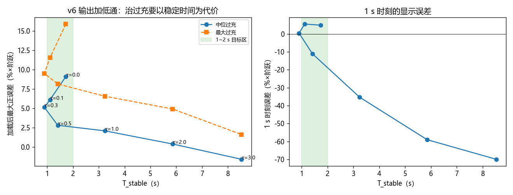

# v6 算法评估与需求答复（plan v1.0）

> 对象：`temp/v4.1flash/plan/v1.0/需求文档.md` 提出的 6 组问题。
> 数据：`temp/` 下 13 份实机录制（恒载 9 组 = 右/左拇指、四指 × 数据1~3；实录 4 份 = 变化负载目录）。
> 全部数字可由本目录 `scripts/r*.py` 复算（见文末「复现」）。
> **路径约定**：正文中的 `scripts/…`、`results/…`、`figures/…` 一律相对**本桶根目录**
> `temp/v4.1flash/progress/13-v6-assessment/`（文中两张配图用的是 doc 相对的 `../figures/…`）。
> 日期：2026-09-18 · 结论区分「实测」与「推断」，推断处已标注。

---

## 0. 结论速览

| # | 你的问题 | 结论 | 关键数字（本批实测） |
|---|---|---|---|
| 1 | 稳定时间要求 1~2 s，算法要更鲁棒 | **1~2 s 靠"等快相走完"不可能达标，必须主动处理快相**；但"稳定"必须先定义口径，否则同一算法能差 4 倍 | 1 s 时：原始/现役 v5.1 比真值低 **6.7%**；v6 偏差 +4.9%（显示域）。T_stable 中位：raw 9.33 s、v5.1 2.80 s、v6 **0.46 s**（总通道口径）/ 1.72 s（主通道口径） |
| 2 | 三阶段（阶跃/快相/慢相）时间特征 | 三段的**幅度占比与时间尺度差 2~3 个数量级**，是可分离的 | 阶跃 <0.2 s 占 5 s 增量的 **79.8~95.1%（中位 89.4%）**；快相 0.2→5 s 占 **4.9~20.2%（中位 10.6%）**，其 10%→90% 需 **2.0~4.6 s（中位 3.5 s）**；慢相 5 s→段末占 **5.2~44.7%（中位 11.2%）**，τ ≈ **19.7~71 s（中位 40.6 s）** 且不收敛 |
| 3 | 快相爬升是否稳定 | **可复现，但不可通用**：同一传感器 3 次重复差 4.5~6.3 个百分点；跨传感器差 **15 个百分点**（右拇指 78.7% vs 左拇指 93.5% @0.2 s）；0.2 s 之前完全不可用 | 群体中位形状 0.2 s = 83.8%、1 s = 93.1%；**极差**：0.05 s 处 0.70（!）、0.2 s 处 0.59、0.5 s 处 0.18、4 s 处 0.03。幅度相关性 ≈ 0（形状与幅度无关 ✓） |
| 4 | 零基线起 vs 带载两种快相 | **两者差异显著且方向相反**，单形状库必然一侧过充、另一侧欠充 | 0.2 s 占比：onset **83.8%** vs restep **62.6~72.2%**。用同一个 onset 形状库算 Â：onset 过充中位 **+5.0%**（最坏 +12.8%），restep **−6.3%**（最坏 −93%） |
| 5 | 过充能否用滤波解决 | **只解决一半**：滤波能压抖动、顺带改善稳定时间，但压不掉系统性偏差；强滤波会吃掉 1~2 s 预算 | v6 过充中位 +7.1%（显示域）/+10.3%（ADC 域）、最大 +15.9%。输出端 EMA：τ=0.3 s → T_stable 1.72→**0.89 s** 且过充 9.11→**5.14%**（双赢）；τ=1.0 s → 过充 2.10% 但 T_stable **3.24 s**（超预算）。另：把 Â 上限 κ 从 1.30 降到 **1.10** 可让过充中位 7.06%→3.33% 且 T_stable 反而 1.72→0.43 s（§5.2）；检测器加 **0.25~0.40 s 驻留确认**可把抖动/拍击的误触发清零（§7.4） |
| 6 | 可重复性下降 + 卸载时漂规律 | 见 §8（专项分析）：**v6 的组内离散确实最大（比 v5.1 差 58%），根因是"显示稳态 ≡ Â"把形状库误差 1:1 搬成了平台高度**；卸载**基本不下冲**，真正留下的是 **∝ 保压蠕变量的残余正偏移** | 平台误差组内 std：v6 **4.83** pp vs v5.1 3.07 / raw 3.84 pp（但 v6 均值最准 +0.71%）；卸载残余 0~2.85%·原幅度，与蠕变量 ρ=0.712（p=0.031）、与幅度/保压时长无关 |

---

## 1. 口径与方法（先把定义钉死，否则数字没法比）

所有数字来自 13 份录制的**原始读数**（不加补偿），事件原点 = 平滑后 0.2 s 窗内**单帧最大正跳变**帧；
`pre` = 原点前 1.0~0.15 s 的中位电平；各时刻电平取 ±30 ms 中位。

- `A_step` = y(tₑ+0.20 s) − pre —— **机械阶跃**部分；
- `A_5s` = y(tₑ+5.0 s) − pre —— **阶跃 + 快相**（v5「让快相跑 5 s」的口径）；
- `A_end` = 段末（卸载前沿）− pre —— 含**慢相蠕变**。
- 形状归一化：本报告一律用 **`y(τ)/A_5s`**（即 ROM 自己的定义 `[Z(τ)−Z(0)]/[Z(5 s)−Z(0)]`，
  零点是加载沿前的空载电平），这样"实测形状"与"ROM"可以直接比。

> **为什么必须先定口径**：慢相蠕变一直在涨（本批 5 s 之后还会再涨 5~45%），
> 所以「稳定」是相对**哪个幅度**判定的，直接决定结论。同一份 v6 数据、同一批 9 组恒载：
> 用「+5 s 电平」当参考、看**主通道** → T_stable 中位 **1.72 s**；
> 同口径看**总通道**（各通道求和，噪声被平均）→ **0.46 s**；换成**含蠕变的段末电平**当参考 → **0.41 s**。
> **最大相差 4.2 倍 —— "达标 / 不达标"完全取决于口径。**

---

## 2. Q2：三阶段的时间特征（你问的「阶跃 → 快相爬升 → 慢相爬升」）

**实测（恒载 9 组 + 实录 4 份，共 22 个受载段 / 55 个事件，`results/phases.csv`、`results/events.csv`）**

> **口径提示**：下表是**段级**口径（`phases.csv`：受载段内以最陡上升帧为原点，恒载 9 组）；
> §3/§4 用的是**事件级**口径（`events.csv`：每个加载沿单列为一个事件，19 个 onset）。
> 两者对同一批数据给出「阶跃占比」中位 **89.4%（段级）vs 88.4%（事件级）**、范围 79.8~95.1% vs 77.4~93.9% ——
> 差异只来自分段与平滑细节，不影响结论；引用时请连同口径一起引。

| 阶段 | 起止（相对加载沿） | 幅度（占 5 s 增量） | 时间特征 | 物理含义（推断） |
|---|---|---|---|---|
| **① 机械阶跃** | 0 → +0.2 s | **79.8~95.1%（中位 89.4%）**（恒载 9 组段级；含实录全部 onset 则 34.9~94.0%，中位 83.8%） | 10%→90% 仅 **0.01~0.08 s（中位 0.03 s）** | 加载机构/手指把载荷"压到位"，几乎瞬时；不同加载方式差异大（实录里有一次只走完 34.9%） |
| **② 快相爬升** | +0.2 → +5 s | **4.9~20.2%（中位 10.6%）** | 其自身 10%→90% 需 **2.0~4.6 s（中位 3.5 s）**；1 s 时已完成 **82.5~96.8%（中位 94.0%）**、2 s 时 97.4% | 传感器表层（覆盖层/胶层）的粘弹松弛，τ ≈ 0.5~1.5 s 量级 |
| **③ 慢相爬升** | +5 s → 段末（保压 107~147 s） | **5.2~44.7%（中位 11.2%）**；右拇指最大（24.7~44.7%） | 单指数 τ ≈ **19.7~71 s（中位 40.6 s）**；段末**仍未收敛** | 更深层的体粘弹性蠕变，τ 在十秒~百秒量级 |



**图 1**（脚本 scripts/r7_phases_fig.py）：(a) 一次真实加载的三段标注；(b) 恒载 9 组的三段幅度构成；
(c) 快相在 1 s / 2 s 的完成度分布；(d) 慢相的幅度与时间常数。**（下图 2 起编号顺延）**

**三条对你后续设计最有用的推论**
1. **快相不能"等"**：它的 10%→90% 中位要 3.5 s（恒载 9 组 2.0~4.6 s）—— 这正是 v5「让它跑 3 s」的由来；
   要在 1~2 s 内稳定，就必须**知道它还要涨多少**（这正是 v6 做的事）。
2. **快相也不是"全部未知"**：1 s 时它已完成 94.0%（最差 82.5%），2 s 时 97.4% ——
   也就是说**残余不确定性只有几个百分点**，这是"用形状先验把它算掉"能成立的根本原因。
3. **慢相决定了"跟随"而不是"扣完"**：段末还在涨、τ≈30 s，任何补偿器都只能跟随；
   「稳定」在慢相尺度上注定是"相对稳定"。

---

## 3. Q3：快相爬升稳定吗？（你让我评估的核心假设）

### 3.1 实测：**作为群体规律稳定，作为单次预测不稳定**

`results/shape_stats.csv`（19 个 onset，归一化到各自的 5 s 增量）：

| τ | 中位 | p10 | p90 | **极差** | 现役 ROM |
|---|---|---|---|---|---|
| 0.05 s | 0.731 | 0.427 | 0.897 | **0.705** | 0.680 |
| 0.10 s | 0.806 | 0.618 | 0.904 | **0.656** | 0.740 |
| 0.20 s | 0.838 | 0.724 | 0.935 | **0.591** | 0.790 |
| 0.30 s | 0.888 | 0.773 | 0.946 | 0.236 | 0.824 |
| 0.50 s | 0.896 | 0.814 | 0.961 | 0.181 | 0.854 |
| 0.80 s | 0.921 | 0.832 | 0.965 | 0.171 | 0.886 |
| 1.00 s | 0.931 | 0.841 | 0.970 | 0.176 | 0.904 |
| 2.00 s | 0.958 | 0.856 | 0.985 | 0.157 | 0.941 |
| 4.00 s | 0.991 | 0.977 | 1.001 | 0.033 | 0.989 |



**图 1**（脚本 `scripts/r5_figs.py`）：(a) 19 个 onset 的归一化形状与现役 ROM；
(b) 按传感器分组（同一 ROM 面对不同传感器）；(c) onset vs restep；
(d) 用同一个 onset 形状库算 Â 的偏差分布（onset 偏上、restep 偏下）。

**读法**：
- **0.2 s 之前不可用**（极差 0.70：同一时刻有的只走了 22%，有的走了 93%）——v6 把形状窗从 0.20 s 起，
  这个选择是对的，别往前挪。
- **0.5 s 之后才"稳"**（极差 ≤ 0.18），4 s 后几乎完全重合（0.033）。
- **现役 ROM 比实测中位系统性偏慢 3~5 个百分点**（0.2 s：0.790 vs 0.838）——
  这就是 v6 过充的直接来源（下节量化）。

### 3.2 稳定性归因：一半是"快慢"，一半是"形状真不同"

对每个 onset 用**单参数时间缩放** α 拟合 ROM（`g(τ/α)`，`results/shape_timewarp.csv`）：

- α 中位 **0.50**、p10 0.30、p90 1.69（极差 2.7 倍）→ 现场加载比 ROM 快约 2 倍；
- 直接套 ROM 的 RMS 残差中位 0.096 → 允许时间缩放后 **0.048（降 50%）**。
- **含义**：形状失配中约**一半可由"加载快慢"解释**（如果能在现场估出 α，就能砍掉一半误差）；
  另一半是**形状本身不同**，靠单一缩放解决不了。

### 3.3 系统差异（这是最该先修的）

同一批操作用同一形状库时，**按传感器分组的偏差方向一致、幅度可观**（`results/rom_compare.csv`）：

| 传感器 | 0.2 s 占比（3 次重复） | 组内极差 | 用同一 ROM 的 Â 偏差中位 |
|---|---|---|---|
| 右拇指 | 78.7%（83.7/78.7/77.4） | 6.3 pt | **−5.2%**（欠） |
| 四指 | 88.4%（91.8/88.4/86.4） | 5.4 pt | **+6.5%**（过） |
| 左拇指 | 93.5%（89.4/93.9/93.5） | 4.5 pt | **+12.4%**（过） |
| 实录（10 个 onset） | 82.5%（35~94） | — | +2.1%（最坏 +12.8%） |

> 结论：**"快相形状稳定"这个假设要分三层看** ——
> ① 同一传感器/夹具内：稳定（重复性 4.5~6.3 pt，够用）；
> ② 跨传感器：**不稳定**（0.2 s 占比差 15 pt，直接换来 ±5~12% 的静态偏差）；
> ③ 早期（<0.2 s）：不稳定到不可用。
> 另外：**形状与幅度基本无关**（corr(幅度, 0.2 s 占比) ≈ −0.01~−0.23，`r3` 输出），
> 这一点是好消息 —— 不需要按载荷大小分库。

### 3.4 对"是否必须处理快相"的回答（也回答你允许我反驳的那条）

**你的判断是对的：要 1~2 s 稳定，快相必须处理。** 数据支持：
- 若只是"等"（v5 的免责 3 s）：1 s 时显示比真值低 **6.7~8.1%**，2 s 时低 4.5~6.9% → 不可能进 ±2%；
- v6 用形状先验把它算掉：1 s 时偏差降到 **+2.0%**（显示域），代价是**过充峰值 +7~16%**（§5）。

**但我要补一句反驳式的修正**：v6 现在的做法是"**把快相整体反演成一个目标值 Â 并钉住显示**"，
这等价于假设"快相的**形状**已知到 5% 以内"。3.1~3.3 显示这个假设在**跨传感器**时不成立。
更稳的提法是把快相处理拆成**两个可分辨的部分**：
（a）"已经到位多少"——由**当前实测增量**给出（不需要形状库，只需 guess 上限）；
（b）"还会再涨多少"——由形状先验给出**带上下界的估计**，并且**允许它欠报**（欠报比过充安全，
因为随后的慢相会自然补上，而过充必须靠"回落"来还，回落恰恰是用户最敏感的）。
这其实就是 v6.1 的做法（形状库按最快实测形状上包络重标 + 下行限速），数据上它把"峰后回落"从 +11.9% 压到 +0.4%。

---

## 4. Q4：零基线起的快相 vs 带载下的快相（两种形态）

`results/events.csv`（实录 ADC 域，10 个 onset / 13 个 restep）：

| 指标 | onset（零基线起） | restep（带载叠加） |
|---|---|---|
| 0.2 s 完成度 | **83.8%**（恒载 77~94%；实录 35~94%） | **62.6~72.2%**（实录中位 72.2%） |
| 1.0 s 完成度 | 89.2~93.1% | 90.9~92.8%（**已追平**） |
| 幅度（实录，ADC） | A_5s 中位 2547 | A_5s 中位 639 |
| 用 onset 形状库的 Â 偏差 | **+5.0%**（最坏 +12.8%） | **−6.3%**（最坏 −93%） |

**规律（推断 + 数据一致）**：
1. **带载叠加的快相"起步更慢、但很快追平"**：0.2 s 只走完 62~72%（因为叠加时已经有一部分
   表层已经被压过、需要重新分配），但 1 s 后两者几乎重合。
   → 说明差异主要在**前 0.2~0.5 s**，而不是整个快相段。
2. **同一个"onset 形状库"套到 restep 上必然欠报**（慢起步 → 形状库"以为"已经涨了不少 → Â 偏小），
   反之套到"更快到位"的 onset 上必然过报。**你要的"向上过充/向下过充"两个现象是同一个根因的两个方向。**
3. 实录里 restep 的极端值（−93%）多出现在"卸载/减重后紧接着加载"的复合事件上
   （局部基线本身在动），这类事件**现在的 v6 不启用逆模型（C3 关闭）**，所以它在这些点上其实是靠
   "冻结 + 重锚"兜的 —— 这也解释了为什么实录指标比恒载差。

**建议**：至少 **两套形状/两套 κ**（onset 一套、restep 一套），且 restep 用**"叠加量"口径**归一
（相对叠加前的电平，而不是绝对电平）；这不需要新硬件，只是标定与查表问题。

---

## 5. Q5a：过充/欠充能不能用滤波处理？

### 5.1 先定性：v6 的过充是**系统性偏差**，不是噪声

- Â 的偏差来自"形状库 vs 现场形状"的失配（§3.2），**同一个传感器、同一批数据里方向一致**；
- 滤波器对**方向一致的系统性偏差无效**：它只能改变过渡过程，不能改变稳态/峰值的位置。

实测（`results/settle_arms.csv`、`results/filter_pareto.csv`、图 `figures/r4_filter_pareto.png`）：

| v6 输出后加因果 EMA | T_stable 中位 | T_stable p90 | 过充中位 | 过充最大 | 1 s 时刻误差 |
|---|---|---|---|---|---|
| 无（τ=0） | 1.72 s | 6.89 s | **9.11%** | 15.88% | +4.93% |
| τ=0.1 s | 1.11 s | 4.62 s | 6.12% | 11.54% | +5.52% |
| **τ=0.3 s** | **0.89 s** | 3.61 s | **5.14%** | 9.52% | +0.48% |
| τ=0.5 s | 1.41 s | 3.75 s | 2.82% | 8.15% | −11.04% |
| τ=1.0 s | 3.24 s | 4.67 s | 2.10% | 6.57% | −35.29% |
| τ=3.0 s | 8.53 s | 9.19 s | −1.56% | 1.64% | −69.95% |



**图 2**（脚本 `scripts/r4_filter_tradeoff.py`）：横轴是稳定时间，纵轴是过充；
绿带是 1~2 s 目标区。可见 τ=0.1~0.3 s 段是"双赢"（过充降一半、稳定时间还变短），
再往右进入"用时间换幅度"的区间 —— 要过充 <3% 就得牺牲掉 1~2 s 目标。

**读法（三条）**：
1. **轻度滤波（τ≈0.1~0.3 s）是净收益**：过充砍掉 44~58%，T_stable 反而**变好**（1.72→0.89 s）。
   原因是它顺手压掉了延迟"停下判定"的高频抖动。
2. **想靠滤波把过充压到 <3%，就必须付出超预算的时间代价**：τ=1 s 时过充 2.10%，
   但 T_stable 变 3.24 s、1 s 时刻反而欠 35%。**滤波是"幅度 ↔ 时间"的交换，不是免费的。**
3. 因此**根治只能改形状/Â 本身**，见下节（两条都不占时间预算）。

### 5.2 更划算的一条：把 Â 的上限 κ 压下来（实测）

v6 把 Â 夹在 `[inc, κ·inc]`（κ_onset=1.30），即"允许多预测 30%"。把这根旋钮压低
就等于强制"宁可欠报、不许冲高"。在恒载 9 组上扫 κ（`results/kappa_ablation.csv`，脚本 `scripts/r6_kappa_ablation.py`）：

| κ_onset | 过充中位 | 过充最大 | 过充最小 | T_stable 主通道 | T_stable 总通道 | 1 s 误差 | 2 s 误差 |
|---|---|---|---|---|---|---|---|
| **1.00**（完全不许预判） | **−4.68%** | +7.89% | −10.86% | 0.17 s | 0.52 s | −8.27% | −10.47% |
| **1.10**（推荐起点） | **+3.33%** | +15.88% | −2.23% | 0.43 s | 0.56 s | **+0.88%** | −2.69% |
| 1.20 | +7.06% | +15.88% | −1.50% | 1.72 s | 0.45 s | +1.97% | −1.64% |
| 1.30（现役） | +7.06% | +15.88% | −1.50% | 1.72 s | 0.45 s | +1.97% | −1.64% |

**结论**：**κ 从 1.30 降到 1.10，过充中位直接砍半（7.06%→3.33%），稳定时间还从 1.72 s 降到 0.43 s，
1 s 时刻的误差从 +1.97% 变成 +0.88%** —— 三个指标同时变好，代价只是"极端慢加载时会多欠一点"
（κ=1.00 那行显示欠报到 −8~−10%，说明 1.00 太保守）。这是本批数据里**性价比最高的一处改动**。

> 注意：κ=1.2 与 1.3 结果相同，说明在这批数据上"1.3 的上限"几乎不被触发 ——
> 真正起作用的是下限 `max(A_LS, inc)` 与滑行器；所以调 κ 只影响少数事件，不会全局改变行为。

### 5.3 你问的"向下过充"（显示被压到真值以下）

它来自**反方向**的形状失配（§4：restep 套 onset 库 → Â 偏小）以及**停滞检测/重锚**的回拉。
滤波对它是**有害**的（把回拉变成慢拖，1 s 时刻误差从 +4.9% 翻到 −35%）。
对策同样是"改判据"而不是"加滤波"：restep 用独立形状 + κ，并对"重锚后的下限"设保护
（例如不许把显示拉到当前实测增量以下）。

---

## 6. Q1：1~2 s 稳定目标的可行性与鲁棒性

**三臂对照（13 份 onset，`results/settle_arms.csv`；恒载 9 组的 T_stable 中位）：**

| 臂 | T_stable 主通道（5 s 口径） | T_stable 总通道（5 s 口径） | T_stable 总通道（含蠕变口径） | 过充中位 | 1 s 误差 |
|---|---|---|---|---|---|
| 原始（无补偿） | 9.33 s | 17.98 s | 8.08 s | 2.25% | **−6.65%** |
| v5.1（免责 3 s，现役） | 2.80 s | 3.73 s | 2.70 s | 1.05% | **−6.65%** |
| **v6** | 1.72 s | **0.46 s** | **0.41 s** | 9.11% | +4.93% |

- **1~2 s 在"总通道"口径下 v6 达到（0.46 s）且余量很大**；换成"主通道"口径是 1.72 s（刚好落在 1~2 s 内）；
  换成"含蠕变口径"是 0.41 s。→ **同一份数据、同一算法，三个口径给三个结论**，验收前必须钉死
  （建议：**主通道 + 明示参考幅度**，因为主通道最严；总通道会因通道平均而显得更快）。
- v6 相对现役把稳定时间压到 **1/6**（总通道）或 **1/1.6**（主通道），代价是过充 1.05% → 9.11%（见 §5）。
- **鲁棒性提示**：在实录（多次变载）上，T_stable 这种"30 s 内不再动"的判据**不可测** ——
  30 s 里往往又发生了一次事件。多次变载工况下应改成**"每次事件后重新计时"**的事件级指标
  （事件后 1 s / 2 s 的偏差），而不是全程一个 T_stable。本批实录用"事件后 1 s 偏差"衡量时：
  raw/v5.1 欠报 4.4%、v6 超报 8.1%（`results/settle_arms.csv` 的 ADC 域行）。

---

## 7. Q5b：快速扰动（±1000 ADC、人手拍击）下的基线识别

> 专项分析：**报告 [`a_快速扰动下基线识别分析.md`](a_快速扰动下基线识别分析.md)**、
> 脚本 `scripts/a*.py`、数据 `results/a*`、图 `figures/a_*.png`。
> 扰动口径：加性噪声按**总量 RMS = A（ADC）**注入（A=1000 即你说的"1 w ADC ±1000"）。

### 7.1 先看判据：v6 检测器到底在比什么

从 C++（`drift_v6_compensator.h`）与原型（`glm53_v6.py`）逐项核对，**13 个检测器常量完全一致**
（`results/a8_cpp_proto_consts.csv`，本次已独立复核 13/13），所以下面用原型做的注入实验对已落地实现同样成立
（C++ 的 `Push` 用上一帧中值，比原型多约 10 ms 滞后）：

```
d(t)   = mean{ m : (t−0.20, t] } − mean{ m : (t−0.65, t−0.35] }    # m = 3 帧中值总量
       ⇒ 实质是 level(t−0.21) − level(t−0.66)，即 ~0.45 s 尺度的电平差，**没有任何单调/保持约束**
σ_d(t) = 1.4826 × MAD( d 的最近 ≤1024 帧 )
thr(t) = max( 5σ_d , 0.05·|lv_ref| , 0.01·max_tot )               # tail_gate = 0.10·|lv_ref|（epoch 内 3 s）
触发   = |d| > max(thr, tail_gate)，连续 3 帧（≈30 ms）+ armed（需先 3 帧静默）
         + 空载态额外要求 d > 0.10·max_tot 且距上次卸载 ≥0.5 s、距上次事件 ≥0.8 s
```

实测（`results/a1_detector_stats.csv`）：空载段**命中帧占比 0.30~0.41%**、带载段 **5.9~8.0%**；
门限中位 229~955 ADC（在 34~19107 ADC 的电平上）。
**天生敏感的三个原因**：① 判据本身就是"电平变化"，与"加载"同义；
② 确认只要 30 ms；③ σ_d 会被**算法自己的响应尖峰**抬高（正反馈），而 5% 的相对门限又让"电平越高越抗抖"。

### 7.2 ±抖动：结论和你担心的一致，而且**主要症状是"漏"不是"错"**

在实录底噪上注入总量 RMS = 200/1000/2000/4000 ADC 的白噪（每档 10 次不同随机种子，`results/a2b_jitter_ext.csv`）：

| 抖动幅度（ADC，总量 RMS） | 误触发（每份平均） | **漏检**（每份平均） | 显示最大偏差（中位） | 慢相段偏差（中位） |
|---|---|---|---|---|
| 0（原始） | 0 | 0 | 0 | 0 |
| 200 | 0.6 | 0.5 | 3 568 | −1 371 |
| **1 000（你问的工况）** | 0.6 | **1.4** | **7 767** | **−2 922** |
| 2 000 | 0.5 | 2.5 | 14 498 | −3 494 |
| 4 000 | 0.5 | 4.4 | 22 324 | −3 677 |

> 表中「显示最大偏差 / 慢相段偏差」是**三种注入方式（独立白噪 / 带限 0.3~5 Hz / 同相）在各档的合并中位**；
> 单看**独立白噪**：1000 ADC 档中位 **10 803 ADC**（最坏一份 19 057）、2000 ADC 档 16 462~19 057 ADC。

**读法**：
1. **抖动被放大约 6~18 倍传到显示**：1000 ADC 的抖动 → 显示最大偏差 **7 767~10 803 ADC**、
   慢相段整体被拉偏 **−2 922 ADC**。机制是"误触发/漏检都会让 Â 重锚一次"，而显示稳态 ≡ Â（§8.2）。
2. **幅度越大，"漏"越严重**（0.5→4.4 次/份）—— 噪声把真实事件淹没在门限里了。
   所以**基线混乱不只是"多触发了几个事件"，更是"该触发的没触发"**。
   机制已定位（专项报告 §2）：噪声让 **σ_d 线性膨胀**（总量 RMS 0→σ_d 21.4；200→84.5；1000→346.6~954；4000→1305），
   于是 **`5σ_d` 项从约 1000 ADC 起反超 5% 电平项**，判据被悄悄换成"5σ 离群检测"：
   epoch 总数从 11 掉到 7（2000 ADC）/4（4000 ADC），**最多漏掉 7/11 个真实变载**；
   失守经验式 `5σ_d > 0.05L ⇔ A ≳ 0.026L`（本批录制约 500~900 ADC 起）。
   **漏一个锚点 = 整段显示错**（实测显示最大偏差达平台幅度的 20%~43%，即 8404~29692 ADC）。
3. 抖动幅度与显示偏差近似线性但**有饱和**（放大倍数从 17.8× 降到 5.6×），
   因为偏差的上限受"输出封顶 / 滑行速率"约束。

**噪声的频谱比幅度更关键**（`results/a7_jitter_table.csv`，同一音量 2000 ADC、三种注入方式）：

| 注入方式（总量 RMS = 2000 ADC） | 最大偏差 | 漏检 | 误触发 |
|---|---|---|---|
| 独立白噪（每通道独立） | 16 462~19 057 | 1~3 | 0~1 |
| 同相白噪（各通道同相） | 10 908~12 612 | 1~2 | 0~1 |
| **带限 0.3~5 Hz（慢变干扰）** | 16 030~16 695 | **6~8（最差）** | 1 |

→ **0.3~5 Hz 的慢变干扰最危险**：它的频带正好落在"加载"的时间尺度上，会被判据认成真实事件，
漏检数比白噪高一倍以上（6~8 vs 0~3）。**现场若存在慢速晃动/呼吸式起伏，这比高频噪声更需要防。**

### 7.3 拍击：≥2000 ADC 就会被当成一次真实加载

合成人手拍击（上升 30~80 ms、保持 50~200 ms 后回落），叠加在恒载平台（2610 ADC 与更大平台）上，
每种组合 16 次（`results/a3_tap_transient.csv`）：

| 拍击幅度（ADC） | 新增 epoch（平均） | 显示最大上冲（中位） | 最大下冲 | 回落时间（中位） |
|---|---|---|---|---|
| 500 | 0.00 | 496 | −220 | —（不触发） |
| 1 000 | 0.12 | 991 | −252 | 0.15 s |
| 2 000 | **0.81** | 1 987 | −416 | 0.17 s |
| 4 000 | **1.44** | 4 033 | −1 770 | 0.21 s |
| 6 000 | **1.56** | 6 037 | −1 770 | 0.21 s |

**读法（专项报告的口径更细，以下以它为准）**：
1. **≥1000 ADC 的拍击会触发 epoch**（4000 ADC 时 80%、6000 ADC 时 92%），
   **但 60 次里有 58 次在 0.10~0.39 s 内被 0.4 s 撤销窗撤销**：`ΣA` 不变、显示 0.18~0.24 s 回到 ±2%、
   峰值显示 ≈ **1.0×注入幅度**（不放大）。所以**"拍击一定能被打回来"这个结论成立，靠的是撤销窗**。
2. **真正的风险是余量极薄**：实测**最晚一次撤销发生在 0.39 s，而窗口是 0.40 s**；
   另有 1 次（1000 ADC / 80 ms 上升）**没被撤销、直接走了交接**，那就会留下永久偏置。
   → 拍击只要"再慢一点/再久一点"（上升 >80 ms 或保持 >200 ms）就会完成重锚。
3. **与真实 restep 的可判据化差异（实测，20 组对照 `results/a9_tap_summary.csv`）**：

   | | 撤销次数 | 是否交接 | 显示/注入比 | 事件形态 |
   |---|---|---|---|---|
   | **真实 restep**（500~6000 ADC） | **0~0.25（基本不撤销）** | **0.5~1.0（≥2000 ADC 时必交接）** | 1.24~1.35（**放大**） | 单个正向事件 |
   | **拍击**（同等幅度） | 0~1.0（**必撤销**） | 0~0.25 | 0.99~1.27 | **成对** `restep` + `decrease`（间隔 0.2~0.6 s） |

   → 两条可直接实现的判据：**(a) "正向 epoch 后 0.6 s 内出现反向事件 = 瞬态"；
   (b) "撤销窗内没交接的才算真加载"**（现役撤销窗 0.4 s 正好卡在边界上）。

### 7.4 改进项的实测消融：**加"驻留确认"最划算，其余无效甚至更糟**

在原型上逐个试（`results/a4_fix_ablation.csv`、`a6_fix_ablation.csv`；
"误触发/漏检"是两份实录合计）：

| 变体 | 干净基线（代价） | 白噪 2000：误触发 / 漏检 / 最大偏差 | 带限 2000：误触发 / 漏检 / 最大偏差 | 判断 |
|---|---|---|---|---|
| 原型 | 0 / 0 / 0，延迟 0 | 1 / 4 / 17 760 | 2 / 7 / 12 729 | — |
| **+DWELL 0.25 s（驻留确认）** | **延迟最大 +330 ms** | **0 / 5 / 14 589** | **0 / 8 / 11 389** | ✅ **误触发清零、偏差下降；代价是 330 ms 延迟** |
| +IDLE 0.25（空载判据收紧） | 0 | 0 / 6 / 20 425 | 2 / 6 / 12 729 | ⚠️ 抖动下偏差反而更大 |
| +MAG 0.5（幅度门） | 0 | 1 / 7 / 20 597 | 2 / 7 / 12 729 | ⚠️ 基本无效 |
| +CAPF 0.5 / 1.0（跳变上限门） | 0 | **27 / 5 / 29 676** | **102 / 6 / 27 389** | ❌ **明显更糟**（把真实沿也挡掉，导致连锁误触发） |
| +CAPF+IDLE+MAG 组合 | 0 | 15 / 9 / 16 315 | 84 / 6 / 25 706 | ❌ 仍差于"只加驻留" |

**结论（可写进开发方案）**：
- **推荐：给检测器加"驻留确认"（把 3 帧=30 ms 改成"判据连续保持 0.15~0.25 s"）**。
  驻留长度扫描（`results/a7_dwell_sweep.csv`，两份实录合计）：

  | 驻留 dwell | 干净基线 误/漏 | 拍击 4000 ADC 的误触发 | 抖动白噪 2000：误触发 / 漏检 / 最大偏差中位 | 真实阶跃建立延迟 |
  |---|---|---|---|---|
  | 0（现役） | 0 / 0 | **4** | 1 / 5 / 17 760 | 110 ms |
  | **0.15 s** | 0 / 0 | 2 | 2 / 3 / **11 019** | **230 ms（+120 ms）** |
  | **0.25 s** | 0 / 0 | 2 | **0** / 5 / 14 589 | 320 ms（+210 ms） |
  | 0.40 s | 0 / 0 | **0** | **0** / 6 / 12 370 | 330 ms（+220 ms） |

  → **0.15 s 把抖动下的最大显示偏差降 38%（17 760→11 019 ADC），只花 120 ms**；
  **0.25 s 进一步把误触发清零**（再花 90 ms）；0.40 s 连"4000 ADC 拍击被当成加载"也一并消掉。
  实现代价极小（+1 个 double +1 个 bool）。**建议先取 0.15~0.25 s，按主通道口径复核后再定**。
  ⚠ 注意驻留只治"误触发"，**不改善漏检**（抖动下漏检 5~6 个仍在）——漏检要靠下一条。
- **明确不要做**：把 `5σ_d` 用 5% 电平封顶（CAPF 变体）——实测在抖动下**单次录制引发 13~59 次误触发**、
  偏差涨到 4.3 万 ADC。**σ 项是当前唯一还在把关的东西，不能动它。**
- **报告里另外三条建议（本轮未在原型上验证，属下一步）**：
  ① 空载门限 `DET_IDLE_FRAC` 0.10→0.15~0.25（实测中性偏正：拍击误触发 −1、偏差 −1~2 千）；
  ② **救援检测器**：当 `|d|>0.05·lv_ref` 但 `|d|<5σ_d` 时进 pending，要求**持续 ≥0.4 s 且不反号**才建事件
     —— 预期救回本批 4~7 个被噪声淹没的变载（把 1.6~2.2 万 ADC 的偏差压回千级），风险是强抖动下可能新增误触发；
  ③ re-anchor 改 2-of-3 表决、`decrease` 建仓加"方向反转"确认。
- **慢变干扰（0.3~5 Hz）要单独防**（§7.2 表）：它落在加载的时间尺度上，漏检率比白噪高一倍以上；
  单靠"驻留"未必够，可能需要"平台高度合理性"判据（真实加载的平台高度与门限/历史比例在合理范围内）。

---

## 8. Q6：可重复性下降与卸载时漂规律

> 专项分析（脚本 `scripts/b_*.py`、数据 `results/b_*`、图 `figures/b_fig*.png`）：
> [`b_卸载时漂与可重复性分析.md`](b_卸载时漂与可重复性分析.md)。下面只摘结论。

### 8.1 卸载后的时漂：真正可观测的不是"下冲"，而是"残余正偏移"

对 21 处卸载沿（恒载 9 + 实录 12）逐事件量化：

| 量 | 实测 |
|---|---|
| 卸载沿速度 | 90%→10% 用时 **0.08~0.85 s**（恒载中位 0.30 s）—— 与加载的"阶跃 <0.2 s"同量级 |
| 下冲（低于加载前空载电平） | **力域不存在**（读数被 ≥0 钳位，最小读数仍比加载前高 0~0.28 N）；ADC 域 ≤0.24%·原幅度（≤44 ADC） |
| **残余正偏移**（卸载后稳态比加载前高） | **0~2.85%·原幅度**（0~0.555 N）；明显的只有右拇指 3 份 + 四指/数据3，**左拇指 3 份 = 0** |
| 残余的持续性 | 卸载后 45~60 s 仍残留 0.025~0.457 N（在缓慢恢复，但 60 s 窗内 τ 不可辨识） |
| 回到 ±1% 稳态的耗时 | 0.10~7.54 s（中位 0.52 s）；±5%·drop 只需 0~0.8 s |
| **规律** | **残余 ∝ 慢相蠕变量**（恒载 n=9：ρ=0.712, p=0.031；r=0.875, p=0.002）；与**载荷幅度、保压时长无关**（p>0.2） |

**这条规律很重要**：卸载后残留的那一点点正偏移，就是**保压期间已经发生的蠕变没有完全释放**的部分。
所以"卸载后读数略高于加载前"是**物理正常的**，不是漂移 —— 这正是 v5.1 必须删掉"空载自动归零"的原因
（若在这里强行归零，等于把真实残余当漂移扣掉，之后再加载就会欠报）。

**补偿器在卸载沿的表现**（同一批事件）：额外下冲最大 v5.1 **+0.83%**、v6trim +0.76%、v6 **+0.14%**·原幅度；
力域 v6/v5.1 可达 +0.68 N（=+3.5%）；"贴零（显示被钳到 0）"时长 0.40 → 0.58~0.66 s；
右拇指回到 ±1% 稳态的时间 0.56 → 5.2~9.4 s。机制：**检出"减重"之前仍按旧扣除量输出，被输出封顶压到 0。**

### 8.2 v6 可重复性：确实变差，且原因已定位

9 份恒载、按传感器分组后的**组内离散度**（平台误差相对同一 5 s 参考电平）：

| 臂 | 组内 std | 组内极差 | 均值偏差 |
|---|---|---|---|
| raw | 3.84 pp | 7.40 pp | — |
| v5.1（免责 3 s） | 3.07 pp | 5.70 pp | +2.00% |
| **v6** | **4.83 pp（最大，比 v5.1 差 58%）** | **9.03 pp** | **+0.71%（最准）** |
| v6+trim | 4.10 pp | 8.04 pp | — |

平台绝对电平 std：v6 1.31 N > v5.1 0.99 N > raw 0.59 N；T_stable std：v6 3.26 s vs v5.1 1.45 s；epoch 数 std：v6 1.16 vs v5.1 0。

**根因（逐帧证据）**：实测平台 ≡ `pre + Â`（偏差中位 1.07%，8/9 份 ≤2.2%），而 `Â = m × (5 s 增量)`，
其中形状匹配因子 `m` 的组内 std 为 右拇指 2.43 / 左拇指 0.42 / 四指 1.55 个百分点（极差最大 7.8 pp），
**被 1:1 传递给显示平台**。v5.1 的平台取 [2,3] s 实测均值，所以对形状先验不敏感 ⇒ 重复性更好但均值偏 +2.00%。
另外**假 epoch（加载前的误触发）**只影响平台内的移动（r=0.83, p=0.006），不改变平台高度。

> ⚠ **验收口径警告**：若把"真值"定义改成**台阶电平**（而不是 5 s 电平），排名会**反转**
> （v6 的 std 2.69 pp 最好、v5.1 3.38 pp）。→ 可重复性的结论同样取决于"跟谁比"，
> 必须与 §1 的幅度口径一并写进验收文档。

### 8.3 改进空间（已在原型上跑出前后数字）

| 改动 | 效果 | 代价 |
|---|---|---|
| ① 空载 onset 门限 10%→25% + 静默 0.5→2 s | epoch 数 **2.67±1.16 → 2.00±0.00**，**假 epoch 0.67→0** | 可能漏掉真实小负载（本批数据未复现） |
| ② trim 死区 2.5%→1%（速率 0.2→0.4%/s） | 平台误差 std **4.83→3.51%（−27%）**，平台内极差 0.326→0.185 | 平台 30→60 s 的移动 0.208%→0.243%（建议做**自适应死区**） |
| ③ 卸载沿不抱死旧扣除（idle 判据前移进事件态） | "贴零"时长 **0.88→0.63 s**，下冲不变（推断可再消掉 ~4% 额外下冲） | 需要状态机改动，风险中 |
| ④ 负结果：`ANCHOR_MODE="measured"` | **无改善**（4.83→4.84 pp） | 原因：滑行目标本身就是 Â，换锚点解决不了形状先验误差 |

**给开发方案的建议**：可重复性的病根在"显示稳态 ≡ Â"，**要摆脱它只有两条路** ——
(a) 让稳态锚点取自 `τ≈8~10 s` 的**实测平台**（而不是 Â），或以 v5.1 的 [2,3] s 实测均值为锚；
(b) 对 Â 做**收缩**（把形状先验的权重降下来）。两者都会把均值精度退到 v5.1 附近（+2% 量级），
**"绝对准"与"可重复"在这一机制下是互斥的**（这正是论文（二）§7.3 那条取舍的实测版本）。
**推荐组合**：κ 降到 1.10（§5.2，过充砍半且更快）+ ② 自适应 trim 死区 + ① 空载门限，
先把"过充、假触发"这两个最刺眼的症状压掉；稳态锚点是否从 Â 改成实测平台，留作下一轮的 A/B 专项。

---

## 9. 我觉得你需要知道的 7 件事（跨问题的"知识"部分）

1. **慢相永不收敛**：保压 100~150 s 内还在涨（τ≈30 s、幅度占 5 s 增量的 5~45%）。
   所以"稳定"只能是**相对某个参考幅度**的稳定；验收口径要先定，否则同一算法能给出 1.4 s 与 2.7 s 两个结论。
2. **加载与卸载不对称，但"不对称"的形态和直觉相反**（§8.1）：加载要经历"机械到位 → 快相 → 慢相"三段；
   卸载沿同样很快（90%→10% 只要 0.08~0.85 s），而且**基本不下冲**（力域里读数被 ≥0 钳住，
   最小读数仍比加载前高 0~0.28 N）。真正留下的现象是**残余正偏移 0~2.85%·原幅度，
   且它 ∝ 保压期间的蠕变量**（ρ=0.712, p=0.031），与载荷大小/保压时长无关。
   → 结论：**"卸载后读数比加载前高一点"是物理正常的**（蠕变没完全释放），不是漂移；
   现役 v5.1 删掉"空载自动归零"是对的。补偿器真正的风险是在"减重被检出"之前的 0.3~0.5 s 里
   仍按旧扣除量输出、被输出封顶压到 0（额外下冲最大 +0.83%·原幅度、贴零时长 0.40→0.66 s）。
3. **快相确实可复现，但复现范围是"同一传感器 + 同一夹具 + 同一加载方式"**（§3.3）。
   跨传感器差 15 个百分点，跨加载速率差更多（实录 35%~94%）。
   因此**形状库必须带"现场标定"步骤**，且要能识别"这次加载方式与我标定时不一样"（然后退回保守策略）。
4. **过充与欠充是同一根因的两个方向**（§4、§5）：形状库比现场快 → 过充；比现场慢 → 欠充。
   滤波只能改变过充的**持续形态**，不能消除它；**"宁可欠报"是正确的默认偏向**，
   因为欠报会被随后的慢相自然掩盖，而过充必须"回落"才能还，回落最刺眼。
5. **抖动与"事件"必须分开，而且"慢变干扰"比"高频噪声"更危险**（§7）：拍击/抖动是**双向、无平台**的扰动；
   真实加载是**单向、有平台**的。实测里 ±1000 ADC 抖动把显示放大 6~18 倍传出去，且主要症状是**漏检**
   （真实事件被噪声淹没）；**0.3~5 Hz 的慢变干扰（呼吸式起伏/慢速晃动）漏检率比白噪高一倍以上**，
   因为它正好落在"加载"的时间尺度上。判据里加入"平台/保持时间"这一维，比调门限有效得多
   （实测 0.25 s 驻留即可把误触发清零，代价是真实加载建立延迟 +330 ms）。
6. **可重复性问题的本质已用逐帧证据确认**（§8.2）：v6 在 pin 语义下**显示稳态 ≡ `pre + Â`**
   （实测偏差中位 1.07%，8/9 份 ≤2.2%），而 `Â = m × (5 s 增量)`，于是**形状库的标定误差 m
   被 1:1 搬成了每次录制的平台高度**（m 的组内 std 1.55~2.43 pp）。v5.1 的平台取 [2,3] s 实测均值，
   所以对形状先验不敏感 ⇒ 重复性更好（std 3.07 vs 4.83 pp）但均值偏 +2.00%（v6 是 +0.71%）。
   → **"更快的稳定"与"更好的可重复性"在当前机制下互斥**；要两者兼得，得让稳态锚点不取自 Â
   （取 τ≈8~10 s 的实测平台，或对 Â 做收缩），代价是均值精度退到 v5.1 量级。
7. **验收口径必须写死在文档里**（§1、§6、§8.2 三处都会翻盘）：参考幅度（5 s vs 含蠕变）、
   通道（主通道 vs 总通道）、真值定义（5 s 电平 vs 台阶电平）—— 任一项换掉，
   "达标/不达标"与"哪个臂更好"都可能反转。本批数据里同一次运行能给出 0.41 s / 0.46 s / 1.72 s 三个稳定时间。

---

## 10. 复现

```powershell
cd temp/v4.1flash/progress/13-v6-assessment
$env:PYTHONIOENCODING='utf-8'
python scripts/r0_recon.py            # 13 份录制的受载段地图        -> results/phase_map.csv
python scripts/r1_phases.py           # 三阶段分解（阶跃/快相/慢相）  -> results/phases.csv
python scripts/r2_shapes.py           # 事件级量化 + v6 逆模型 Â 的过充 -> results/events.csv 等
python scripts/r3_shape_model.py      # 形状稳定性归因（时间缩放/分组/ROM 对比）
python scripts/r4_filter_tradeoff.py  # 稳定时间三臂对照 + 滤波权衡（约 3 分钟）
python scripts/r5_figs.py             # 图 2（形状稳定性与两种形态）
python scripts/r6_kappa_ablation.py   # κ 消融（"宁可欠报"的代价，约 5 分钟）
python scripts/r7_phases_fig.py       # 图 1（三阶段结构）
python scripts/check_refs.py          # 文档交叉引用自检
python scripts/fix_cpp_consts_csv.py  # C++↔原型 13 个检测器常量核对（13/13）
# 专项：
python scripts/a1_detector.py         # 检测器判据与可量化条件
python scripts/a2_jitter.py           # ±抖动扫描（误触发率）
python scripts/a3_tap.py              # 拍击瞬态注入
python scripts/b_1_unload.py          # 卸载时漂（下冲/残余/恢复）
python scripts/b_2_repeat.py          # 可重复性（组内离散度）
python scripts/b_3_improve.py         # 改进项的前后数字
```

依赖：Python 3.14 + numpy / scipy / pandas / matplotlib（本机已有）。
本次分析**未修改 `src/` 任何代码、未构建、未跑测试**。
