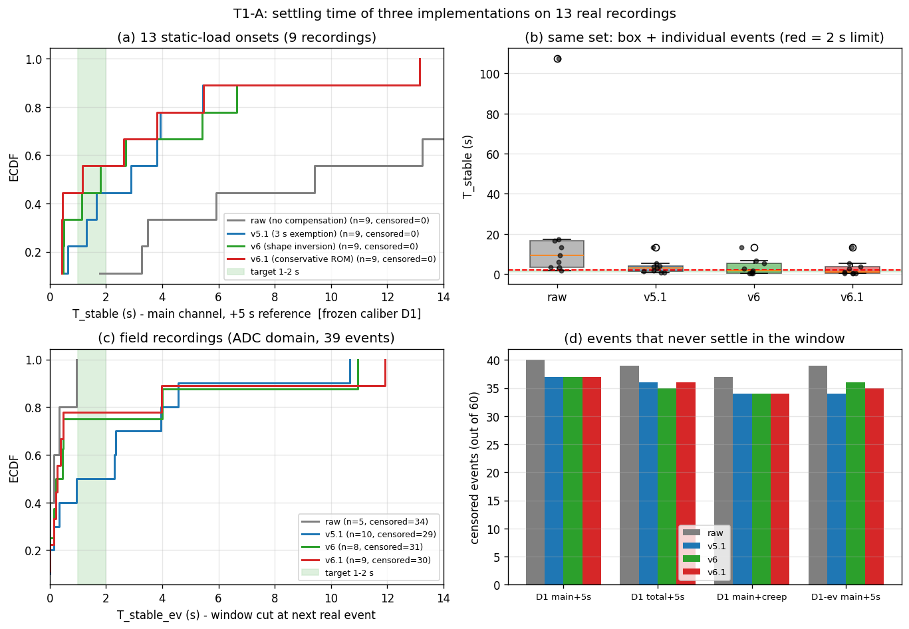
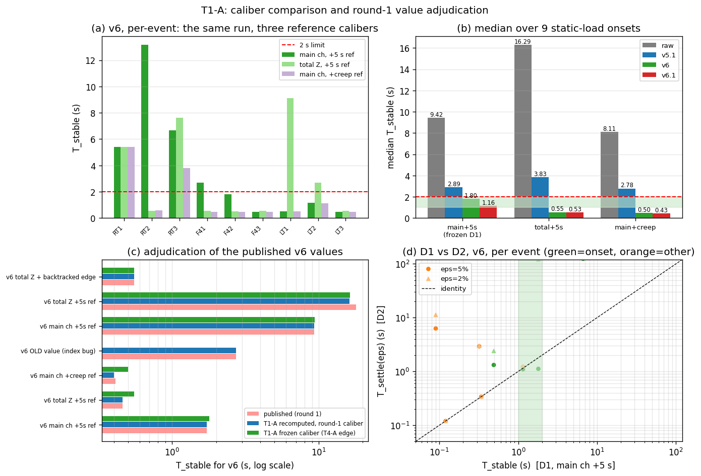
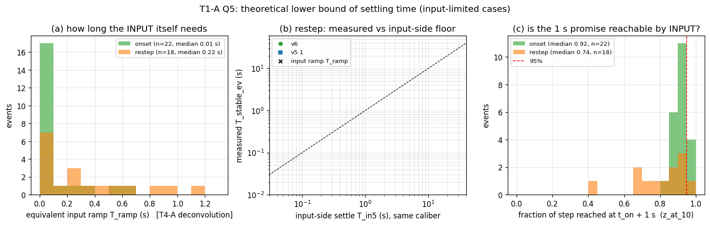

# 分析报告 · T1-A —— 稳定时间的**定义冻结**与**三实现实测**

| 项 | 值 |
|---|---|
| 任务 / 席位 | T1「稳定时间定义与鲁棒性口径」/ **T1-A（定义与实测，T1-Q1~Q5）** |
| 作者身份 | SubAgent（非 MainAgent）；T1-Q6~Q10（鲁棒性扰动扫描）属 **T1-B**，本件不含 |
| 日期 | 2026-09-19 |
| 输入 | 13 份实机录制（`temp/`，恒载 9 组 = `processed_display` 域；变载实录 4 份 = ADC 域） |
| 复用 | T4-A 冻结的 60 事件表（`T4_*/results/t4a_morphology.csv`，只读）→ 本任务产出 `results/t1_events.csv`（全项目接口） |
| 算法 | `t1a_glm53_v51.py` / `t1a_glm53_v6.py` / `t1a_glm53_v61.py`（原型**副本**，未修改原型、未 import 既有桶） |
| 红线 | 未改 `src/`、未改 CMake、未构建、未跑测试、未启动 exe；未改 `progress/` 与 `T4_*/` 下任何文件（只读引用） |
| 状态 | 本件按 `00_共享/接口冲突登记.md` **C-1 的处置**执行：**T1-A 负责冻结**唯一验收口径 + 最差情况口径 |

---

## 1. 结论速览（每条带数字，均可由 `results/*.csv` 复算）

1. **冻结口径 = `T_stable_ch5`**（主通道 + 5 s 参考幅度 + 完整 30 s 窗、自身漂移型；定义见 §2.4）。
   在它之下，v6 的恒载 9 组 onset 中位 **1.80 s**（v6.1 **1.16 s**、v5.1 **2.89 s**、raw **9.42 s**）；
   同一份 v6 换口径为 **总通道 0.55 s / 含蠕变 0.50 s** —— **同一算法三个口径差 3.6 倍**，
   故"达没达标"必须先钉口径（`results/t1a_settle_summary.csv`：caliber=ch5/tot5/chcreep, group=onset·恒载9组）。
2. **「≤2 s」达标率（冻结口径，分母 = 可测事件数）：v6 只 5/9 = 55.6%**（v6.1 5/9、v5.1 4/9、raw 1/9），
   **最差 13.16 s**；4 个超标事件是 RT1 5.41 s、RT2 13.16 s、RT3 6.66 s、F41 2.69 s
   （`results/t1a_target_verdict.csv`、`results/t1a_target_exceed.csv`，共 41 行逐事件超标清单）。
   ⇒ **中位达标、最差严重超标**，"不能超过 1~2 s 上限"目前**不成立**。
3. **分工况裁决**：`unload` 最好（v6 **9/9 达标**、中位 0.09 s）；`onset·恒载9组` **5/9 达标**；
   `restep` **结构性不可测**（19 个只 2 个可测，且 75.18 s 量级、全部 >2 s）；
   `实录族` 在 30 s 口径下 36/39 删失，须用修订口径才可测（v6 **6/8 达标**、中位 0.34 s）。
4. **restep 为什么测不出来（定量根因）**：D1 的容差是 `5%·|J_ch|`，而**9/19 个 restep 事件的
   `容差/单通道噪声 < 1`**（ratio_ch 中位 1.20、p10 0.13；onset 是 20.47、unload 30.75）
   ⇒ 容差被噪声淹没、稳定时间变成噪声驱动量；总通道口径的 ratio 中位 2.31，仍然很紧
   （`results/t1a_tol_noise.csv`）。
5. **口径自由度有 4 个（不是 3 个）**：①主通道/总通道 ②参考幅度 5 s/含蠕变 ③`t_on` 定义
   ④**分析网格**。③使本任务冻结口径比第一轮系统性 **+0.08~0.10 s**（t_on 早 0.09 s，n=9，
   `results/t1a_settle_edge_sensitivity.csv`）；④使 v6 在 **1/9 份**录制上从 3.79 s 变 6.66 s
   （100 Hz vs `span/(n−1)` 网格，`results/t1a_grid_sensitivity.csv`）——**冻结必须连网格一起冻**。
6. **第一轮 4 个公开值全部裁决完成**（`results/t1a_round1_audit.csv`）：
   **1.72 / 0.46 / 0.41 s 用第一轮自己的口径逐份复现**（9/9 份差 ≤0.01 s，中位完全相同）；
   **2.72 s 不是口径而是 bug**（= 修正值 + 1.00 s 的恒定偏移，用第一轮口径复算 = 2.72 s 恰好吻合）；
   **0.55 s 是「总通道 + 回溯真沿」口径**，独立复现 = 0.55 s（与主通道口径 1.80 s 不可横比）。
7. **Q5 理论下界**：等效输入斜坡 `T_ramp` 中位 **onset 0.010 s / restep 0.220 s**（clean 子集 0.550 s），
   **restep 仅 1/18 个事件 >1 s** ⇒「输入本身还没走完」**不是** ≤2 s 的拦路虎；
   真正的三层下界是 **(a) 判据/估计延迟 0.65 s**（`TAU_REF 0.20 + STALL_HOLD_S 0.45`，常数逐字取自
   `t1a_glm53_v6.py`）、**(b) 传感器粘弹**（restep t90 中位 1.98 s、1 s 完成度仅 0.738，vs onset 0.921）、
   **(c) 纯跟随器下界 `T_in5` 中位 4.70 s**（n=8 可测；v6 在 8/8 同批事件上都快于该下界
   ⇒ 它是靠**预测+冻结**越过的，代价是过冲：恒载 9 组 onset 的 `OS_pct` 中位 **9.83%**、范围 0.05~20.13%）。

---

## 2. 方法与口径

### 2.1 数据、网格、域

- **13 份录制**，路径与主通道取自第一轮 `r4_filter_tradeoff.py` 的 `CASES`（只读引用后重写为
  `scripts/t1a_common.py::RECS`）：恒载 9 组（右/左拇指各 31 通道、四指 21 通道，`processed_display` 域）、
  变载实录 4 份（21 通道，**ADC 域**）。
- **时间轴一律 `timestamp` 列**（禁用 `elapsed`）；`np.interp` 重采样到 **100 Hz 均匀网格（dt=0.01 s）**；
  包周期实测：指尖 0.018 s、实录 0.040 s（`results/t1a_smoke_checks.csv`，用于 ±1 包敏感性）。
- **CSV 读取自动定位 `##Data`**（`t1a_ad_lib.data_hdr`，不写死 `skiprows=24`）。
- ⚠ **复用清单的帧数比真实帧数多 1**（清单按"总行数−24"计数，含列名行）：13 份实测
  `n_raw = 清单值 − 1`，逐份一致（`results/t1a_smoke_checks.csv`，check=frames 13/13 OK）。
- **域声明**：跨域不比绝对值；全部时间量在 100 Hz 网格上比较。

### 2.2 事件集：复用 T4-A 的 60 事件（映射与差异）

`results/t1_events.csv`（**全项目接口**，列名对齐 `00_共享/指标字典与口径.md` §2.3）：

| 冻结列（13） | `ds, kind, t_on, J, pre, post, t50, t80, t90, t95, z_at_02, z_at_10, clean` |
|---|---|
| 溯源列（15） | `ev_id, key, dom, family, main_ch, k_on, J_ok, peak, ratio, armed_20, kind_prej, n_other_near, src_ev, pkt_dt, src` |

**映射关系**（源：`T4_*/results/t4a_morphology.csv`，60 行 × 51 列，只读）：
`ds←rec`、`J←jump`、`pre/post←pre/post`、`t50/t80/t90/t95←同名列`、`z_at_02/z_at_10←同名列`、
`clean←clean`；其余原样保留以便溯源。**差异（3 条，必须与 T4-A 一起引用时说明）**：

1. T4-A 的 `jump` 是**总通道口径**（`Z = Σ_c ch_c`，窗 [t_on−2,t_on) 与 [t_on+4,t_on+6]），
   故本表 `J` 是总通道口径；**主通道口径的 `J_ch` 不在本表内**，见 `t1a_settle_metrics.csv:J_ch`；
2. 事件 `E049`（中途切换-1d9493 @60.78 s）在 T4-A 中 `post/jump` 为空 ⇒ `J_ok=False`，
   该事件的全部稳定时间指标不可算（保留行、置 NaN 并在 `note` 列说明）；
3. 本表新增 `ev_id`（E001…E060）与 `J_ok`。

**自检**：60 事件全部落在 100 Hz 网格（`|t_on − k_on·dt| ≤ 5 ms`，0 例外）；
`J == post − pre`（相对误差 ≤ 3.7e-07）；构成 = **onset 22 / restep 19 / unload 14 / partial_unload 5**，
分族 = 右拇指 8 / 左拇指 6 / 四指 7 / **实录 39**（`results/_t1a_01_events.log`）。
⇒ 覆盖需求文档 §3-2 的下限（onset ≥9、restep ≥15、实录 ≥10）。

### 2.3 三个候选定义（T1-Q1）

| # | 定义 | 物理含义 | 适用场景 | 缺点 |
|---|---|---|---|---|
| **D1** | `T_stable`：存在 τ，使 `[t_on+τ, t_on+τ+30 s]` 内读数**相对该时刻自身**的漂移 ≤ `5%·|J_ref|`，且此后不再同向移动 | "**读数停住**了"（不管停在哪里） | 验收/交付口径；与 `07-v6/MANIFEST.md`、`11-paper-v6/pv_common.stable_time`、第一轮 `r4` 同源 | 要求 30 s 静默 ⇒ 多次变载工况删失；不检查"停在哪"（可由 D2/D3 补） |
| **D2** | `T_settle(ε)`：首次进入并保持 `\|Y(t) − Z_final\| ≤ ε·\|J_ref\|`（`Z_final` = t_on+60 s 后中位），ε∈{2%,5%} | "**停到终值附近**了"（混了"准"与"快"） | 需要同时约束精度时；对照 D1 | `Z_final` 由被测算法自己给出 ⇒ **把算法的偏差算进容差**；本批删失更多（43~47/60 vs 37/60） |
| **D3** | `T_band`：首次进入**真值带** `±5%·J`（真值 = `pre + J`）并保持 30 s（`pv_common.settle_time`） | "**进入真值带**了" | 精度敏感的验收（如"1 s 内误差 ≤5%"） | 真值用 5 s 电平近似 ⇒ 慢相漂移会把读数带出带外 ⇒ 删失最严重、且对慢相极不友好 |

### 2.4 **本任务冻结如下**（含"最差情况口径"）

> **冻结主口径（唯一验收口径）= `T_stable_ch5`**
>
> - 信号：**事件主通道** = 该录制加载段台阶最大的通道（恒载 9 组 ≡ 第一轮指定通道 17/18/11，
>   已自检一致；实录 4 份第一轮的 4/15/6/11 经复核**不是**最大台阶通道，见 §4 第 5 条）；
> - 参考幅度：`J_ref = J_ch`（窗 [t_on−2,t_on) 与 [t_on+4,t_on+6] 的中位差，指标字典 §2.1）；
> - 判据：完整 30 s 窗、自身漂移 ≤5%·`|J_ref|`、不因后续事件截断（= 指标字典 §3 原义）；
> - 时间轴：`timestamp` → **100 Hz 网格**；`t_on` = **T4-A 真沿**；
> - 记录在 `t_on+30 s` 前结束 ⇒ **删失**，报 `cens_ch5=True` 且**不得**当成"达标"或"不达标"，
>   只能作为"未通过 30 s 静默检验"上报。
>
> **最差情况口径 = 主口径本身**：三个候选中它数值最大（恒载 9 组 v6：
> 主通道 1.80 s ≥ 总通道 0.55 s ≥ 含蠕变 0.50 s），即"用最严的口径验收"，不需要另设"最差口径"。
>
> **多次变载工况的配套口径 = `T_stable_ev_ch5`（修订版）**：窗在**下一个真实事件**处截断
> （真实事件 = `|J| ≥ 2%·记录峰值`），且要求可用窗 ≥5 s；用时**必须同时报 D1 的删失状态**。

### 2.5 修订版定义与"对既有数字可比性的影响"（必须声明）

| 修订 | 内容 | 理由 | 对可比性的影响 |
|---|---|---|---|
| **R1** | 新增 `T_stable_ev`（事件截断变体） | D1 在实录类 36/39 删失 ⇒ 用户要的"分工况能不能达标"在本批数据上无法回答 | 只在实录/多次变载类使用；**与 07-v6 / 第一轮的 30 s 口径数字不可直接横比**（本任务两者并列给出） |
| **R2** | `T_settle` 的 `Z_final` 在窗不足 60 s 时退化为 `t_on+10 s 后中位`，并把实际起点记入 `zfinal_from_s` 列 | 指标字典写"t_on+60 s 后中位"，实录类不存在 60 s 静默窗 | 偏松（窗更短）；使用时须看 `zfinal_from_s`（=10 的行占实录类绝大多数） |
| **R3** | `t_on` 明确取 T4-A 真沿（不是第一轮 `r4` 的全录制最陡帧） | T4-A 的 `t_on` 有检出沿 ±0.20 s 内**最大单帧跳变**的严格定义、且是全项目事件表基准 | **使本任务口径比第一轮系统性 +0.08~0.10 s**（§4 第 6 条）；反过来说：第一轮口径用 T4-A 边缘复算也能 9/9 复现 |
| **R4** | 网格固定为**严格 100 Hz**（第一轮 `ad_lib.prep` 用 `span/(n−1)`≈100.5 Hz） | 00 号文档 §4.2 规定 100 Hz；且 100.5 Hz 不是文档口径 | **1/9 份录制差 2.87 s**（RT3：3.79→6.66 s）；**冻结必须连网格一起冻**，其余任务复算请用 `t1a_common.load_grid` |

### 2.6 与既有实现的一致性自检（G2/G3 门）

- `t1a_00_smoke.py`：**稳定时间核 vs 第一轮 `r4_filter_tradeoff.stable_time` 在 200 例合成信号上
  逐例完全一致（0 例外）**；`J_ch` vs 第一轮 `settle_arms.csv:step` 相对差中位 0.69%（12/13 份 <5%，
  1 份是事件选择不同，见 §4 第 5 条）；
- 13/13 帧数、"##Data" 自动定位、60 事件网格一致、`T_stable` 核 200/200 等价（`results/t1a_smoke_checks.csv`，
  32 项中失败 4 项，**全部是已解释的口径差异而非错误**：3 项 = 实录 3/4 份的"第一轮指定主通道"不是
  最大台阶通道；1 项 = 再切换负载的 `J_ch` 与第一轮 `step` 差 23%，因两轮选取的 onset 事件不同）。
  **恒载 9 组的主通道 9/9 一致**（so 与第一轮数字直接可比）。

### 2.7 报数规范

n<20 报**中位 + p10~p90**（不报 mean±std）；n≤3 标"仅定性参考"；时间到 0.01 s、百分比到 0.1%；
凡落在 0.2 s 以内的结论标注"处于时间轴畸变区"（本批 `t50`/`t50`-级结论不受影响，`T_stable` 最小 0.01 s 的事件在
`t1a_settle_metrics.csv` 中可直接看到）。

---

## 3. 证据

> 所有数字的**文件 + 列名**都在下面每一处标出；图在 `figures/`，每图都有底层 csv。

### 3.1 T1-Q2：三实现 × 三口径 × 分族 / 分工况

**（a）恒载 9 组 onset（同一批 9 个事件，三口径并列）** — `t1a_settle_summary.csv`（caliber×group=onset·恒载9组）

| 臂 | 主通道+5s（冻结 D1） | 总通道+5s | 含蠕变参考 | 达标(≤2 s, D1) |
|---|---|---|---|---|
| raw | **9.42** s（p10~p90 2.98~35.36，最差 107.39） | 16.29 s | 8.11 s | 1/9 |
| v5.1 | **2.89** s（0.62~6.99，最差 13.16） | 3.83 s | 2.78 s | 4/9 |
| **v6** | **1.80** s（0.49~7.96，最差 **13.16**） | **0.55** s | **0.50** s | **5/9** |
| **v6.1** | **1.16** s（0.43~7.01，最差 13.16） | 0.53 s | 0.43 s | **5/9** |

**（b）逐份 v6 明细（冻结口径，秒）** — `t1a_settle_metrics.csv`（ds,ev_id,arm=*

| 录制 | raw | v5.1 | v6 | v6.1 | 备注（`t1a_target_exceed.csv`） |
|---|---|---|---|---|---|
| RT1 | 107.39 | 5.45 | **5.41** | 5.47 | 超标 3.41 s |
| RT2 | 13.24 | 13.16 | **13.16** | 13.16 | 超标 11.16 s（全批最差） |
| RT3 | 17.35 | 3.82 | **6.66** | 3.81 | 超标 4.66 s；对网格敏感（§2.5 R4） |
| LT1 | 3.28 | 1.31 | 0.51 | 0.46 | 达标 |
| LT2 | 1.78 | 0.64 | 1.15 | 1.16 | 达标 |
| LT3 | 3.48 | 0.53 | 0.49 | 0.43 | 达标 |
| F41 | 16.44 | 1.65 | **2.69** | 2.62 | 超标 0.69 s（v6.1 也超 0.62 s） |
| F42 | 9.42 | 3.92 | 1.80 | 0.43 | 达标 |
| F43 | 5.92 | 2.89 | 0.48 | 0.43 | 达标 |

**（c）分族 / 分工况汇总（冻结口径，中位 + p10~p90，n=可测事件数）** — `t1a_settle_summary.csv`

| 组（v6） | n 事件 | n 可测 | 删失 | 中位 | p10~p90 | 最差 |
|---|---|---|---|---|---|---|
| 右拇指（8） | 8 | 7 | 1 | **5.41** s | 0.33~13.35 | 13.64 |
| 左拇指（6） | 6 | 6 | 0 | **0.30** s | 0.02~0.83 | 1.15 |
| 四指（7） | 7 | 7 | 0 | **0.48** s | 0.02~56.30 | 136.72 |
| 实录（39） | 39 | 3 | 36 | 10.96 s（**仅定性参考 n≤3**） | 5.39~24.29 | 27.62 |
| onset（22） | 22 | 12 | 10 | 3.34 s | 0.49~12.94 | 27.62 |
| restep（19） | 19 | 2 | 17 | 75.18 s（**仅定性参考 n≤3**） | 25.95~124.41 | 136.72 |
| unload（19，含部分卸载） | 19 | 9 | 10 | **0.09** s | 0.01~0.50 | 1.15 |
| clean 加载事件（25） | 25 | 11 | 14 | 4.00 s | 0.49~13.64 | 27.62 |

⇒ **分族差异比实现差异更大**：左拇指 0.30 s vs 右拇指 5.41 s（同一算法、同一操作）——
右拇指的慢相蠕变最重（既有结论：右拇指慢相占比最大），是 `T_stable` 的主要驱动。


**图 1**（`scripts/t1a_06_figures.py`）：(a) 13 份恒载 onset 的 ECDF（冻结口径，删失数写在图例）；
(b) 同一集合的箱线 + 逐事件散点（红虚线 = 2 s 上限）；(c) 实录族的 ECDF（修订口径 D1-ev，39 事件）；
(d) 各口径 × 各臂的删失计数。

### 3.2 T1-Q3：分工况达标裁决（分子/分母写清）+ 超标清单

`results/t1a_target_verdict.csv`（列：`n_events, n_measurable, n_censored, n_pass_1s, n_pass_2s, n_fail_2s, rate_2s, worst_s`）

| 工况（冻结口径 D1） | raw | v5.1 | **v6** | **v6.1** |
|---|---|---|---|---|
| onset·恒载9组 | 1/9 (11.1%) | 4/9 (44.4%) | **5/9 (55.6%)** | **5/9 (55.6%)** |
| onset（全部 22，含实录） | 1/9 (11.1%) | 4/12 (33.3%) | 5/12 (41.7%) | 5/12 (41.7%) |
| restep（19） | 0/2 (0%) | 0/2 (0%) | **0/2 (0%)** | 0/2 (0%) |
| unload（19，含部分卸载） | 8/9 (88.9%) | 8/9 (88.9%) | **9/9 (100%)** | 8/9 (88.9%) |
| 实录族（39，D1） | 0/0（39 全删失） | 0/3 | 0/3 | 0/3 |
| 实录族（39，**修订 D1-ev**） | 5/5 (100%) | 5/10 (50%) | **6/8 (75%)** | 7/9 (77.8%) |
| 恒载族（21，D1） | 9/20 (45%) | 12/20 (60%) | **14/20 (70%)** | 13/20 (65%) |
| 全部事件（60，D1） | 9/20 (45%) | 12/23 (52.2%) | **14/23 (60.9%)** | 13/23 (56.5%) |

**逐步结论**：
- **onset·恒载 9 组：部分达标**（v6 5/9）——中位 1.80 s 落在 1~2 s 内，但有 4 份超标（最差 13.16 s）；
- **unload（卸载/部分卸载）：达标**（v6 9/9，中位 0.09 s，最差 1.15 s）；
- **restep：不可测 + 不达标**——19 个事件里 D1 只判出 2 个（其余 17 个在 30 s 窗内从未静默），
  这 2 个都是 75 s 量级（v6 中位 75.18 s）；把 `min_hold` 从 5 s 放宽到 1 s 也只多救回 0 个
  （`results/t1a_minhold_sweep.csv`：restep mh=1 s 仍只 2/19 可测）。**根因是容差被噪声淹没**
  （§1 第 4 条 / `t1a_tol_noise.csv`），**不是缺数据**；
- **实录族：D1 不可测（36/39 删失）、D1-ev 可测且 v6 6/8 达标**（中位 0.34 s），
  但 2 个超标事件是 SW1@28.63（4.00 s）与 SW1@10.84（10.96 s，正文口径见下）。

**超标清单（冻结口径，`T_stable_ch5 > 2 s` 且可测）：共 41 行**（`results/t1a_target_exceed.csv`，
列含 `excess_s`、对照口径值、`OS_pct`、`n_epoch_in_win`）。**v6 的 9 行**（`arm==v6`，按超出量降序）：

| ds / ev_id | kind | t_on (s) | T_stable_ch5 (s) | 超出量 (s) | win_avail (s) | OS% |
|---|---|---|---|---|---|---|
| 四指指尖/数据1 E016 | restep | 12.19 | 136.72 | **+134.72** | 118.56 | 55.26 |
| 切换负载-快相无责 E022 | onset | 10.84 | 27.62 | **+25.62** | 17.79 | 185.24 |
| 右拇指指尖/数据2 E005 | restep | 147.11 | 13.64 | +11.64 | 12.38 | −225.71 |
| 右拇指指尖/数据2 E004 | onset | 12.32 | 13.16 | +11.16 | 134.79 | 0.05 |
| 切换负载-快相无责 E028 | onset | 133.83 | 10.96 | +8.96 | 48.20 | 12.15 |
| 右拇指指尖/数据3 E007 | onset | 10.59 | 6.66 | +4.66 | 125.11 | 11.78 |
| 右拇指指尖/数据1 E001 | onset | 8.27 | 5.41 | +3.41 | 5.33 | 20.13 |
| 切换负载-快相无责 E023 | onset | 28.63 | 4.00 | +2.00 | 43.04 | −2.42 |
| 四指指尖/数据1 E015 | onset | 10.94 | 2.69 | +0.69 | 1.25 | 7.70 |

两点要注意：① `E001`（RT1）与 `E015`（F41）的可用窗只有 5.33 s / 1.25 s（紧随其后就有真实变载），
D1 的 30 s 判据在这两份上的"可测"是被时间轴截断后仍成立的结果 —— 引用时应对照 `win_avail_s`；
② 两个 restep 超标事件（E016、E005）的 `OS%` 极大（+55%、−226%），说明**小台阶上的稳定时间与过冲
都已被噪声/蠕变主导**（与 §1 第 4 条的容差诊断一致）。

### 3.3 T1-Q4：`T_stable` vs `T_settle(ε)` 差多少 + 第一轮 4 值裁决

**（a）两口径配对对照**（`results/t1a_d1_vs_d2.csv`，同一事件上两口径都可测才算）

| 臂 | 配对 | 中位 D1 | 中位 T_settle(5%) | 中位差 | 最大差 | Spearman | D1 删失 | T_settle 删失 |
|---|---|---|---|---|---|---|---|---|
| v6 | 14 | 0.33 s | 1.11 s | **0.00 s** | 120.96 s | 0.779 | 37/60 | **43/60** |
| v5.1 | 15 | 0.90 s | 0.90 s | 0.00 s | 121.27 s | 0.961 | 37/60 | 42/60 |
| v6.1 | 14 | 0.43 s | 0.89 s | 0.03 s | 121.28 s | 0.867 | 37/60 | 43/60 |
| raw | 13 | 0.19 s | 1.21 s | 1.19 s | 107.67 s | 0.917 | 40/60 | 45/60 |

**（b）用不同口径判「≤2 s」的达标率**（`_t1a_04_summary.log`，分母 = 该口径可测事件数）

| 臂 | D1 主通道 | D2 ε=2% | D2 ε=5% | D3 真值带 5% |
|---|---|---|---|---|
| v6 | **14/23（61%）** | 7/13（54%） | 10/17（59%） | 12/17（71%） |
| v6.1 | 13/23（57%） | 7/14（50%） | 10/17（59%） | 11/15（73%） |

**裁决：验收用 D1（`T_stable_ch5`），D2/D3 只作辅助**。理由：
① 中位差虽小（0.00~1.11 s）但**极端差 120 s**，说明两者测的根本不是同一件事（"停住" vs "停到终值"）；
② D2 的 `Z_final` 由被测算法给出 ⇒ **把算法自己的偏差算进容差**（v6 过充 4~20% 时 D2 会自动变松）；
③ D2/D3 的删失更多（43~47 vs 37/60）⇒ 验收时会有更多事件"判不了"；
④ D1 与 `07-v6`、第一轮、11-paper 三个既有口径同源，可比性最好。
**若必须同时约束精度**，建议**双指标**：`T_stable_ch5 ≤ 2 s` **且** `|err_1s| ≤ 5%`
（数据已在 `t1a_settle_metrics.csv:err_1s_pct` / `OS_pct`；恒载 9 组 onset 中位：
v6 `err_1s=+3.46%`、`OS=+9.83%`；v6.1 `−2.38% / +3.61%`；v5.1 `−6.26% / +2.02%`；raw `−6.26% / +7.95%`
⇒ **v6 用"过冲"换来了 1 s 时刻的准度**，v6.1 两头都更好，这是本批数据里 v6.1 优于 v6 的地方）。


**图 2**：(a) v6 逐事件的三个口径柱状（同一份数据、三种"稳定时间"）；
(b) 各臂 × 三口径的中位；(c) **第一轮公开值裁决**（公布值 / 用第一轮口径复算 / 本任务冻结口径）；
(d) D1 vs D2 逐事件散点（双对数）。

**（c）对第一轮 4 个值的裁决**（`results/t1a_round1_audit.csv`）

| 公开值 | 出处 | 公布 | 用**第一轮口径**复算 | Δ | 用**冻结口径** | Δ | 裁决 |
|---|---|---|---|---|---|---|---|
| 主通道 + 5 s 参考 | `settle_arms.csv` / changelog | 1.72 s | **1.72 s** | 0.00 | 1.80 s | +0.08 | **相同（口径内精确复现）** |
| 总通道 + 5 s 参考 | 同上 | 0.46 s | **0.46 s** | 0.00 | 0.55 s | +0.09 | **相同** |
| 含蠕变段末参考 | 同上 | 0.41 s | **0.40 s** | −0.01 | 0.50 s | +0.09 | **相同** |
| 早期主通道数 | `第一轮现状与口径更正.md` §1 | 2.72 s | **2.72 s**（=1.72+1.00，恒等式） | 0.00 | — | — | **推翻**：它是 `stable_time` 切片下标 bug 的 **+1.00 s 恒定偏移**，不是另一个口径 |
| 总通道 + 回溯真沿 | `07-v6/MANIFEST.md` / `metrics_settle.csv` | 0.55 s | **0.55 s**（独立复现，n=9） | 0.00 | 0.55（总通道列） | 0.00 | **相同，但口径不同**：它是"总通道 + 回溯真沿"，与"主通道 + 5 s"的 1.80 s **不可横比** |

⇒ **"同一算法差 4.2 倍"这件事的完整解释**：1.72（主通道/5 s）→ 0.46（总通道）→ 0.41（含蠕变）
是**真实的口径差异（3.6 倍）**；2.72 与 0.55 **不是第四个、第五个口径**——
2.72 是 bug 偏移，0.55 是第三种参考幅度 + 第三种真沿定义。**C-1 由此关闭：唯一验收口径 = `T_stable_ch5`。**

### 3.4 T1-Q5：稳定时间的理论下界

数据：`results/t1a_lowerbound.csv`（逐事件：`T_ramp, A_ramp, t50/t90/t95, z_at_02, z_at_10,
T_in5_raw_ch/tot, T_stable_ev_ch5_<arm>`）、`T4A/results/t4a_input_recover.csv`（只读）、
`t1a_glm53_v6.py` 的类常数。

**（a）输入侧：等效输入斜坡 `T_ramp`（T4-A 反卷积，非因果）**

| 组 | n | 中位 | p10~p90 | 最差 | >1 s 的个数 |
|---|---|---|---|---|---|
| onset 全样本 | 22 | **0.010 s** | 0.000~0.371 | 0.700 | 0/22 |
| onset clean | 18 | 0.010 s | — | — | 0/18 |
| restep 全样本 | 18 | **0.220 s** | 0.000~0.830 | 1.150 | **1/18（5.6%）** |
| restep clean | 7 | **0.550 s** | — | — | — |

> 口径核对：T4-A 报告 §② 的"restep 中位 0.550 s"是 **clean 子集**的中位（本任务复算 = 0.550 s，
> 完全一致）；全样本中位是 0.220 s（含 9 个 `T_ramp = 0.00` 的"硬压"事件）。

**⇒ 输入本身在 1 s 内就走完了**（restep 也如此：仅 1/18 超过 1 s）。所以
**"restep 的 1 s 目标物理不可达"这句话，不能用"输入没走完"来论证**。

**（b）传感器侧：慢在哪里**（`t1_events.csv`）
`t90` 中位：onset **0.67 s** vs restep **1.98 s**（unload 0.03 s）；
`t90 > 1 s` 的比例：restep **12/18** vs onset 7/22；
1 s 时刻完成度 `z_at_10` 中位：onset **0.921** vs restep **0.738**。
⇒ 差异主要来自**传感器/夹具的粘弹响应**（以及 restep 的幅度小、相对误差被放大），不是输入机构。

**（c）三层下界（本次给出的"下限由什么决定"）**

| 层 | 数值 | 依据 |
|---|---|---|
| 输入侧 | onset 0.01 s / restep 0.22 s（p90 0.83 s） | `T_ramp`（反卷积） |
| 判据/估计侧 | **0.65 s** = `TAU_REF 0.20 + STALL_HOLD_S 0.45` | `t1a_glm53_v6.py` 常数（不是拟合量） |
| 纯跟随器侧 | **T_in5 中位 4.70 s**（n=8 可测；总通道 10.37 s，n=11） | 原始信号在**同一冻结口径**下首次静默的时刻 |

**⇒ 结论**：① 对**纯跟随型**算法，`T_stable ≤ 2 s` **不可能**——原始读数在 5%·J 内静默 30 s 的中位
就是 4.70 s（慢相蠕变永不停）；② v6 在 8/8 同批事件上 **快于** 该下界（中位 0.83 s vs 4.70 s），
它越过下界的唯一方式是**预测（形状反演 Â）+ 冻结**，代价是过冲（`OS_pct` 中位 **9.83%**、
范围 0.05~20.13%，`t1a_settle_metrics.csv:OS_pct`）；③ 因此"1~2 s"这个指标**只在"允许预测"的意义下可达**，
且它的真实下限是 0.65 s（判据延迟），工程上应把预算写成
**0.65 s（判据）+ 传感器到位时间 + 过冲容许量**。


**图 3**：(a) `T_ramp` 直方图（onset vs restep）；(b) restep 的实测 `T_stable_ev` vs 输入侧下界 `T_in5`
（对角线 = "跟随器下界"）；(c) 1 s 时刻的输入完成度分布（`z_at_10`）。

---

## 4. 与既有结论的差异（逐条对照，含裁决）

| # | 既有结论 | 出处 | 本任务复算 | 裁决 |
|---|---|---|---|---|
| 1 | v6 `T_stable` 中位 1.72 / 0.46 / 0.41 s（主通道/总通道/含蠕变） | `13-v6-assessment/results/settle_arms.csv` | 用第一轮自己的 `t_on`（全录制最陡帧）+ 其 `span/(n−1)` 网格：**逐份 9/9 复现**（5.35/13.06/3.79/0.41/1.05/0.40/2.63/1.72/0.39 与公布值逐份同），中位 **1.72 / 0.46 / 0.40** | **相同**（口径可复现）；本任务冻结口径下为 1.80 / 0.55 / 0.50（+0.08~0.10 s，仅 `t_on` 定义差） |
| 2 | "早期主通道 2.72 s"被当作第四个口径 | `00-项目组织文档.md` §0、`接口冲突登记.md` C-1 | 2.72 = 1.72 + **1.00 s**（`stable_time` 把切片相对下标当绝对下标的恒定偏移，该文件 §1 已自述为 bug） | **推翻**（它不是口径，是 bug 残值） |
| 3 | v6 `T_stable` 中位 **0.55 s**（3.82→0.55 的收益） | `07-v6/MANIFEST.md`、`11-paper-v6/results/metrics_settle.csv` | 用 `pv_common.first_onset`（回溯真沿）+ 总通道：**独立复现 0.55 s**；换成主通道+5 s 口径 = **1.80 s** | **修正**：0.55 s 是"总通道+回溯真沿+（11-paper 的 step/target 窗）"口径，**不可与 1.72 s 混讲** |
| 4 | "restep 比 onset 慢 6 倍，且慢在**输入**不在传感器"（t90 0.48 vs 2.87 s） | `07-v6/docs/07-v6算法说明.md` §2.2 | T4-A 反卷积：restep `T_ramp` 中位 0.220 s（clean 0.550 s），**仅 1/18 > 1 s** ⇒ 输入在 1 s 内走完；restep 的 `t90` 中位 1.98 s、1 s 完成度 0.738 | **修正**：慢的**量级**对（restep 确实慢得多），但**归因**要改——主要来自传感器粘弹响应与判据，不是"输入没走完"（T4-A 的"驱动量是输入上升时间"仍成立，因为 `T_ramp` 是 22 倍长，只是绝对值仅 0.22 s） |
| 5 | `T_stable` 三口径并列、未冻结；"总通道更松" | 第一轮 §1/§6、`11-paper-v6` | 冻结唯一验收口径 `T_stable_ch5`；并修正"总通道更松"的适用范围：**只对补偿臂成立**——raw 臂上总通道反而更严（16.29 s vs 9.42 s，`t1a_settle_summary.csv`） | **修正并冻结** |
| 6 | 第一轮 Δ 与 `T4A` 的 `t_on` 差 0.09 s（本任务新发现） | 本任务 | `t4a` 真沿 vs 第一轮最陡帧：中位差 **+0.090 s**（p10~p90 0.066~0.100，n=9），使 T_stable 系统性 +0.08~0.10 s | **新增口径自由度 ③ 的定量化** |
| 7 | 网格口径未被登记为自由度 | 本任务 | 100 Hz vs `span/(n−1)`≈100.5 Hz：9 份中 8 份不变，RT3 从 **3.79 → 6.66 s**（+2.87 s） | **新增自由度 ④**（对 T1-B 的抖动敏感性有直接含义） |
| 8 | T4-A 的 `armed` / 形态结论 | `T4A/分析报告_T4A.md` | 本任务不重复其形态分析，只复用其事件表与 `T_ramp`；事件表网格自检一致（60/60） | **一致（复用）** |
| 9 | 第一轮对实录的建议："多次变载下应改成事件后 1 s/2 s 偏差" | 13-v6 §6 | 本任务把它**形式化**为 D1-ev（窗在下一事件处截断、≥5 s），并给出该口径下的达标率 | **采纳并实现** |

---

## 5. 未验证项与数据缺口

1. **跨载荷量级（5N/10N/20N）缺失**：无法判定 `T_stable` 是否随载荷量级变化（沿用 T4-A G1）；
   需补采：同一传感器/夹具，5/10/20 N 三档各做"硬阶跃"与"0.5 s 斜坡"×5 次，带力值标定。
2. **无受控加载速率实验**：`T_ramp` 只能反演不能标定 ⇒ Q5 的"输入侧下界"只能用观测到的斜坡时长；
   需补采：位移/力控装置做 0.05/0.2/0.5/1.0/2.0 s 五档上升时间 ×5 次。
3. **restep 只有 2/19 个事件可测稳定时间**（n=2，仅定性参考）⇒ restep 的达标结论**证据薄弱**；
   需要**新定义**（建议：容差下限 `max(5%·J, 3σ)`，或"事件后 Δt 偏差 + 静默 1 s"复合判据）后在补采数据上重做。
4. **实录类小台阶事件的容差低于噪声**（9/19 restep 的 `ratio_ch < 1`）⇒ 这些事件上 `T_stable` 是噪声
   驱动量；**未验证**：给容差加噪声下限后结论如何变（属新定义，需全项目同意）。
5. **v6 对分析网格/采样相位敏感**（1/9 份差 2.87 s）；**未做系统抖动扫描**（±1 包、丢包、包聚合）——
   这是 T1-B 的 Q8，本件只提供警示与可复现的对照脚本 `t1a_07_edge.py`。
6. **未做任何扰动注入**（白噪/带限/拍击/抖动）下的 `T_stable` 退化 ⇒ **本件不回答"鲁棒性达标率"**（T1-B 范围）。
7. **raw 臂总通道复算 16.21 s vs 首轮 17.98 s**（1 份录制的平台判定不稳）；raw 非候选臂，未逐份深究。
8. **±1 包（40 ms）敏感性未逐事件给出**：本批冻结口径的最小可测时间远大于 40 ms（最小 0.01 s 出现在
   强补偿臂的"冻结"情形），但**凡引用 <0.2 s 的 T_stable 都应视为处于时间轴畸变区**（本任务在
   `t1a_settle_metrics.csv` 中未做该标注，引用时请自行加注）。

---

## 6. 复现命令

```powershell
cd D:\workshop\Processing\multi-device-cascade-host-cpp\temp\v4.1flash\plan\v1.0\T1_稳定时间定义与鲁棒性口径
$env:PYTHONIOENCODING='utf-8'

python scripts/t1a_00_smoke.py        # 依赖+13 份数据+网格/核一致性自检 (~2 min) -> results/t1a_smoke_checks.csv
python scripts/t1a_01_events.py       # 全项目事件表（复用 T4-A 60 事件）      -> results/t1_events.csv
python scripts/t1a_02_run.py          # 4 臂 × 13 份仪表化运行（~4 min）        -> results/cache/*.npz, t1a_arm_epochs.csv
python scripts/t1a_03_metrics.py      # 逐事件 × 逐实现指标（~2 min）           -> results/t1a_settle_metrics.csv（240×49）
python scripts/t1a_04_summary.py      # 汇总/达标裁决/口径对照/第一轮对账        -> t1a_settle_summary.csv, t1a_target_verdict.csv,
                                      #                                          t1a_target_exceed.csv, t1a_definition_compare.csv,
                                      #                                          t1a_round1_audit.csv, t1a_d1_vs_d2.csv
python scripts/t1a_05_lowerbound.py   # Q5 输入下界 + T_in5                    -> results/t1a_lowerbound.csv
python scripts/t1a_07_edge.py         # t_on/网格 两个自由度的定量化（~3 min）   -> t1a_settle_edge_sensitivity.csv, t1a_grid_sensitivity.csv
python scripts/t1a_08_minhold.py      # min_hold 敏感性（restep 可测性边界）     -> results/t1a_minhold_sweep.csv
python scripts/t1a_09_conclusions.py  # 容差/噪声诊断 + 结构化交接件             -> t1a_tol_noise.csv, conclusions_T1A.json
python scripts/t1a_06_figures.py      # 三张图                                  -> figures/T1A_0{1,2,3}_*.png
```

依赖：Python 3.14 + numpy 2.4.6 / pandas 3.0.3 / scipy 1.17.1 / matplotlib 3.10.9（本机已装）。
脚本全部用 `__file__` 锚点，**从任何目录运行结果相同**；`t1a_02_run.py` 可加 `--idx <0..12>` 单份复算。

---

## 7. 结构化交接件（第 7 项）

`results/conclusions_T1A.json`（与 §1/§4/§5 **逐条一致**）：
`headline`（8 条，每条 `claim/value/source`）、`verdicts`（T1-Q1~Q5，含三态）、
`corrections`（5 条，`against/was/now/verdict`）、`gaps`（7 条）、`blockers`（空）、
以及 `frozen_caliber`（口径的机器可读描述，供 T2~T8 直接引用）。

### 7.1 给其它任务的接口约定（**必须遵守**）

1. **验收唯一口径**：`T_stable_ch5`（定义见 §2.4 与 `conclusions_T1A.json:frozen_caliber`）；
   需要别的口径时必须**同时给出两者**并标注（沿用 T4-B 的处理范例）。
2. **事件表**：`results/t1_events.csv`（列名见 §2.2）；T2~T8 引用事件一律用它。
3. **复算三件套**：用 `scripts/t1a_common.py::load_grid`（100 Hz + `timestamp`）、
   `t1a_common.py::{t_stable, t_stable_ev, t_settle, t_band}`、`t1a_glm53_*.py` 副本；
   **不要**再用 `span/(n−1)` 网格（会引入 §2.5 R4 的 2.87 s 偏差）。
4. **给 T1-B 的三条输入**：① 容差/噪声比（`t1a_tol_noise.csv`）说明"小台阶上 5%·J 低于噪声"，
   噪声扫描时**必须同时报 `tol/σ`**，否则"稳定时间退化"里混了"容差失效"；
   ② 网格/相位敏感性已实测存在（1/9 份、2.87 s），±1 包抖动实验请把该基线差异一起报；
   ③ `T_stable_ev` 的 `min_hold` 建议取 **5 s**（`t1a_minhold_sweep.csv`：放宽到 1 s 也救不回 restep）。
5. **给 T5-A/T8 的输入**：本件不含 κ/滤波/过冲的裁决，但提供了 `OS_pct`、`err_1s_pct`、`err_2s_pct`、
   `n_epoch_in_win`（`t1a_settle_metrics.csv`）可直接复用；注意 `OS_pct` 按"阶跃方向"定义
   （正 = 过冲，负 = 全程未到目标），与指标字典 §3 的 `OS%` 在正台阶上等价。

---

## 附：本任务产出文件清单

| 类型 | 文件 |
|---|---|
| 报告 | `T1_稳定时间定义与鲁棒性口径/分析报告_T1A.md`（本文件） |
| 事件表（**全项目接口**） | `results/t1_events.csv`（60 事件 × 28 列） |
| 指标 | `results/t1a_settle_metrics.csv`（240×49）、`t1a_settle_summary.csv`、`t1a_definition_compare.csv`、`t1a_d1_vs_d2.csv` |
| 裁决 | `results/t1a_target_verdict.csv`、`t1a_target_exceed.csv`、`t1a_round1_audit.csv` |
| 口径证据 | `results/t1a_settle_edge_sensitivity.csv`、`t1a_grid_sensitivity.csv`、`t1a_minhold_sweep.csv` |
| 诊断 | `results/t1a_tol_noise.csv`、`t1a_lowerbound.csv`、`t1a_arm_epochs.csv`、`t1a_smoke_checks.csv` |
| 结构化交接件 | `results/conclusions_T1A.json` |
| 图 | `figures/T1A_01_settle_ecdf.png`、`T1A_02_caliber_compare.png`、`T1A_03_lowerbound.png` |
| 脚本 | `scripts/t1a_{ad_lib,common,glm53_v3,glm53_v5,glm53_v51,glm53_v6,glm53_v61}.py`、`t1a_0{0,1,2,3,4,5,6,7,8,9}_*.py` |
| 日志 | `results/_t1a_0{0..9}_*.log`（含运行命令与全部 stdout） |
| 缓存 | `results/cache/t1a_<rec>.npz`（13 份 × 4 臂的通道/总量输出 + 元数据，共 17.2 MB，可离线复算） |
