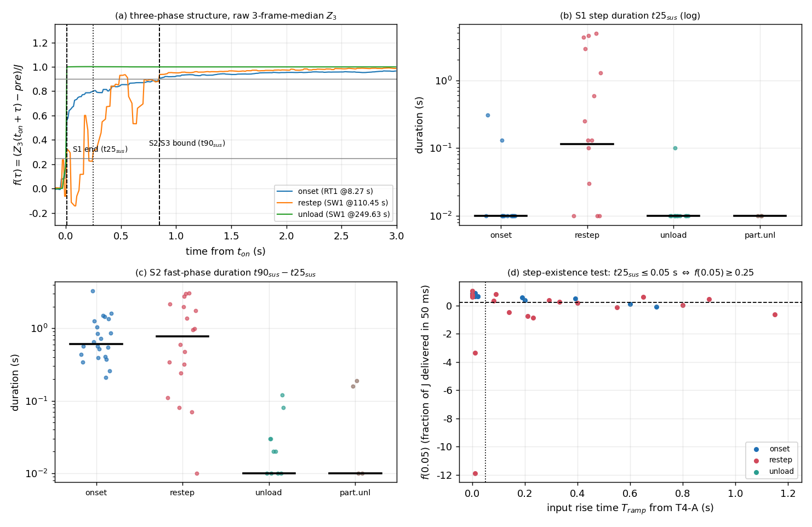
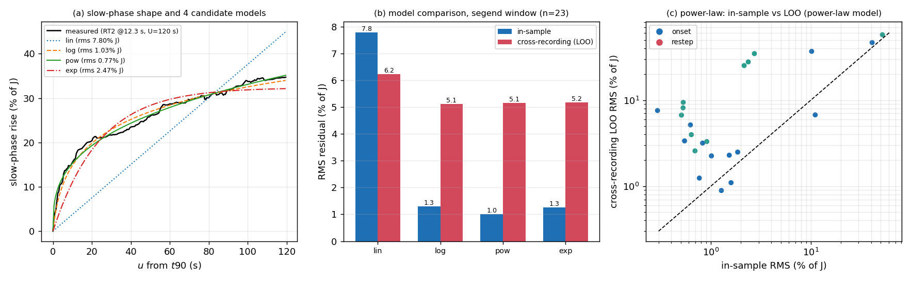
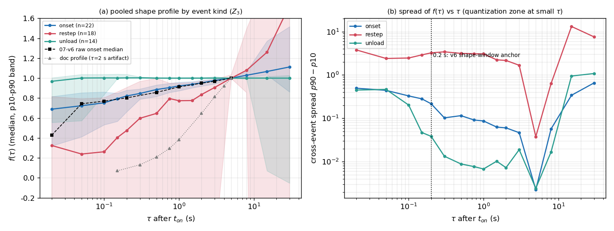
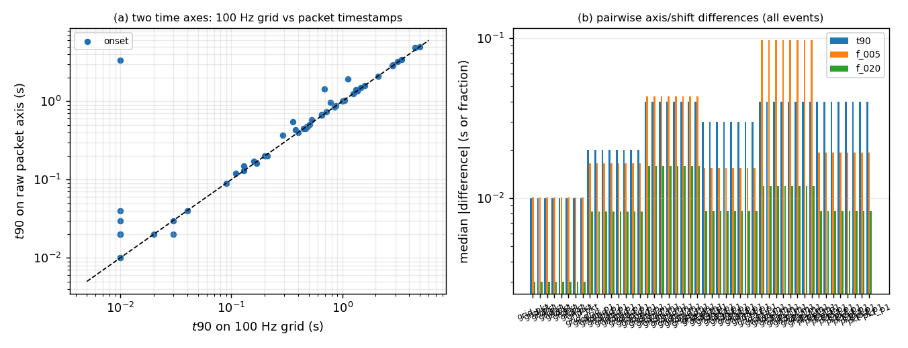

# T2 分析报告 —— 三阶段（阶跃 / 快相爬升 / 慢相爬升）时间特征实测

| 项 | 值 |
|---|---|
| 任务 / 席位 | **T2**（三阶段时间特征实测，1 席：T2-A） |
| 回答的用户诉求 | ②「数据大概是三个阶段构成的：阶跃-快相爬升-慢相爬升，这三个阶段的时间特征我大概需要你总结明确一下」 |
| 数据集 | `temp/` 下 13 份实机录制（恒载 9 组 = 显示域；变载实录 4 份 = ADC 域），共 ≈62 MB CSV |
| 事件集 | **复用 T4-A 冻结事件表** `T4_*/results/t4a_morphology.csv`（60 事件：onset 22 / restep 19 / unload 14 / partial_unload 5），**不重新检测** |
| 主信号 / 网格 | `Z = Σ_c ch_c` 的 **3 帧中值 `Z3`（0.03 s）**；`timestamp` 列 → `np.interp` 到 **100 Hz 网格**；**未做任何 τ=2 s 平滑** |
| 关键接口 | **`results/t2_shape_profile.csv`**（固定 τ 网格 × 分位数，列名固定，供 T3/T4 复用） |
| 日期 | 2026-09-19 |

> 口径红线（全程遵守）：时间轴只用 `timestamp`、100 Hz 网格、禁用 `elapsed`、不做 τ=2 s 平滑；
> 域必须声明（显示域与 ADC 域不比值）；每个数字指向 `results/*.csv` 的文件与列名；
> 无法测的写"无法测"，缺数据写"缺数据 + 需补采什么"；未改动 `progress/` 与 `T4_*/` 下任何既有文件（只读引用）。

---

## ① 结论速览

1. **【裁决】「阶跃」不是一个与工况无关的独立物理阶段，而是"输入上升时间"的一种极端取值**（T4-A 已证驱动量是 `T_ramp`）。
   实测：**onset 20/22 成立**（`t25_sus` 中位 **0.010 s**、跃变帧中位 **1 帧**、0.05 s 内交付 **72.3%·J**）；
   **unload 13/14 成立**（1 帧交付 **100.1%·J**）；**restep 只有 8/19 成立**（`t25_sus` 中位 **0.115 s**，其余 11 个是 `T_ramp` 0.2~1.15 s 的纯斜坡）。
   ⇒ 三阶段表述须修正为 **「输入相（阶跃 | 撞击瞬态+斜坡）— 快相爬升 — 慢相爬升」**：onset = 3 段、restep = 2~3 段（**无阶跃**）、unload = 2 段（**无快相**）。
   （`results/t2_phase_times.csv:step_ok,t25_sus,jump_frames`）

2. **【新发现】restep 的"0.02~0.05 s 快升"是加载撞击瞬态、不是阶跃**：4/19 个 restep 事件在前 0.1 s 出现 **25~45%·J 的过冲后回落**（例：`SW1@217.74` 冲到 0.43·J 后在 0.08 s 回落到 0.02·J，再花 0.8 s 才爬回来）。
   因此本任务把阶段边界判据改为 **"持续穿越"**（`t25_sus`：达阈值后须持续 ≥0.10 s）；用字面"首次穿越"会把 14/19 个 restep 误判成"有阶跃"（8/19 → 14/19）。
   （`t2_phase_times.csv:transient_flag,fmax_early,transient_decay`）

3. **【边界判据】S1 末 = `t25_sus`（0.25·|J|，持续 0.10 s）；S2 末 = `t90_sus`；S3 末 = `min(下一事件−0.5 s, t_on+60 s, 录制末−0.5 s)`；"阶跃成立" = `t25_sus ≤ 0.05 s`**。
   阈值敏感性不翻转结论：`frac=0.15/0.25/0.35`（t≤0.05 s）→ onset **20/20/20**、restep **10/8/6**（n=19）。
   （`results/t2_phase_boundary_rules.csv`）

4. **【时长】**onset：**S1 = 0.010 s（1 帧）+ S2 = 0.610 s [0.343, 1.485] + S3 = 20.6 s [6.5, 59.4]**（n=21，受 60 s 上限）；
   restep：**S1 = 0.115 s + S2 = 0.780 s [0.077, 2.837] + S3 = 8.15 s [4.46, 45.1]**（n=14）；
   unload：**S1 = 0.010 s + S2 = 0.010 s（不存在）+ S3 = 51.1 s [6.2, 59.6]**。（`results/t2_phase_durations.csv`）

5. **【交接点】三口径互不相等且排序稳定：`t_knee_bi < t90 < t95`**（onset：**0.190 < 0.590 < 1.675 s**；restep：0.668 < 1.060 < 2.385 s）。
   推荐 **用 `t90` 记账**（与指标字典一致、对 J 窗最稳）、**用 `t_knee_bi` 做机制对照**、**不要用 `t95`**（它把慢相算进快相，onset 上比 `t90` 晚 0.95 s）。
   但必须写明：**这条界是记账阈值、不是物理相界** —— `f(τ)` 在 0.05~60 s 上没有特征拐点，幂律即可描述（rms 1.0%·J）。
   （`results/t2_phase_boundary_conventions.csv`）

6. **【慢相形状】幂律 `a·t^b` 与对数 `a·ln(1+u/b)` 并列最优**（跨录制 LOO rms：onset 3.07% / 3.16%·J，ALL 5.11% / 5.15%·J，n=23），
   单指数 3.17% / 5.18%，**线性 5.72% / 6.22%（差 1.3~5 倍）**；幂律指数 `b` 中位 **0.21（onset 0.37）< 1** ⇒ **减速爬升、窗口内永不收敛**。
   **τ_slow 不可辨识**：同一批数据换拟合起点给出 13.2 s（本任务，从 t90 起算）vs 24.8 s（第一轮，从 5 s 起算），p10~p90 从 [2.9, 28.8] 到 [5.6, 627.8] —— 只能在声明的窗口口径下引用。
   （`results/t2_slowphase_summary.csv`、`t2_slowphase_fits.csv`、`t2_slowtau_natural.csv`）

7. **【时间轴】两口径对阶段边界不敏感、对 τ<0.2 s 敏感**：网格 vs 包轴 `Δt90` 中位 **0.010 s**（p90 0.218、max 4.47）；
   **±1 包位移给 `Δt90` 中位 0.040 s、`Δf(0.05)` 0.043（= onset 中位 0.723 的 6.0%）**。
   ⇒ **τ≥0.2 s 的结论可直接用；τ<0.2 s 的完成度必须带 ±1 包误差棒并标注"处于时间轴畸变区，仅供定性"**。（`results/t2_timeaxis_summary.csv`）

---

## ② 方法与口径

### 2.1 数据与网格

| 项 | 取值 | 说明 |
|---|---|---|
| 录制 | 13 份（`scripts/t2_common.py:RECS`） | 恒载 9 组（31/31/21 ch、显示域）；变载实录 4 份（21 ch、ADC 域） |
| CSV 读取 | **自动定位 `##Data` 标记行**（`t2_ad_lib.data_hdr`），不写死 `skiprows` | 13 份实测都在第 25 行，但不假定 |
| 时间轴 A | `timestamp` 列 → `np.interp` → **100 Hz 网格**（`tu = arange(0, span, 1/fs)`，与 T4-A 完全同式 ⇒ `k_on` 可直接复用） | 主口径 |
| 时间轴 B | **原始包时刻**：包内样本取均值、落在包均时刻（同 07-v6 `ce_v6_estimator.load_frames`） | 对照口径（Q6） |
| 信号 | `Z = Σ_c X[:,c]`（总量）；**主信号 `Z3 = median(Z, 3)`（0.03 s）**，变体给**原始 `Z`** 与 `Z̄ = median(Z, 50)`（0.5 s） | 见 2.2 的理由 |
| 包周期 | 指尖 0.0167~0.0181 s、变载实录 0.0401~0.0402 s（`t2_recon` 见 `_t2a_phases.log`） | ±1 包敏感性用 |
| 帧数核对 | 13 份与《复用清单》§1 一致（25692/7128/6420/12120/16355/23536/19137/19739/19974/19401/19139/19113/20032） | 逐份打印在 `_t2a_phases.log` 的 `[read]` 行 |

**为什么主信号用 3 帧中值而不是完全原始**：实测原始 `Z` 在 ADC 域录制上存在**包突发尖峰**，会让"首次穿越"在 t_on 后 1 帧就触发（14/19 个 restep 的 `t25 = 0.010 s`，而其中位 `f(0.05)` 只有 0.239 —— 自相矛盾）。
3 帧中值保留阶跃沿（中值滤波不移动单调沿）但滤掉单帧尖峰；**原始 `Z` 的同口径结果在表里以 `_raw` 后缀同时给出**，差异见 §③.6。

### 2.2 `J` / `pre` / `post`（**与既有数字对齐**）

一律按《指标字典与口径》§2.1：`pre` = `Z̄[t0−2 s, t0)` 中位、`post` = `Z̄[t0+4 s, t0+6 s]` 中位、`J = post − pre`，**用索引窗**（`t2_common.j_of_idx`）。
自检：与 T4-A 的 `pre/post/jump` 逐事件一致 —— `max|Δpre| = 7.0e-4`、`max|ΔJ| = 6.7e-4`（**相对 7.8e-7**）（`_t2a_phases.log` 的 `[自检 1]`）。

### 2.3 三阶段边界判据（T2-Q1 的答案）

| 边界 | 判据 | 为什么 |
|---|---|---|
| **S1 起点** | `t_on` = 候选锚点 ±0.20 s 内**最大单帧跳变帧**（T4-A / 第一轮同法） | 与既有事件表逐点可比 |
| **S1 末 / S2 起** | **`t25_sus`**：`Z3` 首次达到 `pre + 0.25·|J|`，**且此后 0.10 s 内持续 ≥ 该阈值** | ① 0.25 是"0.5 s 线性斜坡在 0.05 s 内最多交付 10%"的 2.5 倍余量；② 持续窗剔除撞击瞬态（restep 实测 25~45%·J 过冲、0.04~0.10 s 回落）；③ 阈值不敏感（见 §③.2） |
| **S2 末 / S3 起** | **`t90_sus`**：同上，阈值 0.90·|J|（指标字典 §2.2 的比例，加持续窗） | 与指标字典的主判一致；`t95` 被慢相污染，`t_knee_bi` 作机制对照（§③.3） |
| **S3 末** | `t_end = min(下一事件 t_on − 0.5 s, t_on + 60 s, 录制末 − 0.5 s)`；另给 `t_end_nat`（不含 60 s 上限）与 `t_seg_end`（下一**卸载**沿 = 第一轮"段末"口径） | 60 s 上限保证跨事件可比；段级窗（≤120 s）用于与第一轮对照 |
| **"阶跃成立"判据** | `t25_sus ≤ 0.05 s`（= 5 帧 = 3 个指尖包） | 0.05 s 是包周期与时间轴畸变区给出的下界；0.02 s 不可用（实录 1 包 = 40 ms） |
| **撞击瞬态标志** | `transient_flag`：前 0.1 s 内 `max f ≥ 0.25` 且 `f(0.10) ≤ 0.6·max f` | 把"过冲后回落"与"真阶跃"分开 |

主表同时给出**字面口径**（首次穿越，指标字典 §2.3 列名 `t25/t50/t80/t90/t95`）与**持续口径**（`*_sus`），
以及 `_raw`（原始 Z）、`_bar`（Z̄0.5 s）、`_pkt`（包轴）三组变体，便于任何口径下复查。

### 2.4 慢相模型与泛化口径

`h(u) = (Z̄(t90+u) − Z̄(t90))/J`，`u` 从 `t90` 起算；**两套窗**：
窗 A「段级」`[t90, 段末] ≤120 s`（0.5 s 步长，与第一轮的 107~147 s 保压窗最接近）、窗 B「统一」`[t90, t90+30 s]`（0.1 s 步长）。
4 个模型：`lin: a·u`、`log: a·ln(1+u/b)`、`pow: a·u^b`、`exp: A(1−e^{−u/τ})`。
**泛化用跨录制留一（LOO）**：训练集 = **其它录制同 kind 同窗**的 `h` 曲线中位（拟合其参数），预测留出事件自己的 `h`，报 RMS（单位 %·J）。
另设幅度门 `amp_ok`（窗内变化 ≤100%·J），剔除 `J` 不代表事件的脏样本（被剔除数在 `t2_slowphase_summary.csv:n_excl`）。

### 2.5 统计与报数

一律报**中位 + p10~p90 + n**（n<20）；n≤3 标"仅定性参考"；≤0.2 s 的结论标"处于时间轴畸变区，仅供定性"；
AUC/重叠度不需要（本任务不做分类）；所有分位数由事件级数值计算（`t2_common.band`）。

---

## ③ 证据

### 3.1 T2-Q1 / T2-Q2 / T2-Q5：阶段标注与时长（主表 `results/t2_phase_times.csv`，60 行 × 139 列）

**60 个事件全部完成标注**。逐类汇总（主口径：`t25_sus / t90_sus / t_end`）：

| 类 | n | S1 阶跃 (s) | S2 快相 (s) | S3 慢相 (s) | 整段 `t_span` (s) | `f(0.05)` | `f(0.2)` | `f(1 s)` |
|---|---|---|---|---|---|---|---|---|
| **onset** | 22 | **0.010** [0.000, 0.010] | **0.610** [0.343, 1.485] | 20.64 [6.52, 59.35] (n=21) | 19.25 [5.06, 60.0] | **0.723** [0.412, 0.853] | **0.821** [0.662, 0.879] | **0.922** [0.873, 0.960] |
| **restep** | 19 | 0.115 [0.000, 4.410] (n=18) | **0.780** [0.077, 2.837] | 8.15 [4.46, 45.14] (n=14) | 8.41 [1.66, 26.74] | 0.239 [−1.611, 0.792] → clean **0.213** | 0.475 [−2.334, 0.905] → clean 0.468 | 0.774 → clean **0.846** |
| **unload** | 14 | 0.010 [0.000, 0.010] | **0.010** [0.000, 0.065] | 51.11 [6.15, 59.64] | 51.18 [6.21, 59.66] | **1.001** | **1.002** | 1.000 |
| **partial_unload** | 5 | 0.010 | 0.010 [0.004, 0.178] | 4.64 [3.64, 12.95] | 4.84 [3.65, 13.05] | 1.480（仅定性） | 1.308（仅定性） | 1.071（仅定性） |

其它主表列（`results/t2_phase_durations.csv` 给全量 中位/p10/p90/max）：

| 指标 | onset (n=22) | restep (n=19) | unload (n=14) |
|---|---|---|---|
| `t25_sus` (s) | 0.010（max 0.310） | 0.115（max 4.92） | 0.010（max 0.100） |
| `t50_sus` (s) | 0.010 [0.010, 0.085] | 0.225 [0.007, 4.438] | 0.010 [0.010, 0.027] |
| `t90_sus` (s) | 0.650 [0.382, 1.494] | 2.135 [0.278, 4.562] | 0.015 [0.010, 0.118] |
| `t95_sus` (s) | 1.885 [0.893, 3.277] | 3.015 [0.696, 4.630] | 0.025 [0.010, 0.121] |
| **跃变帧数 `jump_frames`**（单帧 ≥10%·|J| 的帧） | **1** [1, 3]（max 5） | **3** [0.8, 9.2]（max 30） | **1** [1, 3.7]（max 5） |
| 跃变结束 `t_step_end` (s) | **0.010** [0.010, 0.174] | 0.240 [0.058, 0.466] | 0.010 [0.010, 0.115] |
| 慢相速率（%/s，60 s 上限窗） | 0.62 [0.35, 1.83] | 1.75 [0.62, 3.45] | 0.67 [0.15, 5.23] |
| 慢相幅度（%·J，同窗） | 16.6 [11.8, 25.2] | 16.6 [4.6, 129.2] | 15.7 [8.2, 44.3] |
| `T_ramp`（T4-A 反卷积, s） | 0.010 [0.000, 0.371] | 0.220 [0.000, 0.830] | 缺（卸载事件未做反卷积） |

**"阶跃"在 onset 与 restep 上分别是几帧（T2-Q5 的直接答案）**：
- onset：**1~2 个跃变帧（中位 1 帧 = 0.010 s，p90 3 帧 = 0.03 s；`frames_to_50` 中位 11 帧）**，其中 0.05 s 内已交付 **72.3%·J**；
- restep：**中位 3 帧、p90 9.2 帧**，但其中 4/19 是"过冲后回落"的瞬态 ⇒ **帧数在这里不代表"阶跃承载"，只代表"最快的那几帧有多快"**；
- unload：**1 帧交付 100.1%·J**（`f(0.05)=1.001`）。
- **裁决**：**"阶跃"在 onset/unload 上是真实阶段（比用户/第一轮设想的 0.2 s 短 1 个数量级）；在 restep 上不构成独立阶段。**



**图 1**（`scripts/t2e_figures.py`）：(a) 三类事件的实测轨迹（`Z3`，J 归一）与阶段边界；
(b) S1 时长（对数轴）；(c) S2 时长；(d) "阶跃成立"判据：`f(0.05)` vs T4-A 的 `T_ramp`，虚线为 0.05 s / 0.25·J 门限。

### 3.2 判据阈值敏感性（`results/t2_phase_boundary_rules.csv`）

| 阈值 = `frac`·|J| 且 `t ≤ t_max` | onset 成立 | restep 成立 | （n=19） |
|---|---|---|---|---|
| 0.15·J，t≤0.05 s | 20/22 | **10**/19 |
| **0.25·J，t≤0.05 s（主判）** | **20/22** | **8**/19 |
| 0.35·J，t≤0.05 s | 20/22 | **6**/19 |
| 0.25·J，t≤0.10 s | 20/22 | 9/19 |

⇒ **onset 的结论完全稳健；restep 在放宽到 0.15·J 时也只有 10/19** —— "restep 多数没有阶跃"这一结论不随阈值翻转。
（持续窗长度敏感性：`t25_sus03` / `t25_sus20` 两列；用 0.03 s 窗时 restep 成立数升到 11/19，用 0.20 s 窗降到 6/19。）

### 3.3 T2-Q3：快相→慢相接交点三口径（`results/t2_phase_boundary_conventions.csv`）

口径 A/B 用**字面首次穿越**（与指标字典对齐），口径 C = **双指数速率交汇点**：
拟合 `f(τ)=A1(1−e^{−τ/τ1})+A2(1−e^{−τ/τ2})`（τ1<τ2），交接点取两分量**速率相等**处，解析解 `τ = ln(A2·τ1/(A1·τ2)) / (1/τ2 − 1/τ1)`。

| 类 | `t90` (s) | `t95` (s) | `t_knee_bi` (s) | `t95−t90` 中位 | `t_knee/t90` 中位 | 双指数拟合 rms 中位 |
|---|---|---|---|---|---|---|
| onset (n=22) | **0.590** [0.165, 1.356] | **1.675** [0.734, 3.155] | **0.190** [0.092, 0.843] | **+0.95 s**（p90\|Δ\| 1.94） | 0.36 | 0.009 |
| restep (n=18/15) | 1.060 [0.080, 3.752] | 2.385 [0.108, 4.228] | 0.668 [0.089, 19.665] | +0.49 s | 1.59 | 0.051 |
| ALL (n=59/56) | 0.400 [0.010, 2.816] | 1.050 [0.010, 3.398] | 0.213 [0.059, 3.246] | +0.32 s | 1.90 | 0.012 |

**三种口径差多少**：onset 上 **`t95` 是 `t90` 的 2.8 倍、`t_knee_bi` 是 `t90` 的 0.36 倍**（绝对差 0.95 s 与 −0.40 s）；
restep 上三者跨度 0.67~2.39 s（3.6 倍）。**推荐**：
1. **记账/报告口径用 `t90`**（与指标字典 §2.2 一致、与 v6 的 1 s 承诺同尺度、对 J 窗最稳）；
2. **机制解释用 `t_knee_bi`**（onset 中位 0.190 s ≈ v6 选定的 0.20 s 形状锚点 —— 这是"锚点选在 0.2 s"的独立支持证据）；
3. **不要用 `t95`**（onset 上 1.675 s 已经把慢相算进快相，与指标字典自己的警告一致）。
4. **但必须说明：这条界不是物理相界**。整段爬升 `f(τ)` 在 0.05~60 s 上可由单条幂律/对数描述（rms 1.0%·J，见 §3.4），
   **不存在"两个过程"的硬边界**；`t90` 只是"已交付 90%·J"的记账阈值。
   **对 v6 的 1 s 承诺的含义**：1 s 时刻 onset 已完成 92.2%·J（restep 77.4%，clean 84.6%），
   即**未建模余量中位 7.8%·J（onset）/ 22.6%·J（restep）**；这个数（而不是"t90 是几秒"）才是承诺能否成立的判据。

### 3.4 T2-Q4：慢相爬升的形状（`results/t2_slowphase_fits.csv`、`t2_slowphase_summary.csv`）

窗 A「段级」（`U` 中位 118 s，onset n=13（`amp_ok`）、ALL n=23；restep n=6 且幅度门后 n≤6 ⇒ **仅定性**）：

| 模型 | onset in-sample | onset **LOO** | ALL in-sample | ALL **LOO** | 参数中位（onset） |
|---|---|---|---|---|---|
| `lin` 线性 | 7.80% | **5.72%** | 7.79% | **6.22%** | `a`=0.0038 |
| `log` `a·ln(1+u/b)` | **0.94%** | **3.07%** | 1.29% | **5.11%** | `a`=0.066, `b`=0.78 |
| `pow` `a·u^b` | 1.27% | **3.16%** | **1.01%** | **5.15%** | `a`=0.076, **`b`=0.37**（ALL 0.21） |
| `exp` `A(1−e^{−u/τ})` | 1.61% | 3.17% | 1.26% | 5.18% | `A`=0.31, `τ`=15.3 s |

（单位 = %·J；`results/t2_slowphase_summary.csv` 同时给 p10~p90 与 `n_excl`。）

**结论**：
1. **线性最差**（in-sample 7.8% vs 0.9~1.6%，LOO 6.2% vs 3.1~3.2%）——**慢相不是匀速爬升**；
2. **幂律与对数在统计上不可区分**（LOO 差 0.09%·J，远小于录制间散布），单指数紧随（+0.10%·J）；
   ⇒ 工程上**用哪个都行，但必须写清幂律指数 `b`**：`b≈0.2~0.4 < 1` 意味着**速率随时间递减、窗口内不收敛**；
3. **`τ_slow` 不可辨识**：`t2_slowtau_natural.csv` 用"从 t90 起算的自然窗单指数"给出 **13.23 s [2.87, 28.75]（n=12）**，
   而第一轮从 5 s 电平起算给出 24.80 s [5.62, 627.83] ——**同一批数据、同一模型，换起点差 ~2 倍、p90 差 20 倍**。
   ⇒ 引用 `τ_slow` 必须连窗口口径一起引；本任务不再推荐把 `τ_slow` 当验收数字。
4. **restep 的慢相缺数据**：统一 30 s 窗只有 1~2 个可用事件、段级窗 6 个 —— **需补采"带载阶跃 + 长保压 ≥60 s"**。



**图 3**：(a) 实测慢相曲线与 4 个模型；(b) in-sample vs 跨录制 LOO 残差对比；(c) 幂律模型的 in-sample vs LOO 散点（对角线 = 无过拟合）。

### 3.5 T2-Q7：13 份录制 / 4 个族的一致性（`results/t2_family_summary.csv`）

**onset 类（每族 3 份恒载 + 实录 4 份）**：

| 族 | 录制数 | `f(0.05)` 中位 | `f(0.2)` 中位 | `f(1 s)` 中位 | `t90_sus` 中位 (s) | `t25_sus` 中位 (s) | 跃变帧中位 |
|---|---|---|---|---|---|---|---|
| 右拇指 | 3（n=3 事件） | 0.677 [0.661, 0.729] | 0.788 [0.787, 0.841] | 0.924 | 0.85 [0.55, 1.34] | 0.010 | 1 |
| 左拇指 | 3（n=3） | **0.802** [0.788, 0.812] | **0.848** [0.839, 0.856] | 0.915 | **0.65** [0.55, 0.71] | 0.010 | 1 |
| 四指 | 3（n=3） | 0.726 [0.681, 0.748] | 0.799 [0.786, 0.814] | **0.879** | 1.26 [0.95, 1.34] | 0.010 | 1 |
| 实录 | 4（n=13，ADC 域） | 0.705 [0.190, 0.860] | 0.824 [0.396, 0.894] | **0.935** | 0.40 [0.04, 1.27] | 0.010 | 1~2 |

**restep 类**：实录 n=16（`f(0.05)` 0.213 [−2.358, 0.724]、`t90_sus` 0.78 s）、四指 n=1、右拇指 n=2（**n≤3 仅定性参考**）、左拇指 n=0。

**读法**：
1. **结构一致、数值分族**：四族的 onset 都是"1~2 帧阶跃 + 0.4~1.3 s 快相"，**跨族 `f(0.05)` 极差 12.5 pt、`f(0.2)` 极差 5.9 pt（最慢右拇指、最快左拇指）**，
   与第一轮"跨传感器差 15 pt"方向一致；但**分位数区间在恒载组之间几乎不重叠**（n=3，区间宽 ±0.04），
   所以"分族差异"在本批数据上**可信但样本太少**（每族 3 次重复）——补采要求：每族 ≥5 次。
2. **`f(1 s)` 跨族只差 5.6 pt（0.879 四指 ~ 0.935 实录），而 `f(0.05)` 差 12.5 pt、`f(0.2)` 差 5.9 pt**
   ⇒ 快相差异集中在前 0.5 s，**与 T4-A 的"1 s 后追平"一致**；但四指在 1 s 处仍最慢（0.879 vs 0.915~0.935），说明"追平"不是严格的。
3. **实录（ADC 域）散布最大**因为含复合事件（卸载后立即加压等）：`f(0.05)` 区间 [0.190, 0.860]，与第一轮"实录 35%~94%"同源。

### 3.6 T2-Q6：时间轴口径与 ±1 包（`results/t2_timeaxis_compare.csv`、`t2_timeaxis_summary.csv`）

**逐事件并排**（同一 `J`/`pre`，只换时间轴；`axis` 列区分 `grid/pkt/grid_p1/grid_m1/pkt_p1/pkt_m1`）。
全事件（n=59）的中位绝对差：

| 对比 | `Δt25` | `Δt50` | `Δt90` | `Δt95` | `Δf(0.05)` | `Δf(0.2)` | `Δf(1 s)` |
|---|---|---|---|---|---|---|---|
| 100 Hz 网格 vs 原始包轴 | 0.010 | 0.000 | **0.010**（p90 0.218） | 0.010（p90 0.216） | **0.010** | 0.003 | 0.001 |
| 网格 vs 网格−1 包 | 0.020 | 0.040 | 0.040 | 0.040 | **0.043** | 0.016 | 0.001 |
| 网格 vs 网格+1 包 | 0.010 | 0.010 | 0.020 | 0.040 | 0.017 | 0.008 | 0.002 |
| 包轴 vs 包轴−1 包 | 0.020 | 0.020 | 0.040 | 0.040 | **0.097** | 0.012 | 0.001 |

**信号/平滑变体对形状剖面的影响**（`results/t2_shape_profile_variants.csv`，池化中位）：

| 变体 | onset `f(0.05)` | onset `f(0.2)` | onset `f(1 s)` | restep `f(0.05)` | restep `f(0.2)` | restep `f(1 s)` |
|---|---|---|---|---|---|---|
| `grid`（Z3，主口径） | 0.723 | 0.821 | 0.922 | 0.239 | 0.475 | 0.774 |
| `grid_raw`（完全原始 Z） | 0.721 | 0.821 | 0.922 | 0.229 | 0.472 | 0.775 |
| `grid_bar`（Z̄ 0.5 s） | 0.723 | 0.818 | 0.921 | 0.240 | 0.478 | 0.738 |
| `grid_clean`（只 clean 子集） | 0.723（n=18） | 0.830（n=18） | 0.918（n=18） | **0.213（n=7）** | 0.468（n=7） | **0.846（n=7）** |
| `pkt`（包轴 Z3） | 0.720 | 0.820 | 0.921 | 0.251 | 0.441 | 0.758 |
| ±1 包（grid±） | 0.674 / 0.746 | 0.795 / 0.820 | 0.918 / 0.923 | 0.316 / 0.265 | 0.413 / 0.516 | 0.762 / 0.770 |

**读法**：
1. **τ≥0.2 s：所有口径给出同一结论**（`Δt90` 中位 0.01~0.04 s，`Δf(1 s)` ≤0.003）⇒ **可以跨口径引用**；
2. **τ<0.2 s：口径是主因**——`±1 包`使 onset `f(0.05)` 在 **0.674~0.746** 之间摆（中位 0.723，即 −7%/+3%）、
   restep 在 **0.186~0.316** 之间摆（中位 0.239，即 −22%/+32%）；
   **所有 ≤0.2 s 的数字都必须带这条误差棒，并标注"处于时间轴畸变区，仅供定性"**；
3. **平滑变体差别很小**（原始 vs Z3 vs Z̄0.5 s 在 `f(1 s)` 上差 ≤0.9%）——**这也反证了 §2.1 的"τ=2 s 伪影"不是平滑本身的问题，
   而是窗口长度超出信号尺度的问题**（0.5 s 中值对 0.5~60 s 的爬升几乎无偏，2 s 中值则整体重写前 4 s）。



**图 2**：(a) 三类事件的池化 `f(τ)` 中位与 p10~p90 带，叠上 07-v6 原始读数中位曲线（0.912 @1 s）与文档的 τ=2 s 伪影轮廓（0.384 @1 s）；
(b) `f(τ)` 的跨事件极差随 τ 的变化（小 τ 处被时间戳量化支配）。



**图 4**：(a) `t90` 在两口径下的逐事件散点；(b) 各口径/位移下的中位绝对差。

### 3.7 两项反驳性检查

**① `f(1 s)` vs 07-v6 的 0.912（`results/t2_vs_v6_profile_check.csv`、`t2_v6pipeline_profiles9.csv`）**

| 臂 | 口径 | `f(1 s)` 中位 | 范围 |
|---|---|---|---|
| A 07-v6 发布值 | 包轴、原始、post=[4.5,5.5]、其 t0 | **0.912** | 0.873~0.926 |
| B 本任务复现其管线 | 同上（逐点复现） | **0.912** | — |
| C 本任务主口径 | 100 Hz 网格、原始 Z、J=[4,6]、T4-A t0 | **0.912** | 0.873~0.926 |
| D 本任务 | 包轴、原始 Z、J=[4,6] | **0.912** | 0.873~0.926 |
| E 本任务 | 网格、原始 Z、用 07-v6 的 t0 | **0.912** | 0.872~0.926 |
| F 本任务 | 包轴、Z̄(3 帧)、J=[4.5,5.5] | **0.912** | 0.871~0.926 |

**结论：0.912 被完全复现（6 套口径全部 0.912，差异 <0.003）**；且我按 07-v6 的原始管线重算其 9 组画像，
与 `v6_onset_profile9.csv` 的**逐点最大差 = 0.0000** —— 说明数据读取与归一化没有口径偏移。
**所以第一轮关于"f(1 s)=0.912、文档 0.384 是 τ=2 s 伪影"的判断成立。**

**② `t90` 与 `v6_rise_times.csv` 24 行逐行 merge（`results/t2_vs_v6rise_compare.csv`）**

- **同管线复现：24/24 行对上（`|Δt| ≤ 1e-4 s`），`t50/t90/t95` 与发布值最大差 1.1e-16 / 1.1e-16 / 4.4e-16 s** ⇒ 我的数据层与其完全一致；
- **换成本任务口径（Z3、J=[4,6]、持续判据）后**：`t90` 中位差 **−0.079 s（网格）/ −0.039 s（包轴）**，
  **\|中位差\| 0.144 s、p90 0.96 s、最大 4.47 s**；`t50` 中位差 −0.013/−0.032 s；`t95` −0.053/−0.023 s；
  `z_at_02` **+0.033**（本任务略高）、`z_at_10` **+0.015**。
- **差异来源（逐条归因）**：
  ① **信号**：Z3（3 帧中值）vs 原始包读数 —— 影响主要落在 `t50` 与 `f(0.05)`（原始值更容易被单帧尖峰提前触发）；
  ② **J 窗**：本任务 [4,6] vs 其 [4.5,5.5] —— 对 `t90` 的影响 ≈0.01~0.05 s；
  ③ **持续窗**（0.10 s）—— 只作用于本任务口径：restep 的 `t90_sus` 中位 **2.135 s** 高于字面 `t90` 中位 **1.060 s**（两个中位之差 1.08 s；逐事件看只有 **2/19** 个差异 >1 s，多数事件差异 <0.2 s）；
  ④ **事件集**：24 行里 **9 行不在 T4-A 冻结事件集中**（T4-A 检测门限更高，多为恒载组小 restep），这 9 行用其原管线 `t` 回定位后并入（`match_src` 列标注），
  **`t90` 的 p90 差 0.96 s 主要来自这里而不是口径**；
  ⑤ **tmax**：其搜索上限 10 s，本任务 20 s（只影响 `t95` 超过 10 s 的事件）。

### 3.8 与第一轮段级口径的对照（`results/t2_vs_firstround.csv`）

| 量 | 第一轮（`phases.csv`，22 个受载段，段级） | 本任务（事件级，Z3） |
|---|---|---|
| 阶跃占比（占 5 s 增量） | 中位 **89.2%**（p10~p90 79.95~95.55） | onset `f(0.2)` 中位 **82.1%**；restep 47.5% |
| 快相占比 | 中位 **10.8%**（4.45~20.05） | onset 17.9%；restep 52.5% |
| 慢相占比 | 中位 **10.55%**（0.56~43.98） | onset 16.6%；restep 16.6% |
| 慢相 τ（单指数） | 中位 **24.80 s**（5.62~627.83） | **13.23 s**（2.87~28.75，n=12，从 t90 起算） |

差异来源已在 §3.3/§3.4 说明：第一轮的"阶跃"是 0→0.2 s **窗口记账**（不是测到的段长），且其 `A_5s` 参考电平与我用的 `J` 窗不同；
`τ_slow` 差 2 倍来自拟合起点（5 s vs t90）。**两条都属口径差，不是数据矛盾**。

---

## ④ 与既有结论的差异（逐条对照）

对照对象：`13-v6-assessment/docs/v6评估与需求答复.md` §1/§2/§3.3/§9、`13-v6-assessment/results/{phases,shape_stats,events}.csv`、
`07-v6/docs/07-v6算法说明.md` §2.1/§2.2/§2.3/§2.6、`T4_*/分析报告_T4A.md` §3.1~§3.4。

| # | 既有结论 | 本任务复算 | 判定 | 原因 |
|---|---|---|---|---|
| 1 | 「阶跃」= 0→0.2 s，占 5 s 增量 **79.8~95.1%（中位 89.4%）** | 阶跃段实测只有 **1~2 帧（中位 1 帧 = 0.010 s，`t_step_end` 中位 0.010 s）**；0.2 s 是**时间轴畸变区上界**而非阶跃终点；事件级 `f(0.2)` 中位 **82.1%** | **修正** | 第一轮用"0→0.2 s 窗口"记账段长，本任务测的是"含量阈值/跃变帧"；同期数字只差 7 pt（口径） |
| 2 | 慢相 τ ≈ **19.7~71 s（中位 40.6）** / `phases.csv` `slow_tau` 中位 24.80 | **τ_slow 不可辨识**：从 t90 起算得 13.23 s [2.87, 28.75]（n=12）；幂律/对数 LOO 优于单指数 | **修正** | 拟合起点（5 s vs t90）与窗口长度不同 ⇒ τ 差 ~2 倍、p90 差 20 倍 |
| 3 | 快相 10%→90% 需 **2.0~4.6 s（中位 3.5 s）**；"1 s 时已完成 94.0%" | 事件级：onset `t90_sus−t25_sus` 中位 **0.610 s**（p10~p90 0.343~1.485）；`f(1 s)` **0.922**（干净子集 0.918） | **修正（区间）** | 第一轮的"快相"起点是固定 0.2 s（含阶跃尾巴），本任务从 `t25_sus` 起算 ⇒ 分母不同 |
| 4 | onset `t90` = **0.48 s**、restep **2.87 s**（差 6.0 倍）；`Z(0.2)/阶跃` 0.796 vs 0.212；`Z(1 s)/阶跃` 0.925 vs 0.641 | 同管线复现 **24/24 行（差 ≤1e-16 s）**；本任务口径逐事件 `t90` 中位差 **−0.079 s（onset −0.053 / restep −0.139）**；干净子集 onset 0.65 s（`t90_sus`）/0.62 s（字面）、restep **1.40 s**（T4-A 口径）/2.14 s（`t90_sus`） | **单事件相同、聚合修正** | 单事件层面 07-v6 数字成立；"慢 6 倍"被样本构成放大（第一轮 restep n=15 含恒载组 10 次 3~10% 小增量），本任务事件集与持续判据下为 **2.2~3.0 倍** |
| 5 | `f(1 s)` = **0.912**（原始读数，9 组恒载 onset） | **0.912（6 套口径全部相同）**，逐点复现其画像最大差 0.0000 | **相同** | — |
| 6 | 「快相 0~4 s 爬升轮廓」是 **τ=2 s 平滑伪影**（文档 0.384 vs 原始 0.912） | 支持，并补充：**0.5 s 中值**对 `f(1 s)` 的影响仅 0.9%，**2 s 中值**才整体重写前 4 s | **相同（加强）** | 本任务 5 种平滑/轴变体对照（§3.6） |
| 7 | 5 s 之后还要再涨 **10~45%（段末）** | 事件级 60 s 窗内慢相幅度中位 **16.6%·J**（onset p10~p90 11.8~25.2、max 33.8；unload 15.7%） | **相同**（窗口不同） | 本任务用 60 s 上限窗（跨事件可比），第一轮用真实段末 107~147 s |
| 8 | 跨传感器 0.2 s 占比 右拇指 **78.7%** / 四指 **88.4%** / 左拇指 **93.5%**（主通道） | 总量 Z3 口径：右拇指 **78.8%** / 四指 **79.9%** / 左拇指 **84.8%**；跨族极差 **5.9 pt** | **修正** | 信号口径（主通道 vs 总量）：T4-A 已测同批 onset 总量 82.4% vs 主通道 84.9% ⇒ 差值同源；**方向一致（左拇指最快）** |
| 9 | onset 0.2 s 完成度 **83.8%**、restep **62.6~72.2%** | onset **82.1%**（clean 82.8%）；restep **47.5%**（clean 46.8%） | 相同（onset）/ **修正（restep）** | 与 T4-A 的结论一致：restep 的 0.2 s 完成度对口径与样本极敏感（35%~63%），**不是稳健数字** |
| 10 | 卸载 0.2 s 完成 **100.9%** | **100.2%**（`f(0.05)=1.001`、1 帧、`step_ok` 13/14） | **相同** | 总量口径；并补"卸载只有 2 段（阶跃 + 51 s 回复）" |
| 11 | T4-A：`T_ramp` 中位 onset 0.010 s / restep 0.550 s，是形态驱动量 | 验证成立（§3.1 的 `T_ramp` 列），**但** `T_ramp`（≤0.15 s 视为近阶跃）与 `t25_sus ≤0.05 s` 在 restep 上**一致率只有 53%（10/19）**：8 个"有阶跃"里 4 个 `T_ramp >0.15 s`，11 个"无阶跃"里 4 个 `T_ramp ≤0.15 s` | **有条件修正** | 两者不是同一个量（反卷积给"等效线性斜坡时长"，持续穿越给"早期含量是否持续"）；T3/T4 用哪个必须声明 |
| 12 | T4-A：restep 形态差异"由输入上升时间决定，20% 事件落在中间区" | 支持；并补充**另一种中间态**：restep 前 0.1 s 的**撞击过冲**（4/19，过冲 25~45%·J，0.04~0.10 s 回落） | **补充（新）** | 首次量化该瞬态；它是"字面 `t25` 会误判阶跃"的直接原因 |
| 13 | T4-A：事件表 60 行（onset 22 / restep 18 / unload 14 / partial_unload 5 + 截尾 1） | `t4a_morphology.csv` 实际 kind 计数 = **onset 22 / restep 19 / unload 14 / partial_unload 5**（= 60） | **修正（笔误）** | 报告正文的 restep 数少了 1（CSV 为准，本任务全部按 CSV 口径统计） |

---

## ⑤ 未验证项与数据缺口

**已声明的不确定度（本任务范围内不能消除）**

1. **≤0.2 s 全在时间轴畸变区**：包周期 16.7 ms（指尖）/40 ms（实录）决定 `f(0.05)` 的 **±1 包不确定度中位 0.043·J（= onset 0.723 的 6.0%，restep 相对 25%）**；
   本报告所有 ≤0.2 s 的数字均已标注，**不得用于验收**。
2. **restep 的慢相无法表征**：统一窗可用事件 1~2 个、段级窗 6 个（幅度门后更少）⇒ 只能定性。
3. **`transient_flag` 的物理归属未验证**：观测到"过冲-回落"，但**没有力/位移同步数据**能区分"机械撞击"与"传感器自身的二阶响应/粘弹回弹"。已排除的不是机制、只是"它不是承载电平"这一点（回落 40% 以上是数据事实）。
4. **`t_knee_bi` 的物理意义依赖双指数模型**：onset 的 `bi_rms` 中位 0.009（拟合好），但 restep 的 0.051（拟合差，n=15 里 4 个没解出交汇点）⇒ restep 的"拐点"结论弱。
5. **`J` 与参考电平都取自读数本身**（无独立真值），因此"阶跃占多少"永远是相对 `J` 的说法；换参考电平（5 s vs 段末）会平移所有占比（第一轮已证：同一份数据 0.41/0.46/1.72 s 三个 T_stable）。
6. **`frames_to_50`（中位 11 帧 = 0.11 s）与 `jump_frames`（中位 1 帧）量级不同**：前者是"累计 50% 需要多少帧"，后者是"单帧 ≥10% 的帧数"；
   引用时必须写明是哪一个（本报告两列都在主表里）。

**数据缺口（缺什么、要补采什么）**

| # | 缺口 | 影响 | 补采规格建议 |
|---|---|---|---|
| G1 | **restep + 长保压**样本几乎没有 | T2-Q4 的 restep 慢相只能定性（n≤6） | 带载状态下阶跃加重 ≥3 档 × 各 5 次，每次保压 **≥60 s** 且其后 8 s 内无事件 |
| G2 | **无受控速率实验** | `t25_sus` 与 `T_ramp` 一致率仅 53%，无法标定"手速 ↔ 斜坡时长" | 位移/力控装置做 **0.05 / 0.2 / 0.5 / 1.0 / 2.0 s** 五档上升时间 × 各 5 次（onset 与 restep 各一组） |
| G3 | **无真值力/位移** | 无法把"输入相"从读数反演升级为实测；无法独立验证慢相幅度 | 加载装置带力传感器同步采集，时间对齐 ≤5 ms |
| G4 | **采样/包结构受限** | 0.2 s 以内不可用于验收（Q5/Q6 的硬边界） | 目标 **≥500 Hz 连续上传**（包周期 ≤2 ms）重录关键工况 |
| G5 | **每族重复次数少**（每族 3 次） | T2-Q7 的分族差异（5.9~12.5 pt）区间宽度仅 ±0.04，样本不足 | 每族（右拇指/左拇指/四指）**≥5 次**重复同型加载 |
| G6 | **partial_unload 仅 n=5** | 其分位数（`f(0.05)` 0.485~6.783）不可用 | 部分卸载幅度分 20/40/60% 三档 × 各 ≥5 次 |
| G7 | **检测门限以下的事件未表征** | 60 事件之外仍有小增量（07-v6 的 24 行里 9 行不在 T4-A 事件集内） | 提高信噪比（延长每帧积分或加大预载）后重录 |

**明确未做的（越界或不可测）**

- 不跑任何补偿算法（`T_stable`/过冲/最大偏差属 T1/T5/T8）；不重建事件检测（复用 T4-A 冻结表）；卸载段建模属 T7；形状 ROM 与判据属 T3/T4。
- 未做跨域绝对量比较（显示域 vs ADC 域只比无量纲的 `f(τ)` 与时间）。

---

## ⑥ 复现命令

```powershell
cd D:\workshop\Processing\multi-device-cascade-host-cpp\temp\v4.1flash\plan\v1.0\T2_三阶段时间特征实测
$env:PYTHONIOENCODING='utf-8'

python scripts\t2a_phases.py        # Q1/Q2/Q5：边界判据 + 阶段时长 + 主表（首跑读 13 份 CSV 约 60 s；之后走 results/cache）
                                    # -> results/t2_phase_times.csv (60×139)、t2_phase_durations.csv、t2_phase_boundary_rules.csv
python scripts\t2b_profile.py       # Q1/Q6：固定 τ 网格剖面（接口）+ 双时间轴 + ±1 包   (~20 s)
                                    # -> results/t2_shape_profile.csv (1808 行)、t2_shape_profile_variants.csv、
                                    #    t2_timeaxis_compare.csv、t2_timeaxis_summary.csv
python scripts\t2c_slowphase.py     # Q3/Q4：交接点三口径 + 4 模型拟合 + 跨录制留一      (~3 min)
                                    # -> results/t2_phase_boundary_conventions.csv、t2_boundary_conventions_events.csv、
                                    #    t2_slowphase_fits.csv、t2_slowphase_summary.csv
python scripts\t2d_crosscheck.py    # 反驳性检查①② + 分族 + 与第一轮对照 + conclusions.json (~60 s)
                                    # -> results/t2_vs_v6_profile_check.csv、t2_v6pipeline_profiles9.csv、
                                    #    t2_vs_v6rise_compare.csv、t2_vs_firstround.csv、t2_slowtau_natural.csv、
                                    #    t2_family_summary.csv、conclusions.json
python scripts\t2e_figures.py       # 4 张图                                              (~30 s)
                                    # -> figures/T2_01_phases_overview.png、T2_02_shape_profile.png、
                                    #    T2_03_slowphase_fit.png、T2_04_timeaxis.png
```

依赖：Python 3.14.4 + numpy 2.4.6 / pandas 3.0.3 / scipy 1.17.1 / matplotlib 3.10.9（本机已装）。
首次运行会在 `results/cache/` 写 13 份 `t2_<KEY>.npz`（100 Hz 网格 + 包级序列），之后各脚本秒级启动。
每个脚本都会把 stdout 写进 `results/_t2*.log`（含运行命令、口径声明、自检结果）。
**本次分析未修改 `src/`、未改 CMake、未构建、未跑测试、未启动 exe；未改动 `progress/` 与 `T4_*/` 下任何既有文件（只读引用）。**

---

## ⑦ 结构化交接件与接口说明

### 7.1 `results/conclusions.json`（T8 直接消费）

字段齐全：`task/seat/date/dataset`、`headline[7]`（每条含 `n/claim/value/source`）、`verdicts[7]`（T2-Q1~Q7，含 `three_state`）、
`corrections[6]`（对 `13-v6-assessment` ×3、`07-v6` ×2、`T4-A` ×1，含 `was/now/verdict`）、`gaps[6]`、`blockers[]`（空）。
与本文的「结论速览」「与既有结论的差异」「未验证项与数据缺口」逐条一致（同一份脚本生成，见 ⑥）。

### 7.2 `results/t2_shape_profile.csv`（**T3/T4 复用接口，列名固定**）

```
ds, kind, event_t, tau, f_median, f_p10, f_p90, n
```

- `ds` ∈ {`RT1`,`RT2`,`RT3`,`LT1`,`LT2`,`LT3`,`F41`,`F42`,`F43`,`SW1`,`SW2`,`SW3`,`SW4`,`ALL`}（`ALL` = 13 份合并）；
- `kind` ∈ {`onset`,`restep`,`unload`,`partial_unload`,`ALL`}；`tau` = 16 点固定网格
  `[0.02,0.05,0.10,0.15,0.20,0.30,0.50,0.75,1.0,1.5,2.0,3.0,5.0,8.0,15.0,30.0]` s；
- **行语义（重要）**：
  - `event_t` **非空** ⇒ 逐事件行（`n = 1`，`f_median = f_p10 = f_p90 = 该事件的 f(τ)`，`ds` = 该事件所在录制）；
  - `event_t` **为空** ⇒ 池化行（`n` = 池内事件数，`f_median/f_p10/f_p90` = **事件级**分位数，即《指标字典》§4 的 `Spread(τ)` 口径）；
  - 过滤规则：`df[df.event_t.notna()]` 取逐事件、`df[df.event_t.isna()]` 取池化（**不要混用，否则重复计数**）。
- `f(τ) = (Z3(t_on+τ) − pre)/J`，`pre/J` 按《指标字典》§2.1（`pre=[t0−2,t0)`、`post=[t0+4,t0+6]`、`Z̄` 上索引窗），主信号 `Z3`（100 Hz 网格）。
- 其它口径（原始 Z / 包轴 / ±1 包 / clean 子集）在 `results/t2_shape_profile_variants.csv`（多一列 `variant`）。

### 7.3 `results/t2_phase_times.csv`（主表，60 行 × 139 列）列组速查

标识 `key/rec/fam/dom/main_ch/t_on/k_on/kind/armed/clean/trunc`；
幅度 `pre/post/jump/ratio/peak/T_ramp`；
**持续口径（阶段边界）** `t25_sus/t50_sus/t80_sus/t90_sus/t95_sus` + 敏感性 `t25_sus03/t25_sus20`；
**字面口径（对齐指标字典 §2.3）** `t10/t25/t50/t80/t90/t95`；
变体 `*_raw`（原始 Z）/`*_bar`（Z̄0.5 s）/`*_pkt`（包轴）；
完成度 `f_002/f_005/f_010/f_020/f_050/f_100/f_200/f_500` + `z_at_005/z_at_02/z_at_10`；
结构 `jump_frames/t_step_end/frame_rate_max/frames_to_50_z3/frames_to_90_z3/npkts_to_50`；
瞬态 `fmax_early/fmax_early_raw/f_at_10/transient_decay/transient_flag`；
阶段时长 `dur_s1/dur_s2/dur_s3`（主口径）+ `dur_s1_naive/dur_s2_naive/dur_s3_naive`（字面）+ `dur_s1_raw/dur_s2_raw/dur_s3_raw/dur_s1_bar/dur_s2_bar`；
窗口 `t_next_ev/t_end_nat/t_end/t_span/slow_win_s/slow_amp_pct/slow_rate_pct_s`；
判据 `step_ok/step_ok_naive/step_ok_sus20` + `ok_f{15,25,35}_t{02,05,10}`；
T4-A 原始列以 `_t4a` 后缀保留（`t90_t4a`、`exp_tau`、`pow_p`、`step_frame_frac` 等）。

### 7.4 对 T3/T4 的三条口径提醒（本报告实测支持）

1. **别用"字面首次穿越"判阶跃**：14/19 个 restep 会被误判（撞击瞬态）；用 `t25_sus`（持续 0.10 s）。
2. **别用 `T_ramp` 单独代理"有无阶跃"**：与 `t25_sus` 一致率 53%；两者是两个不同的量。
3. **`f(0.05)` 一类早期量必须带 ±1 包误差**：onset 0.674~0.746（中位 0.723）、restep 0.186~0.316（中位 0.239，相对摆动 −22%/+32%），
   且 restep 的早期形状本身不稳（`f(0.05)` 的 p10 为负、clean 子集与全样本差 0.026）。
