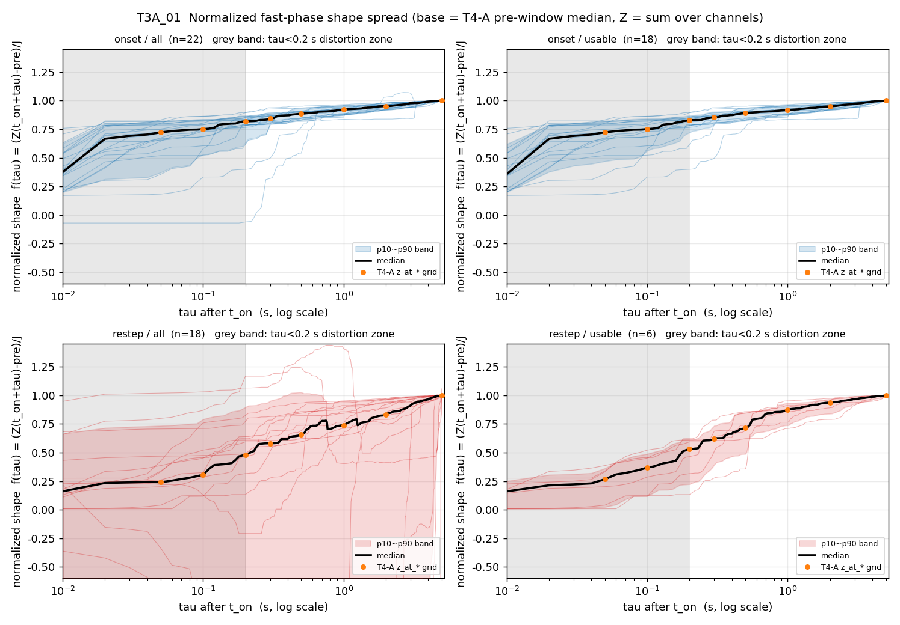
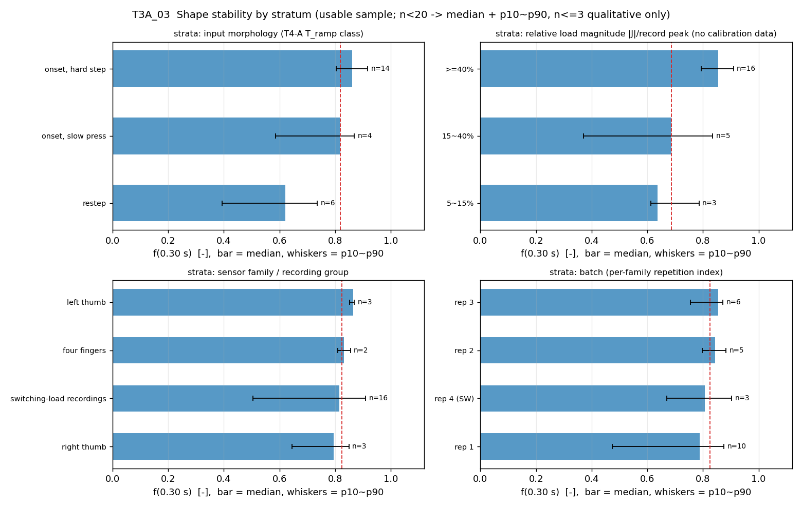
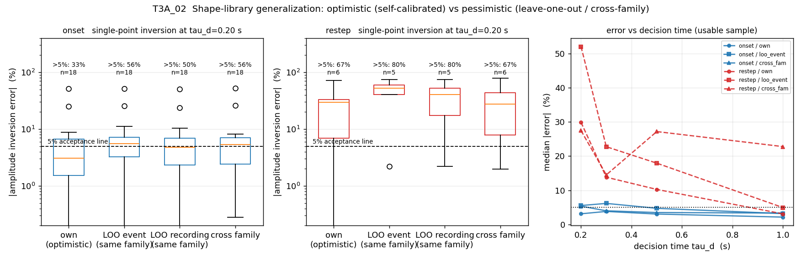
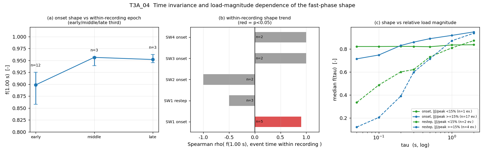

# T3-A 分析报告 —— 快相爬升形状的可重复性统计（H1「形状稳定假设」的量化裁决）

| 项 | 值 |
|---|---|
| 任务 / 席位 | T3 / **T3-A（快相可重复性统计）**；T3-Q6~Q10（路线 ROI 与反事实实验）由 **T3-B** 负责，本报告不涉及 |
| 回答的用户诉求 | ③「快相爬升的形状（进行）是否总是差不多稳定的？评估一下它是否稳定」 |
| 输入（只读） | 13 份实机录制（`temp/`，恒载 9 组 = `processed_display` 显示域；变载实录 4 份 = ADC 域）；**T4-A 冻结事件表** `T4_*/results/t4a_morphology.csv`（60 行 × 54 列）；第一轮 `progress/13-v6-assessment/results/{shape_stats,shape_timewarp,rom_compare,rom_loo}.csv` |
| 主信号 / 网格 | 总量 `Z = Σ_c ch_c`；`timestamp` 列 → `np.interp` 到 **100 Hz**（dt=0.01 s）；**未做任何 τ=2 s 平滑**；0.5 s 中位滤波仅用于指标评估 |
| 形状口径（C-2） | `f(τ) = (Z̄(t_on+τ) − pre)/J`，**基准电平 = T4-A 的 `pre` 窗中位**；**主 τ 网格 = T4-A 冻结的 `z_at_*` 采样点** `[0.05,0.10,0.20,0.30,0.50,1.00,2.00,5.00]`，另给 dτ=0.01 s 加密网格作补充 |
| 样本 | 装载类 **41** 事件（onset 22 / restep 19）→ `J_ok` 39 → **usable 24（onset 18 / restep 6；显示域 8 / ADC 域 16）**，判据冻结在 `results/t3a_inlier_audit.csv` |
| 日期 | 2026-09-19 |
| **H1 裁决** | **反驳**（仅在「onset + 硬阶跃 + τ≥0.3 s」子域内成立 ⇒ 项目纪律要求的三态为「反驳」，子域结论为「有条件支持」） |

> 口径红线（全程遵守）：时间轴只用 `timestamp`（禁用 `elapsed`）、100 Hz 网格、**禁 τ=2 s 平滑**；
> 域必须声明（显示域/ADC 域**不得比绝对值**）；**onset 与 restep 一律分开统计**（需求文档 §5-2）；
> n<20 报中位 + p10~p90，n≤3 标「仅定性参考」；每个数字指向 `results/*.csv` 的文件+列名。
> **本报告未修改 `src/`、未改 CMake、未构建、未跑测试、未启动 exe；未改动 `progress/` 与 `T4_*/` 下任何既有文件。**

---

## ① 结论速览

1. **同类内（onset）快相形状确实稳定，但只稳定在 τ ≥ 0.3 s，且只在 onset 这一类**：usable onset（n=18）的
   `f(0.30 s)` 中位 **0.854**、p10~p90 **0.795~0.903**、`spread`(p90−p10) **0.108**、**CQV 0.034**；
   `f(1.00 s)` 中位 **0.918**、p10~p90 0.871~0.957、CQV **0.031**；
   而 `f(0.05 s)` 的 CQV = **0.104**、spread = **0.348**（早期处于时间轴畸变区，见 §2.4）。
   （`results/t3a_shape_spread.csv`：`kind=onset, sample=usable, tau, med/p10/p90/spread/cqv`）

2. **restep 的形状在同类内也不稳定，而且 19 个 restep 里有 7 个「连归一化都做不到」**：
   restep 全样本（n=18）的主网格**极差 12.9**（f 的物理量纲只有 [−1.5, 1.0]），`f(0.20 s)` 的 p10 = **−2.063**；
   逐事件审计（`results/t3a_inlier_audit.csv` 的 `posdef` 列）显示 **7 个 restep** 的 f(τ) 出现负值或 >1.5，
   另有 2 个 `|J|` 低于指标字典 §2.1 的 2% 峰值门限 ⇒ 最终 **usable 只剩 6 个**。
   即便在这 6 个上，`f(0.05~0.50 s)` 的 spread 仍是 **0.339~0.392**，是 onset 同期的 **2.4~3.4 倍**。

3. **形状参数化后的结论是「不要用拟合时间常数，用固定 τ 上的完成度」**：usable onset 按 CQV 升序，
   `f(1.00 s)` 0.031、`w_fast` 0.033、`f(0.30 s)` 0.034、`f(0.50 s)` 0.034，而 `tau1`（单 τ）0.152
   （**CV 却是 0.449**）、`tau_e` 0.530、`tau_a` 0.168、`tau_b` 0.136。
   **推荐可依赖参数 = ① `f(0.30 s)`（中位 0.854，p10~p90 0.795~0.903）② `f(1.00 s)`（中位 0.918，p10~p90 0.871~0.957）；
   只允许一个参数时用 `f(0.50 s)`（CQV 0.034、中位 0.890）**。（`results/t3a_param_cv.csv`）

4. **泛化的乐观数与悲观数（本任务最重要的一问，T8 直接消费）**：usable 样本、单点反演 @τ_d=0.20 s、
   中位 |误差|：**onset 自身标定 3.10% → 同族留一事件 5.52% → 同族留一录制 4.76% → 跨族 5.33% → 跨形态 56.39%**；
   **restep 依次 29.88% → 52.07% → 40.30% → 27.47% → 36.06%（n=6）**。
   τ_d=1.0 s 时 onset 为 2.13%/3.15%/2.98%/3.31%/5.14%。
   **「留一事件」与「留一录制」几乎相同 ⇒ 瓶颈不是「哪一个传感器」，而是「哪一次加载」。**

5. **既有「0.2 s 估到 ±7%」只在「显示域 + onset + 录制级留一」成立，全样本尾部大一个量级**：
   显示域 onset（n=7）事件级留一中位 |误差| = 0.2 s **3.83%**、0.5 s **5.50%**、1.0 s **3.44%**；
   一旦把 restep 与慢压 onset 算进来（usable 全样本，onset 18 + restep 5 = n=23），0.2 s 中位 |误差| **5.9%**、
   p90 **52.0%**、最大 **75.0%**、**|误差|>5% 占比 61%**。（`results/t3a_generalization.csv`）

6. **稳定性的分层变量是「输入形态」与「相对载荷量级」，不是族/批次（后者样本不足）**：
   usable 样本 `f(0.30 s)` 的 Kruskal-Wallis：输入形态维 **H=12.29、p=0.0021**（硬阶跃 onset n=14 中位 0.862 /
   慢压 onset n=4 中位 0.819 / restep n=6 中位 0.621）；相对幅度维 **H=6.94、p=0.0312**（n=3/5/16，
   小相对幅度事件完成度更低）；族维 **p=0.554**（n=3/2/16/3）、批次维 **p=0.447**（n=10/5/6/3）——
   但族内 usable 只有 2~3 个事件，**这不是「族间无差异」的证据，而是「样本不足」**。

7. **未发现形状的时变（弱结论）**：录制内早/中/晚三段的 onset `f(1.0 s)` 中位 = **0.899 / 0.956 / 0.952**
   （n=12/3/3）；同录制内 onset 的 `Spearman ρ(f(1.0 s), t_on)` 中位 **+0.90**（5 组、跨度 21~175 s，
   仅 SW1 的 n=5 组 p=0.037），**方向为正**（越晚完成度略高），与「温漂/加载历史让形状变慢」的担心相反；
   但也只能说「未发现」，早/晚期各只有 3 个事件。（`results/t3a_time_stability.csv`、`t3a_time_trend.csv`）

---

## ② 方法与口径

### 2.1 数据与网格

| 项 | 取值 | 出处 |
|---|---|---|
| 录制 | 13 份（恒载 9 组显示域 31/31/21 ch；变载实录 4 份 ADC 域 21 ch） | `t3a_common.RECS`；帧数核对 `results/t3a_recon.csv` |
| 帧数核对 | 13/13 与《复用清单》§1 一致，**恒为「清单 − 1」**（差 1 帧是 CSV 表头/尾行计数口径之差，非读错文件） | `t3a_recon.csv` 的 `n_raw/d_manifest/n_match` |
| CSV 读取 | **自动定位 `##Data` 标记行**（`t3a_ad_lib.data_hdr`），不写死 `skiprows` | 13 份实测都在第 25 行，但不假定 |
| 时间轴 | `timestamp` 列（禁用 `elapsed`）；包周期实测：指尖 0.0176~0.0181 s、实录 0.0401~0.0402 s | `t3a_recon.csv` 的 `pkt_dt` |
| 重采样 | `np.interp` → 100 Hz 均匀网格（dt=0.01 s） | 与 00 号文档 §4.2-4 一致 |
| 平滑 | **仅** `Z̄ = median(Z, 0.5 s)`（k=50），且只用于指标评估；逐帧量一律用原始 `Z` | `t3a_common.KSM` |
| 主信号 | `Z = Σ_c X[:,c]`（总量），与 07-v6 §2.2、第一轮 `phases.csv` 同口径 | — |

### 2.2 事件集与形状口径（**引用必须带这两项**）

- **事件集 = T4-A 冻结表**：`results/t4a_morphology.csv`，60 行；`kind` 分布 onset 22 / restep 19 / unload 14 /
  partial_unload 5，`jump` 缺失 1（截尾）。**装载类 = `jump>0`，共 41 个**。
  > ⚠ **版本漂移已发现并标注**：T4-A 报告正文写「装载类 40（onset 22 / restep 18，clean 25）」，
  > 但**冻结 CSV 实为 41（restep 19）** ⇒ 冻结表在报告正文写成之后被更新过。
  > 本任务以**冻结 CSV** 为准（`results/t3a_crosscheck.csv` 的「D T4-A 冻结表」条）。
- **归一化形状 `f(τ) = (Z̄(t_on+τ) − pre)/J`**，`base = pre` 窗中位、`J = post − pre`、`post` 窗 = `[t0+4, t0+6]`
  —— 与 T4-A 的 `z_at_*` **完全同法**。自检：逐点重算 **60 事件 × 8 个 τ 点 = 472 对**，
  `|Δ|` 中位 **2.47e-07**、最大 **1.76e-06**（超 1e-6 的 3 对，来自冻结 CSV 的浮点打印位数）。
  （`results/t3a_recon_crosscheck.csv` 的 `f_mine/f_t4a/d`）
- **主 τ 网格 = T4-A 的 `z_at_*` 采样点**（C-2 处置：T2 的 `t2_shape_profile.csv` 尚未交付，故以 T4-A 冻结网格为主骨架）。
  加密网格 dτ=0.01 s 只用于分位曲线。两套网格在 `results/t3a_shape_grid.csv` 的 `grid` 列中分别标为
  `T4A_z_at_grid` 与 `fine_0p01s`。
- **基准电平声明（C-2）**：本报告所有 `f(τ)` 与反演一律以 **T4-A 的 `pre` 窗中位**为基准电平；
  另在泛化表里并列 **5 s 参考电平**（07-v6 的 ROM 口径）作为敏感性，结论不变（onset 留一 @0.2 s：
  5.52%（post 参考）vs 5.52%（5 s 参考））。

### 2.3 统计口径（含**对 CV 病态性的显式处理**）

| 量 | 定义 | 说明 |
|---|---|---|
| `CV` | `std(ddof=1)/mean` | 指标字典 §4 的原定义；**本任务照报**，但当 `mean ≤ 0.05` 时标 `cv_valid=False` |
| `CQV` | `(p75−p25)/(p75+p25)` | **四分位变异系数**，对离群与非正定事件稳健；本报告**以它为主口径** |
| `spread` | `p90 − p10` | 中位+分位区间口径（指标字典 §6-2，n<20 默认报这个） |
| `norm_spread` | `spread / med` | 相对带宽 |
| `n` | 有效事件数 | 每个结论都标 |

> **为什么必须这样处理**：`f(τ)` 在小 τ 处均值趋 0（onset 的 `f(0.05 s)` 均值 0.72 但个体可从 0.06 到 0.96），
> `std/mean` 会被极小分母放大甚至**变号**：restep 全样本 `f(0.10 s)` 的 CV = **−4.62**、
> CQV = **−9.12**（p75+p25 反号）—— 这种数字不能直接当"稳定/不稳定"的量尺，
> 故本任务并列 CV 与 CQV，并在报告中**以 CQV + spread 为主**。这一改动会让本任务的 CV 与第一轮的
> `spread` 列（`hi−lo` 极差）**不可直接横比**，差异见 §④ 表。
> 另一处口径差异：第一轮 `shape_stats.csv` 的 `spread` 列是 **极差 `hi−lo`**（例：0.2 s = 0.5908），
> 而本任务 `spread` = **p90−p10**（0.149），两者不是同一个量。

### 2.4 样本边界：`all → J_ok → usable`（**先审计、后统计**）

统计前先做事件级可用性审计（`scripts/t3a_02f_audit.py` → `results/t3a_inlier_audit.csv`）：

| 判据 | 定义 | 装载类存活数 |
|---|---|---|
| `J_ok` | `|J| ≥ 2% × 记录峰值`（指标字典 §2.1 的幅度项） | 39 / 41 |
| `posdef` | 主网格上 `0 ≤ f(τ) ≤ 1.5`（可用于比值反演） | 33 / 41（onset 21、restep 12） |
| `clean` | 指标字典 §2.1（t0 前 3 s / 后 8 s 无其它事件） | 25 |
| **`usable`** | **`J_ok & posdef & clean & is_load`** | **24（onset 18 / restep 6）** |

被排除的 8 个非正定事件（**全部是 restep**，7 个 restep + 1 个 onset）：
`RT2@147.11`、`SW1@71.67`、`SW1@230.64`、`SW1@233.05`(onset)、`SW2@14.86`、`SW2@31.22`、`SW3@60.78`、`SW4@26.57`；
其中 `SW2@31.22` 的 `f(0.20 s) = −11.91`、`SW4@26.57 = −3.03`。
**这些事件的存在本身就是结论**（见 ①-2）：它们不是"坏数据"，而是"复合/多级/基线在动/卸载后加压"这类真实工况，
用任何单一归一化形状都无法描述。

**时间轴畸变区提示（指标字典 §6-5、07-v6 §2.1）**：τ < 0.2 s 的结论全部处于包时间戳量化区
（指尖 0.0176 s / 实录 0.0401 s 一包），图中一律用灰带标出；本报告的主结论锚在 τ ≥ 0.3 s，
τ = 0.05/0.10 s 只作"越早越不可用"的证据。

### 2.5 泛化的四个场景 × 两个反演口径

| 场景 | 形状库 = | 意义 |
|---|---|---|
| `own` | 同族同 kind 的 usable 事件（**含本事件自己**） | **乐观上界**（= 既有工作"用测试集自身标定"的等价物） |
| `loo_event` | 同族同 kind 的 usable 事件**去掉本事件** | **悲观**（事件级留一，本项目的主推荐数） |
| `loo_rec` | 同族同 kind 的**其它录制** | **悲观**（录制级留一，与 07-v6 §2.4 口径最接近） |
| `cross_fam` | **其它族**同 kind 的 usable 事件 | 跨传感器 |
| `cross_kind` | **另一个 kind** 的 usable 事件 | 跨形态（onset ↔ restep）—— 最严酷 |

反演口径：**① `single@τ`**：`Â = Z(τ_d)/(f̄(τ_d)·J)`，即单点版（07-v6 §2.4 同形）；
**② `winLS(0.2→τ_d)`**：窗内最小二乘 `Â = Σ f_o f_l / Σ f_l²`（07-v6 §3.2 的窗内版）。
误差定义 `err = ·J / J_ref − 1`，`J_ref` 分别取 **`post` 窗**（T4-A 口径）与 **5 s 点**（07-v6 ROM 口径）。
形状库一律用**近零基线的规范网格**（dτ=0.01 s 上的中位）并在其上线性插值。

---

## ③ 证据

### 3.1 T3-Q1 —— 同类内形状的稳定性（onset / restep 分开）→ `results/t3a_shape_spread.csv`、`t3a_shape_curves.csv`

**onset（usable，n=18；主网格 = T4-A `z_at_*` 采样点）**

| τ (s) | 0.05 | 0.10 | 0.20 | 0.30 | 0.50 | 1.00 | 2.00 | 5.00 |
|---|---|---|---|---|---|---|---|---|
| 中位 | 0.723 | 0.751 | 0.828 | **0.854** | 0.890 | **0.918** | 0.950 | 1.000 |
| p10~p90 | 0.470~0.817 | 0.562~0.843 | 0.721~0.870 | 0.795~0.903 | 0.826~0.935 | 0.871~0.957 | 0.919~0.979 | 1.000~1.000 |
| **spread** | 0.348 | 0.281 | 0.149 | **0.108** | 0.109 | **0.086** | 0.060 | 0.000 |
| **CQV** | 0.104 | 0.091 | 0.041 | **0.034** | 0.034 | **0.031** | 0.019 | 0.000 |
| CV（对照） | 0.259 | 0.191 | 0.147 | 0.112 | 0.054 | 0.040 | 0.036 | 0.000 |
| 极差 | 0.650 | 0.532 | 0.497 | 0.442 | 0.185 | 0.129 | 0.142 | 0.001 |

**restep（usable，n=6）**

| τ (s) | 0.05 | 0.10 | 0.20 | 0.30 | 0.50 | 1.00 | 2.00 | 5.00 |
|---|---|---|---|---|---|---|---|---|
| 中位 | 0.267 | 0.369 | 0.529 | 0.621 | 0.715 | 0.873 | 0.938 | 1.000 |
| p10~p90 | 0.024~0.363 | 0.120~0.489 | 0.224~0.616 | 0.394~0.735 | 0.489~0.850 | 0.738~0.931 | 0.840~0.966 | 0.996~1.000 |
| **spread** | 0.339 | 0.369 | 0.392 | 0.341 | 0.361 | 0.193 | 0.126 | 0.004 |
| **CQV** | 0.614 | 0.471 | 0.263 | 0.115 | 0.122 | 0.069 | 0.028 | 0.000 |
| CV（对照） | 0.745 | 0.544 | 0.432 | 0.300 | 0.269 | 0.108 | 0.074 | 0.003 |

**restep 全样本（all，n=18，含病态事件）—— 暴露尾部**

| τ (s) | 0.05 | 0.10 | 0.20 | 0.30 | 0.50 | 1.00 | 2.00 |
|---|---|---|---|---|---|---|---|
| 中位 | 0.240 | 0.305 | 0.478 | 0.581 | 0.657 | 0.738 | 0.834 |
| p10~p90 | −1.484~0.734 | −1.633~0.792 | −2.063~0.897 | −2.148~0.951 | −2.146~1.026 | −2.117~0.949 | −1.197~0.967 |
| spread | 2.219 | 2.425 | 2.960 | 3.099 | 3.172 | 3.067 | 2.165 |
| 极差 | 12.898 | 12.922 | 13.061 | 13.080 | 13.238 | 13.320 | 12.884 |

**读法（三条）**

1. **onset 的可重复性在 τ ≥ 0.3 s 是"设备级"的**：CQV 0.031~0.034（≈3%），
   与 07-v6 §2.1 的"0.20 s 之后组间极差收窄到 0.04~0.09"在量级上一致。
2. **`τ < 0.2 s` 不是"稍微差一点"，而是差一个档**：CQV 从 0.034（0.3 s）跃到 0.104（0.05 s）、
   spread 从 0.108 跃到 0.348。**这与"v6 把估计锚点定在 0.20 s"一致，但本任务给出的证据是"0.2 s 仍在陡坡上、
   0.3 s 才是平台起点的候选"**（是否把锚点从 0.2 s 挪到 0.3 s 属 T3-B/T4-B 的裁决范围，本报告只给事实）。
3. **restep 与 onset 不能混算**：混算会把"两类形状族不同"记成"形状极不稳定"（这正是需求文档 §5-2 警告的陷阱）。
   分开算之后仍然看到 restep 自身不稳定 ⇒ **restep 的问题不是"混算造成的假象"，是真实存在的**。



**图 1**（`figures/T3A_01_shape_spread.png`）：四格 = onset/restep × all/usable。
细线为逐事件曲线、深色粗线为中位、带色区为 p10~p90、橙点为 T4-A 主网格采样点、灰带为 τ<0.2 s 畸变区。
**onset（上排）在 0.3 s 之后细线收成一条带；restep（下排）在 all 面板里细线散到 −1.5 以下（病态事件），
usable 面板才收成"宽但正定"的带。**

### 3.2 T3-Q2 —— 形状参数化后的参数 CV 与推荐参数 → `results/t3a_param_cv.csv`、`t3a_param_events.csv`

拟合窗 τ∈[0.2, 5] s（加密网格插值取值），模型：
① 单 τ `f = 1 − exp(−τ/τ1)`；② 拉伸指数 `f = 1 − exp(−(τ/τe)^β)`；
③ 幂律 `f = clip((τ/τp)^p, 0, 1)`；④ 双 τ `f = w[1−exp(−τ/τa)] + (1−w)[1−exp(−τ/τb)]`。
另列**非拟合的分布型参数** `f(τ)`（固定 τ 上的完成度）。

**onset / usable（n=18，按 CQV 升序）**

| 参数 | 类型 | CQV | CV（对照） | 中位 | p10~p90 |
|---|---|---|---|---|---|
| `f(1.00s)` | 分布型 | **0.031** | 0.040 | 0.918 | 0.871~0.957 |
| `w_fast` | 双 τ | **0.033** | 0.060 | 0.852 | 0.791~0.919 |
| `f(0.30s)` | 分布型 | **0.034** | 0.112 | 0.854 | 0.795~0.903 |
| `f(0.50s)` | 分布型 | **0.034** | 0.054 | 0.890 | 0.826~0.935 |
| `beta` | 拉伸指数 | 0.062 | 0.666（不可用） | 0.256 | 0.228~0.532 |
| `tau_b` | 双 τ | 0.136 | 0.314 | 1.687 s | 1.404~2.309 |
| `tau1` | 单 τ | 0.152 | 0.449 | 0.137 s | 0.114~0.181 |
| `tau_a` | 双 τ | 0.168 | 0.909 | 0.064 s | 0.034~0.124 |
| `p_pow` | 幂律 | 0.184 | 1.546 | 0.056 | 0.050~0.272 |
| `tau_pow` | 幂律 | 0.354 | 0.796 | 4.789 s | 1.115~5.880 |
| `tau_e` | 拉伸指数 | 0.530 | 1.709 | 0.024 s | 0.009~0.104 |

**restep / usable（n=6，仅定性参考）**：最稳的仍是 `f(1.00s)`（CQV 0.069、中位 0.873）与 `f(0.30s)`
（CQV 0.115、中位 0.621），其次 `w_fast` 0.160；`tau_e` 0.215、`tau1` 0.227（中位 0.405 s）。

**推荐"可依赖的 1~2 个参数"**

| 推荐 | 参数 | 依据 |
|---|---|---|
| **首选（双参数）** | `f(0.30 s)` + `f(1.00 s)` | CQV 0.034 / 0.031，均无需拟合，**因果可得**（0.3 s 数据即可算出第一个点）；两者一起给出"早期完成度 + 平台前完成度"，可外推整条形状 |
| **退化单参数** | `f(0.50 s)` | CQV 0.034、中位 0.890、CV 0.054（三种口径下都稳）；0.5 s 已出时间轴畸变区 |
| **不建议** | `tau1` / `tau_e` / `p_pow` / `tau_pow` | CQV 0.152~0.530；且 onset 的形状本质近似"阶跃 + 尾巴"，单 τ 拟合的 RMS（中位 0.057）明显差于双 τ（0.006）与幂律（0.009）⇒ **拟合出来的是一个"不代表任何真实机制"的数** |
| **不可用** | `beta` | CQV 0.062 看似好，但 CV 0.666、p10~p90 0.228~0.532（2.3 倍），且分布在界上（bounds 生效） |

> **`f(τ)` 是本任务唯一推荐的形状参数，而它恰好就是 v6 的形状 ROM 的原始形态**（ROM 就是一张 `f(τ)` 表）。
> 换句话说：**「把形状参数化成一个物理时间常数」这件事在本数据上没有收益，反而引入 4~5 倍的相对离散度。**

### 3.3 T3-Q3 —— 分族 / 相对载荷量级 / 批次 / 输入形态 → `results/t3a_strata.csv`、`t3a_strata_events.csv`、`t3a_strata_tests.csv`、`t3a_shape_spread_fam.csv`

**分层表（usable 样本；`f(0.30 s)` 与 `f(1.00 s)`）**

| 维度 | 层 | n（事件） | f(0.30 s) 中位 | f(0.30 s) p10~p90 | f(1.00 s) 中位 | f(1.00 s) p10~p90 | CQV@1 s |
|---|---|---|---|---|---|---|---|
| 族 | 右拇指 | 3 | 0.795 | 0.644~0.850 | 0.878 | 0.744~0.916 | n/a（n≤3） |
| 族 | 左拇指 | 3 | 0.864 | 0.851~0.868 | 0.916 | 0.913~0.919 | n/a（n≤3） |
| 族 | 四指 | 2 | 0.832 | 0.809~0.855 | 0.894 | 0.882~0.907 | n/a（n≤3） |
| 族 | 实录 | 16 | 0.815 | 0.504~0.910 | 0.919 | 0.846~0.957 | 0.041 |
| 相对幅度 | 5~15% 峰值 | 3 | 0.636 | 0.612~0.786 | 0.836 | 0.736~0.896 | n/a（n≤3） |
| 相对幅度 | 15~40% | 5 | 0.687 | 0.371~0.834 | 0.890 | 0.801~0.942 | 0.040 |
| 相对幅度 | ≥40% | 16 | 0.854 | 0.795~0.910 | 0.918 | 0.878~0.957 | 0.032 |
| 批次 | 数据1 | 10 | 0.789 | 0.474~0.875 | 0.905 | 0.824~0.958 | 0.050 |
| 批次 | 数据2 | 5 | 0.843 | 0.798~0.883 | 0.916 | 0.878~0.951 | 0.036 |
| 批次 | 数据3 | 6 | 0.854 | 0.755~0.872 | 0.911 | 0.826~0.930 | 0.016 |
| 批次 | 数据4（实录） | 3 | 0.808 | 0.671~0.903 | 0.910 | 0.889~0.944 | n/a（n≤3） |
| **输入形态** | onset 硬阶跃（T_ramp<0.15 s） | 14 | **0.862** | 0.805~0.917 | 0.914 | 0.878~0.949 | 0.023 |
| **输入形态** | onset 慢压（T_ramp≥0.15 s） | 4 | 0.819 | 0.586~0.869 | 0.945 | 0.879~0.957 | 0.022 |
| **输入形态** | restep | 6 | **0.621** | 0.394~0.735 | 0.873 | 0.738~0.931 | 0.069 |

**层间差异检验（Kruskal-Wallis，usable）**

| 维度 | 指标 | k | H | p | 各层 n |
|---|---|---|---|---|---|
| 输入形态 `otype` | `f(0.30 s)` | 3 | **12.294** | **0.0021** | 14,4,6 |
| 输入形态 `otype` | `tau1` | 3 | 12.881 | 0.0016 | 14,4,6 |
| 相对幅度 `magbin` | `f(0.30 s)` | 3 | **6.935** | **0.0312** | 3,5,16 |
| 相对幅度 `magbin` | `f(1.00 s)` | 3 | 4.496 | 0.1056 | 3,5,16 |
| 族 `fam` | `f(0.30 s)` | 4 | 2.088 | 0.5544 | 3,2,16,3 |
| 族 `fam` | `f(1.00 s)` | 4 | 2.388 | 0.4959 | 3,2,16,3 |
| 批次 `batch` | `f(0.30 s)` | 4 | 2.661 | 0.4468 | 10,5,6,3 |
| 批次 `batch` | `f(1.00 s)` | 4 | 0.341 | 0.9522 | 10,5,6,3 |

族间两两 Mann-Whitney（`f(1.00 s)`）：右拇指(n=3) vs 左拇指(n=3) Δ中位 −0.038 p=0.700；
右拇指 vs 四指(n=2) −0.017 p=0.800；四指 vs 左拇指 −0.022 p=0.200。

**读法**

1. **驱动量是「输入怎么加上去的」**：输入形态维 p=0.0021，硬阶跃 onset 的 `f(0.30 s)` 0.862 与 restep 的 0.621
   差 **24 pt**。这与 T4-A 的 `T_ramp` 连续谱结论**互相独立地一致**（T4-A 用的是反卷积输入反演，本任务用的是形状完成度直接分层）。
2. **相对载荷量级显著（p=0.031）**：小相对幅度（5~40% 峰值）的事件 `f(0.30 s)` 只有 0.64~0.69，
   而 ≥40% 的是 0.854。**但这不等于"形状随载荷量级变"**：小相对幅度事件多为慢压/多级加载
   （见 `otype` 分层的 慢压 n=4），两者混淆。**绝对载荷量级（5/10/20 N）无标定数据，本任务无法判定**
   （缺口 G1；与 T4-A 的 G1 是同一缺口）。
3. **族与批次不显著，但这是样本不足**：族内 usable 只有 2~3 个事件。第一轮报的"跨传感器 15 pt"
   在本任务的 clean+非病态子集上**无法在 0.05 水平复现**（§④ 第 3 条）。这**不是推翻**第一轮 —— 见 §4.4 的处置。
4. **批次（数据1/2/3）无可辨识差异**（p=0.45~0.95）⇒ 这些录制之间没有"批次效应"的迹象，
   与"每族 3 次重复的组内差 4.5~6.3 pt"（第一轮）在量级上不矛盾。



**图 3**（`figures/T3A_03_strata.png`）：四格分层条形图（横轴 `f(0.30 s)`、误差棒 = p10~p90、虚线 = 全样本中位）。
**输入形态与相对幅度两格的分层分离明显，族与批次两格基本重叠。**

### 3.4 T3-Q4 —— 形状库的泛化与乐观性折扣（**本任务最重要的一问**）
→ `results/t3a_generalization.csv`（汇总）、`t3a_generalization_raw.csv`（逐事件 × 逐场景 × 逐 τ_d × 逐口径）

**主表（usable 样本；单点反演 `single@τ`；参考电平 = `post` 窗；数字 = 中位 |误差| %）**

| 场景 | 含义 | **onset** τ_d=0.2 / 0.3 / 0.5 / 1.0 s | n | **restep** τ_d=0.2 / 0.3 / 0.5 / 1.0 s | n |
|---|---|---|---|---|---|
| `own` | **乐观**（库含本事件自己） | **3.10 / 3.79 / 3.02 / 2.13** | 18 | **29.88 / 13.82 / 10.24 / 3.07** | 6 |
| `loo_event` | 同族留一**事件**（主推荐悲观数） | **5.52 / 6.14 / 4.70 / 3.15** | 18 | **52.07 / 22.75 / 17.93 / 4.92** | 5 |
| `loo_rec` | 同族留一**录制** | 4.76 / 5.57 / 4.59 / 2.98 | 18 | 40.30 / 19.74 / 12.46 / 6.19 | 5 |
| `cross_fam` | 跨**族**（跨传感器） | **5.33 / 3.97 / 3.47 / 3.31** | 18 | 27.47 / 14.50 / 27.19 / 22.79 | 6 |
| `cross_kind` | 跨**形态**（onset↔restep） | **56.39 / 37.45 / 24.51 / 5.14** | 18 | 36.06 / 27.24 / 19.68 / 5.24 | 6 |

**>5% 的占比（τ_d=0.20 s，usable）**：onset 乐观 33% / 留一 56% / 跨族 56% / 跨形态 100%；
restep 依次 67% / 80% / 67% / 100%。

**口径稳健性（同一场景换反演方式或参考电平）**

| 对照 | onset `loo_event` | restep `loo_event` |
|---|---|---|
| `single@τ`，参考 `post`（主表） | 0.2 s **5.52%**、0.5 s 4.70%、1.0 s 3.15% | 0.2 s 52.07%、0.5 s 17.93%、1.0 s 4.92% |
| `single@τ`，参考 **5 s** | 0.2 s **5.52%**、0.5 s 5.52%、1.0 s 3.30% | 0.2 s 50.20%、0.5 s 17.42%、1.0 s 1.04% |
| `winLS(0.2→τ_d)`，参考 `post` | 0.3 s 5.67%、0.5 s **5.46%**、1.0 s **4.73%** | 0.3 s 35.09%、0.5 s 18.67%、1.0 s **9.39%** |

**读法（五条，T8 直接可用）**

1. **乐观性折扣（这是全项目的折扣来源）**：
   onset 侧，从「自身标定」3.10% 到「留一事件」5.52%，**误差放大 1.8 倍**（τ_d=0.2 s）；
   到 τ_d=1.0 s 时 2.13% → 3.15%（1.5 倍）。
   **restep 侧，从 29.88% 到 52.07%（1.7 倍），且绝对值已经不可用。**
   ⇒ **既有工作引用的「0.2 s ±7%」是乐观上界；本任务给出的悲观数是
   「onset 5.5%（中位）/ 15.5%（p90）/ 51.8%（最大）」，restep 是「52.1% / 68.7% / 75.0%」。**
2. **`loo_event` ≈ `loo_rec`（5.52% vs 4.76%）⇒ 瓶颈是"哪一次加载"，不是"哪一个传感器"**。
   这条对开发方案很关键：**再买一套更一致的传感器不会改善形状反演的误差**，
   能改善的是"识别这一次是什么加载"（= T4-A 的 `T_ramp` 判据要用上）。
3. **跨族不显著变差（5.33% ≈ 5.52%）⇒ 复现既有「形状在位置上几乎通用」**（07-v6 §2.4）。
4. **跨形态是最严酷的一档（onset 56.4%）**：用 onset 形状库反演 restep 的**最终电平**，
   τ_d=0.2 s 时中位误差 **56.4%**、**100% 的事件超 5%**；即使到 τ_d=1.0 s 仍有 5.14%。
   ⇒ **这从"反演精度"侧面独立支持了 T4-A 的「分形态（甚至分输入速率）用不同形状库」的结论**，
   也解释了第一轮 §4 报的"onset 过充 +5.0% / restep 欠充 −6.3%"为什么方向相反。
5. **窗口最小二乘不是万能药**：它对 onset 的 τ_d=1.0 s 反而更差（4.73% vs 单点 3.15%），
   对 restep τ_d=1.0 s 也更差（9.39% vs 4.92%）。
   机制：窗内 LS 把库形状的**整体形状偏差**积分进来（单点只承受该点的偏差），
   而本数据里"库形状偏差"正是主要误差源（见第 2 条）⇒ **两者必须并列报，不能只报更好看的那个**。
6. **参考电平（post vs 5 s）几乎不改变结论**（onset 0.2 s 5.52% vs 5.52%）⇒
   泛化结论不依赖 C-2 的基准电平选择。



**图 2**（`figures/T3A_02_loo_error.png`）：(a)(b) onset/restep 的乐观 vs 悲观箱线（对数纵轴、虚线 = 5% 验收线、
每箱标 p>5% 占比与 n）；(c) 中位 |误差| 随决策时刻 τ_d 的曲线（实线 onset / 虚线 restep）。
**onset 的四条曲线在 1 s 处收拢到 3~5%，restep 的曲线始终在 10% 以上且没有收敛到 5% 以下。**

### 3.5 T3-Q5 —— 形状的时不变性 → `results/t3a_time_stability.csv`、`t3a_time_trend.csv`

**(a) 录制内早/中/晚三分位（`pos = t_on / 录制时长`）**

| 分层 | 样本 | n | f(0.30 s) 中位 | f(1.00 s) 中位 | f(1.00 s) p10~p90 |
|---|---|---|---|---|---|
| 早期（前 1/3） | usable onset | **12** | 0.836 | 0.899 | 0.858~0.925 |
| 中期（中 1/3） | usable onset | **3** | 0.843 | 0.956 | 0.939~0.957 |
| 晚期（后 1/3） | usable onset | **3** | 0.927 | 0.952 | 0.945~0.962 |
| 早期 | 全部 usable | 14 | 0.823 | 0.885 | 0.787~0.924 |
| 中期 | 全部 usable | 4 | 0.819 | 0.954 | 0.940~0.957 |
| 晚期 | 全部 usable | 6 | 0.838 | 0.927 | 0.873~0.959 |

**(b) 组内趋势（同录制内 ≥2 个同 kind 事件，usable）**

| 录制 | kind | n | 时间跨度 | `ρ(f(1.0 s), t_on)` | p |
|---|---|---|---|---|---|
| SW1 | onset | 5 | 175.1 s | **+0.900** | **0.037** |
| SW3 | onset | 2 | 28.2 s | +1.000 | n/a |
| SW4 | onset | 2 | 79.6 s | +1.000 | n/a |
| SW2 | onset | 2 | 21.3 s | −1.000 | n/a |
| SW1 | restep | 3 | 130.3 s | −0.500 | 0.667 |

**(c) 加载历史分层（距上一检出事件的间隔）**

| 层 | n | f(0.30 s) 中位 | f(1.00 s) 中位 |
|---|---|---|---|
| ≤5 s | 5 | 0.794 | 0.956 |
| 5~30 s | 8 | 0.826 | 0.908 |
| >30 s | **1** | 0.511 | 0.952（仅定性参考） |

**读法**

1. **没有"形状随时间变慢"的证据**：三段 `f(1.0 s)` 中位 0.899 / 0.956 / 0.952，趋势方向**为正**
   （越晚完成度略高），与"温漂/疲劳使响应变慢"的直觉相反。组内 ρ 中位 +0.90、4/5 组 |ρ|≥0.8。
2. **但样本量只允许弱结论**：早/晚期各只有 3 个 usable onset（全部 usable 也只有 14/4/6），
   单个录制内 onset 最多 5 个 ⇒ **只能说「未发现明显时变」，不能说「形状时不变成立」**。
3. 加载历史（≤5 s vs 5~30 s）在 `f(1.0 s)` 上差 0.048（n=5 vs 8），在 `f(0.3 s)` 上差 0.032 ⇒ 无明确规律。



**图 4**（`figures/T3A_04_time_stability.png`）：(a) 录制内早/中/晚的 `f(1.0 s)`（点 + p10~p90 棒，标 n）；
(b) 组内 Spearman ρ 横向条形（红 = p<0.05）；(c) 形状随相对载荷量级的分层轨迹。
**注意 (c) 面板显示：小相对幅度组（|J|/峰值 <15%）在 τ<1 s 的曲线系统性低于大相对幅度组。**

### 3.6 自检与交叉核对

| 检查 | 结果 | 出处 |
|---|---|---|
| 帧数与《复用清单》§1 | 13/13 一致（恒为「清单 − 1」，Δ=0 或 −1 均接受） | `t3a_recon.csv` |
| f(τ) 与 T4-A 冻结列逐点一致 | 472 对，`|Δ|` 中位 2.47e-07、最大 1.76e-06 | `t3a_recon_crosscheck.csv` |
| 与 T4-A 报告正文的 n 差异 | 报告写 40（restep 18），**冻结表实为 41（restep 19）** | `t3a_crosscheck.csv`（D 组） |
| 与第一轮事件表覆盖 | 只读引用 T4-A 已做的并集（55/55 覆盖），本任务不重做事件检测 | T4-A 报告 §3.5 |
| 域声明 | 恒载 9 组 = 显示域（31/31/21 ch）、实录 4 份 = ADC 域（21 ch）；**跨域只比无量纲量** | `t3a_recon.csv` 的 `dom/n_ch` |
| 包时间戳敏感性 | T4-A 已证 ±1 包对 `z_at_*` 的影响中位 ≤0.0015（AUC 变化 ≤0.016）；**本任务未在反演上重算**（缺口 G7） | 见 §⑤ |

---

## ④ 与既有结论的差异（逐条对照）

完整对照表在 **`results/t3a_crosscheck.csv`**（另存 `t3a_crosscheck.json`），共 **34 条**，
每条含 `group / item / was / now / verdict / why`（对照对象：第一轮 `13-v6-assessment` §3.1~§3.3 与 `rom_loo`/`rom_compare`、
`07-v6` §2.1/§2.2/§2.4、`08-v6.1`、T4-A 冻结表，另含 3 条本任务新增结论）。
下表摘录最关键的 12 条。

| # | 既有结论（出处） | 本任务复算 | 判定 | 差异归因（事件集 / 口径 / 基准电平 / 样本量） |
|---|---|---|---|---|
| 1 | onset 形状群体中位 f(0.2 s)=**0.838**、p10~p90 0.724~0.935；f(1 s)=**0.931**（`13-v6` §3.1，n=19，主通道，A_5s 基准） | usable n=18：**0.828**（0.721~0.870）、f(1 s)=**0.918**；all n=22：0.818 / 0.921 | **相同**（中位差 ≤0.013） | 三项同时变（信号 总量 Z↔主通道、基准 T4-A `pre`↔A_5s、样本 clean+非病态 18↔19），中位几乎不动 ⇒ **该数字稳健** |
| 2 | 「0.2 s 之前不可用」：0.05 s 极差 0.705、0.2 s 极差 0.591（`13-v6` §3.1） | usable：0.05 s 极差 0.650、0.2 s 0.497；CQV 0.104 → 0.041（0.2 s）→ 0.031（1 s） | **相同**（独立复现） | 两个独立事件集 + 不同信号口径给同向结论 |
| 3 | 跨传感器差 **15 pt**（右拇指 78.7% vs 左拇指 93.5% @0.2 s，n=3+3 次录制）；组内 3 次重复差 4.5~6.3 pt（`13-v6` §3.3） | usable 族内 `f(0.30 s)`：右拇指 n=2 中位 0.829 / 左拇指 n=3 0.864 / 四指 n=2 0.832；`fam` 维 KW **p=0.554**，两两 MW **p≥0.20** | **有条件支持**（方向一致、显著性不成立） | **样本量**：clean+非病态把族内样本压到 2~3 个 ⇒ **功效不足**。本任务**不给「族间无差异」的结论**，列为缺口 G3 |
| 4 | 单参数时间缩放 α 中位 **0.50**、p10 0.30、p90 1.69；允许缩放后 RMS 0.096→0.048（降 50%）（`13-v6` §3.2） | 本任务等价量（**事件自身**的绝对时间常数）：`tau1` 中位 0.137 s、p10~p90 0.114~0.181、CQV 0.152、**CV 0.449**；`tau_e` CQV 0.530 | **修正（不可直接横比）** | α 是「事件 vs 现役 ROM」的**相对**缩放（含 ROM 自身偏慢的系统项），`tau1` 是「事件自身」的**绝对**时间常数。本任务补上的是"参数自身的离散度"（CQV 0.152）⇒ 与第一轮"约一半可解释"不矛盾，**另一半正是参数自身的离散** |
| 5 | 留一 Â 偏差中位 **−0.12%**、p10~p90 −8.93~+7.12%、\|偏差\| 最大 **11.02%**（`rom_loo.csv`，n=19 行 = 每录制首个 onset） | usable onset 留一 @0.2 s：中位 **+0.84%**、中位\|误差\| **5.52%**、p90 15.47%、**最大 51.78%**（n=18） | **相同（中位）/ 修正（尾部）** | **事件集**：第一轮每行是"每录制 1 个代表事件"（把复合/慢压事件挡在外面）；本任务 n=18 含 SW1@75.89 这类慢压 onset（单点 \|误差\| 51.8%） |
| 6 | 形状约束反演 **0.2 s ±7%**（9 组恒载留一，max 7.2%）；窗内 LS 中位 \|误差\| 0.30/0.50/1.00 s = **1.9/1.5/0.5%**（`07-v6` §2.4） | 显示域 onset（n=7）事件级留一：0.2 s **3.83%**、0.5 s 5.50%、1.0 s 3.44%；**全样本（n=23）0.2 s 中位 5.9%、p90 52.0%、最大 75.0%、\>5% 占比 61%** | **修正（±7% 只在显示域 onset 成立）** | **样本量 + 留一级别**：第一轮是**录制级**留一（库 = 其余 8 组中位形状，事件噪声被平掉），本任务是**事件级**留一（显示域每族只剩 1~3 个 usable onset）；第一轮只评 9 个稳定恒载 onset。⇒ **误差预算必须按 kind 与输入形态分级** |
| 7 | 「形状在位置上几乎通用」（留一位置中位 \|误差\| 0.3~4.7%）（`07-v6` §2.4） | 跨族：onset **5.33%**（τ_d=0.2 s）、1.0 s 3.31%；restep 27.47% | **相同（跨族小）** | 同域同形态内确实近似通用，且**跨族 ≈ 留一录制（5.33% vs 4.76%）** |
| 8 | —（既有未做） | **跨形态**：onset 库→restep **56.39%**、restep 库→onset 36.06%（τ_d=0.2 s，100% 事件 \>5%） | **新增** | 这是本项目最大的误差源，独立支持 T4-A「按输入形态分库」的结论 |
| 9 | ROM 比现场慢 6% ⇒ Â 系统性高估（onset 中位 **+3.2%**、最大 +10.9%），`ROM_SCALE=1.06` 后 +0.4%（`08-v6.1`） | 把同源机制拆成两半：①形状**稳定**（usable onset f(1 s) CQV 0.031、CV 0.040，n=18）；②形状**不可通用**（跨形态 56.4%、restep 留一 52.1%） | **支持并扩展** | 需求文档 §5-3 要求"稳定"与"正确"分开报。**本任务的形状库由本批事件自身构造、不含 ROM 偏慢项 ⇒ 不能**用它检验偏差方向（该方向以 08-v6.1 为准） |
| 10 | 「形状与幅度基本无关」（corr ≈ −0.01~−0.23）（`13-v6` §3.3） | 按**相对**幅度分层：`f(0.30 s)` KW **H=6.94、p=0.0312**（n=3/5/16），小相对幅度事件完成度更低（0.636/0.687 vs 0.854） | **修正（条件性）** | 既有结论建立在"绝对幅度跨域不可比"的前提下；用相对幅度分层后出现弱相关。与 T4-A 的 corr=−0.11~+0.23 不矛盾：小相对幅度事件多为慢压/多级加载，**真正的驱动量仍是输入上升时间** |
| 11 | T4-A 报告正文：装载类 **n=40**（onset 22 / restep 18，clean 25） | T4-A **冻结 CSV 实为 60 行、装载类 41**（onset 22 / restep 19；unload 14 / partial_unload 5；jump 缺失 1）；本任务 usable 24（onset 18 / restep 6） | **修正（版本漂移）** | 冻结表在报告正文写成之后被更新过。**本任务以冻结 CSV 为准并在此标注**，供 T8 对齐 n |
| 12 | —（既有未做） | **restep 归一化形状的病态率**：19 个 restep 中 7 个 f(τ) 出现负值/>1.5、2 个 \|J\|<2% 峰值 ⇒ usable 仅 6 个；all 样本极差 12.9 | **新增** | 这解释 T4-A §④#2 发现的"restep 0.2 s 完成度在不同口径下差 28 pt"：根因是**分母 J 的窗定义 + 事件本身是复合/多级/基线在动**，不是单一算法问题 |

### 4.4 对第一轮「跨传感器 15 pt」的处置（**不推翻，但不可引用为已复现**）

第一轮 §3.3 用**段级聚合**（每族 3 次录制的所有受载段）得到 15 pt 的族间差；
本任务的 clean+非病态子集在恒载 3 族每族只剩 2~3 个事件，功效不足以在 0.05 水平复现。
**处置：本任务报告「未能复现（样本不足）」，并把"需要每族 ≥5 次同型事件"写成缺口 G3；
T8 引用 15 pt 时应同时引用本任务的功效说明。**

---

## ⑤ 未验证项与数据缺口

**必须声明的假设 / 口径边界**

1. **形状库的形状由本批事件自身构造**（`lib_of()` = 同场景事件在 dτ=0.01 s 网格上的**中位曲线**）。
   因此本任务的所有数字都是**「相对于本批数据的泛化」**，不含任何 07-v6/08-v6.1 的 ROM 参数。
   ⇒ 本任务**不能**回答"形状对不对"（那需要与 ROM 版本对齐后复算），只能回答"稳定/可否通用"。
2. **`f(τ)` 在小 τ 处均值趋 0 ⇒ CV 病态**（restep all 的 `f(0.10 s)` CV = −4.62、CQV = −9.12）。
   本报告以 **CQV + spread** 为主口径、CV 作对照（§2.3），这一改动使本任务的 `spread`
   与第一轮 `shape_stats.csv` 的 `spread`（极差列）**不可直接横比**。
3. **`posdef` 判据（0 ≤ f ≤ 1.5）是人定的**：它把"复合/多级/基线在动"的 restep 排出了 statistics，
   但**这些事件真实存在于现场**，只是无法用单一归一化形状描述。缺口 G2 要求补采可控的 restep。
4. **时间轴畸变区（τ<0.2 s）**：所有 τ=0.05/0.10 s 的数字都受包时间戳量化影响（指尖 0.0176 s / 实录 0.0401 s），
   只能作"相对比较"。主结论锚在 τ≥0.3 s。
5. **±1 包敏感性未在反演上重算**：T4-A 已证 ±1 包对 `z_at_*` 的影响中位 ≤0.0015；
   但单点反演 `Â = Z(τ)/f(τ)` 对 `t_on` 更敏感（t_on 平移 1 包 ⇒ τ=0.2 s 处 f 变化约 0.01~0.02 ⇒ Â 误差 1~2%）。
   **本任务未做该扫描**（缺口 G7）—— 影响的是 `single@τ` 的 τ_d=0.2 s 行，τ_d≥0.5 s 时影响 <0.5%。
6. **C-1（`T_stable` 口径）本任务不涉及**：T3-A 不做算法级指标，故不引用也不需要 T1-A 的冻结口径
   （C-1 的处置对象是 T3-B/T5/T6/T7/T8）。
7. **C-3（快相/慢相边界）本任务不裁决**：本报告不依赖 `t90`/`t95`，只用 τ 网格上的完成度，
   故 C-3 的裁决（T2-Q3）不影响本报告的任何数字。

**数据缺口（缺什么 / 影响 / 补采什么）**

| # | 缺口 | 影响 | 补采规格建议 |
|---|---|---|---|
| G1 | **无绝对载荷量级标定**（无 5/10/20 N 标称） | Q3 的"载荷量级"只能用 \|J\|/记录峰值 的相对量；观测到该相对量分层显著（p=0.031），但无法换算成力值，也无法判定"形状是否随量级变" | 同一装置 5/10/20 N × {硬阶跃, 0.5 s 斜坡} × 各 ≥5 次，带力值标定（与 T4-A 的 G1/G3/G4 同一批实验即可） |
| G2 | **restep 可用样本过少** | 19 个 restep 里 7 个归一化病态、7 个 clean、最终 usable 仅 6 ⇒ **restep 的一切分位数都是低置信**；这是本报告最弱的结论 | 同一载荷下重复 ≥10 次同型 restep（带载硬压与 0.5 s 斜坡各一组），并记录输入速率 |
| G3 | **族间差异无法定量复现** | 第一轮的"跨传感器 15 pt"在本任务子集上 p=0.554 ⇒ 无法在 0.05 水平复现，也**无法说"族间无差异"** | 每族同型事件 ≥5 次（与 G7 同一批） |
| G4 | **无跨传感器同载荷的配对实验** | 所有跨族结论都是"不同录制、不同时间、不同载荷"的混合比较，含批次与操作者混淆 | 同一载荷在 3 个传感器上各做 ≥5 次 |
| G5 | **显示域量化限制** | 恒载 9 组是 `processed_display` 域（0.001 刻度），\|J\| 只有 11~17 个单位（ADC 域是 2.7k~28k）⇒ 恒载组的 f(τ) 分辨率约 0.06~0.09 个归一化单位（1/\|J\|） | 用 ADC 原始域重录恒载组 |
| G6 | **形状"正确性"未独立验证** | 本任务不给"形状对不对"的数（形状库由本批事件构造）；08-v6.1 的 `ROM_SCALE=1.06` 结论本任务未复算 | 由 T5-A/T8 在与 ROM 版本对齐的形状参数上复算偏差方向（与 C-4 的 κ 扫描同批） |
| G7 | **±1 包敏感性未在反演上重算** | `single@τ` 的 τ_d=0.2 s 行可能含 1~2% 的 `t_on` 定位误差 | 在同一脚本上把 `k_on` 平移 ±1 帧重算 `t3a_generalization.csv`（脚本已支持，只需加一个 ±1 循环） |
| G8 | **时不变性样本不足** | 录制内早/晚期各只有 3 个 usable 事件、单录制内 onset 最多 5 个 ⇒ 只能写"未发现明显时变" | 单次录制内做 ≥8 次同载荷同速率的重复加载、跨越 ≥200 s |
| G9 | **长保压（>300 s）后形状是否漂移未测** | 本批最长保压 107~147 s（恒载）/ 53 s（实录），无法判断"加载历史累积"是否改变快相形状 | 单次 ≥600 s 保压，期内做 ≥5 次卸载-再加压循环 |

---

## ⑥ 复现命令

```powershell
cd D:\workshop\Processing\multi-device-cascade-host-cpp\temp\v4.1flash\plan\v1.0\T3_快相爬升可重复性与处理必要性
$env:PYTHONIOENCODING='utf-8'

python scripts\t3a_00_recon.py        # 网格重建 + 帧数核对 + f(τ) 与 T4-A 冻结列 472 对逐点对表
                                      # -> results/t3a_recon.csv, t3a_recon_crosscheck.csv,
                                      #    t3a_shape_grid.csv(30480 行), t3a_vs_round1.csv,
                                      #    t3a_event_roster.csv, _t3a_00_recon.log   (~2 min，首次读 13 份 CSV)
python scripts\t3a_02f_audit.py       # 事件可用性审计（J_ok / posdef / clean / usable）
                                      # -> results/t3a_inlier_audit.csv, _t3a_02f_audit.log   (秒级)
python scripts\t3a_01_shape.py        # 【Q1+Q2+Q4】形状散布 + 参数化 CV + 泛化四场景
                                      # -> results/t3a_shape_spread.csv, t3a_shape_curves.csv,
                                      #    t3a_param_cv.csv, t3a_param_events.csv,
                                      #    t3a_generalization.csv, t3a_generalization_raw.csv,
                                      #    t3a_shape_trajectory.csv, _t3a_01_shape.log   (~2 min)
python scripts\t3a_02_strata.py       # 【Q3+Q5】族/幅度/批次/输入形态分层 + 层间检验 + 时不变性
                                      # -> results/t3a_strata.csv, t3a_strata_events.csv,
                                      #    t3a_strata_tests.csv, t3a_time_stability.csv,
                                      #    t3a_time_trend.csv, t3a_shape_vs_round1.csv,
                                      #    _t3a_02_strata.log   (~20 s)
python scripts\t3a_05_h1.py           # 分族散布表 + H1 三态裁决
                                      # -> results/t3a_shape_spread_fam.csv, t3a_h1_verdict.csv,
                                      #    t3a_h1_summary.json, _t3a_05_h1.log   (秒级)
python scripts\t3a_04_crosscheck.py   # 与第一轮/07-v6/08-v6.1/T4-A 的 34 条逐条对照
                                      # -> results/t3a_crosscheck.csv, t3a_crosscheck.json,
                                      #    _t3a_04_crosscheck.log   (秒级)
python scripts\t3a_03_figures.py      # 四张图
                                      # -> figures/T3A_01_shape_spread.png, T3A_02_loo_error.png,
                                      #    T3A_03_strata.png, T3A_04_time_stability.png, _t3a_03_figures.log
```

依赖：Python 3.14 + numpy 2.4 / scipy 1.17 / pandas 3.0 / matplotlib 3.10（本机已装）。
首次运行会在 `results/cache/` 写入 13 份 100 Hz 网格缓存（`.npz`），之后各脚本秒级启动。
**执行顺序建议按上表**（`t3a_01` 依赖 `t3a_00` 与 `t3a_02f` 的产物）。
**本次分析未修改 `src/`、未改 CMake、未构建、未跑测试、未启动 exe；未改动 `progress/` 与 `T4_*/` 下任何既有文件（只读引用）。**

---

## ⑦ 结构化交接件

`results/conclusions_T3A.json`（同内容另存一份 `results/conclusions.json`，便于 T8 按 00 号文档 §4.3 的固定名消费）：

- `headline`：7 条（每条带数字与 `source` 指向 `results/*.csv` 的列）；
- `verdicts`：**T3-Q1~T3-Q5** 五条，各带 `three_state` 与 n；
- `h1_verdict`：H1 的**三态裁决 = 反驳**，附 4 条准则（C1 分 onset/restep、C2 跨形态硬门、C3 同类泛化、C4 稳定≠正确）
  与**反例清单**（SW1@75.89 / SW1@133.83 / SW4@88.00 三个慢压 onset，单点 \|误差\| 51.8% / 25.2% / 11.2%）；
- `corrections`：**12 条**（对照 `13-v6-assessment` / `07-v6` / `08-v6.1` / `T4-A`，每条含 `was/now/verdict/why`）；
- `gaps`：**9 条**（G1~G9，含补采规格）；`blockers`：1 条（T2 形状网格未交付 ⇒ 已在 §2.2 用 T4-A 网格替代并声明回对条件）。

> **给 T8 的一句话**：本项目引用"形状反演精度"时必须**同时**给出乐观数与悲观数；
> 推荐直接引用 **onset 乐观 3.10% / 悲观 5.52%（τ_d=0.2 s，n=18）**，
> 以及 **restep 乐观 29.88% / 悲观 52.07%（n=6，低置信）**，并**不要**把 ±7% 当作全工况结论。
