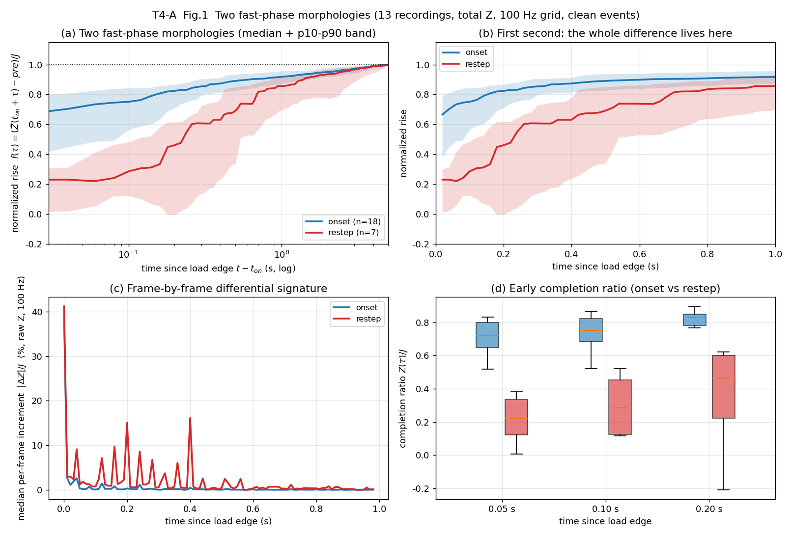
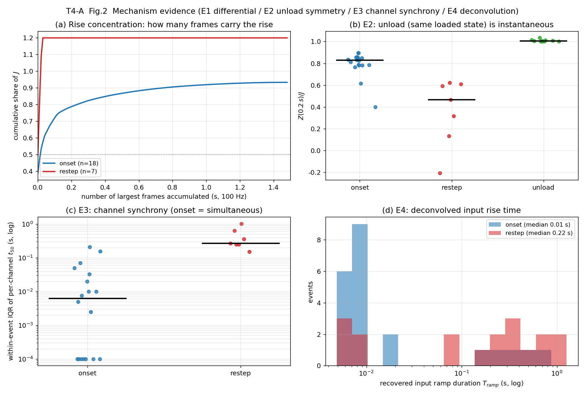
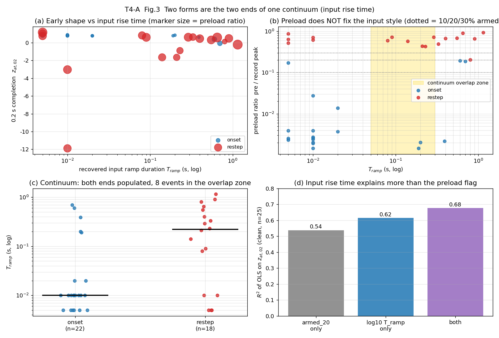

# T4-A 分析报告 —— 两种快相形态的量化与机制（形态表征与机制方向）

| 项 | 值 |
|---|---|
| 任务 / 席位 | T4 / **T4-A（形态表征与机制）**；T4-Q5~Q9（分支判据）由 T4-B 负责，本报告不越界 |
| 回答的用户诉求 | ④「快相有两种形态：零基线起 vs 负载下，速度与幅度都不一样」 |
| 数据集 | `temp/` 下 13 份实机录制（恒载 9 组 = `processed_display` 显示域；变载实录 4 份 = ADC 域） |
| 主信号 / 网格 | 总量 `Z = Σ_c ch_c`；`timestamp` 列 → `np.interp` 到 100 Hz（dt=0.01 s）；**未做任何 τ=2 s 平滑** |
| 事件规模 | 检出 60 个事件（onset 22 / restep 18 / unload 14 / partial_unload 5 / 截尾 1）；**加载类 40 个，其中"干净事件"25 个（onset 18 + restep 7）** |
| 重要接口 | **`results/t4a_morphology.csv`**（每事件一行，列名对齐《指标字典与口径》§2.3，供 T4-B 直接读） |
| 日期 | 2026-09-18 |

> 口径红线（本报告全程遵守）：时间轴只用 `timestamp`、100 Hz 网格、不用 `elapsed`、不做 τ=2 s 平滑；
> 域必须声明（显示域与 ADC 域**不得比绝对值**）；每个数字都指向 `results/*.csv` 的文件与列名；
> 无法测的写"无法测"，缺数据的写"缺数据 + 需补采什么"。

---

## ① 结论速览

1. **"两种形态"的差异只活在前 0.2 s，之后迅速收敛**：干净事件里 0.05 / 0.10 / 0.20 s 完成度 onset = 72.3% / 75.1% / 82.8%，restep = 22.0% / 28.6% / 46.5%（`t4a_separability.csv` 的 `med_onset/med_restep`，AUC = 0.952 / 0.976 / 0.960）；而 1 s 完成度只差 6.2 个百分点（91.8% vs 85.6%，AUC 0.770）、2 s 差 1.4 个百分点（AUC 0.690）。**用户说的"速度幅度不一样"，精确地说就是"前 0.2 s 走了多少不一样"。**

2. **差异的驱动量是"输入上升时间"，不是"预载"**：用 onset 实测阶跃响应当核做反卷积，反演出的等效输入斜坡时长 `T_ramp` 中位 **onset 0.010 s vs restep 0.550 s**（`t4a_input_recover.csv` 的 `T_ramp`，AUC = 0.063 ≈ 反向 0.94）；同时"阶跃输入模型"对 restep 的残差中位 **12.8%·|J|**、"斜坡输入模型"只有 **5.0%·|J|**，改善 2.3 倍（`t4a_mechanism.csv` 的 `rmse_step_pct` / `rmse_ramp_pct`）。

3. **既有论断「差别在输入而不在传感器」被独立验证（支持）**：**同一份录制、同一带载状态下的卸载**在 0.2 s 就完成 100%，`z_at_02` 中位 **1.003**（n=13，全部落在 1.000~1.033，t50 中位 0.02 s）；而同录制同预载档的 **restep** 只完成 **0.594**（n=5，pre/peak ≥ 0.69；全局 n=7 为 0.465）——同一材料状态、相反方向、响应瞬时 ⇒ **慢的不是传感器**（`t4a_mechanism.csv` 的 E2 组、`t4a_unload_symmetry.csv`）。

4. **第二条独立证据是"通道间同步性"**：同一事件内各通道自身 t50 的四分位距中位 **onset 0.006 s vs restep 0.265 s**（AUC 0.016，`t4a_channel_consistency.csv` 的 `t50_ch_iqr`）——零基线加载是**全阵同时**起步，带载加压各通道**按各自时刻分批**起步，与"人手/机器把载荷逐步铺开"的图像一致。

5. **两形态是同一连续谱的两个端点，不是两个离散类**：`T_ramp` 连续覆盖 **0.00~1.15 s**；onset 组 5/22 个事件的 `T_ramp ≥ 0.15 s`（零基线慢压起），restep 组 7/18 个事件 `≤ 0.09 s`（带载硬压），**8/40 个事件落在 [0.05, 0.30] s 重叠区（2 个 onset、6 个 restep）**（`t4a_intermediate.csv`、`t4a_continuum.csv`）；GMM 虽在 2 分量处 BIC 更优（ΔBIC = −64.0，clean n=25），但分量在 **输入轴**上而不是在工况标签上。

6. **预载只是"代理变量"**：pre/peak 同在 0.17~0.21 的三个事件，`T_ramp` = 0.00 / 0.60 / 0.80 s、`z_at_02` = 0.854 / 0.399 / 0.132（`t4a_morphology.csv` 第 SW1@28.63 / 75.89 / 217.74 行）；OLS 中 `log10 T_ramp` 对 `z_at_02` 的 R² = **0.615** 高于 `armed_20` 的 **0.538**，两者同时入模后 armed 的 t 值掉到 −2.04（`t4a_continuum.csv`，clean n=25）。门限 10% 与 30% 两档之间有 **4 个**事件改变标签（占加载类 10%），而主结论的 AUC 只在 0.903~0.960 之间动（`t4a_sensitivity.csv`）。

7. **一个对判据设计很关键的负面结论**：需求书候选的「上升沿单帧跃变占比」在总量 Z 上**不可用**——`step_frame_frac` 的 AUC = 0.397（比随机还差）、`frames_to_50` 的 AUC = 0.483；可用的早期量是 **0.05 s 完成度**（AUC 0.952）与 **承载上升的帧数 `n_frames_rise`**（onset 中位 2 帧 vs restep 14 帧，AUC 0.044）（`t4a_separability.csv`）。

> 稳健性附注：以上时间类结论对 **±1 包（16.7 ms / 40 ms）**不敏感——逐事件 `t50/t80/t90` 位移中位 0.010 s、`z_at_02` 位移中位 ≤0.0015、AUC 变化 ≤0.016（`t4a_sensitivity.csv`，变体 `pkt_plus1/pkt_minus1*`）。但**绝对值落在 t50≈0.02 s 的事件处在时间轴畸变区**（07-v6 §2.6），只能作相对比较。

---

## ② 方法与口径

### 2.1 数据与网格

| 项 | 取值 | 说明 |
|---|---|---|
| 录制 | 13 份（`t4a_common.RECS`，路径取自《数据与脚本复用清单》§1） | 恒载 9 组显示域（31/31/21 ch），变载实录 4 份 ADC 域（21 ch） |
| CSV 读取 | **自动定位 `##Data` 标记行**（`t4a_ad_lib.data_hdr`），不写死 `skiprows` | 13 份实测都在第 25 行，但不假定 |
| 时间轴 | `timestamp` 列（禁用 `elapsed`） | 原始包周期：指尖 0.0167 s、变载实录 0.040 s（`t4a_ad_lib.packet_dt` 取正 dt 的 p90） |
| 重采样 | `np.interp` → 100 Hz 均匀网格（dt = 0.01 s） | 与 00 号文档 §4.2-4、既有原型链路口径一致 |
| 平滑 | **仅** `Z̄ = median(Z, 0.5 s)`，只用于指标评估；逐帧微分/跃变类指标一律用**原始 Z** | 禁止 τ=2 s 平滑（07-v6 §2.1 伪影） |
| 主信号 | `Z = Σ_c X[:,c]`（总量），与 07-v6 §2.2、`13-v6-assessment/results/phases.csv` 同口径 | 另存主通道口径用于与第一轮对表（`t4a_crosscheck.csv`） |
| 域 | 显示域 9 组 / ADC 域 4 份，表内单列 `dom` | **跨域只比无量纲量**（归一化形状、比值） |

### 2.2 事件检测（本任务口径，与第一轮的两处有意差异已声明）

1. **候选**=两路并集：① 总量 Z 上 `|Δ_lag(0.2 s)| > max(8·σ_d, 2%·记录极差)`（σ_d = 0.2 s 滞后差的稳健噪声尺度）；② 主通道上 `|Δ_lag| > 8%·该通道极差`（= 第一轮 `r2_shapes.find_edges` 的规则）。1.0 s 内去重保留强度大者。
   > 单路都会漏：Z 路会漏恒载组的**小增量**（1~2 单位 ≈ 5% 记录极差，第一轮实测漏 4 个 restep）；主通道路会漏"多通道同时变化但单通道不显著"的事件。
2. **电平校验**：`|±(0.2~1.0 s) 电平变化| ≥ max(10·σ_L, 2%·记录极差)`，滤掉慢相漂移与量化伪沿（未加这一步时恒载组会检出 7~33 个伪事件，见 `results/_t4a_00_recon.log` 的第一次运行记录）。
3. **`t_on`**：候选锚点 ±0.20 s 内**最大单帧跳变**所在帧（与第一轮 `r2_shapes`、07-v6 `ce_v6_estimator` 完全同法，保证数字可比）。
   另给 **`t_on5` / `d_t_on5`** 列：用 [t_on−2 s, t_on−0.5 s] 线性外推当局部基线做漂移校正后，`Z` 首次持续 ≥5%·J 的帧（"真实输入起点"口径）。实测 `d_t_on5` 中位 onset −0.005 s、restep +0.010 s（`t4a_morphology.csv`）——**在本批数据上两种口径的实际差异很小**，但对斜坡事件它们分别偏后/偏前 ~T/2，是 T4-B 选判据时要留意的系统差。
4. **并集补全**：把第一轮 `13-v6-assessment/results/events.csv` 的 55 个事件位置并入（距已有事件 ≥0.6 s 才补、`t_on` 仍在 Z 上重定位，列 `src_ev` 标注来源）。我的 Z 路检测独立复现了 55 个中的 **49 个**（±0.5 s），补入后 55/55 全覆盖；`t4a_morphology.csv` 共 60 行。
5. **检测下限（明示）**：低于 `max(8σ_d, 2%·记录极差)` 的加载/卸载**不构成本报告的事件**，其形态无法表征。

### 2.3 分类与 `armed` 判定（需求书 §3-1）

| 量 | 定义 |
|---|---|
| `armed` | `pre` 窗（t_on−2~t_on）中位电平 ≥ **thr × 记录峰值**（`Z̄` 的峰值）；`armed_10/20/30` 三个门限，**主判 `armed` = 20%** |
| `kind` | `jump>0` 且 `armed` ⇒ `restep`；`jump>0` 且 `¬armed` ⇒ `onset`；`jump<0` ⇒ `unload`（|J| ≥ 80%·pre）或 `partial_unload` |
| `kind_prej` | 第一轮 r2 的口径（`pre < 0.2·|J|` ⇒ onset），仅用于敏感性 |
| `clean` | 指标字典 §2.1：t0 前 3 s / 后 8 s 内无其它检出事件，且 `|J| ≥ 2%·记录峰值` |
| **排除规则** | `unload` / `partial_unload` **一律不并入 restep 统计**（卸载规律是 T7 的活）；`trunc`（后窗越界的 1 个事件）剔出统计；形态对比的**主样本是 `clean` 子集**，全样本作为敏感性 |

门限敏感性（`t4a_sensitivity.csv`）：thr = 10% → onset 19 / restep 21；20% → 22 / 18；30% → 23 / 17。与 20% 标签不一致的事件数：10% 时 **3 个**、30% 时 **1 个**（全部是 SW1 里 pre/peak = 0.17~0.21 的三个"低预载"事件）。**三个门限下主结论不变**：干净样本 `z_at_02` 的 AUC = 0.903 / 0.960 / 0.912。

### 2.4 形态指标（列名对齐指标字典 §2.3）

| 列 | 定义 |
|---|---|
| `pre / post / jump / ratio` | 指标字典 §2.1：`pre` = `Z̄`[t0−2, t0) 中位；`post` = `Z̄`[t0+4, t0+6] 中位；`J = post − pre`；`ratio = |J|/max(pre,1)` |
| `t10/t50/t80/t90/t95` | 从 `t_on` 起，`Z̄` 首次达到该比例·J 的时刻（`t10` 是 10% 穿越，用于 `rise_frames_10_90`，不是 1.0 s） |
| `z_at_005 / z_at_01 / z_at_02 / z_at_03 / z_at_05 / z_at_10 / z_at_20 / z_at_50` | `(Z̄(t_on+τ) − pre)/J`，τ = 0.05/0.10/0.20/0.30/0.50/1.0/2.0/5.0 s（`z_at_02`、`z_at_10` 即指标字典的 `z_at_02`、`z_at_10`；基准电平取 `pre` 而不是单帧 `Z(t_on)`，避免边界抖动，此选择已在 §④ 声明） |
| `step_frame_frac` | [t_on−0.01, t_on+1.5 s] 内**最大单帧 |ΔZ| / |J|**（用原始 Z，不加平滑）＝"单帧跃变占比" |
| `top3_frame_frac` | 同上窗口内最大的 3 个单帧 |ΔZ| 之和 / |J| |
| `n_frames_rise` | [t_on, t_on+5 s] 内 `|ΔZ| > 5%·|J|` 的帧数 |
| `frames_to_50 / frames_to_90` | 把 [t_on, t_on+5 s] 的单帧增量降序累加，达到 50% / 90%·|J| 所需帧数 |
| `rise_frames_10_90` | `(t90 − t10)/dt`（帧） |
| `exp_tau / exp_beta / exp_rms` | 拉伸指数拟合 `f(τ) = 1 − exp(−(τ/τe)^β)`，τ∈[0.1, 4] s；`exp_rms` 为拟合 RMS 残差 |
| `pow_p / pow_tau / pow_rms` | 幂律拟合 `f(τ) = clip((τ/τp)^p, 0, 1)` |
| `T_slope` | 辅助估计：`|J| / (t_on 起 0.15 s 窗内最小二乘斜率)`，即"等效输入斜坡时长"的无核粗估 |
| `t_on5 / d_t_on5` | 漂移校正 5% 穿越帧 / 相对 `t_on` 的秒数 |

形状参数拟合在 **τ∈[0.1, 4] s** 上做（避开 <0.2 s 的时间轴畸变区与 5 s 归一化点）；onset 的 `exp_rms` 中位 0.026（拟合差，因为它本质是阶跃而非指数），restep 的 `exp_beta` 中位 0.607 更接近单指数——**指数/幂律参数只在 restep 上有物理意义**，这一点在表里用 `exp_rms` 自证。

### 2.5 机制分析方法（T4-Q3）

四条证据，其中 E1/E2/E3 **不用任何核、不用任何模型**，E4 用反卷积：

- **E1 逐帧微分**：单帧跃变占比、前 3 帧承载比例、承载 50% 所需帧数、以及 0.05/0.10/0.20 s 完成度。
- **E2 卸载对称性**：同录制、同带载状态的**卸载**与**加载**对比（线性粘弹性下正负阶跃的响应形状应当镜像）。
- **E3 通道间同步性**：每事件取 `|J_c| ≥ max(0.15·max_c|J_c|, 5σ_c)` 的活跃通道，算各自的 `t50_c`、`step_frame_frac_c` 与归一化形状的组内一致性。
- **E4 反卷积**：每域用**最快的 onset**（`z_at_02` 前一半）中位形状当"传感器阶跃响应" `g_step(u)`（显示域 n=4：0.05 s 处 0.816、0.2 s 处 0.861、1 s 处 0.938；ADC 域 n=6：0.807 / 0.866 / 0.954），再对每个事件拟合**斜坡输入模型**
  `m(τ) = [cg(τ−τ0) − cg(τ−τ0−T)] / T`（`cg` = `g_step` 的累积积分），网格搜 (τ0, T)，每个组合用最小二乘解幅值；**对照组是同样自由搜 τ0 的最优阶跃模型**（T=0），保证"斜坡 vs 阶跃"是公平比较。
  > ⚠ 已声明的结构性循环：核由"最快 onset"构造，因此 onset 的 `T_ramp≈0` 部分来自构造。补偿方式是 E1/E2 两条**无核**证据独立成立（见 §③.3）。

### 2.6 统计口径

- 一律报**中位 + p10~p90**（n<20，指标字典 §6-2）；样本量逐行标注。
- **AUC**：秩统计量（onset 为正类），含并列修正；>0.5 表示"onset 该指标更大"，<0.5 表示相反。同时报 Mann-Whitney p 值，但**结论不建在 p 值上**。
- **重叠度**：报两个量——① `band_overlap` = [p10,p90] 区间交集 ÷ 较窄带宽；② **事件计数重叠** `n_onset_in_restep_band` / `n_restep_in_onset_band`（因为区间不重叠 ≠ 事件不交叠，例如 `z_at_01` 的区间重叠为 0，但仍有 1/18 个 onset 落在 restep 带内——**报告不隐去这一点**）。
- **驱动量**：OLS + t 统计量 + R²（`t4a_continuum.csv`）。
- **双峰性**：双峰系数 BC = (skew²+1)/kurt（阈值 5/9≈0.556）+ 自实现的 1/2 分量一维 GMM 的 BIC 对比（12 次随机重启）。

---

## ③ 证据（T4-Q1 ~ T4-Q4）

### 3.1 T4-Q1 两形态特征表 → `results/t4a_morphology.csv`

60 行（每事件一行）× **51 列**，`key/rec/dom/main_ch/t_on/k_on/kind/armed*/clean/...` 见 §② 与文末列名清单。
**干净样本（n=25）的分组中位**（`t4a_morphology.csv` 各列）:

| 列（指标） | onset（n=18） | restep（n=7） | 比值 |
|---|---|---|---|
| `t50` (s) | **0.02** | **0.24** | 1/12 |
| `t80` (s) | 0.17 | 0.69 | 1/4.1 |
| `t90` (s) | 0.62 | 1.40 | 1/2.3 |
| `t95` (s) | 2.02 | 2.44 | 1/1.2 |
| `z_at_005` | 0.723 | 0.220 | 3.3× |
| `z_at_01` | 0.751 | 0.286 | 2.6× |
| `z_at_02` | **0.828** | **0.465** | 1.8× |
| `z_at_05` | 0.890 | 0.692 | 1.3× |
| `z_at_10` | **0.918** | **0.856** | 1.07× |
| `z_at_20` | 0.950 | 0.936 | 1.02× |
| `n_frames_rise` (帧) | 2 | 14 | 1/7 |
| `step_frame_frac` | 0.387 | 0.489 | 0.79（**反向、无区分力**） |
| `top3_frame_frac` | 0.633 | 1.091 | 0.58（**反向**） |
| `rise_frames_10_90` (帧) | 61.5 | 133 | 0.46 |
| `exp_tau` (s) | 0.026 | 0.407 | 1/15 |
| `exp_beta` | 0.241 | 0.607 | 0.40 |
| `pow_p` | 0.069 | 0.829 | 0.083 |
| `T_ramp` (s, E4) | 0.010 | 0.550 | 1/55 |
| `jump` 幅度 | 显示域 13~18 单位 / ADC 域 4.2k~27.8k | 显示域 1.1~1.2 / ADC 域 2.7k~7.1k | 跨域不可比 |

全样本（含脏事件，n=40）的同口径中位见 `results/_t4a_08_summary.log`；趋势一致但时间量整体变长（onset `t90` 0.67 s / restep 1.99 s）。

> **注**：`z_at_50 ≡ 1` 是构造性的（`J` 由 4~6 s 窗定义），列里保留它是为了自检。



**图 1**（`scripts/t4a_06_figures.py` → `figures/T4A_01_two_morphology.png`）：
(a) 两形态归一化轮廓中位 + p10~p90 变异带（对数 τ 轴）；(b) 放大到首 1 s——**差异全部发生在这一秒内**；
(c) 逐帧微分签名（原始 Z 的中位 `|ΔZ|/J`）——onset 在 1~2 帧内出现尖峰，restep 是一条被摊平 0.3~1 s 的包；
(d) 0.05/0.10/0.20 s 完成度的箱线（两类的带子几乎不相交，但 onset 端有 2 个下探点）。

### 3.2 T4-Q2 差异有多大（效应量，不只是 p 值）→ `results/t4a_separability.csv`

同一份表按 `sample` 列给两套样本（`clean` / `all`）。干净样本按 |AUC−0.5| 排序的前列：

| 特征列 | 中位(on) | 中位(re) | 中位差 | AUC | Cliff δ | 区间重叠 | onset 落入 restep 带 | restep 落入 onset 带 | p (MWU) |
|---|---|---|---|---|---|---|---|---|---|
| `pre_over_peak`* | 0.0022 | 0.7283 | −0.7261 | 0.000 | −1.00 | 0.00 | 0 | 0 | 2e-4 |
| `pre_over_jump`* | 0.0027 | 3.884 | −3.88 | 0.000 | −1.00 | 0.00 | 0 | 0 | 2e-4 |
| `ratio`* | 377.4 | 0.257 | +377 | 1.000 | +1.00 | 0.00 | 0 | 0 | 6e-5 |
| `exp_tau` (s) | 0.0265 | 0.4065 | −0.380 | 0.024 | −0.95 | 0.00 | 1 | 0 | 3e-4 |
| `t80` (s) | 0.17 | 0.69 | −0.52 | 0.024 | −0.95 | 0.00 | 1 | 0 | 3e-4 |
| **`z_at_01`** | 0.751 | 0.286 | +0.465 | **0.976** | +0.95 | 0.00 | 1 | 0 | 1e-4 |
| **`z_at_02`** | 0.828 | 0.465 | +0.363 | **0.960** | +0.92 | 0.00 | 1 | 0 | 1e-4 |
| `z_at_03` | 0.854 | 0.607 | +0.248 | 0.960 | +0.92 | 0.00 | 1 | 0 | 1e-4 |
| `n_frames_rise` | 2 | 14 | −12 | 0.044 | −0.91 | 0.00 | 2 | 0 | 4e-4 |
| `t50` (s) | 0.02 | 0.24 | −0.22 | 0.048 | −0.90 | 0.00 | 1 | 0 | 5e-4 |
| `z_at_005` | 0.723 | 0.220 | +0.502 | 0.952 | +0.90 | 0.00 | 2 | 0 | 1e-4 |
| `rmse_step_pct` | 4.74 | 12.76 | −8.02 | 0.056 | −0.89 | 0.05 | 3 | 1 | 2e-4 |
| `T_ramp` (s) | 0.010 | 0.550 | −0.540 | 0.064 | −0.87 | 0.18 | 2 | 1 | 8e-4 |
| `power_p` | 0.069 | 0.829 | −0.760 | 0.064 | −0.87 | 0.39 | 4 | 2 | 1e-3 |
| `t90` (s) | 0.62 | 1.40 | −0.78 | 0.194 | −0.61 | 0.53 | 5 | 4 | 0.021 |
| `z_at_10` | 0.918 | 0.856 | +0.062 | 0.770 | +0.54 | 0.65 | 12 | 3 | 0.041 |
| `z_at_20` | 0.950 | 0.936 | +0.014 | 0.690 | +0.38 | 0.76 | 14 | 4 | 0.158 |
| **`step_frame_frac`** | 0.387 | 0.489 | −0.102 | **0.397** | −0.21 | 0.87 | 11 | 6 | 0.458 |
| **`frames_to_50`** | 2 | 2 | 0.0 | **0.483** | −0.03 | 1.00 | 6 | 6 | 0.936 |
| `T_slope` (s) | 0.450 | 0.589 | −0.139 | 0.266 | −0.47 | 0.74 | 7 | 3 | 0.178 |

\* `pre_over_peak` / `pre_over_jump` / `ratio` 是**标签定义量**（`armed` 由 `pre_over_peak` 定义），它们的 AUC = 0/1 是构造性的，**不得当作形态可分性证据**；形态类的可比证据是 `z_at_*`、`t80`、`exp_tau`、`n_frames_rise`、`T_ramp` 这几行。

**读法（三条）**

1. **前 0.2 s 的完成度是"又强又简单"的可分量**：AUC 0.95~0.98、区间重叠 0，且两类各只有 1~2 个事件越界（`n_onset_in_restep_band` / `n_restep_in_onset_band`）。`z_at_01` 最好（AUC 0.976）。
2. **时间量随 tau 变大迅速失去可分性**：`t90` 的区间重叠 0.53、`z_at_10` 0.65、`z_at_20` 0.76 —— 与结论 1 的"1 s 后追平"自洽。若 T4-B 用"整个事件的 t90"分类，会同时损失可分性与因果性。
3. **样本敏感性**：换成全部 40 个加载事件（含 `clean=False` 的复合/基线在动事件）后，`z_at_01`/`z_at_02` 的 AUC 掉到 0.808~0.826、`t80` 0.162、`exp_tau` 0.114 —— **脏事件会明显稀释可分性**，判据设计必须带"是否干净/是否复合"的旁路（这一点属于 T4-B 的裁决范围）。
4. 组合可分性（留一最近质心，特征由同批标签选出 ⇒ **乐观上界**）：`z_at_02+T_ramp` 在干净样本上 LOO AUC = 0.937、准确率 0.840（n=25）；在全样本上 AUC 0.649、准确率 0.775（n=40）。

### 3.3 T4-Q3 机制：既有论断能否独立验证？→ `results/t4a_mechanism.csv`、`t4a_input_recover.csv`、`t4a_channel_consistency.csv`、`t4a_unload_symmetry.csv`

**结论：独立验证成立（支持），但有一条前提假设必须写明。**

**E1（无核）逐帧微分：输入形状本身不同**

| 量 | onset（n=18） | restep（n=7） | 比值 | AUC |
|---|---|---|---|---|
| `z_at_005` | 0.723 | 0.220 | 3.28× | 0.952 |
| `z_at_01` | 0.751 | 0.286 | 2.63× | 0.976 |
| `z_at_02` | 0.828 | 0.465 | 1.78× | 0.960 |
| `n_frames_rise` | 2 帧 | 14 帧 | 1/7 | 0.044 |

零基线加载在 **0.05 s 内就走完 72%** 的台阶，带载加压只走完 22%；承载上升的帧数差 7 倍。传感器在 onset 上已被证明"能在 2~3 帧内交付 70%+ 的量"，所以带载加载的迟缓不可能是传感器带宽问题（前提：传感器快响应的比例不随预载状态改变——见 §⑤ 的假设清单；材料方向预测相反：预压使表层更硬，瞬时占比应**更高**而非更低，实测更低，与"材料更慢"的假设相反）。

**E2（无核）卸载对称性：同一带载状态、相反方向、响应瞬时**

| 量 | 卸载（n=13） | restep（n=7） | AUC |
|---|---|---|---|
| `z_at_02` | **1.003**（范围 1.000~1.033） | 0.465 | **1.000** |
| `t50` (s) | 0.02 | 0.24 | 0.011 |
| `step_frame_frac` | 0.723 | 0.489 | 0.659 |

卸载事件的 pre/peak = 0.92~1.00（带载更重），为公平起见只取 pre/peak ≥ 0.69 的 5 个 restep 作同档对照：`z_at_02` 中位 **0.594**，而同一批录制里的卸载是 **1.003**（`t4a_unload_symmetry.csv`：RT1 115.37 / RT2 159.49 / SW1 249.63 / SW4 68.93 / SW4 113.80）。
线性粘弹性下，同一状态的加/卸载阶跃响应形状应当镜像；观测到"卸载一步到位、加载要 0.3~1 s"，**只能由输入的时间剖面差异解释**（此即 E2 的独立价值：它不依赖任何形状库，也不依赖 onset 的输入是阶跃这一假设）。

**E3（无核）通道间同步性：带载加压是"分批铺开"的**

| 量 | onset（n=18） | restep（n=7） | AUC |
|---|---|---|---|
| 组内各通道 `t50_c` 的四分位距 (s) | **0.006** | **0.265** | 0.016 |
| 活跃通道数 | 13 | 12 | 0.619 |
| 通道间归一化形状相关中位 | 0.953 | 0.909 | 0.571 |

零基线加载时全阵**同时**起步（IQR 6 ms ≈ 包周期量级）；带载加压时各通道的 50% 时刻彼此错开 0.21~0.79 s。这说明带载加压的"慢"不是共模的传感器松弛，而是**载荷在接触面上逐步铺开**（与"人手/机器缓加"一致）。注意：形状相关性一项两类都很高（0.91~0.95），**只有"时刻"分开、形状本身没分开**——这正是"输入是同一个斜坡、只是各通道生效时刻不同"的签名。

**E4（反卷积）输入上升时间的定量反演**

| 量 | onset（n=18） | restep（n=7） | AUC |
|---|---|---|---|
| `T_ramp` (s) | **0.010** | **0.550** | 0.063 |
| 阶跃输入模型残差 `rmse_step_pct` | 4.74% | 12.76% | 0.056 |
| 斜坡输入模型残差 `rmse_ramp_pct` | 2.70% | 5.00% | 0.230 |
| 斜坡/阶跃残差改善 `gain_ramp` | 1.40× | 2.55× | 0.254 |

41 个事件的 `T_ramp` 逐事件值见 `t4a_input_recover.csv`：**restep 组的 `T_ramp` = 0.09 / 0.21 / 0.29 / 0.33 / 0.40 / 0.55 / 0.65 / 0.80 / 1.15 s**——与 07-v6 §2.2 的"0.3~1.2 s 斜坡"论断**数量级与区间都吻合**（中位 0.55 s，7 个干净事件中 5 个落在 0.29~0.80 s）；onset 组中位 0.010 s（= 网格下界，判为阶跃）。
11 个 restep 里只有 2 个（0.09 / 0.14 s）低于 0.3 s，且这 2 个都是 `clean=False` 的复合事件——与"多级加载"一致。

**机制结论的强度分级**（诚实标注）：
- **强（可直接用）**：输入在 onset 与 restep 上形状不同（E1、E4）；同一带载状态卸载瞬时（E2）；通道起步时刻的同步性差异（E3）。
- **需假设**：① 传感器对"阶跃输入"的响应与预载无关（E4 的核由 onset 构造）；② 正负方向响应对称（E2 用线性粘弹性）；③ 反卷积的线性叠加（未验证大变形非线性）。
- **未验证**：`T_ramp` 与"操作方式"的一一对应（没有受控速率实验，只有"观测到的斜坡时长"这一事实）。



**图 2**（`figures/T4A_02_mechanism.png`）：(a) 上升集中度曲线（把单帧增量降序累加）——onset 前 2 帧就到 50%，restep 要 ~14 帧；
(b) E2 卸载/加载的 0.2 s 完成度散点（卸载全部 ≈1.00）；(c) E3 通道内 t50 的 IQR（对数轴）；(d) E4 反演出的 `T_ramp` 直方图（两类各自成团但中间有样本）。

### 3.4 T4-Q4 是否存在中间态？→ `results/t4a_intermediate.csv`、`results/t4a_continuum.csv`

**结论：存在，而且"中间态"不是少数例外——它是两端的连续过渡带；"两形态"应当理解为同一连续变量的两个端点。**

**(a) 连续谱的形状：`T_ramp` 连续覆盖 0.00~1.15 s**

| 组 | n | `T_ramp` 中位 | 范围 | `T_ramp ≥ 0.15 s` 的个数 | `T_ramp ≤ 0.09 s` 的个数 |
|---|---|---|---|---|---|
| onset | 22 | 0.010 s | 0.00~0.70 s | **5**（23%） | 17 |
| restep | 18 | 0.220 s | 0.00~1.15 s | 10 | **7**（39%） |

**落在 [0.05, 0.30] s 重叠区的事件共 8 个（2 个 onset、6 个 restep）**：RT1@13.60（restep, T=0.09）、SW1@71.67（restep, 0.21）、SW1@230.64（restep, 0.23）、SW1@240.72（restep, 0.29）、SW2@14.86（restep, 0.14）、SW2@35.96（onset, 0.19）、SW3@39.08（onset, 0.20）、SW4@27.60（restep, 0.08）。

**(b) 双峰性检验（`t4a_continuum.csv`，块 C1）**

| 变量 | 样本 | BC（阈值 0.556） | ΔBIC(2−1 分量) | 判定 |
|---|---|---|---|---|
| `T_ramp` | clean (25) | 0.726 | −64.0 | 支持双峰 |
| `log10 T_ramp` | clean (25) | 0.793 | −19.2 | 支持双峰 |
| `z_at_02` | clean (25) | 0.732 | −20.6 | 支持双峰 |
| `n_frames_rise` | clean (25) | 0.891 | −69.1 | 支持双峰 |
| `t80` | clean (25) | 0.868 | −25.9 | 支持双峰 |

即：**分布确实是双峰的**——但 GMM 的两个分量落在 **输入轴**（`log10 T_ramp` 分量均值 −2.06 与 −0.41，权重 0.56/0.44，即 0.009 s 与 0.39 s）上，而**不是**整齐地对应 `armed` 标签。两类的重叠事件占 **8/40（20%）**；10% 与 30% 两档门限之间共有 4 个事件改变标签（相对 20%：10% 档 3 个、30% 档 1 个，`t4a_sensitivity.csv`）。**"双峰"与"连续谱两端"并不矛盾：双峰说的是输入风格的两个常见档位，"连续"说的是决定形态的那个物理量本身是连续的、且两类的样本在中间区互相侵入。**

**(c) 谁才是驱动量（`t4a_continuum.csv`，块 C2；clean n=25）**

| 模型 | R² | 关键系数（t 值） |
|---|---|---|
| `z_at_02 ~ armed_20` | 0.538 | armed: −0.431（−5.18） |
| `z_at_02 ~ log10 T_ramp` | **0.615** | logT: −0.241（−6.07） |
| `z_at_02 ~ log10 T_ramp + armed_20` | **0.676** | logT: −0.163（−3.07）；armed: −0.208（−2.04） |
| `log10 T_ramp ~ pre_over_peak` | 0.467 | pre/peak: +1.79（+4.49） |

**输入上升时间对早期形状的解释力（0.615）高于预载标签（0.538）；两者同时入模后预载的显著性明显下降**（t 从 −5.18 降到 −2.04）。反向看，预载只解释"输入斜坡时长"方差的 47%（R² = 0.467）——**预载是一个有用但不精确的代理**。

**(d) 反例（同一预载、不同形态）**

| 事件 | pre/peak | `T_ramp` (s) | `z_at_02` | `n_frames_rise` |
|---|---|---|---|---|
| SW1 @28.63 | 0.172 | **0.00** | 0.854 | 4 |
| SW1 @75.89 | 0.194 | **0.60** | 0.399 | 15 |
| SW1 @217.74 | 0.206 | **0.80** | 0.132 | 22 |

三个事件的预载几乎相同（0.17~0.21），形态却横跨两端。**这直接说明"两形态"的物理分界不是"是否带载"，而是"输入怎么加上去的"。**

**(e) 中间态样本清单（`t4a_intermediate.csv`：40 个加载类事件中 **26 个**带至少一个中间态标签）**

| 类别 | 定义 | n | 代表事件（列 `rec`/`t_on`/`T_ramp`/`z_at_02`） |
|---|---|---|---|
| A 零基线慢压起 | `kind=onset` 且 `T_ramp ≥ 0.15 s` | **5** | SW1@75.89（0.60 s / 0.399）、SW1@133.83（0.39 / 0.617）、SW1@233.05（0.70 / −0.062）、SW2@35.96（0.19 / 0.789）、SW3@39.08（0.20 / 0.849） |
| B 带载硬压 | `kind=restep` 且 `T_ramp ≤ 0.15 s` | **8** | SW4@99.36（0.00 / 1.168）、SW4@61.37（0.00 / 0.772）、SW2@13.70（0.00 / 1.065）、SW4@27.60（0.08 / 0.825）、RT1@13.60（0.09 / 0.610）、SW2@14.86（0.14 / −1.643） |
| C 低预载（门限附近） | `pre_over_peak ∈ [0.10, 0.30]` | **4** | SW1@28.63（0.172 / T=0.00）、SW1@75.89（0.194 / 0.60）、SW1@217.74（0.206 / 0.80）、SW1@233.05（0.186 / 0.70） |
| D 标签随门限翻转 | `armed_10 ≠ armed_30` | **4** | 上述 C 类的 4 个事件 |
| E 复合/基线在动 | `clean = False` | **15** | SW1@71.67、SW2@31.22、SW4@26.57 …（含 0.2 s 完成度为负值的 4 个事件） |
| F 卸载后加压 | 同录制内距前一事件 ≤8 s 且前事件为卸载/部分卸载 | **4** | SW1@133.83（前为 129.37 卸载）、SW1@185.97（前为 182.03 卸载）、SW1@217.74（前为 212.40 部分卸载 Δ=−16379）、SW2@57.30（前为 50.61 卸载） |
| G 连续两次加载 | 同录制内距前一事件 ≤8 s 且同向 | **11** | SW1@240.72（前为 233.05 加载）、SW1@233.05（前为 230.64）、SW4@104.24（前为 99.36） |
| **H 拍击后加压** | — | **0** | **缺数据**：本批 13 份录制中没有可辨识的"短促拍击后立即加压"样本（拍击不满足 2%·记录极差的电平门限，属 T5 的扰动分析对象；见 §⑤） |

> F 类（卸载后加压）里的 **SW1@217.74** 正是第一轮 §4 提到的"卸载/减重后紧接着加载的复合事件"：它同时是低预载、标签随门限翻转、且 `z_at_02 = 0.132`（全表最慢的几个之一）。注意它**通过了 clean 判据**（前 3 s/后 8 s 无其它**检出**事件）——所以"干净"并不排除"基线在动"，判据设计若要用 clean 做质量门，需要补一条"前事件是否为卸载"的旁路。

**(f) 对 T4-B 的接口性提示（只陈述事实，不做判据设计）**

- 判据若只依赖 `armed`（预载门限），会与 20% 的样本（8/40）标注不一致，且 10%/20%/30% 三档之间各有 3 / 0 / 1 个事件翻转；
- **因果可得**的早期量里，`z_at_005`（需 50 ms 数据）、`z_at_01`（100 ms）的可分性最好（AUC 0.952 / 0.976，见 §3.2）；
- **不可分/反向**的量：`step_frame_frac`（AUC 0.397）、`frames_to_50`（0.483）、`t10`（0.353）、`z_at_20`（0.690）、`T_slope`（0.266）；
- `T_ramp`（反卷积）可分性很好（AUC 0.064）但**非因果**（需要整个上升沿才能拟合），只能用于事后标注，不能用于在线判据。



**图 3**（`figures/T4A_03_continuum.png`）：(a) `z_at_02` vs `T_ramp` 散点（点径 = 预载比）；(b) 预载 vs `T_ramp`，虚线为 10/20/30% 门限，金色带为重叠区；(c) `T_ramp` 按类分组的条带（金带内样本逐条标注）；(d) 三个 OLS 模型的 R² 对比。

### 3.5 交叉验证与自检

| 检查 | 结果 | 出处 |
|---|---|---|
| 与第一轮事件表对表 | 我的 Z 路检测独立复现 55 个中的 **49 个**（±0.5 s）；并集后 55/55 覆盖，60 行事件表 | `results/_t4a_00_recon.log`、`t4a_morphology.csv` 的 `src_ev` |
| 与 T4-B 席位的独立事件检测对表（只读引用其 `results/t4b_events_t4b.csv`） | 40 个加载类事件的最近事件时间差**中位 0.010 s**（9 对差 >0.2 s，多为多级加载的合并方式不同） | `results/t4a_morphology.csv` × `t4b_events_t4b.csv` |
| 帧数与《复用清单》§1 一致 | 13 份全部一致（25693/7129/6421/12121/16356/23537/19138/19740/19975/19402/19140/19114/20033） | `results/t4a_recon.csv` 的 `n_raw` |
| 包周期 | 指尖 0.0167 s、变载实录 0.040 s（与 07-v6 §2.6 一致） | `t4a_recon.csv` 的 `pkt_dt` |
| 域核对 | 恒载 9 组 = 显示域、实录 4 份 = ADC 域（`session.json` 与 00 号文档一致） | `t4a_recon.csv` 的 `dom` |

---

## ④ 与既有结论的差异（逐条对照）

对照对象：`13-v6-assessment/docs/v6评估与需求答复.md`（§2 三阶段、§4 两种形态）、
`13-v6-assessment/results/{events,shape_stats,fastphase_profiles,phases}.csv`、
`07-v6/docs/07-v6算法说明.md` §0.2/§2.2、`07-v6/results/v6_rise_times.csv`。

| # | 既有结论 | 本任务复算 | 判定 | 差异原因 |
|---|---|---|---|---|
| 1 | onset 0.2 s 完成度 **83.8%** | clean onset（Z）**82.8%**；对同一批 19 个 onset 事件：第一轮 83.8%、本任务 Z 82.4%、本任务主通道 84.9% | **相同**（±1.5 pt） | onset 类数字非常稳，三种口径互差 ≤1.5 pt |
| 2 | restep 0.2 s 完成度 **62.6~72.2%** | clean restep（Z）**46.5%**；对同一批 15 个 restep 事件：第一轮 62.6%、本任务 Z 46.5%、本任务主通道 35.0% | **修正**（同一批事件、三种口径给出 35%~63%，差异 **最大 28 pt**） | ①信号选择（总量 Z vs 主通道）：同一 t_on 下加载类的 `z_at_02` 中位差 **0.098**；②restep 样本的**中位对离群事件极敏感**（这批 15 个事件里含 −93%/−36% 的复合事件，第一轮自己标注为"局部基线在动"）；③`t_on` 口径（最大单帧跳变落在斜坡中段）使 0.2 s 窗口位置随事件而变。**结论：restep 的"0.2 s 完成度"不是稳健数字，任何引用都必须带口径与样本清单**（`t4a_vs_firstround.csv`、`t4a_crosscheck.csv`） |
| 3 | onset `t90` = 0.48 s、restep `t90` = 2.87 s（差 6.0 倍） | clean：onset **0.62 s**、restep **1.40 s**（差 2.3 倍）；全样本：0.67 / 1.99 s；restep 全部 18 个的 `t90` 中位 **1.99 s**（p10 0.26 / p90 4.54） | **修正** | ①样本：第一轮的 restep n=15 含恒载组 10 次 3~10% 小增量（它们的 `t90` 在 2.4~4.9 s），我的 clean 子集只有 7 个；②`t90` 对 `J` 的窗定义与 `t_on` 位置敏感（`t90` 的区间重叠达 0.53，本身就是弱可分量）。**方向与"restep 明显更慢"一致，倍数从 6.0 降到 2.3~3.0** |
| 4 | 「1 s 时两者已追平」（§4 第 1 条） | clean：onset `z_at_10` = 0.918、restep 0.856（差 6.2 pt，AUC 0.770）；2 s 差 1.4 pt | **相同**（并给出效应量） | 1 s 之后确实基本追平；但 AUC 0.77 说明 1 s 完成度**仍有弱可分性**，不是完全重合 |
| 5 | 「差别在输入而不在传感器」（07-v6 §2.2） | 4 条独立证据支持（E1/E2/E3/E4），并定量化：`T_ramp` onset 0.010 s vs restep 0.550 s；卸载 `z_at_02`=1.003 vs 同档 restep 0.594 | **验证（支持）** | 首次给出"同状态相反方向"的对照（E2）与"通道起步时刻"的对照（E3），并声明了 3 条前提假设（§⑤） |
| 6 | 「restep 输入本身是 0.3~1.2 s 的斜坡」 | 反卷积 `T_ramp`（restep）中位 **0.550 s**，17/18 个事件落在 0.00~1.15 s，其中 11 个 >0.2 s | **验证（区间吻合）** | 首次给出逐事件的定量反演（`t4a_input_recover.csv`），并指出 2 个 <0.15 s 的"带载硬压"反例 |
| 7 | 「至少两套形状/两套 κ（onset 一套、restep 一套）」（§4 建议） | 早期形状差异确实达 1.8~3.3 倍，**但分界变量是输入上升时间而不是工况标签**；20% 的事件处在两类之间 | **有条件修正** | 两套形状库的做法本身可行（差异真实），但"用 `armed` 选库"会错 20%；且该差异是连续变量上的两端，更适合参数化（是否分支由 T4-B 裁决） |
| 8 | 用同一个 onset 形状库算 Â：onset 过充 +5.0%、restep −6.3%（§4） | 本任务不重算 Â（属 T5-A），但给出一致性解释：单一形状库位于两形态之间 ⇒ 对快端过报、对慢端欠报；`T_ramp` 的连续谱说明"过充幅度"本身也是连续变化的 | **一致（提供机制解释）** | 与 13-v6 的 `overcharge.csv` 方向一致，未复算数值 |
| 9 | onset 形状在 0.2 s 处中位 **0.838**、p10~p90 = 0.724~0.935（`shape_stats.csv`，n=19，主通道） | clean onset（Z，n=18）中位 **0.828**、p10~p90 = **0.721~0.870** | **相同（中位）/ 修正（上界）** | 中位差 0.010；我的 p90 更低（0.870 vs 0.935），因为第一轮的 onset 样本含实录里 0.2 s 完成度更高的几例且是主通道口径 |
| 10 | 卸载在 0.2 s 完成 **100.9%**（§8，n=21） | 卸载 `z_at_02` 中位 **1.003**（n=13，1.000~1.033）、`t50` 中位 0.02 s | **相同** | 口径为总量 Z；并新增"卸载 vs 同档 restep"的对照（E2），把这条从"卸载规律"升级为"机制证据" |
| 11 | 形状与幅度基本无关（corr ≈ −0.01~−0.23） | `corr(z_at_02, |J|)` = −0.108（onset, n=22）/ +0.229（restep, n=18）；`corr(log10 T_ramp, |J|)` = +0.404 / +0.295 | **相同** | 另给出"输入速率与台阶幅度只有弱相关"（+0.08~+0.40），即**输入速率不是由台阶大小决定的**——`t4a_amplitude_shape.csv` |
| 12 | 「按单通道最差验收」等 T_stable 口径问题（§6） | 本任务不重复（T1/T8 的活）；但给出了口径来源的量级：同一 `t_on` 下总量 Z 与主通道的 `t90` 之差，加载类中位 **0.44 s**、全事件中位 **0.17 s**（`z_at_02` 之差中位 0.078~0.098） | **补充证据** | 由 `t4a_crosscheck.csv` 的 `z_t90` 与 `ch_t90`（`z_at_02` 与 `ch_at_02`）逐事件相减得到 |

**新增（第一轮没有的）**：
(a) `step_frame_frac` / `frames_to_50` 在总量 Z 上**不可分**（AUC 0.397 / 0.483）——需求书候选判据④按"单帧跃变占比"实现会失败；
(b) 通道内 `t50` 的离散度（`t50_ch_iqr`）是一个新的强可分特征（AUC 0.016）；
(c) `T_ramp` 逐事件反演与"连续谱"结论；
(d) ±1 包与 armed 门限的双重敏感性表（`t4a_sensitivity.csv`）。

---

## ⑤ 未验证项与数据缺口

**必须声明的假设（未独立验证）**

1. **传感器阶跃响应与预载无关**（E4 的核由"最快的 onset"构造）。构造性循环：这批 onset 的 `T_ramp ≈ 0` 部分是"由构造保证"的。缓解：E1/E2/E3 三条证据完全不用核，且方向一致。**要彻底验证需要补采**：在同一传感器上做"硬阶跃加载 → 保持 → 再硬阶跃加载"的受控实验（见下）。
2. **正负方向响应对称**（E2 用线性粘弹性）。若材料在预压态下加/卸载谱不对称，E2 的推断会变弱。**补采**：同一载荷的"快加/快卸"成对实验（各 ≥5 次）。
3. **线性叠加**（E4 的卷积模型）。大变形非线性未验证，`T_ramp` 的绝对值可能有偏。
4. `t_on` 取"最大单帧跳变"对斜坡事件偏后约 T/2，因此 `t50/t90` **系统性偏小**（尤其 restep）。本报告给了 `t_on5/d_t_on5` 列但**未重算全套指标**；若 T4-B 需要另一套口径，应在同一脚本里成对输出。

**数据缺口（缺什么、要补采什么）**

| # | 缺口 | 影响 | 补采规格建议 |
|---|---|---|---|
| G1 | **跨载荷量级**（无 5N/10N/20N 标称） | 无法判定"输入斜坡时长/形态"是否随载荷量级变化；本报告只能用 `|J|`/记录峰值做相对幅度，且二者与 `log10 T_ramp` 只有弱相关（r = +0.08~+0.40） | 同一传感器、同一加载装置，在 5/10/20 N 三档各做"硬阶跃"与"0.5 s 斜坡"两类输入 × 各 5 次；需记录力值标定 |
| G2 | **无"拍击后加压"样本**（T4-Q4 的 H 类） | 该中间态无法表征（不是不存在，是本批数据里拍击不构成加载事件） | 人手拍击 + 立即加压的录制 ≥5 次，且拍击与加压间隔 0.2~2 s 各若干 |
| G3 | **无受控速率实验** | `T_ramp` 与"操作方式"的对应关系只能由观测推断（本批是自然操作，无法标定"多大的手速 = 多长的 T_ramp"） | 用位移/力控装置做 0.05/0.2/0.5/1.0/2.0 s 五档上升时间 × 各 5 次 |
| G4 | **无真值力/位移** | 无法把 `T_ramp` 从"读数反演"升级为"实测输入"；也无法独立验证反卷积的绝对精度 | 加载装置带力传感器同步采集（时间对齐 ≤5 ms） |
| G5 | **检测门限以下的事件未表征** | < max(8σ_d, 2%·记录极差) 的慢小增量不在表内，restep 类样本因此偏向大台阶 | 若要覆盖小增量，需先提高信噪比（延长每帧积分或加大预载） |
| G6 | **显示域量化（0.001 刻度）** 限制了恒载组的逐帧微分指标 | 恒载组的 `step_frame_frac`、`n_frames_rise` 受量化影响（本报告已把含 ADC 域的实录作为主要形态证据来源之一） | 用 ADC 原始域重录恒载组 |
| G7 | 单次录制内缺乏"同载荷重复加载" | 未做重复性（属 T3/T6）；本报告的 restep 样本 n=7（clean），**中位数的不确定度较大** | 每个工况重复 ≥5 次同型事件 |

**明确未做的（越界或不可测）**

- T4-Q5~Q9（判据、混淆矩阵、误判代价、迟滞、跨载荷量级裁决）——**T4-B** 负责，本报告只提供特征表与可分性事实。
- `T_stable` / 超调 / 最大偏差的算法级评估（T1/T5/T8 负责）；本报告不跑任何补偿算法。
- 卸载段的漂移规律建模（T7 负责）；本报告只做"不污染 restep 统计"的处理。
- 30 s 尺度 `T_stable` 在多次变载录制上不可测（与第一轮 §6 一致）。

---

## ⑥ 复现命令

```powershell
cd D:\workshop\Processing\multi-device-cascade-host-cpp\temp\v4.1flash\plan\v1.0\T4_两种快相形态与分支判据
$env:PYTHONIOENCODING='utf-8'

python scripts\t4a_00_recon.py        # 网格/包结构核对 + 事件检测自检 + 与第一轮对表
                                      # -> results/t4a_recon.csv, t4a_recon_events.csv, _t4a_00_recon.log (~90 s, 首次读 13 份 CSV)
python scripts\t4a_01_morphology.py   # 【T4-Q1】两形态特征表（固定接口名）
                                      # -> results/t4a_morphology.csv  (60 行 × 51 列)
python scripts\t4a_02_mechanism.py    # 【T4-Q3】阶跃核 + 反卷积 + 通道一致性 + 卸载对称性
                                      # -> results/t4a_input_recover.csv, t4a_channel_consistency.csv,
                                      #    t4a_mechanism.csv, t4a_unload_symmetry.csv   (~3 min)
python scripts\t4a_03_separability.py # 【T4-Q2】效应量/重叠度/AUC（clean + all 两套样本）
                                      # -> results/t4a_separability.csv
python scripts\t4a_04_intermediate.py # 【T4-Q4】中间态清点 + 双峰性 + 驱动量回归
                                      # -> results/t4a_intermediate.csv, t4a_continuum.csv
python scripts\t4a_05_sensitivity.py  # armed 10/20/30% 与 ±1 包敏感性
                                      # -> results/t4a_sensitivity.csv   (~2 min)
python scripts\t4a_06_figures.py      # 三张主图
                                      # -> figures/T4A_01_two_morphology.png, T4A_02_mechanism.png,
                                      #    T4A_03_continuum.png
python scripts\t4a_07_crosscheck.py   # 总量 Z vs 主通道 vs 第一轮数字（差异归因）
                                      # -> results/t4a_crosscheck.csv, t4a_vs_firstround.csv
python scripts\t4a_08_summary.py      # 报告用的汇总数字 + 幅度相关性
                                      # -> results/t4a_amplitude_shape.csv, _t4a_08_summary.log
```

依赖：Python 3.14 + numpy 2.4 / scipy 1.17 / pandas 3.0 / matplotlib 3.10（本机已装）。
首次运行会在 `results/cache/` 写入 13 份 100 Hz 网格缓存（`.npz`），之后各脚本秒级启动。
**本次分析未修改 `src/`、未改 CMake、未构建、未跑测试、未启动 exe；未改动 `progress/` 下任何既有文件（只读引用）。**

---

## 附 A：`results/t4a_morphology.csv` 列名清单（T4-B 直接读）

标识：`key`（录制短码 RT1..SW4）、`rec`（中文录制名，与第一轮 events.csv 同名字段）、`dom`（显示域/ADC域）、
`main_ch`、`t_on`（s，真沿=最大单帧跳变帧）、`k_on`（100 Hz 网格帧号）、`kind`（onset/restep/unload/partial_unload）、
`armed`/`armed_10`/`armed_20`/`armed_30`（bool）、`kind_prej`（第一轮口径标签）、`clean`、`n_other_near`、`src_ev`（t4a/r1_union）。

幅度与电平：`pre`、`post`、`jump`（=J）、`ratio`=|J|/max(pre,1)、`peak`（记录 `Z̄` 峰值）、
`pre_over_peak`、`pre_over_jump`。

时间指标（s）：`t10`、`t50`、`t80`、`t90`、`t95`（从 `t_on` 起算，对齐指标字典 §2.3）。

完成度：`z_at_005`、`z_at_01`、`z_at_02`、`z_at_03`、`z_at_05`、`z_at_10`、`z_at_20`、`z_at_50`
（`(Z̄(t_on+τ) − pre)/J`，τ 单位为 s；`z_at_50` 恒 ≈1 属构造性）。

上升沿结构：`n_frames_rise`（|ΔZ|>5%·J 的帧数）、`rise_frames_10_90`（帧）、`frames_to_50`、`frames_to_90`、
`step_frame_frac`（单帧跃变占比）、`top3_frame_frac`。

形状拟合：`exp_tau`、`exp_beta`、`exp_rms`（拉伸指数）、`pow_p`、`pow_tau`、`pow_rms`（幂律）、
`T_slope`（无核斜坡时长粗估）。

其它：`t_on5`、`d_t_on5`（漂移校正 5% 穿沿口径）、`pkt_dt`（该录制的包周期）。

> 相关但另外成表的列：`T_ramp`、`tau0`、`A_ramp`、`rmse_ramp_pct`、`rmse_step_pct`、`gain_ramp` 在
> `results/t4a_input_recover.csv`（用 `key` + `t_on` 关联）；`t50_ch_iqr`、`shape_corr_med`、`n_active`
> 在 `results/t4a_channel_consistency.csv`。
