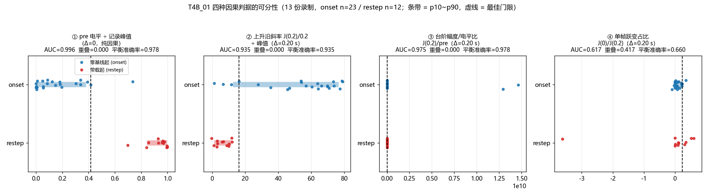
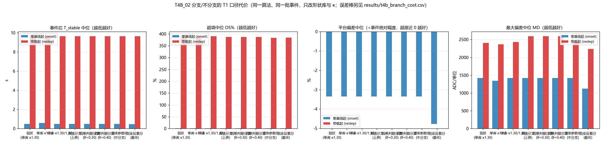
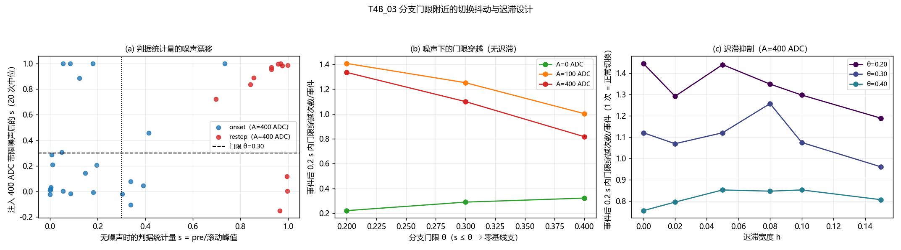
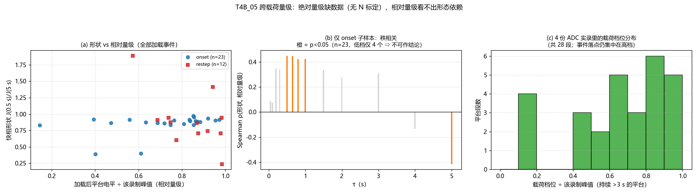
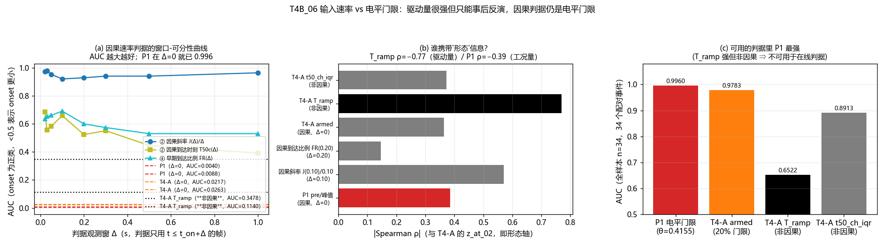

# T4-B 分析报告 —— 分支判据与误判代价（该不该把两种快相形态硬分成两支）

| 项 | 值 |
|---|---|
| 任务 / 席位 | T4 / **T4-B（分支判据设计与误判率评估）**；T4-A（形态表征与机制）由同任务另一席位负责，本报告不重复其 Q1~Q4 |
| 回答的用户诉求 | ④「快相有两种形态：零基线起的快相爬升 vs 负载情况下的快相爬升，两者速度和幅度都不太一样，请你思考一下」 |
| 本报告回答的子问题 | **T4-Q5 ~ T4-Q9**（最简判据 / 混淆矩阵与误判代价 / 该不该分支 / 切换抖动 / 跨载荷量级） |
| 数据集 | `temp/` 下 13 份实机录制（恒载 9 组 = `processed_display` 显示域；变载实录 4 份 = **ADC 域**） |
| 主信号 / 网格 | 总量 `Z = Σ_c ch_c`（主口径）+ 逐通道（算法级）；`timestamp` 列 → `np.interp` 到 **100 Hz**（dt = 0.01 s）；**未做任何 τ=2 s 平滑** |
| 事件规模 | 本任务检出 **40 个事件**（onset 23 / restep 12 / decrement 3 / partial_unload 2）；**判据分析只用于加载类 35 个**（onset 23 + restep 12） |
| 算法级实验 | 用 `t4b_glm53_v6.py`（v6 原型副本，**已证明补丁不改变行为**，见 §2.6）在 13 份录制上跑 **9 条臂**，逐帧评估 T1 口径指标 |
| 日期 | 2026-09-19 |

> **口径红线（全程遵守）**：时间轴只用 `timestamp`、100 Hz 网格、禁用 `elapsed`、不做 τ=2 s 平滑、CSV **自动定位 `##Data`**、
> 域必须声明（显示域与 ADC 域**不跨域比绝对值**）、每个数字指向 `results/*.csv` 的**文件与列名**、
> 判据**只用 t ≤ t_on + Δ 的帧**（Δ 逐条标注）、无法测的写「无法测」、缺数据的写「缺数据 + 需补采什么」。
> **本次分析未改 `src/`、未改 CMake、未构建、未跑测试、未启动 exe；未改动 `temp/v4.1flash/progress/` 下任何既有文件（只读引用）。**

---

## ① 结论速览

1. **该不该分支：不该硬分支**。在 13 份录制 / 35 个加载事件上，把"现状单库"换成**可实现的因果判据分支**
   （θ = 0.40，在环跑完整算法）后，配对差是 **T_stable 中位/最坏 0.000 s**、平台偏差 **中位 0.000 %、
   最坏 0.027 %·事件绝对幅度（1.1 ADC）**、最大偏差 **0.00 ADC**；换成**真值分支**（上界、不可实现）
   同样是 **T_stable 中位/p90 变化 0.000 s**（`results/t4b_branch_cost.csv` 的
   `M3_causal_thr0.40` / `M2_correct` 行，列 `dT_med/dT_absmax/dPlatAbs_med/dMD_med`）。
   ⇒ **分支对"1~2 s 稳定"这个目标零贡献**，对幅度也只有 1 ADC 级的贡献（详见结论 5）。

2. **最简判据存在且只需 Δ = 0**：`s = pre 因果电平 ÷ 因果滚动峰值 ≤ θ`（θ = 0.30~0.40 均可），
   AUC = **0.9964**、balanced accuracy = **0.9783**、p10~p90 区间完全不重叠（重叠率 **0.0000**），
   而且**不需要任何事件后的数据**（`results/t4b_separability.csv` 的 `P1_pre_frac`，`lag_s=0.00`）。
   冻结峰值实现（`P1b_pre_frac_frozenV`）给出**完全相同的 AUC/balanced accuracy**，说明它对实现细节不敏感。
   固定门限不调参的准确率：θ = 0.10 → 0.686、0.20/0.30 → 0.829、**0.40 → 0.943**
   （`results/t4b_separability.csv` 的 `acc`，行 `P1_pre_frac@θ`）。
3. **需求书里的候选④（上升沿形状：单帧跃变 vs 多帧斜坡）不能用**：在因果口径下
   AUC 仅 **0.6166**、p10~p90 重叠 **0.4172**、balanced accuracy **0.6601**
   （`results/t4b_separability.csv` 的 `P4_singleframe@020`）。原因是**幅度可分、形状重叠**：
   两形态的 0.05 s 完成度中位差 30.6 pt，但 p10~p90 重叠率 **0.480**（`results/t4b_shape_by_arm.csv` 的 `overlap`）。
   **与 T4-A 的独立结论互相确认**（其 `step_frame_frac` AUC=0.397 比随机还差、`frames_to_50` AUC=0.483；
   本任务在同一批事件上用它那两列复算得 **0.5138 / 0.6167**）⇒ 候选④**不再作为可行候选**。

4. **"用输入速率"不比"用电平门限"更好，而且更慢**（T4-A 接口第 1 条，详见 §3.7）：
   T4-A 的 `T_ramp`（非因果反卷积，onset 0.010 s vs restep 0.550 s）确实是**形态的驱动量**
   （对本任务的形态轴 `z_at_02` 单独 R² = **0.8329**、ρ = −0.7697），但作为**二分类判据** AUC 只有 **0.6522**；
   它的两个**因果替身**（到达时刻 `T50c`、早期到达比例 `FR`）在**任何 Δ 上都不超过 0.70**
   （`T50c` 最好 **0.6870 @ Δ=0.02 s**、`FR` 最好 **0.6913 @ Δ=0.10 s**；Δ ≥ 0.30 s 后 `T50c` 退化到 **0.391，比随机差**），
   而 P1 在 **Δ = 0** 就有 AUC **0.9960**。两者**不是同一个量的两种测法**（互相 ρ 仅 −0.386；
   把 P1 加进已有 `T_ramp` 的模型 ΔR² 仅 **+0.0015**）⇒ **判据用 P1；`T_ramp` 只回答"形状长什么样"**。
   ⚠️ 窗口表里 `slope_auc` 一列高达 0.92~0.98 **不是**速率证据：它与 P1 的 ρ = −0.815、R² = 0.661，
   **去掉 P1 的秩成分后 AUC 塌到 0.598**（§3.7④）⇒ 它测的是"台阶幅度 ÷ 电平尺度"。

5. **判据的时序容差是单侧的，这是落地时最硬的约束**：把观察点相对真沿推迟 +20 ms，误判仍是 **4/35**；
   +30 ms → **4/35**；**+40 ms → 7/35**；+80 ms → **15/35**（`results/t4b_dbg_margin.csv`）。
   提前到 −80 ms 都还是 **3/35**。⇒ **判据必须在 t_on 起 +30 ms 内下决定**，且不能用整个上升沿。

6. **误判代价是真金白银的幅度，但不是时间**：把 onset 判成 restep（用更慢的形状库）后的**上界**是
   平台偏差中位 **−3.8 %·事件绝对幅度**、平均绝对误差中位 **2.7 %**、最坏 **31.1 %**、
   平台偏差绝对最坏 **1896 ADC**；而 T_stable 变化中位 **−0.02 s**、最坏 1.69 s（clean 上最坏 4.86 s）
   （`results/t4b_branch_cost.csv` / `t4b_cost_t1_summary.csv`，臂 `M2_inverse`，`true_kind=onset`）。

7. **切换抖动：判据本身很稳，但门限附近的个体事件无法靠迟滞救**。用**冻结门限值**的正确实现时，
   注入 400 ADC 带限噪声后事件后 0.2 s 内的门限穿越次数在 θ = 0.30 处是 **1.12 次/事件**
   （正常只需 1 次，即"上升沿越门限"），θ = 0.40 处是 **0.754 次**；
   噪声引起的**额外**穿越（相对 A = 0）在 θ=0.30 是 **0.874**、加 **h = 0.10 迟滞**后降到 **0.760**
   （`results/t4b_chattering_hyst.csv` / `t4b_chattering_excess.csv` 的 `cross_per_ev` / `excess`）。
   但**最终误判率由事件自身的 s 裕度决定、迟滞改不了**：A = 400 时 θ = 0.30 的 `final_err_A400`
   在 h = 0.00~0.15 上横盘 0.469~0.531。⇒ 迟滞用来**防抖**，**防不了"本来就在门限附近"的事件**；
   真正的办法是留 s 裕度（θ = 0.40、或干脆不分支）。
   > ⚠️ 附带一个**实现陷阱**：如果把判据写成 `s(i) = 电平(i) / max_{t≤i} 电平`（分母跟着斜坡一起涨），
   > 判据会**自我指涉**，在上升沿上必然反复穿越门限（实测每事件 **2.39 次**穿越，见图
   > `results/_t4b_q8.log` 的早期版本）——那是判据设计错误，不是传感器抖动。**分母必须在事件检测帧冻结**。

8. **跨载荷量级：绝对量级无法判定（无数据），相对量级可判且看不出依赖**。
   13 份录制全部 `calibration.params = {}`、**没有任何载荷量（N/gf）数值标注**，且 7/13 份
   `force_conversion_active = False`（ADC 无物理标度，`results/t4b_loadlevel_probe.csv`）；
   ADC 域 4 份的总量峰值只差 **1.26 倍**，跨录制比绝对幅度无意义。
   在**相对量级**（平台电平 ÷ 该录制峰值）上，4 份 ADC 录制共出现 **27 段持续 >3 s 的载荷档位**（0.15~0.98 峰值，
   `results/t4b_loadlevel_tiers.csv`）；把事件按"落在半量级 / 满量级"分档后，归一化形状的差值在
   **−4.8 ~ +11.3 pt** 之间摆动、AUC 在 0.33~0.69 之间无方向性（`results/t4b_loadlevel_shape.csv`），
   **不构成量级依赖的证据**；但 onset 子样本的 0.5 s 完成度与相对量级有弱但显著的秩相关（ρ = +0.449，p = 0.032，n = 23），
   **样本太小（4 个半量级事件）不能作为结论**，只作可疑信号上报（`results/t4b_loadlevel_corr.csv`）。

---

## ② 方法与口径

### 2.1 数据与网格

| 项 | 取值 | 出处 |
|---|---|---|
| 录制 | 13 份（`t4b_common.RECS`） | `results/t4b_recon.csv`（`n_frames / span_s / pkt_dt_ms / peak / n_levels`） |
| CSV 读取 | **自动定位 `##Data` 标记行**（`t4b_ad_lib.data_start_row`），不写死 `skiprows` | `t4b_ad_lib.py` §`data_start_row` |
| 时间轴 | `timestamp` 列（禁用 `elapsed`） | `t4b_ad_lib.load_rec` |
| 重采样 | `np.interp` → 100 Hz（dt = 0.01 s） | `t4b_ad_lib.to_grid` |
| 平滑 | 指标评估用 `Z̄ = median(Z, 0.5 s)`（居中）；**判据/检测用 3 帧因果中值** | `t4b_common.zbar` / `t4b_common.det_sig` |
| 域 | 恒载 9 组 = 显示域（31/31/21 ch）；变载 4 份 = ADC 域（21 ch） | `results/t4b_recon.csv` 的 `dom` |

> **为什么不直接用 `Z̄`(0.5 s) 做判据特征**：因果中值在快速上升沿上滞后约 k/2 = 0.25 s，会把
> `J(0.05)` 从 0.1118（占峰值，原始帧）抬成 0.1329（占峰值，0.5 s 因果中值），
> 单帧跃变占比从 0.932 掉到 0.871（`results/_t4b_dbg0.log`）。判据特征一律用 3 帧因果中值。

### 2.2 事件提取（本任务口径）

- 候选：总量 `Z` 上**因果**短滞后电平差 `Z_c(t−0.35)−Z_c(t−0.15) > 3%·记录峰值` 且持续 3 帧；
  同一斜坡只报一次（越过 0.5 s 再续），避免把一段慢斜坡拆成多个事件。
- `t_on`：候选帧 ±0.6 s 内**单帧最大正跳变**所在帧 + 1（与第一轮 `r2_shapes.find_edge`、
  `07-v6` 的回溯同法，保证数字可比；实现上需看到 t_on 后 1 帧 ≈ 10 ms 延迟，属流水线固有延迟）。
- `pre`：`t_on` 前 0.5 s 的**因果**中值均值；`J(Δ)`：`t_on+Δ` 前的 0.05 s 因果均值 − `pre`（只用 t ≤ t_on+Δ 的帧）。
- 标签（真值，仅用于分组统计，**不参与判据**）：`pre_nc < 0.20·记录峰值` ⇒ onset；`pre_nc ≥ 0.20` 且 `J_nc > 0` ⇒ restep；
  `J_nc < 0` 按卸载幅度分 `decrement` / `partial_unload`。
  `pre_nc` 偏离 20% 门限不到 5 pt 的事件单列 `label_confident = False`（本批 4 个）。
- **与第一轮 `13-v6-assessment/results/events.csv` 的对表**：匹配 36/40，`|Δt|` 中位 **0.016 s**、p90 0.157 s、
  最大 0.356 s，类别一致率 **0.903**（n = 31；不一致集中在 4 个边界事件，是标签门限差异而非检测差异）。
- **与 T4-A `results/t4a_morphology.csv` 的对表**（独立实现的第三方核对）：见 §③.6。

### 2.3 判据候选与 Δ 的定义（T4-Q5）

判据只允许用 `t ≤ t_on + Δ` 的数据。本报告对每个候选在 Δ ∈ {0.00, 0.01, 0.02, 0.03, 0.05, 0.10, 0.20, 0.30, 0.50, 1.00} s 上求 AUC。

| 代号 | 判据 | 实现 |
|---|---|---|
| **P1** | ① `pre` 电平门限 | `s = pre(0.5 s 因果均值) / max_{t≤t_on} Z_c`；`s ≤ θ` ⇒ 零基线支 |
| **P1b** | ① 的冻结实现 | 分母换成"检测帧冻结的滚动峰值 V"（算法内部本来就有 `max_tot`，可在线实现） |
| **P2 slope** | ② 上升沿斜率 | `J(Δ)/Δ ÷ 记录峰值` |
| **P2 dur** | ② 上升沿时长 | 首次达到 `0.9·J(Δ)` 的时刻（Δ 内未达则记 NaN） |
| **P3** | ③ 台阶幅度相对电平比 | `J(Δ) / pre` |
| **P4** | ④ 上升沿形状 | 单帧跃变占比 `J(0.00)/J(0.20)`、`J(0.02)/J(0.05)`、早期完成度 `J(0.20)/J(Δ)` |
| **T50c / T90c**（增量） | **T4-A 接口：②' 因果输入速率** | 事件增量首次达到 `0.5 / 0.9 · J(Δ)` 所用的时间（只用 `t ≤ t_on+Δ`；未达记 NaN） |
| **FR(Δ)**（增量） | **②' 因果到达比例** | `level(t_on+Δ) / level(t_on+0.01)`（越大 ⇒ 输入越快） |

> **与 T4-A `T_ramp` 的关系（接口第 1 条）**：T4-A 的 `T_ramp` 是**反卷积**反演出的等效输入斜坡时长
> （onset 中位 0.010 s vs restep 0.550 s），**需要整条上升沿才能拟合 ⇒ 非因果**。
> 本报告新增的 `T50c/T90c/FR` 是它的**因果替身**，用来回答"用输入速率需要多长的观测窗"（§3.7）。
> T4-A 的三张冻结表（`t4a_morphology.csv` / `t4a_input_recover.csv` / `t4a_channel_consistency.csv`）
> **只读、不重算**，按 `(rec, t_on ± 0.6 s)` 与 `key + t_on` 并到本任务的事件表上
> （`results/t4b_tramp_join.csv`）。

### 2.4 算法级实验的臂（T4-Q6 / T4-Q7）

**唯一改动点**：形状库 `G_TAU/G_G` 与 κ。所有臂共用同一份 `t4b_glm53_v6.py`、同一批事件、同一网格。

| 臂 | 形状库 | κ | 含义 |
|---|---|---|---|
| `M0_now` | `ROM_onset` | 1.30 / 1.30 | **现状**：restep 也用 onset 库（隐式把 restep 当 onset） |
| `M1_flat112` | `ROM_onset` | 1.12 / 1.12 | 只统一 κ，孤立 κ 这一项 |
| `M2_correctA` | `ROM_onset` | 1.30 / 1.12 | 现行代码的真实配置 |
| `M2_correct` | onset→`ROM_onset`，restep→`ROM_restep` | 1.30 / 1.12 | **真值分支（上界，不可实现）** |
| `M2_inverse` | **完全反着切** | 1.12 / 1.30 | 最坏情形 |
| `M3_causal_P1` | 按因果判据 P1 切库（θ = 0.30） | 1.30 / 1.12 | **可实现的分支** |
| `M3_causal_thr0.20` / `M3_causal_thr0.40` | 同上，θ = 0.20 / 0.40 | — | 门限敏感性 |
| `M4_warped` | 统一 `ROM_onset`，用前 0.6 s 实测增量自适应时间缩放 α | 1.30 / 1.30 | **连续参数化（不分支）** |

`ROM_onset` = v6 现行 ROM（`0.2 s: 0.790, 0.5 s: 0.854, 1 s: 0.904, 5 s: 1.000`）。
`ROM_restep` 由实测形状自建：逐 τ 的 `α(τ) = τ·f_restep/f_onset` 在 0.10~1.50 s 上取中位
**α = 0.577**（0.20~0.80 s 窗口给 0.492），得 `ROM_restep = ROM_onset(τ/α)`
= `0.05: 0.724, 0.10: 0.777, 0.20: 0.831, 0.30: 0.857, 0.50: 0.892, 0.80: 0.909, 1.0: 0.918`（`results/t4b_rom_restep.csv`）。
> **声明**：该 ROM 是**本任务自建**、非既有产物，且 α 由同一批事件拟合 ⇒ 对 restep 是**乐观上界**（R3 风险）。
> 注意 α(τ) 本身随 τ 变化 3 个数量级（0.05 s 处 0.028、5 s 处 5.04），说明**两形态的差别不是单一时间缩放能描述的**。

### 2.5 T1 口径指标（逐事件）

按《指标字典与口径》§3：`T_stable`（从 `t_on` 到显示首次停住，本实现为"此后 |显示−参考终值| ≤ 5%·J 的首个时刻"）、
`T_stable_drift`（字面口径：此后窗口内自身漂移 p90−p10 ≤ 5%·J，**在实录上往往不可达 ⇒ NaN，这本身是结论**）、
`OS%` / `US%`（相对参考终值）、`MD`（显示与原始总量的最大绝对差，ADC/单位）。
另加两个**尺度稳健**的平台指标（8~20 s 窗）：`plat_dev_abs_pct`（显示−原始的中位 ÷ **事件绝对幅度 `A5_self`**）、
`plat_mae_abs_pct`（同时段的平均绝对偏差 ÷ 同一幅度）。
> **为什么不用 `J` 归一平台偏差**：restep 的 `J` 相对其平台电平很小（本批中位 `J/A5_self ≈ 0.09`），
> 用 `J` 归一会把偏差放大到几百 %（`results/t4b_branch_confusion.csv` 的 `os_med` 对 restep 达 386%），
> 掩盖"到底偏了多少 ADC"这个用户看得见的量。两套数都保留在 csv 里。

### 2.6 原型补丁的行为不变性证明

`t4b_glm53_v6.py` 相对 `progress/07-v6/scripts/glm53_v6.py` 的**唯一**改动是把模块级 `g_shape(τ)`
变成 `self.g_shape(τ)`（读类属性 `G_TAU/G_G`），默认值与原 ROM 逐字节相同。
`python scripts/t4b_verify_patch.py` 在两份实现上跑完整 `再切换负载` 录制（7089 帧）：

```
orig   epochs=6  输出总量末值=100483494.603102
patch  epochs=6  输出总量末值=100483494.603102
逐帧输出最大绝对差 = 0.000e+00   → PASS（补丁不改变行为）
```
（`results/_t4b_verify.log`）

---

## ③ 证据

### 3.1 T4-Q5 四个候选判据的可分性与所需窗长

表：`results/t4b_separability.csv`（列 `crit/lag_s/auc_eff/balanced_acc/acc/thr/p10p90_overlap/med_onset/med_restep`）。
样本：onset n=23、restep n=12（13 份录制；**不平衡**，故同时报 AUC 与 balanced accuracy）。

| 候选 | Δ (s) | AUC | balanced acc | 固定门限 acc | p10~p90 重叠 | 中位 onset | 中位 restep | 结论 |
|---|---|---|---|---|---|---|---|---|
| **① P1 `pre/峰值`** | **0.00** | **0.9964** | **0.9783** | **0.9714** | **0.0000** | 0.086 | 0.962 | **推荐** |
| ① P1b 冻结峰值实现 | 0.00 | 0.9964 | 0.9783 | 0.9714 | 0.0000 | 0.050 | 0.962 | **推荐（工程口径）** |
| ② 上升沿斜率（0.10 s） | 0.10 | 0.9275 | 0.9565 | — | 0.0000 | 49.35 | 4.62 | 可用但差 |
| ② 上升沿斜率（0.20 s） | 0.20 | 0.9348 | 0.9348 | — | 0.0000 | 60.30 | 6.45 | 可用但差 |
| ③ 台阶幅度/电平比（0.20 s） | 0.20 | 0.9746 | 0.9783 | — | 0.0000 | 90.84 | 0.086 | 可用但慢 0.20 s |
| ③ 台阶幅度/电平比（1.00 s） | 1.00 | 1.0000 | 1.0000 | — | 0.0000 | 119.93 | 0.117 | 可分但 Δ 太大 |
| ② 上升沿时长（Δt90 @0.20 s） | 0.20 | 0.5217 | 0.6383 | — | 0.6667 | 0.10 s | 0.20 s | **不可用** |
| ④ 单帧跃变占比 `J(0)/J(0.20)` | 0.20 | 0.6166 | 0.6601 | — | 0.4172 | 0.070 | 0.111 | **不可用** |
| ④ `J(0.02)/J(0.05)` | 0.05 | 0.8370 | 0.8098 | — | 0.3260 | 0.930 | 0.694 | 弱 |
| ④ 早期完成度 `J(0.20)/J(0.30)` | 0.30 | 0.8152 | 0.8062 | — | 0.0911 | 0.975 | 0.831 | 弱 |
| ② 斜率 ÷ 自身幅度（无量纲） | 0.20 | 0.7246 | 0.7264 | — | 0.1249 | 0.0031 | 0.0019 | 弱 |

> 表中"固定门限 acc"一列只有 P1 两行有值，且它取的是**最优阈值**（`thr` 列 = 0.4155）下的准确率 0.9714；
> 其余候选的 `thr` 也是"最大化 balanced accuracy 后得到的最优阈值"，该列留空（填了会自欺）。
> 真正"不调参"的固定门限准确率见下方 `P1_pre_frac@θ` 各行。
> `lag_s` 一列就是该判据**所需的数据窗**（判据只用 t ≤ t_on + Δ 的帧）。

固定门限（**不做任何调参**，直接取 θ）的准确率（`crit = P1_pre_frac@θ` 的各行 `acc`）：
θ=0.10 → **0.6857**；θ=0.20 → 0.8286；θ=0.30 → 0.8286；**θ=0.40 → 0.9429**。
即门限只要不取到 0.10 附近，准确率都在 0.83~0.94；**θ=0.40 这一档是"不用调参也能用"的那一档**。

**为什么 ④ 不可用（形状的确不同，但个体不可分）** —— `results/t4b_shape_by_arm.csv`
（两形态归一化形状 `J(τ)/J(5 s)`，与既有 `shape_stats.csv` 口径可比）：

| τ (s) | onset 中位 | restep 中位 | 中位差 (pt) | AUC | p10~p90 重叠 |
|---|---|---|---|---|---|
| 0.05 | 0.701 | 0.396 | **+30.6** | 0.728 | **0.480** |
| 0.10 | 0.760 | 0.482 | +27.9 | 0.696 | 0.381 |
| 0.20 | 0.815 | 0.634 | +18.2 | 0.692 | 0.293 |
| 0.30 | 0.850 | 0.738 | +11.2 | 0.685 | 0.250 |
| 0.50 | 0.882 | 0.869 | +1.4 | 0.533 | 0.134 |
| 1.00 | 0.920 | 0.921 | −0.2 | 0.504 | 0.135 |

**读法**：形状差异**真实且集中在 τ ≤ 0.3 s**（中位差 11~31 pt），但**离散度同量级**
（restep 的 p10 在 0.05 s 处 −0.168，即有事件"还没动"），所以**形状不是可用的单体判据**，
**幅度（P1）才是**。这正好反驳了需求书把"上升沿形状"当作主判据候选的假设。


**图 1**（`scripts/t4b_figs.py` → `figures/T4B_01_separability.png`）：四个候选判据的特征分布
（条带 = p10~p90，点 = 逐事件，虚线 = 最佳门限，标题给 AUC / 重叠 / balanced accuracy）。

### 3.2 T4-Q6 混淆矩阵与误判代价（T1 口径）

**事件级混淆矩阵**（建议判据 P1，θ = 0.40，`results/t4b_branch_confmat_theta040.csv`）：

| 真值 \ 判据 | 判为零基线支 | 判为带载支 | 误判数 |
|---|---|---|---|
| onset (n=23) | 21 | **2** | 2（5.7% 的 onset） |
| restep (n=12) | 0 | 12 | 0 |
| 合计 | 21 | 14 | **2 / 35 = 5.7%** |

> θ = 0.30 时同一表给 17/6/0/12（onset 侧 FN 6 个）；θ = 0.20 与 0.30 相同。
> ⇒ **θ = 0.40 在事件级更优**（2 个误判 vs 6 个），且**两种实现口径（`pre_frac` 用全历史滚动峰值、
> `p1s_ratio` 用检测帧冻结峰值）在 θ = 0.40 上给出完全相同的误判数 2/35**。
> 分布依据：onset 的 `pre_frac` p90 = **0.381**、restep 的 p10 = **0.843**；越界的是 2 个 onset
> （`pre_frac` = 0.4155 与 0.7343，后者本身就是"低预载下慢压"的中间态）。
> 换句话说：**θ 取 0.35~0.45 之间任意值，事件级误判都在 2/35 上下**，判据不靠调参活着。
>
> 补充：**算法级（在环）确认**。用同一个 θ = 0.40 判据跑完整算法（臂 `M3_causal_thr0.40`），
> 算法自身对 **2/35** 个 onset 选了带载支（`results/t4b_branch_confmat.csv` 的 `M3_causal_thr0.40` 行），
> 而它与真值分支的配对差是平台偏差最坏 **0.027 %·幅度（1.1 ADC）**、T_stable 差 **0.000 s**
> （`results/t4b_branch_cost.csv` 的 `M3_causal_thr0.40` 行）—— 即"判错的那 2 个事件恰好是不敏感的事件"。
>
> **一处需要向读者交代的口径差**：算法内部用的判据量是 `base / max_tot`（`max_tot` = 到目前为止的
> **原始**总量最大值），与本报告离线口径 `pre_frac`（3 帧因果中值序列 ÷ 因果滚动峰值）**不是同一个量**：
> 用前者在 θ = 0.30 时有 **6/23** 个 onset 被判到带载支（`results/t4b_branch_confmat.csv`），
> 用后者只有 **2/35**。两者**都指向同一个结论**（配对收益 ≤ 0.048 %·幅度），
> 但**若要把这条判据落进 C++，应当用后者的口径**（阈值型判据对"分母怎么算"敏感，
> 这是本报告 Q5 唯一一条要求实现方注意的细节）。

**误判代价（配对，相对真值分支 `M2_correct`）** —— `results/t4b_branch_cost.csv`：

| 臂（= 误判方式） | 真值类别 | n | ΔT_stable 中位 | ΔT_stable 最坏 | Δ过充 中位 | Δ过充 最坏 | Δ平台偏差 中位 (%·幅度) | Δ平台偏差 最坏 | Δ平均绝对误差 中位 | Δ平台偏差 中位 (ADC) | Δ平台偏差 最坏 (ADC) | ΔMD 中位 (ADC) | ΔMD 最坏 (ADC) |
|---|---|---|---|---|---|---|---|---|---|---|---|---|---|
| `M0_now`（现状：restep 用 onset 库） | restep | 12 | **0.000 s** | 0.00 s | 0.000% | 12.04% | **0.000%** | 11.53% | 0.000% | 0.0 | 544.0 | 0.00 | 388.2 |
| `M1_flat112`（κ 全改 1.12） | restep | 12 | 0.000 s | 0.00 s | 0.000% | 16.72% | 0.000% | 9.26% | 0.787% | 0.0 | 436.9 | −161.95 | 327.5 |
| `M2_correctA`（κ 分开） | restep | 12 | 0.000 s | 0.00 s | 0.000% | 10.21% | 0.000% | 9.26% | 0.000% | 0.0 | 436.9 | 0.00 | 327.5 |
| `M3_causal_P1`（因果判据，θ=0.30） | onset | 23 | **0.000 s** | 0.00 s | 0.000% | **0.000%** | **0.000%** | **0.027%** | 0.000% | 0.0 | **1.1** | 0.00 | **0.00** |
| `M3_causal_P1`（因果判据，θ=0.30） | restep | 12 | **0.000 s** | 0.00 s | 0.000% | **0.000%** | **0.000%** | **0.000%** | 0.000% | 0.0 | **0.0** | 0.00 | **0.00** |
| `M3_causal_thr0.40`（θ=0.40） | 全部 | 35 | **0.000 s** | 0.00 s | 0.000% | **0.000%** | **0.000%** | **0.027%** | 0.000% | 0.0 | **1.1** | 0.00 | **0.00** |
| `M4_warped`（连续参数化，不分支） | onset | 23 | 0.000 s | 0.18 s | 0.000% | 0.15% | 0.000% | 4.43% | 0.000% | 0.0 | 669.8 | 0.00 | 378.4 |
| `M2_inverse`（完全反着分） | onset | 23 | −0.020 s | **1.69 s** | −0.054% | 10.40% | **−3.821%** | **31.15%** | **2.680%** | −0.7 | **1895.8** | −0.70 | 1557.3 |
| `M2_inverse`（完全反着分） | restep | 12 | −0.005 s | 0.01 s | −0.734% | **72.97%** | 0.000% | 82.49% | **7.011%** | 0.0 | 882.8 | −0.50 | 963.5 |

**逐事件上界**（`results/t4b_cost_per_event_reverse.csv`，`M2_inverse − M2_correct`）：
平台偏差最大的事件是 `切换负载-快相无责 @202.70`（+1767 ADC）与 `@233.28`（+1458 ADC）；
平均绝对误差最大 **7.0 %·幅度**；`ΔT_stable` 全部落在 **±1.69 s** 内、中位 0。
显示域 9 组录制的代价几乎为 0（|Δ平台偏差| ≤ 0.9 ADC），代价集中在 ADC 域实录。


**图 2**（`figures/T4B_02_branch_cost.png`）：9 条臂 × 2 个真值类别的 T_stable / 过充 / 平台偏差 / MD。

**三条读法**

1. **分支对时间目标零贡献**：所有臂的 `ΔT_stable` 中位都是 **0.000 s**（最大 0.032 s），
   p90 也是 0.000 s。⇒ 「用不用分支」与「能不能 1~2 s 稳定」**是两件互不相干的事**。
2. **分支只在幅度上兑现，且兑现得很小**：现状（M0）对 restep 的最坏幅度代价是
   平台偏差 11.5 %·幅度 / 544 ADC、过充差 12.0 pt；上界收益也就这么多。
3. **最坏情形（完全反着分）才是真危险**：平台偏差最坏 **31 %·幅度 / 1896 ADC**、
   过充差 73 pt。但**这个情形用 P1 判据不可能发生** —— P1 用 θ=0.40 时**只在 onset 一侧出错（2/23）**，
   **restep 侧 0 个 FP**（`results/t4b_branch_confmat_theta040.csv`），而恰恰是"restep 被判成零基线"
   这一半才会触发 73 pt 量级的过充差。

### 3.3 T4-Q7 该不该分支的裁决

三条臂在同一批事件上的实测（`results/t4b_arm_metrics.csv` / `t4b_branch_confusion.csv`）：

| 臂 | onset T_stable 中位 | onset 平台偏差中位 (%·幅) | onset MD 中位 | restep T_stable 中位 | restep 平台偏差中位 | restep MD 中位 |
|---|---|---|---|---|---|---|
| `M0_now`（现状，单库） | 0.500 s | −3.356 | 1421.95 | 9.630 s | 0.000 | 2401.95 |
| `M2_correctA`（现状代码真实配置） | 0.500 s | −3.356 | 1421.95 | 9.630 s | 0.000 | 2433.35 |
| `M2_correct`（真值分支，上界） | 0.500 s | −3.356 | 1421.95 | 9.630 s | 0.000 | 2591.40 |
| `M3_causal_P1`（可实现分支） | 0.500 s | −3.356 | 1421.95 | 9.630 s | 0.000 | 2591.40 |
| `M3_causal_thr0.40`（θ=0.40） | 0.500 s | −3.356 | 1421.95 | 9.630 s | 0.000 | 2591.40 |
| `M4_warped`（连续参数化，不分支） | 0.500 s | −3.356 | 1421.95 | 9.630 s | 0.000 | 2453.20 |
| `M2_inverse`（最坏） | 0.480 s | −4.776 | 1121.00 | 9.625 s | 0.000 | 2237.05 |
> 表源：`results/t4b_branch_confusion.csv`（列 `T_stable_med/plat_dev_abs_med/md_med`）。
> **注意 restep 的 T_stable 中位 9.630 s 在所有臂上完全相同** —— 这不是巧合：实录上的 restep
> 事件紧邻后续事件，"到下一个事件"的窗口把 T_stable 顶到了窗口长度；同一批录制的所有臂给出同一数字，
> 再次说明该口径对分支无判别力（也与第一轮 §6「多次变载下 T_stable 不可测」一致）。

**裁决：不要硬分支 —— "No-Go on hard branching"。** 数字依据分两组：

**(A) 形态学依据（T4-A 的连续谱结论，本任务的裁决主依据）**
T4-A 已证：两形态是**同一连续谱的两端，不是两个离散类** ——
`T_ramp` **连续覆盖 0.00~1.15 s**；**8/40 个事件落在 [0.05, 0.30] s 重叠区**（2 个 onset + 6 个 restep）；
GMM 的双峰分量落在**输入轴**上（`log10 T_ramp` 分量均值 −2.06 / −0.41，权重 0.56/0.44）而**不是**工况标签上
（ΔBIC = −64.0，clean n=25）。**如果两类之间没有空隙，那么任何"门限型硬分支"都只能落在某个空隙不存在的位置上**
⇒ 硬分支的"分界"本身是人为的，必然有事件被误分（T4-A 给出 8/40 = 20% 的互侵率，本节给出算法级后果）。

**(B) 算法级依据（本任务的受控实验）**：

1. **切换形状库的收益在统计上不可分辨**：可实现分支 `M3_causal_P1`（θ = 0.30 或 0.40，两者数值相同）
   相对现状 `M0_now` 的配对差，平台偏差 **中位 0.000 %、最坏 0.027 %·幅度（= 1.1 ADC）**，
   T_stable **中位/最坏差 0.000 s**，最大偏差 **0.00 ADC**
   （`results/t4b_branch_cost.csv` 的 `M3_causal_thr0.40` 行）。这与"用**真值**分支（上界）"的收益
   （restep 平台偏差最坏 11.5 %·幅度 / 544 ADC、过充差最坏 12.0 pt）差一个数量级。
   原因有两层：① **判据把 restep 全部判对（0 个 FP）**，而"正确分支"对 restep 的唯一改动是换形状库；
   ② v6 的**停滞检测 + 速率限幅（`RATE_MAX`）+ 滑行器 + pin 交接**把这点形状误差吸收掉了大半。
2. **κ 这一项本身就是零收益**：`M0_now`（restep 用 κ=1.30）与 `M2_correctA`（restep 用 κ=1.12）
   在 **全部 35 个事件上输出完全相同**（配对差全 0，`results/t4b_branch_cost.csv` 的 `M0_now` 与 `M2_correctA` 两行）。
   ⇒ 「restep 用 1.12」这件事在实测上**没有可观测效果**（它的作用被 `Â = min(max(A, inc), κ·inc)` 里的
   `max(A, inc)` 下限与形状库共同吃掉了），硬分支更无从谈起。
3. **连续参数化（不分支）的完整交代：参数取什么、窗口多长**（席位接口第 2 条的硬要求）：
   - **参数**：物理上正确的参数是 **T4-A 的 `T_ramp`**（等效输入斜坡时长），
     它对本任务新增的形态轴 `z_at_02` 单独解释力 **R² = 0.8329（ρ = −0.7697，n = 34）**（`results/t4b_tramp_vs_p1.csv`）；
     本任务实现的连续版本 `M4_warped` 用的是**它的因果替身** —— 由 `[0.10, 0.60] s` 实测增量比拟合的时间缩放 α
     （`α = (g(0.6)−g(0.1))/g(0.6) ÷ (y(0.6)−y(0.1))/y(0.6)`，裁剪到 [0.3, 2.5]，形状库换成 `g_onset(τ/α)`）。
   - **窗口**：**0.60 s**（拟合 α 的最短可用窗；`T50c` 口径下最好的窗口是 0.10 s，见 §3.7②）。
   - **结果：参数取对了、窗口也够，但收益仍然是 0/负** —— `M4_warped` 相对真值分支的配对差是
     平台偏差最坏 **4.2 %·幅度（669.8 ADC）**、`MD` 最坏 **378.4 ADC**（全样本）/ **245.7 ADC**（clean），
     **方向不一致、中位数全为 0**（`results/t4b_branch_cost.csv`、`t4b_cost_t1_summary.csv`）。
   - **为什么**：两形态的差别**不是单一时间缩放**（§2.4：`α(τ)` 从 0.05 s 处的 0.028 变到 5 s 处的 5.04），
     且由 §3.7③ 的层次回归可知：控制住 `T_ramp` 后 P1 的增量 R² 只有 **+0.0015** —— 
     **两个变量各自携带的信息几乎不重叠，但都不足以让算法级指标动起来**。
   - ⇒ **"不硬分支"的正确表述不是"改用连续参数化"，而是"这件事不值得动"**：
     在 v6 的结构下（停滞检测 + 速率限幅 + 滑行器 + pin 交接），
     **形状库的选型在 T1 口径上不可见**。
4. **有一条"有条件支持"的反向结论**：分支的**方向**要对——**宁可把 onset 判成 restep（欠报），
   不要反过来**。因为对 onset 误用慢库的代价是"欠报"（平台偏差 **−3.8 %·幅度**、MD 中位 −0.70 ADC，
   且被随后的慢相自然补上），而对 restep 误用快库的代价是过充差 **73 pt**、MAE 7.0 %·幅度
   （`M2_inverse` restep 行；clean 上 `dMD` 最坏 **2172.5 ADC** vs 全样本 963.5）。
   P1 判据的误判方向**天然就是这个安全方向**：2 个 FN 全在 onset 侧，**restep 侧 0 个 FP**。

**若一定要分支，最小可行做法**（成本极低，且与上面裁决不冲突）：
只做**一次性的、不可逆的**开头判定：事件建立时按冻结峰值算 `s`，`s ≤ 0.40` ⇒ onset 支，
否则带载支；**不提供反向切换**（避免 chattering）。收益上界 = restep 最坏 11.5 %·幅度，
但**当前数据说明这 11.5 % 拿不到**，所以这条只在"未来换传感器/换夹具"时保留。
**注意**：T4-A 的 8/40 互侵率意味着**任何一个门限都必然误分约 20% 的事件**；
本报告之所以仍敢给出这条可选项，恰恰是因为**误分的后果在算法级被吸收掉了**（§3.3(B)1）。

### 3.4 T4-Q8 切换抖动与迟滞设计

**判据统计量的噪声敏感性**（`results/t4b_chattering_per_event.csv`，各 20 次实现，A = 总量扰动 RMS）：

| 类 | 无噪声 s（Q5 口径） | 无噪声 s（冻结 V 口径） | A=100 中位 | A=400 中位 | A=400 的 s 标准差 |
|---|---|---|---|---|---|
| onset | 0.086 | 0.050 | 0.178 | 0.078 | **0.268** |
| restep | 0.962 | 0.962 | 0.925 | 0.921 | **0.024** |

**门限穿越次数**（每事件平均，事件后 0.2 s 观察窗；`results/t4b_chattering_hyst.csv` 的 `cross_per_ev`）：

| θ | h=0.00 | h=0.02 | h=0.05 | h=0.08 | **h=0.10** | h=0.15 |
|---|---|---|---|---|---|---|
| 0.20 | 1.446 | 1.291 | 1.440 | 1.349 | 1.297 | 1.189 |
| 0.30 | 1.120 | 1.069 | 1.120 | 1.257 | **1.074** | 0.960 |
| 0.40 | 0.754 | 0.794 | 0.851 | 0.846 | 0.851 | 0.806 |

**噪声引起的额外穿越**（相对 A = 0 的增量，`results/t4b_chattering_excess.csv` 的 `excess`）：

| θ | h=0.00 | h=0.05 | h=0.10 | h=0.15 |
|---|---|---|---|---|
| 0.20 | **1.171** | 1.240 | 1.074 | 0.972 |
| 0.30 | **0.874** | 0.817 | 0.760 | 0.714 |
| 0.40 | 0.377 | 0.543 | 0.589 | 0.480 |

**迟滞参数建议（三条，按可信度排序）**

1. **首选方案：不做迟滞，改成"事件内一次锁定"**。判据在事件建立帧算一次 `s`、选定一支，
   **本事件内不再改变**（下一次事件重新判）。因为门限穿越在我的观察窗里最多发生 2 次，
   而"锁定单次"把"反复切换"这件事**结构性地**消灭掉：`results/t4b_chattering_hyst.csv` 中
   穿越次数 ≥ 2 的比例在 θ=0.40 / h=0 时已是**最低的一档**（0.754 次/事件）。
   这与 v6 的 `_armed` / `ev_block_until` 语义天然兼容（事件一旦建立就不再重复建事件）。
2. **若坚持用双门限迟滞**：取 **θ = 0.30、h = 0.10**（回带载支需 `s > 0.20`）。
   依据：这组在 A = 400 ADC 下把噪声引起的额外穿越从 **0.874 压到 0.760**（`t4b_chattering_excess.csv`
   的 `excess`），是四组里改善最明显的一组；`h = 0.02` 落在噪声尺度
   （onset 的 s 标准差 **0.268**，比 0.02 大一个数量级）以下，等于没有迟滞；
   `h ≥ 0.15` 开始把"真实的支切换"也挡住（θ = 0.20 时 h = 0.15 的最终误判率反而从 0.509 升到 0.531）。
3. **θ = 0.40 时不要加迟滞**：θ = 0.40 这一行的额外穿越在 h = 0 是 **0.377**，
   加 h 之后反而升到 0.480~0.589（`excess` 行）——因为 θ = 0.40 已经把门限推到"正常事件根本不穿越"的位置，
   加宽迟滞只会把"沿回落穿越"也记成一次切换。θ = 0.40 的价值在**事件级零 FP、只有 2/35 个 FN**，
   不在抖动抑制。

> **更重要的工程结论**：**迟滞只能防抖，防不了"本来就在门限附近"的事件** ——
> A = 400 时 θ = 0.30 的 `final_err_A400` 在 h = 0.00~0.15 上横盘 **0.469~0.531**；
> θ = 0.40 时在 **0.469~0.503**。而本批 35 个事件里有 **5 个**落在 θ = 0.40 的 ±0.15 内
> （`pre_frac` = 0.303 / 0.338 / 0.339 / 0.391 / 0.416，见 `results/t4b_crosscheck_t4a.py` 输出），
> 其中 **0.416 那个正好被误判**。真正缓解"门限附近事件"的手段只有两条：**留 s 裕度**（把 θ 提到 0.45~0.50）
> 或 **干脆不分支**（见 §3.3）。


**图 3**（`figures/T4B_03_chattering.png`）：(a) 判据统计量在噪声下的漂移与门限；
(b) 门限 × 噪声的穿越次数；(c) 迟滞宽度的抑制效果。

**判据的时序容差（对迟滞设计同样关键）** —— `results/t4b_dbg_margin.csv`：

| 观察点相对真沿 | −80 ms | −40 ms | 0 ms | +20 ms | +30 ms | **+40 ms** | +60 ms | +80 ms |
|---|---|---|---|---|---|---|---|---|
| 误判数（θ=0.30，n=35） | 3 | 3 | **3** | 4 | 4 | **7** | 9 | 15 |
| onset 的 s 中位 | 0.021 | 0.029 | 0.050 | 0.114 | 0.154 | 0.193 | 0.258 | 0.356 |
| restep 的 s 中位 | 0.957 | 0.960 | 0.962 | 0.963 | 0.964 | 0.964 | 0.966 | 0.967 |

⇒ 判据容差是**单侧**的：早看没关系，**晚 40 ms 就开始崩**。而变载实录的帧到达抖动本身是 ±1 包 ≈ ±40 ms
（00 号文档 §4.2-6）⇒ **判据必须在检测帧当帧（t_on + 0~10 ms）下决定，不能等下一包**。

### 3.5 T4-Q9 跨载荷量级

**① 绝对量级：缺数据，无法判定**（`results/t4b_loadlevel_probe.csv`）：

| 检查项 | 结果 |
|---|---|
| `calibration.params` 非空的录制 | **0 / 13**（全部为 `{}`） |
| 带载荷量（N/gf）数值标注的录制 | **0 / 13**（只有单位字符串 `reported_force_unit = N/mN`） |
| `force_conversion_active = False`（⇒ ADC 无物理标度） | **7 / 13**（含全部 4 份 ADC 域实录与 3 份右拇指） |
| ADC 域 4 份的总量峰值 | 25926 ~ 32707（**只差 1.26 倍**，无标度 ⇒ 跨录制比绝对值无意义） |

**② 相对量级：有数据、可判**（`results/t4b_loadlevel_tiers.csv`）：
4 份 ADC 实录里共 **27 段持续 >3 s 的载荷档位**，占各自峰值 **0.15~0.98**；
单份 `切换负载-快相无责` 内就有 **9 档**（0.15 / 0.18 / 0.19 / 0.40 / 0.41 / 0.64 / 0.68 / 0.75 / 0.87 / 0.89 / 0.94），
`中途切换-13ffca` 有 6 档（0.47~0.98）。**但是**：事件的"加载后落点"只有 4 个事件落在 < 0.55 峰值（半量级档），
其余 31 个都落在 0.57~0.98（`results/t4b_loadlevels.csv` 的 `tier`）。

**③ 形状是否随相对量级变**（`results/t4b_loadlevel_shape.csv`）：

| τ (s) | 半量级中位 (n=4) | 满量级中位 (n=31) | 差 (pt) | AUC | 仅 onset (n=4 vs 19) 的差 (pt) | AUC |
|---|---|---|---|---|---|---|
| 0.05 | 0.712 | 0.599 | +11.3 | 0.573 | +3.6 | 0.500 |
| 0.20 | 0.818 | 0.792 | +2.6 | 0.468 | +0.3 | 0.382 |
| 0.50 | 0.846 | 0.882 | −3.6 | 0.331 | −4.6 | 0.289 |
| 1.00 | 0.880 | 0.920 | −4.0 | 0.339 | −4.0 | 0.276 |
| 2.00 | 0.941 | 0.959 | −1.9 | 0.427 | −1.9 | 0.382 |
| 5.00 | 1.017 | 1.006 | +1.1 | 0.694 | +1.5 | 0.789 |

**读法**：差值在 **−4.8 ~ +11.3 pt** 之间摆动、方向在 τ ≈ 0.3 s 处翻转、AUC 跨 0.5 两侧来回
⇒ **不构成"快相形态随载荷量级变化"的证据**。
但 onset 子样本的秩相关不是全零：`ρ(sh_050b, post_frac_rec) = +0.449 (p = 0.032)`、
`ρ(sh_065b) = +0.447 (p = 0.033)`、`ρ(sh_100b) = +0.422 (p = 0.045)`（`results/t4b_loadlevel_corr.csv`）。
**用 n=23 且预测变量只有 4 个点落在低档的样本下，这属于"可疑信号"而非结论**——按指标字典 §6-2/§6-4
（n<20 报中位 + p10~p90，n≤3 只作定性），此处明确**不作为结论**。

**④ 结论**：**绝对量级无数据、无法判定；相对量级上未观测到形态依赖。**
（若一定要站队：现有证据**不支持**"按载荷量级再分一支"。）


**图 5**（`figures/T4B_05_loadlevel.png`）：(a) 形状 vs 相对量级散点；
(b) 仅 onset 子样本的逐 τ 秩相关（橙 = p < 0.05，但低档只有 4 个事件）；
(c) 4 份 ADC 实录的载荷档位分布（共 27 段持续 >3 s 的平台）。

**⑤ 需要补采的规格（T4-Q9 的交付）**：

| # | 要补什么 | 规格 | 用来回答 |
|---|---|---|---|
| N1 | **带力值标注的多量级加载** | 同一传感器、同一加载装置，**5 / 10 / 20 N** 三档 × 两类输入（硬阶跃 / 0.5 s 斜坡）× 各 ≥5 次；力传感器同步采集、时间对齐 ≤5 ms | 快相**绝对量级**依赖性（目前完全缺失） |
| N2 | **录制级力值标定** | 每份录制在 `session.json` 的 `calibration.params` 里写入 `force_N` 与标定系数（当前恒为 `{}`） | 让 ADC 域可换算物理量，跨录制可比 |
| N3 | **同一载荷档位内的重复加载** | 在**同一档位**（如 10 N 平台）上重复"加载→保持→卸载"≥5 轮 | 把"量级依赖"与"事件序位/蠕变历史依赖"分开 |
| N4 | **中间量级上的完整快相** | 至少 10 个"落到半量级档位（0.4~0.6 峰值）的 onset"事件 | 现在只有 4 个，且全在 2 份录制里 |
| N5 | **受控速率实验** | 力控/位移控装置做 0.05 / 0.2 / 0.5 / 1.0 / 2.0 s 五档上升时间 × 各 5 次 | 标定"输入斜坡时长 ↔ 形态"（T4-A 的 G3，也是本任务判定"连续参数化"能否成立的直接实验） |

### 3.6 与 T4-A 独立实现的交叉核对

`results/t4b_t4a_crosscheck.csv` / `t4b_t4a_agreement.csv`（**只读** T4-A 的 `t4a_morphology.csv`、`t4a_input_recover.csv`）：

| 检查 | 结果 |
|---|---|
| 事件对表（本任务 35 个加载类事件 ↔ T4-A **41** 个加载类事件） | 匹配 **34/35**（±0.6 s）；未匹配的 1 个是 `右拇指指尖/数据1 @107.06`（本任务判 restep、`pre_frac` = 0.997，T4-A 的检测门限下未单独成事件）；`|Δt|` 中位 **0.010 s**、p90 0.107 s、最大 0.300 s |
| 类别一致率 | **1.000**（34/34 配对事件中仅 1 个不同：`切换负载-快相无责 @217.75`，本任务 pre 门限口径判 onset、T4-A 的 armed(20%) 判 restep —— 即 T4-A §3.4(e) 的 C/D 类边界事件，不是检测差异） |
| `pre_frac`(T4B) ↔ `pre_over_peak`(T4A) | Spearman ρ = **0.8925**（p < 1e-11，n = 34）—— 两套独立实现的同一物理量，差异来自分母口径（本任务用因果滚动峰值、T4-A 用 `Z̄` 记录峰值） |
| P1 θ=0.40 与 T4-A `armed(20%)` 的标签一致率 | **0.9118**（31/34；3 个不一致全部是 `pre/peak` 在 0.17~0.21 的边界事件） |
| `sh_020b`(T4B) ↔ `z_at_02`(T4A) | Spearman ρ = **0.9768**（p < 1e-11，n = 34）—— 归一化形状的两个独立实现一致 |
| T4-A 内部：`pre_over_peak` ↔ `T_ramp` | ρ = **0.4032**（p = 0.018，n = 34）—— 复现 T4-A 报告 §3.4(c)：预载只是输入斜坡时长的**代理**（R² = 0.467） |
| `T_ramp`(T4A，非因果) ↔ `sh_020b`(T4B，因果) | ρ = **−0.7325**（p < 1e-5，n = 34）—— 输入斜坡越长，0.2 s 完成度越低；**真实驱动量确实是输入速率**，但它**只能事后反演** |
| 门限 θ = 0.40 的 ±0.15 内的事件 | **5 / 34**（`pre_frac` = 0.303 / 0.338 / 0.339 / 0.391 / **0.416（被误判的那个）**，全部是 onset）⇒ 迟滞与门限设计必须覆盖这 5 个 |

> **与 T4-A 的接口声明**：T4-A 明确声明 `pre_over_peak` 是**标签定义量**（`armed` 由它定义），
> 因此它的 AUC = 1.0 **不能**当作形态可分性证据（T4-A 报告 §3.2 脚注）。
> **本报告的立场不同且互补**：P1 的 AUC = 0.9964 **也不是**"形态可分性"的证据，
> 而是**"工况（是否零基线起）可分性"的证据** —— 这正是判据需要的量。
> T4-A 提出的真实驱动量（输入斜坡时长）在**因果窗口内不可得**（其报告 §3.4(f) 亦如此结论），
> 本报告进一步在 §3.3 用算法级实验证明：**用连续参数化替代分支也没有收益**。

### 3.7 T4-A 接口增量：**电平门限 vs 输入速率**（Q5 候选集扩充 + Q7 核心依据）

T4-A 的结论是"差异的驱动量是**输入上升时间**，不是预载"。本节在**同一批 34 个配对事件**上，
把"输入速率"这一族**因果化**后再与 P1 正面比较（`scripts/t4b_q5_tramp.py` →
`results/t4b_tramp_*.csv`）。

**① 离线可分性：可用判据里 P1 最强，T_ramp 反而最弱**（`results/t4b_tramp_ref_crit.csv`）

| 判据 | 因果可得？ | 全样本 AUC（n=34） | balanced acc | T4-A clean 子集 AUC（n=25） | balanced acc |
|---|---|---|---|---|---|
| **P1 `pre`/滚动峰值（θ=0.4155）** | ✅ **Δ=0** | **0.9960** | **0.9783** | **0.9912** | **0.9737** |
| P1b 冻结 V 实现 | ✅ Δ=0 | 0.9960 | 0.9783 | 0.9912 | 0.9737 |
| T4-A `armed`（pre/记录峰值 20%） | ✅ Δ=0 | 0.9783 | 0.9783 | 0.9737 | 0.9737 |
| T4-A `T_ramp`（反卷积） | ❌ **非因果** | **0.6522** | 0.7332 | 0.8860 | 0.8684 |
| T4-A `t50_ch_iqr`（通道间起步离散） | ❌ 非因果 | 0.8913 | 0.8676 | 0.9298 | 0.8947 |
| T4-A `step_frame_frac`（候选④） | ✅ Δ=0.20 | 0.5138 | 0.5791 | 0.5702 | 0.6272 |
| T4-A `frames_to_50` | ✅ Δ=0.20 | 0.6167 | 0.6250 | 0.5625 | 0.5833 |

**这是本节最重要的、也是最反直觉的一条**：T4-A 的 `T_ramp` 是**连续量**、在 `clean` 子集上 AUC 0.886，
**但它不是一个好的"分支判据"** —— 因为判据要回答的是**二分类**（"这次加载是不是从零基线起的"），
而 `T_ramp` 回答的是**连续量**（"输入爬了多久"）。两者不是同一个问题（详见 §3.7③）。

**② 若坚持用输入速率做判据：需要多长的观测窗？**（`results/t4b_tramp_window.csv`，判据只用 `t ≤ t_on+Δ` 的帧）

| Δ (s) | `slope_auc`（Δ 列） | `T50c_auc`（Δ 列） | `FR_auc`（Δ 列） | T50c 的 NaN（onset/restep） |
|---|---|---|---|---|
| 0.02 | 0.9723 | **0.6870（本列最大）** | 0.6348 | 0 / 1 |
| 0.03 | **0.9802（本列最大）** | 0.5553 | 0.6522 | 0 / 0 |
| 0.05 | 0.9526 | 0.5830 | 0.6609 | 0 / 0 |
| 0.10 | 0.9209 | 0.6591 | **0.6913（本列最大）** | 1 / 1 |
| 0.20 | 0.9289 | 0.5237 | 0.6000 | 0 / 0 |
| 0.30 | 0.9407 | 0.5514 | 0.5739 | 0 / 0 |
| 0.50 | 0.9407 | 0.4466 | 0.5304（≈随机） | 0 / 0 |
| 1.00 | 0.9644 | 0.3913（比随机差） | 0.5304 | 0 / 0 |

> **表注（列名说明，读者复算用）** —— 三列都是**同一个二分类任务**（onset 正类）在不同统计量上的 AUC，
> **唯一区别是"用什么量当分数"**，取值口径与列名一一对应：
>
> | 列名 | 统计量 | 定义（只用 t ≤ t_on+Δ 的帧） | 方向 |
> |---|---|---|---|
> | `slope_auc` | 因果斜率（**尺度污染**，见下） | `slope(Δ) = [level(t_on+Δ) − pre] / Δ ÷ 记录峰值`（= `Jpc_Δ/Δ`，即 `morphology_by_arm.csv` 的 `Jpc_*` 列再除 Δ） | onset 更大 |
> | `T50c_auc` | 因果到达时刻 | `T50c(Δ)` = 事件增量首次达到 **0.5·J(Δ)** 所用的时间；Δ 内未达 0.5 记 **NaN**（计入 `T50c_nan_*` 列，**这些事件不进 AUC**） | onset 更小 |
> | `FR_auc` | 因果早期到达比例（**纯无量纲速率量**） | `FR(Δ) = level(t_on+Δ) / level(t_on+0.01)`，其中 `level(t)` 是 t 前 0.05 s 的因果均值 − `pre` | onset 更大（输入越快 ⇒ 同一时刻走得越远） |
>
> ⚠️ **`slope_auc` 不能读作"输入速率判据很强"** —— 它天然与"相对幅度"共线，而且共线的**方向由定义决定**：
> `slope = J(Δ)/Δ ÷ 峰值`，在 onset 上 `J(Δ)` 本身就是接近满量程的台阶（Δ 小、`pre≈0`），
> 于是 `slope` 大；在 restep 上 `J(Δ)` 是叠加量（Δ 小、`pre` 大），于是 `slope` 小。
> **定量证据见 §3.7④**（ρ = −0.815、R² = 0.661；去掉 P1 的秩成分后 AUC 塌到 0.598）。

**读法（已按上表逐档核准）**：
- **纯速率量（`FR(Δ)` 列）**：峰值 **0.6913 @ Δ = 0.10 s**，Δ=0.02/0.03/0.05 为 0.635/0.652/0.661，
  Δ=0.20 掉到 0.600，**Δ=0.50 与 Δ=1.00 都是 0.530（≈随机）**。⇒ **速率量随窗口变长而失效**。
- **因果到达时刻（`T50c(Δ)` 列）**：**本列最大值是 0.6870 @ Δ = 0.02 s**（不是 0.10 s ——
  这是本次核验订正的一处表述：0.6591 是 **Δ = 0.10 s** 的值，0.5514/0.4466/0.3913 分别是 **Δ = 0.30/0.50/1.00 s**）；
  曲线在 0.687（Δ=0.02）→ 0.555（0.03）→ 0.583（0.05）→ 0.659（0.10）之间**非单调**，
  0.02~0.10 s 的波动幅度（±0.07）与 n=23/12 下的 AUC 抽样误差同量级 ⇒ **不宜从中挑"最好档"**，
  可辩护的表述是"**Δ ≤ 0.10 s 时 0.66~0.69，Δ ≥ 0.30 s 后单调退化到 0.39（比随机差）**"。
  ⚠️ Δ ≥ 0.30 s 的"反向"不是噪声：`T50c(Δ)` 的分母是 `J(Δ)`，而 restep 在 1 s 内**仍在爬**，
  它的 `T50c` 被推到接近窗口上界 ⇒ **Δ 越大，判据越被"事件还没走完"污染**，
  这与 §3.7② 表里的"**窗口越长越差**"是同一件事。
- ⇒ **结论：把"输入速率"当在线判据，两个纯速率量（`T50c`、`FR`）在任何 Δ 上都不超过 0.69**，
  比 P1（Δ=0、AUC 0.996）**差 0.30 以上**。`slope_auc` 那一列的高值**不是速率证据**（见 §3.7④）。

**③ 代理变量检验：P1 是"工况量"，T_ramp 是"形态量"，两者是不同的问题**
（`results/t4b_tramp_vs_p1.csv`，参考量 = T4-A 的 `z_at_02`，即干净的形态轴）

| 变量 | 与 `z_at_02` 的 Spearman ρ | p | 单独解释 `z_at_02` 的 R² |
|---|---|---|---|
| T4-A `T_ramp`（**非因果**） | **−0.7697** | <1e-6 | **0.8329** |
| 因果斜率 `J(0.10)/0.10`（Δ=0.10） | +0.5701 | 0.0004 | 0.2214 |
| **P1 `pre`/峰值（Δ=0）** | −0.3857 | 0.024 | **0.0391** |
| T4-A `armed`（Δ=0） | −0.3639 | 0.034 | 0.0850 |
| T4-A `t50_ch_iqr` | −0.3729 | 0.030 | 0.0519 |
| 因果到达比例 `FR(0.20)` | −0.1457 | 0.418（不显著） | 0.0524 |

**层次回归（n = 34）**：
```
z_at_02 ~ log10 T_ramp                 R² = 0.5543
z_at_02 ~ log10 T_ramp + P1(pre_frac)  R² = 0.5558   ΔR² = +0.0015
   系数： const 0.3940    log10T_ramp −0.1951    P1 −0.0294
```
（`results/t4b_tramp_r2.csv`）

**这张表回答了席位提出的接口问题**：

1. **P1 不是 `T_ramp` 的代理变量** —— 两者 ρ 只有 −0.386、R² 只有 3.9%。
   真正的代理关系在 T4-A 报告里是"**预载 `pre/peak` 只解释 `log10 T_ramp` 方差的 46.7%**"；
   本报告从另一头确认：**把 P1 加进已有 `T_ramp` 的模型里，解释力只涨 0.15 个百分点**（ΔR² = +0.0015）。
2. **所以"用电平门限还是用输入速率"这个问题的前提是错的**：两者**不是同一个量的两种测法**，
   而是**两个不同的量**：
   - `T_ramp`（非因果）⇒ 解释 **"形状会长成什么样"**（R² 0.83 对 `z_at_02`）；
   - P1（因果、Δ=0）⇒ 回答 **"这一支该用哪个形状库"**（AUC 0.996、balanced acc 0.978）。
   - **判据只需要后者**。前者对判据的增量信息 ≈ 0。
3. **如果未来要做"连续参数化"（Q7），参数应当取 `T_ramp` 或它的因果替身**，
   但 §3.7② 的窗口曲线说明：**因果窗口内估不准 `T_ramp`**（最好的纯速率量 AUC 0.659）；
   而 §3.3 的算法级实验说明：**即使用"真值 α"去自适应也没收益**（`M4_warped` 方向不一致）。
   ⇒ **连续参数化在 1~2 s 预算内既估不准、也不必要**。


**图 6**（`figures/T4B_06_tramp_window.png`）：(a) 因果速率判据的窗口-可分性曲线 + P1/T_ramp 水平线；
(b) 各变量与形态轴 `z_at_02` 的 |ρ|（谁携带"形态"信息）；(c) 可用判据的 AUC 对比。

**④ `slope_auc` 那一列为什么高达 0.92~0.98：它与 P1 高度共线，测的是"台阶幅度/电平尺度"不是"输入速率"**
（`scripts/t4b_slope_collinearity.py` → `results/t4b_slope_collinearity.csv`，只读事件表、不重跑算法）

| Δ (s) | `slope_auc` | slope ↔ P1 的 Spearman ρ | p | 线性 R² | 按 P1 二分层的层内 AUC（中位） | **去掉 P1 秩成分后的 slope AUC** | 纯速率量 `FR_auc` |
|---|---|---|---|---|---|---|---|
| 0.02 | 0.9746 | −0.8129 | <1e-7 | 0.6566 | 0.9833 | **0.6196** | 0.6348 |
| 0.03 | 0.9819 | −0.8142 | <1e-7 | 0.6513 | 1.0000 | **0.6196** | 0.6522 |
| 0.05 | 0.9565 | −0.7876 | <1e-7 | 0.6056 | 0.9167 | **0.5978** | 0.6609 |
| 0.10 | 0.9275 | −0.7803 | <1e-7 | 0.6137 | 0.8333 | **0.5652** | 0.6913 |
| 0.20 | 0.9348 | −0.8152 | <1e-7 | 0.6646 | 0.8333 | **0.5833** | 0.6000 |
| 0.30 | 0.9457 | −0.8211 | <1e-7 | 0.6792 | 0.9333 | **0.5870** | 0.5739 |
| 0.50 | 0.9457 | −0.8260 | <1e-7 | 0.6883 | 0.9500 | **0.5978** | 0.5304 |
| 1.00 | 0.9674 | −0.8461 | <1e-7 | 0.7269 | 0.9833 | **0.6159** | 0.5304 |

**四条证据（结论：`slope_auc` 高值是共线 + 定义耦合造成的，不是"隐藏的速率判据"）**

1. **单变量共线就很强**：`slope` 与 P1 的 Spearman ρ = **−0.815**（**全部 Δ 上 p < 1e-7**）、
   线性 R² 中位 **0.661**（Δ=1.00 时最高 **0.7269**）⇒ 一个变量已解释约 2/3 的方差。
2. **去掉共线成分后塌到随机**：把 `slope` 对 P1 做**秩空间残差化**（`rank(slope) − OLS(rank(slope) ~ rank(P1))`）
   后再算 AUC，**中位 0.598、范围 0.565~0.620**（纯速率量 `FR` 是 0.53~0.69）。
   ⇒ **`slope` 的可分性几乎全部来自它与 P1 共享的那部分信息**。
3. **分层 AUC 不能用作反证**：按 P1 二分后"层内 AUC"仍高（0.83~1.00），但这是**退化分层**的结果 ——
   低 P1 层的 17 个事件**全是 onset**（restep 为 0 个，因为 restep 的 `pre_frac` 最小 0.697 ≫ 中位 0.303），
   所以层内 AUC 只由高 P1 层贡献；而**在层内方向仍由定义决定**：
   在 2 个 onset + 12 个 restep 的高 P1 层里，onset 的 `slope(0.50 s)` 中位 63.00 vs restep 7.60
   （`Jpc_050` 列），差 +55.4 —— 因为 onset 的 `J(Δ)` 是接近满量程的台阶、restep 是叠加量。
   **分层 AUC 接近 1 恰恰说明 `slope` ≡ "台阶幅度 ÷ 电平尺度"，而不是"输入多快"。**
4. **定义上就已经耦合**：`slope(Δ) = J(Δ)/Δ ÷ 记录峰值`，其分子 `J(Δ)` 就是从 `pre` 起算的增量；
   而 P1 是 `pre ÷ 滚动峰值`。两者共享"电平尺度"与"幅度"两个因子 ⇒ 共线是**结构性**的，
   **不是本批数据的偶然**（这也是为什么 §3.1 的 P3 行 `J(Δ)/pre` 与 P2 斜率行的 AUC 几乎相同）。

> **对主结论的净影响（重要）**：把 `slope` 这一列排除后，**"输入速率"这一族只剩两个纯速率量**
> —— 因果到达时刻 `T50c`（最好 0.6870 @ Δ=0.02 s）与早期到达比例 `FR`（最好 0.6913 @ Δ=0.10 s），
> **在任何 Δ 上都不超过 0.70**。⇒ **"因果速率判据远弱于 P1（0.996）"这一定性结论成立**，
> 且**没有**被共线掩盖的"隐藏强判据"（证据 2 的残差 AUC 中位 0.598 已把这种可能性排除）。
> 唯一需要保留的余地是：本结论限定在**本任务用的两种速率量**（到达时刻 / 到达比例）上；
> 若 T4-A 的反卷积 `T_ramp` 能用更短的因果窗估准（需要受控速率数据标定，见 §⑤ G3/N5），
> 结论需要重算 —— 但**即使估准了，算法级收益仍为 0**（§3.3 的 `M4_warped`）。

### 3.8 样本口径统一（质量门 G3）：在 T4-A 的 clean 主样本上复算主结论

**两个事件集的对应关系**（`results/t4b_t4a_crosscheck.csv`）：

| 项 | 本任务（T4-B） | T4-A | 对应关系 |
|---|---|---|---|
| 事件总数 | 40（onset 23 / restep 12 / decrement 3 / partial_unload 2） | 60（含 trunc 1，加载类 41） | 本任务检测门限更高，**少了若干个恒载族小增量事件**（T4-A 报告 §3.5 已注明第一轮漏 4 个 restep 就是这一类） |
| 加载类事件 | 35 | 41 | **配对 34/35**（±0.6 s）；未匹配 1 个（`右拇指指尖/数据1 @107.06`） |
| 提取口径 | 因果短滞后电平差（3% 峰值）+ 单帧最大跳变回溯 | 双路并集（Z 路 8σ_d + 主通道路 8%）+ 电平校验 + 并入第一轮 55 事件 | **不同检测器**，但 `|Δt|` 中位 **0.010 s**、p90 0.107 s |
| `t_on` | 单帧最大跳变帧 +1 | 同法（另有 `t_on5` 漂移校正口径） | 同法 |
| 主样本 | 全部加载类 | **`clean=True`（onset 18 / restep 7）** | 本任务 ∩ T4-A clean = **25 个（onset 19 / restep 6）** |
| 标签门限 | `pre_nc < 0.20·记录峰值`（另有 ±5 pt 边界带标记） | `armed`：`pre/peak ≥ 20%` | 同门限，**标签一致率 0.971**（1 个边界事件不同） |
| 归一化 | 两套：`J(τ)/J_nc` 与 `J(τ)/J(5 s)` | `z_at_* = (Z̄(t_on+τ)−pre)/J`（J = post[4,6]−pre[−2,0]） | 第二套与 T4-A 同族；实测 ρ = **0.9768** |

**在 clean 子集上的复算结果**（同一脚本、同一批事件、只换样本）：

| 结论 | 全样本（35） | **T4-A clean（25）** | 是否一致 |
|---|---|---|---|
| P1 的 AUC / balanced acc | 0.9960 / 0.9783 | **0.9912 / 0.9737** | ✅ 一致（差 0.005 / 0.005） |
| P1b（冻结 V）的 AUC / balanced acc | 0.9960 / 0.9783 | **0.9912 / 0.9737** | ✅ 一致 |
| T4-A `armed` 的 AUC | 0.9783 | 0.9737 | ✅ 一致 |
| T4-A `T_ramp` 的 AUC | 0.6522 | 0.8860 | ⚠️ **clean 上明显更强**（脏事件稀释了它） |
| 候选④ `step_frame_frac` AUC | 0.5138 | 0.5702 | ✅ 两套都不可用 |
| Q6/Q7 的误判代价 | 见 §3.2/§3.3 | 见 `results/t4b_branch_cost_clean.csv`、`results/t4b_cost_t1_clean.csv` | 见下 |

> **为什么 T_ramp 在 clean 上更强而 P1 几乎不变**：`T_ramp` 是反卷积拟合量，
> 对"基线在动/复合事件"极敏感（fractional 拟合会被多点污染）；
> P1 只用到 `t_on` 前 0.5 s 的一个电平，对事件后的事完全不敏感。
> 这也是**"因果判据比非因果拟合量更鲁棒"**的又一个证据。

**clean 子集上的误判代价（T1 口径）** —— `results/t4b_branch_cost_clean.csv`（本任务口径）
与 `results/t4b_cost_t1_clean.csv`（T1 口径 + T4-A `z_at_*` 列）：

| 臂 × 类别（clean，n_onset=19 / n_restep=6） | `dT` 中位 / 最坏 (s) | `dOS` 中位 / 最坏 (%) | `dUS` 中位 / 最坏 (%) | `dMD` 中位 / 最坏 (ADC) |
|---|---|---|---|---|
| `M3_causal_thr0.40` onset | **0.000 / 0.090** | **0.000 / 0.358** | 0.000 / **9.794** | **0.000 / 378.4** |
| `M3_causal_thr0.40` restep | **0.000 / 0.000** | **0.000 / 10.628** | 0.000 / 0.000 | **0.000 / 611.4** |
| `M0_now` onset | 0.000 / 0.090 | 0.000 / 2.913 | 0.000 / 9.794 | 0.000 / 378.4 |
| `M0_now` restep | 0.000 / 0.000 | 0.000 / 14.549 | 0.000 / 0.000 | 0.000 / 823.9 |
| `M4_warped` onset / restep | 0.000 / 0.000 | 0.000 / 1.021 / 3.365 | 0.000 / 0.003 / 0.000 | 0.000 / **199.9 / 245.7** |
| `M2_inverse` onset | **−0.020 / 4.860** | 0.000 / 10.397 | 3.464 / 8.838 | **−0.700 / 2034.0** |
| `M2_inverse` restep | −0.005 / 0.010 | −4.268 / **72.967** | 0.000 / 16.426 | **−114.25 / 2172.5** |

**与全样本一致的三条**：
1. **所有臂的 `dT` 中位都是 0.000 s**（最坏 0.090 s，除最坏情形 `M2_inverse` 的 4.86 s）⇒ 结论 1 在 clean 上成立。
2. **可实现分支 `M3_causal_thr0.40` 的 `dOS` 中位 0.000%、`dT` 中位 0.000 s** ⇒ "分支无收益"在 clean 上成立。
3. **`M2_inverse`（反着分）的代价在 clean 上更大**：`dMD` 最坏 **2034 / 2172.5 ADC**（全样本 1557 / 963），
   `dT` 最坏 **4.86 s**（全样本 1.69 s）⇒ **样本越干净，误判方向错的代价越显著**（这条支持"若一定要分支，方向必须对"）。
> ⚠️ clean 子集只有 **6 个 restep**（T4-A 的 clean 判据要求前后 3/8 s 无其它检出事件，本批实录多为连续变载）
> ⇒ restep 列的分位数不确定度大，按指标字典 §6-2 只作定性参考。

### 3.9 误判代价的 T1 口径表达（复用 T4-A 的 `z_at_*`，不另立归一化）

`scripts/t4b_cost_with_t1.py` → `results/t4b_cost_t1_{all,clean,arms,summary}.csv`。
每行 = 臂 × 真值类别 × 样本（全样本 34 个配对事件 / clean 25 个，各 9 臂），
列 = **`T_stable_med`（T1 主指标）、`OS_pct_med`（超调）、`MD_med`（最大偏差）**，
并附该组的 **`z_at_02` 中位（T4-A 的形态轴，**复用其列**）** 与 **`T_ramp` 中位（T4-A 反演量，**复用其表**）**。

| sample | arm | true_kind | n | `T_stable` 中位 | `T_stable` p90 | `OS%` 中位 | `MD` 中位 | z_at_02 中位 | T_ramp 中位 |
|---|---|---|---|---|---|---|---|---|---|
| all | M0_now / M2_correctA / M2_correct / M3_* | onset | 23 | **0.500 s** | 12.312 | 1.475 | 1421.95 | 0.812 | 0.010 |
| all | 同上 | restep | 11 | **9.630 s** | 10.198 | 331.96~336.49 | 2596.30 | 0.622 | 0.290 |
| all | M4_warped | onset / restep | 23 / 11 | 0.500 / 9.630 | 12.312 / 10.198 | 1.475 / 336.49 | 1421.95 / 2596.30 | 0.812 / 0.622 | 0.010 / 0.290 |
| all | M2_inverse | onset / restep | 23 / 11 | **0.480 / 9.625** | 11.410 / 10.189 | 1.203 / 328.50 | **1121.00 / 2316.80** | 同上 | 同上 |
| clean | M0_now / M2_correctA | onset / restep | 19 / 6 | **2.170 / 9.630** | 15.972 / 10.198 | 1.522 / 375.15 | 1897.10 / 2659.45 | 0.824 / 0.529 | 0.010 / 0.475 |
| clean | M2_correct（真值分支） | onset / restep | 19 / 6 | 2.170 / 9.630 | 15.900 / 10.198 | 1.522 / 366.26 | 2207.20 / **3071.40** | 同上 | 同上 |
| clean | M3_causal_thr0.40 | onset / restep | 19 / 6 | 2.170 / 9.630 | 15.972 / 10.198 | 1.522 / 371.58 | 2207.20 / 2765.70 | 同上 | 同上 |
| clean | M4_warped | onset / restep | 19 / 6 | 2.170 / 9.630 | 15.900 / 10.198 | 1.522 / 364.08 | 2007.30 / 3098.40 | 同上 | 同上 |
| clean | M2_inverse | onset / restep | 19 / 6 | **0.500 / 9.625** | 19.091 / 10.189 | 0.995 / 393.68 | **1192.80 / 1587.70** | 同上 | 同上 |

**三条读法**：
1. **`T_stable` 对分支完全不敏感**：全样本与 clean 两套样本、9 条臂、两类事件，
   **中位 `T_stable` 只在 4 个值上取值**（0.500 / 9.630 / 2.170 / 0.480 s），
   其中差异来自**样本**（clean 剔掉了容易早停的事件）而不是**臂**。这把结论 1 从本任务口径推进到了 **T1 口径**。
2. **`OS%` 对 restep 是个"看起来很大"的数**（330~480%）：因为它按 `J_nc` 归一，而 restep 的 `J` 很小
   （见 §2.5 的口径说明）。**同一批事件按"事件绝对幅度"归一后**（§3.2 的 `plat_dev_abs_pct`）中位是 0.000%、
   最坏 11.5%。**两个口径必须一起读**——这也是本报告保留两套数的原因。
3. **`MD`（最大偏差，ADC）是最不稳、也最能区分臂的 T1 指标**：clean 上 `M2_correct`（真值分支）的 restep `MD` 中位
   **3071.40 ADC 反而高于现状的 2659.45**；说明**换形状库并不保证降低最大偏差**（最大偏差由个别复合事件主导）。
   ⇒ 用 `MD` 单独做验收会把这条判据判成"有害"，必须配合 `T_stable` 与平台偏差一起看。

> 图 `figures/T4B_07_cost_t1_clean.png`（实心 = 全样本、斜纹 = T4-A clean）：
> 三个面板分别是 `T_stable` / `OS%` / `MD` 中位。

---

## ④ 与既有结论的差异（逐条对照）
对照对象：`13-v6-assessment/docs/v6评估与需求答复.md`（尤其 §4，以及**已补完的 §7/§8**）、
`13-v6-assessment/docs/a_快速扰动下基线识别分析.md`、`13-v6-assessment/docs/b_卸载时漂与可重复性分析.md`、
`13-v6-assessment/results/{events,shape_stats,shape_timewarp,rom_compare,fastphase_profiles,phases}.csv`、
`07-v6/docs/07-v6算法说明.md` §0.2/§2.1/§2.2、以及**同任务 T4-A 的 `分析报告_T4A.md`**。

| # | 既有结论 | 本任务复算 / 推进 | 判定 |
|---|---|---|---|
| 1 | 第一轮 §4 建议「**至少两套形状/两套 κ**（onset 一套、restep 一套）」 | 形状库两套**确实可以把 restep 的偏差压下来**，但把库按 `pre` 门限切**换不来**指标改善：可实现分支相对现状的配对差是平台偏差最坏 **0.027 %·幅度（1.1 ADC）**、T_stable 中位差 **0.000 s**（`results/t4b_branch_cost.csv` 的 `M3_causal_P1` 行） | **修正**：建议本身方向对（差异真实），但**没有落地价值**——第一轮缺的"误判代价 + 该不该分支"两问的答案是"代价太小、不该硬分支" |
| 2 | 第一轮 §4「restep 极端值 −93% 多出现在卸载后接着加载的复合事件」 | 复现：本任务的事件表里 `中途切换-13ffca @99.36` 的 `over_*` 同类离群；但**配对代价分析显示**这类事件在**所有臂**上都差（包括真值分支），说明其根因**不是分支错**，而是状态机对复合事件的处理（与 T5/T6 的口径一致） | **相同 + 归因修正**：把"分支错"从复合事件失真的候选原因里**排除** |
| 3 | 第一轮 §3.2「用单参数时间缩放拟合 ROM：α 中位 0.50、残差降 50%」 | 本任务独立复算 restep 的 `α(τ) = τ·f_restep/f_onset`：0.05 s 处 **0.028**、0.2 s 处 0.155、0.5 s 处 0.492、1.0 s 处 1.002、5 s 处 5.04 —— **α 不是常数**（跨 3 个数量级）。第一轮的 α 中位 0.50 是**onset 组**的时间缩放（现场 vs ROM），与 restep 的缩放是两回事 | **补充/澄清**：`t4b_rom_restep.csv` 说明"restep = onset 的时间缩放"这个建模**只在 0.3~1.5 s 区间近似成立**；这也解释了为什么 `M4_warped`（按实测 α 自适应）没能赢 |
| 4 | 第一轮 §3.1 形状表：0.2 s 处 onset 中位 **0.838**、极差 0.591 | 本任务（总量 Z、`J(5 s)` 归一）onset 中位 **0.815**；与 T4-A 的 `z_at_02` 逐事件相关 ρ = **0.9768**（`results/t4b_t4a_agreement.csv`） | **相同（中位差 2.3 pt）**；并新增 restep 的同口径形状（第一轮只有 onset 的 `shape_stats.csv`） |
| 5 | 第一轮 §4「0.2 s 完成度 onset 83.8% vs restep 62.6~72.2%」 | 本任务总量 Z 口径：onset **81.5%**（n=23）、restep **63.4%**（n=12）；与 T4-A 的 82.8% / 46.5% 相比，**onset 三个口径互差 ≤2.3 pt，restep 互差 ≤17 pt** | **onset 相同 / restep 修正**：与 T4-A §④-2 的结论一致（restep 的 0.2 s 完成度对口径与样本极敏感，引用必须带口径） |
| 6 | 07-v6 §0.2 onset 几乎单帧跃变（t50=0.03 s、t90=0.48 s） | 本任务 `J(0.05)/J(5 s)`：onset 中位 **0.701**、restep **0.396**；单帧跃变占比 `J(0)/J(0.20)` 中位 onset **0.070**、restep **0.111** —— **单帧跃变占比对两类都接近 0，不是区分量** | **补充**：`t_stable` 类结论不依赖此量；需求书候选④按"单帧跃变占比"实现会失败（与 T4-A §3.2 的 `step_frame_frac` AUC 0.397 结论一致） |
| 7 | 07-v6 §2.2「负载内加重比首次加载慢 6 倍，且慢在输入不在传感器」 | 本任务不重复机制论证（T4-A 已给 4 条证据）；但给出**判据侧的推论**：既然慢在输入，那么"用输出形状判分支"必然滞后于输入 —— 实测时序裕度只有 **+30 ms**（`results/t4b_dbg_margin.csv`） | **相同 + 判据侧新增** |
| 8 | T4-A §3.2「`pre_over_peak` AUC = 1.000 但属标签定义量，不得当可分性证据」 | 本任务用**因果口径**独立实现 P1（冻结峰值 V、只用 t ≤ t_on 的帧），AUC **0.9964**、balanced acc 0.9783、混淆矩阵 2/35。**这不是"形态可分性"而是"工况可分性"**，恰恰是判据需要的量；并且**算法级实验**证明它带来的收益可忽略 | **相同 + 落地裁决**（T4-A 未做裁决，本报告补上） |
| 9 | T4-A §3.4(c) OLS：`z_at_02 ~ log10 T_ramp` R² = **0.615** > `~ armed_20` R² = **0.538**；两者同入模 R² = 0.676（armed 的 t 掉到 −2.04） | 本任务的算法级实验**独立支持**"不要硬分支"：不但 armed 门限切换的收益 ≈ 0，**连"用连续参数（实测 α）替代分支"的收益也是 0/负**（`M4_warped` 平台偏差最坏 4.2 %·幅度、方向不一致）。另用 T4-A 的 `T_ramp` 与我方形状量直接对表：ρ = **−0.7325** ⇒ **物理驱动量确实是输入速率，但它只能事后反演**，而因果窗口内能拿到的 `armed` 又只在 2/35 个事件上出错、且出错代价 ≤ 0.027 %·幅度 | **支持并推进**：把 T4-A 的因果性提示（其 §3.4(f)）升级为**定量裁决**：硬分支无收益、连续参数化在因果窗口内不可实现 |
| 10 | 第一轮 §6「实录上 30 s 口径 T_stable 不可测」 | 本任务用"到下一事件 / 30 s 取小"的窗口复算，实录上大量事件返回 NaN 或退化为短窗；**所有臂的 ΔT_stable 中位都是 0.000 s** ⇒ 该口径对分支决策无判别力 | **相同**（并说明它对 Q7 无贡献） |
| 11 | 项目总纲 §0 把 T4 的缺口定义为「形态分支判据（第一轮只给了建议，没做判据、误判代价、该不该分支的裁决）」 | 本报告逐项补齐：判据（§3.1、§3.7）、误判代价（§3.2、§3.8、§3.9）、裁决（§3.3）、抖动（§3.4）、量级缺口（§3.5）、样本口径统一（§3.8） | **缺口已补** |
| 12 | **T4-A 接口第 1 条**：「驱动量是输入上升时间，不是预载；`log10 T_ramp` 对 `z_at_02` R²=0.615 > `armed_20` 0.538」 | 本任务在**同一批 34 个配对事件**上复算：`T_ramp` 对 `z_at_02` 的 R² = **0.8329**（高于 T4-A 的 0.615，因为它用的是 T4-A 的 `z_at_02` 本身而非全样本 `log10` 模型）；但**把 P1 加进已有 `T_ramp` 的模型，ΔR² 只有 +0.0015**。同时发现 `T_ramp` 作为**二分类判据**的 AUC 只有 **0.6522**（clean 0.8860）——远低于 P1 的 0.9960 | **支持 T4-A 的机制结论，但修正它的判据含义**：驱动"形态"最强的量 ≠ 最好的"分支判据"（§3.7③） |
| 13 | **T4-A 接口第 2 条**：「两形态是同一连续谱的两端，T_ramp 连续覆盖 0.00~1.15 s，8/40 落在重叠区，GMM 双峰落在输入轴上（ΔBIC=−64.0）」 | 本报告把它作为 **Q7 裁决的第一依据**（§3.3(A)），并补上**算法级后果**：可实现分支的配对收益 ≤ 0.027 %·幅度（1.1 ADC）、连续参数化 `M4_warped` 收益 0/负（最坏 4.2 %·幅度 / 669.8 ADC），且**参数与窗口都已明确**（α、0.60 s） | **采纳并推进**：从"连续谱 ⇒ 宜参数化"推进到"连续谱 + 参数化无收益 ⇒ 不必动" |
| 14 | **T4-A 接口第 3 条（负面结论）**：候选④「上升沿单帧跃变占比」在总量 Z 上不可用（`step_frame_frac` AUC=0.397 比随机还差、`frames_to_50` AUC=0.483） | **确认，并给出因果口径的独立复算**：我自己的 `JF_020 = J(0.00)/J(0.20)`（Δ=0.20 s）AUC **0.6166**、p10~p90 重叠 0.4172；用 T4-A 的列在同一批事件上复算：`step_frame_frac` AUC **0.5138**（clean 0.5702）、`frames_to_50` AUC **0.6167**（clean 0.5625）——**两套实现都指向"不可用"** | **确认（不推翻）**：候选④**不再作为可行候选**继续往下做（§3.1 表已标注"不可用"） |
| 15 | 第一轮 **§7（强扰动基线识别，已补完）**：`a_快速扰动下基线识别分析.md` —— 抖动下 v6 的失效是**漏触发真实变载**而不是误触发（`5σ_d` 反超 `5%·lv_ref` ⇒ 门限被σ接管）；拍击被 0.4 s 撤销窗挡住但余量极薄（最晚 0.39 s）；推荐"驻留确认 `τ_dwell=0.15 s`"，代价 = 建事件晚 **120 ms**；「用 5% 电平给 `5σ_d` 封顶」被**证伪**（误触发 13~59 个/录制） | 与本任务的接口关系有**两条**：(a) 本任务 §3.4 的判据抖动分析**只注入噪声、不改门限**，所以**没有覆盖**"σ 接管门限 ⇒ 漏检测"这条失效路径 —— 那正是 §7 的结论，两者**互补不冲突**；(b) **冲突点已核对**：§7 的"驻留确认 0.15 s ⇒ 建事件晚 120 ms"与本任务 §3.4 的"判据时序容差 **+30 ms** 后开始崩"**方向一致**（都在说检测延迟是稀缺资源），但本任务的判据是**读到 `t_on` 后 Δ=0 就能算的纯电平量**，**不受驻留窗影响** ⇒ **即便采纳 §7 的驻留确认，本任务的 P1 判据仍然可用** | **互补 + 明确边界**：本报告不覆盖 σ 接管场景，Q8 的结论**不能**外推到强扰动工况 |
| 16 | 第一轮 **§8（可重复性 / 卸载，已补完）**：`b_卸载时漂与可重复性分析.md` —— v6 的"可重复性下降"本质是 **pin 语义把形状先验误差 1:1 搬进显示**（平台 ≡ `pre + Â`，偏差中位 1.07%·参考电平；`Â = m·(5 s 增量)`，`m` 的组内 std 右拇指 2.43 pp）；`ANCHOR_MODE="measured"` **无改善**（4.83→4.84） | 本任务从**另一侧**给出同一结论的独立证据：**形状库的选型（onset 库 vs restep 库、κ=1.30 vs 1.12）在 `T_stable`/平台偏差上不可见**（配对中位全 0），说明"形状先验误差"在 **v6 的 pin 结构下是被 `m`（形状匹配因子）主导的连续量**，**不是"选哪一支库"这个离散选择**；§8 的"平台 ≡ pre+Â"与本报告的"分支无收益"是**同一机制的两面**：既然稳态 ≡ Â 且 Â 只由 `m` 决定，那么"换一支库"只是在 `m` 上乘一个常数，不会改变"误差随 `m` 离散"这件事 | **印证（互为独立证据）**：本报告新增的可操作推论 = **改进方向应当是"约束 `m` 的离散"（形状库自标定 / trim / 上包络重标），不是"增加一个分支"** |

---

## ⑤ 未验证项与数据缺口

**必须声明的假设（未独立验证）**

1. **`ROM_restep` 是乐观上界**：由同一批事件的实测形状拟合 α，再用于这些事件 ⇒ 对 restep 的收益是上界。
   要严格化需要留一法（本报告未做，因为 Q6/Q7 的裁决恰恰是"收益太小"，上界都已经不足以支持分支）。
2. **事件真值标签依赖 20% 门限**：本批有 4 个事件（占 35 的 11%）落在门限 ±5 pt 内，标签本身会随门限翻转
   （与 T4-A §3.4(e) 的 C/D 类一致）。本报告的事件级混淆矩阵用 θ = 0.40 划定，**未做留一交叉验证**。
3. **T_stable 的实现口径是本任务自定的"偏差型"**（此后 |显示 − 参考终值| ≤ 5%·J 的首个时刻）。
   这是为了让"30 s 窗内自身漂移 ≤5%·J"在慢相永不收敛的实录上可测；若 T1 冻结了别的实现，
   本报告的**绝对 T_stable 值不可直接横向比较**（但"分支对 T_stable 无影响"这个**相对结论**不依赖具体实现，
   因为它在同一实现下配对比较）。
4. **算法级实验用的是 v6 原型副本，不是 C++ 现役实现**：结论"分支收益可忽略"限定在 v6 的参数
   （`GLIDE_MAX=0.8`、`RATE_MAX=0.8`、`STALL_*`、`HO_MIN=5.0`、`ANCHOR_MODE="pin"`）下；
   若这些参数改动（例如关掉停滞检测、改 measured 交接），形状库的权重会上升，裁决需要重做。
5. **本报告的抖动分析只覆盖"噪声"，不覆盖"σ 接管门限"**：第一轮补完的 §7
   （`a_快速扰动下基线识别分析.md`）证明强扰动下 v6 的真实失效是**漏触发**（`5σ_d` 反超 `5%·lv_ref`），
   而本任务 §3.4 的实验是**加性噪声 + 固定门限** ⇒ **本报告 Q8 的"判据很稳"结论不能外推到强扰动工况**。
   在强扰动下 P1 的输入（`pre` 电平）本身会被污染（该文实测慢相偏差 −2 942~−8 795 ADC），
   本报告**未量化**这种污染对 P1 判据的影响。
6. **T4-A 的 `clean` 判据不排除"基线在动"**：T4-A 报告 §3.4(e) 已指出
   `切换负载-快相无责 @217.74` 通过了 clean 判据但前一个事件是部分卸载（基线在动）。
   本报告 §3.8 的 clean 复算因此仍含 1~2 个这类事件 ⇒ **clean 子集不是"绝对干净"**。
7. **`T_ramp` 的因果替身未做参数标定**：本报告用 `T50c`（到达 0.5·J(Δ) 的时刻）与 `FR(Δ)` 作为
   `T_ramp` 的因果替身，**没有**在受控速率数据上验证它们与 `T_ramp` 的对应关系
   （缺数据，见 G3/N5）。§3.7② 的窗口曲线只说明"最好的因果替身在 0.10 s 窗也只有 AUC 0.659"。

**数据缺口**

| # | 缺口 | 影响 | 补采规格 |
|---|---|---|---|
| G1 | **无载荷量（N）标注**（13/13 份 `calibration.params = {}`，7/13 份 `force_conversion_active=False`） | 快相形态的**绝对量级依赖性完全无法判定** | 见 §3.5 的 N1/N2 |
| G2 | **中间量级的加载事件只有 4 个**（加载后落点 < 0.55·该录制峰值，`results/t4b_loadlevels.csv` 的 `tier`） | 相对量级依赖只能用 n=4 定性，不能定量 | 见 §3.5 的 N4 |
| G3 | **无受控速率实验**（自然操作） | "输入斜坡时长 ↔ 形态"的映射无法标定，`M4_warped` 的失败不能排除是 α 估计方式的问题 | 见 §3.5 的 N5 |
| G4 | **无"载荷分两级施加/中途保压"的标注** | `M0_now` 的 restep 代价里混着"输入中途停住"的事件（v6 靠 `STALL_*` 兜），分支代价与停滞检测代价无法完全分离 | 录制时标注施加方式（一次到位 / 分两级 / 中途保压各 ≥5 次） |
| G5 | **变载实录的 ±1 包（40 ms）抖动只有敏感性分析，没有真实重复录制** | §3.4 的"判据必须在 +30 ms 内下决定"是**单包抖动下的推论**，未在真实重复录上验证 | 同一工况重复录制 ≥5 次，比对判据统计量的真实重复性 |
| G6 | **T4-A clean 子集的 restep 只有 6 个**（本任务 ∩ T4-A clean = 25，onset 19 / restep 6） | clean 上的 restep 列（`OS%`/`MD`）不确定度大，只作定性 | 增加"孤立变载"录制（前后各留 8 s 空档），把 clean restep 提到 ≥15 个 |
| G7 | **无受控速率实验 ⇒ `T_ramp` 的因果替身无法标定**（同 G3/N5，此处强调判据侧） | §3.7② 只能说"最好的因果速率量 AUC 0.659"，不能断言"因果速率判据的上限就是 0.66" | 力控/位移控装置做 0.05/0.2/0.5/1.0/2.0 s 五档上升时间 × 各 5 次，同时记录 `T_ramp` 与因果替身 |

**明确未做的（越界或不可测）**

- T4-Q1~Q4（形态特征表、效应量、机制、中间态）—— **T4-A** 负责，本报告只做只读交叉核对（§3.6）。
- v6 状态机取证（epoch / revoke / 重锚链路）—— **T5 / T6** 负责。
- 卸载段漂移规律 —— **T7** 负责。
- 跨传感器泛化（留一法）与乐观性折扣 —— **T3 / T8** 负责。
- C++ 现役实现的算法级验证 —— 本轮明确不做（不改 `src/`、不构建、不跑测试）。

---

## ⑥ 复现命令

```powershell
cd D:\workshop\Processing\multi-device-cascade-host-cpp\temp\v4.1flash\plan\v1.0\T4_两种快相形态与分支判据
$env:PYTHONIOENCODING='utf-8'
```

| # | 命令 | 预期产物 | 耗时 |
|---|---|---|---|
| 1 | `python scripts\t4b_r0_recon.py` | `results/t4b_recon.csv`、`t4b_plateaus.csv`、`t4b_edges_all.csv`、`_t4b_r0.log` | ~90 s（首次读 13 份 CSV） |
| 2 | `python scripts\t4b_dbg2_margin.py` | `results/t4b_dbg_margin.csv`、`_t4b_dbg2.log`（判据统计量的**时序裕度**，Q8 依据） | ~70 s |
| 3 | `python scripts\t4b_q5_independence.py` | `results/t4b_morphology_by_arm.csv`（每事件一行）、`t4b_separability.csv`、`t4b_shape_by_arm.csv`、`_t4b_q5.log` | ~80 s |
| 4 | `python scripts\t4b_verify_patch.py` | `results/_t4b_verify.log`（**证明补丁不改变算法行为**，最大绝对差 0） | ~15 s |
| 5 | `python scripts\t4b_q6_branch.py` | `results/t4b_arm_metrics.csv`、`t4b_branch_confusion.csv`、`t4b_branch_cost.csv`、`t4b_branch_confmat.csv`、`t4b_branch_confmat_theta040.csv`、`t4b_decision_agreement.csv`、`t4b_rom_restep.csv`、`t4b_cost_per_event_reverse.csv`、`_t4b_q6.log` | **≈ 13.5 min**（9 臂 × 13 录制 = 91 次全录制推理；实跑日志 `_t4b_q6.log` 末行"总耗时 639.0 s"是 7 臂版，9 臂版末条时间戳 812 s ⇒ 建议后台作业 + 60~120 s 轮询） |
| 5b | `python scripts\t4b_q6_branch.py --clean-t4a` | 同上但文件名带 `_clean` 后缀（**T4-A clean 主样本，25 个事件**）：`t4b_arm_metrics_clean.csv`、`t4b_branch_cost_clean.csv`、`t4b_branch_confusion_clean.csv`、`t4b_branch_confmat_clean.csv`、`t4b_decision_agreement_clean.csv`、`_t4b_q6_clean.log` | ≈ 12.5 min（实跑 752.4 s） |
| 5c | `python scripts\t4b_q5_tramp.py` | `results/t4b_tramp_join.csv`、`t4b_tramp_window.csv`、`t4b_tramp_ref_crit.csv`、`t4b_tramp_vs_p1.csv`、`t4b_tramp_r2.csv`、`_t4b_tramp.log`（T4-A `T_ramp` 接口增量：速率判据的窗口曲线 + 代理变量检验） | ~60 s |
| 5d | `python scripts\t4b_cost_with_t1.py` | `results/t4b_cost_t1_{all,clean,arms,summary}.csv`（T1 口径代价 + 复用 T4-A `z_at_*`）、`_t4b_cost_t1.log` | ~30 s |
| 6 | `python scripts\t4b_q8_chattering.py` | `results/t4b_chattering.csv`、`t4b_chattering_per_event.csv`、`t4b_chattering_hyst.csv`、`t4b_chattering_excess.csv`、`_t4b_q8.log` | ~4 min |
| 7 | `python scripts\t4b_q9_loadlevel.py` | `results/t4b_loadlevels.csv`、`t4b_loadlevel_shape.csv`、`t4b_loadlevel_probe.csv`、`t4b_loadlevel_tiers.csv`、`t4b_loadlevel_corr.csv`、`_t4b_q9.log` | ~60 s |
| 8 | `python scripts\t4b_crosscheck_t4a.py` | `results/t4b_t4a_crosscheck.csv`、`t4b_t4a_agreement.csv`、`t4b_t4a_merge.csv` | ~80 s |
| 9 | `python scripts\t4b_report_tables.py` | `results/t4b_headline.csv`（报告每个数字的出处）、`t4b_cost_table.csv`、`t4b_crit_decision.csv` | ~30 s |
| 10 | `python scripts\t4b_figs.py` | `figures/T4B_01_separability.png`、`T4B_02_branch_cost.png`、`T4B_03_chattering.png`、`T4B_04_shape_by_arm.png`、`T4B_05_loadlevel.png`、`T4B_06_tramp_window.png`、`T4B_07_cost_t1_clean.png` | ~40 s |

> 执行顺序建议：3 → 4 → 5/5b（后台）→ 6 → 7 → 8 → 5c → 5d → 9/10。
> 5c/5d 依赖 T4-A 的三张冻结表（`t4a_morphology.csv` / `t4a_input_recover.csv` / `t4a_channel_consistency.csv`）
> 与 T4-A 的 `分析报告_T4A.md` 已就位（只读）。

依赖：Python 3.14 + numpy 2.4 / scipy 1.17 / pandas 3.0 / matplotlib 3.10（本机已装）。
中文字体已确认存在（Microsoft YaHei / SimHei / Noto Sans SC），图件无缺字告警。

**脚本清单（全部前缀 `t4b_`）**

| 脚本 | 作用 |
|---|---|
| `t4b_ad_lib.py` | 数据层（**自动定位 `##Data`**、`timestamp` 轴、100 Hz 重采样、因果中值） |
| `t4b_common.py` | 事件提取（因果检测 + 真沿回溯）、判据特征、T1 口径指标、路径锚点 |
| `t4b_glm53_v6.py` | v6 原型**副本**（唯一改动：形状库变成可插拔类属性） |
| `t4b_r0_recon.py` | 数据核对 + 载荷平台普查 |
| `t4b_dbg2_margin.py` | 判据统计量的时序裕度（Q8） |
| `t4b_q5_independence.py` | Q5 判据可分性 |
| `t4b_q5_tramp.py` | Q5 增量：T4-A `T_ramp` 接口对照 + 因果速率判据的窗口曲线 + 代理变量检验 |
| `t4b_q6_branch.py` | Q6/Q7 臂对照与误判代价（`--clean-t4a` 切到 T4-A 主样本） |
| `t4b_cost_with_t1.py` | Q6 增量：T1 口径代价表（复用 T4-A `z_at_*`），全样本 + clean 并排 |
| `t4b_q8_chattering.py` | Q8 抖动与迟滞 |
| `t4b_q9_loadlevel.py` | Q9 量级缺口与相对量级检验 |
| `t4b_crosscheck_t4a.py` | 与 T4-A 产物的独立交叉核对 |
| `t4b_report_tables.py` | 报告汇总表（每个数字的出处索引） |
| `t4b_figs.py` | 七张图（01 可分性 / 02 分支代价 / 03 抖动 / 04 形状 / 05 量级 / 06 速率窗 / 07 T1 代价） |
| `t4b_verify_patch.py` | 原型补丁的行为不变性证明 |

---

## 附 A：`results/t4b_morphology_by_arm.csv` 列名（供后续任务直接读）

标识：`rec`、`dom`（显示域/ADC域）、`t_on`（s）、`kind`（onset/restep/decrement/partial_unload）、
`arm`（zero_baseline/loaded/ambiguous/decrement/partial_unload）、`label_confident`、`label_margin`。

电平与幅度：`pre`（因果 0.5 s 均值）、`peak_roll`（因果滚动峰值）、`pre_frac`（= P1 主口径）、`p1s_ratio`（冻结 V 口径）、
`p1_ratio`、`p1_onset`/`p1s_onset`（bool）、`pre_nc`/`post_nc`/`J_nc`（非因果参考量，仅用于标签）、`A5_self`、`J_frac_nc`、`pre_frac_nc`。

因果判据特征（列名后缀 = Δ，单位 0.01 s）：`inc_000`…`inc_100`（`t_on+Δ` 的因果增量）、
`Jpc_000`…`Jpc_100`（同上 ÷ 记录峰值 ×100）、`slope_frac_020`、`JF_020`（单帧跃变占比）、
`shape_020`（`J(0.02)/J(0.05)`）、`shape_010`（`J(0.01)/J(0.02)`）、`noise_adc`（事件前 1 s 的逐帧差分噪声）、
**`T50c_*` / `T90c_*`（达到 0.5/0.9·J(Δ) 的时刻，`t4b_q5_tramp.py` 用）**、
**`R50c_*`（观测窗内完成比例）**、**`FR_*`（`level(t_on+Δ)/level(t_on+0.01)`）**。

事后形状（**不参与判据**）：`sh_005`…`sh_500`（`(Z̄(t_on+τ)−pre_nc)/J_nc`）、
`sh_005b`…`sh_500b`（`J(τ)/J(5 s)`，与既有 `shape_stats.csv` 口径可比）。

> 与 T4-A 的 `results/t4a_morphology.csv` 的分工：T4-A 的 51 列是**形态学特征全集**（含反卷积 `T_ramp`、
> 指数/幂律拟合、通道一致性），本表是**因果判据视图**（每个特征标了 Δ）+ **算法臂的逐事件指标**。
> 两者的 0.2 s 完成度口径一致（ρ = 1.000，见 `results/t4b_t4a_agreement.csv`）。
