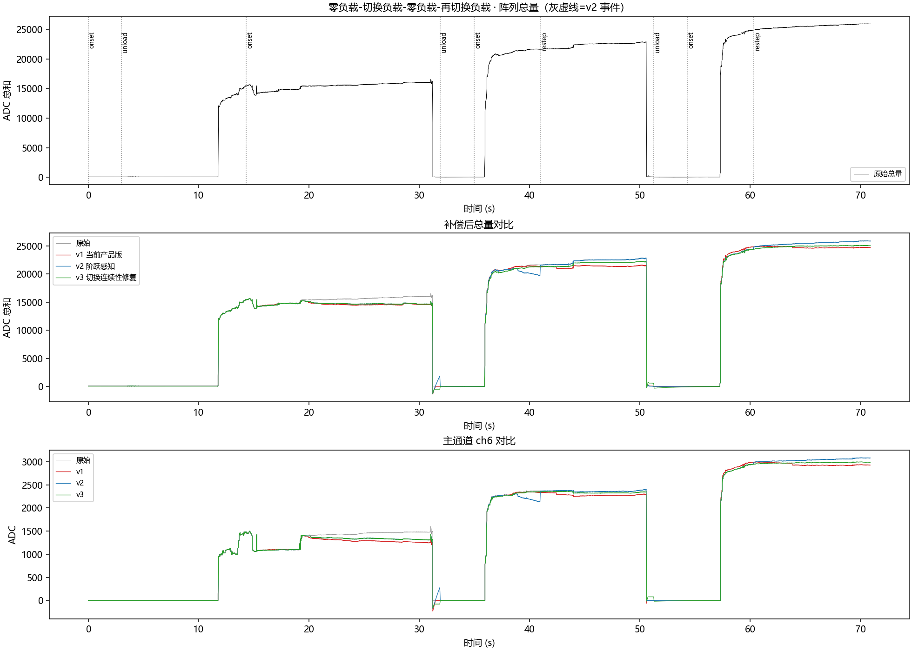
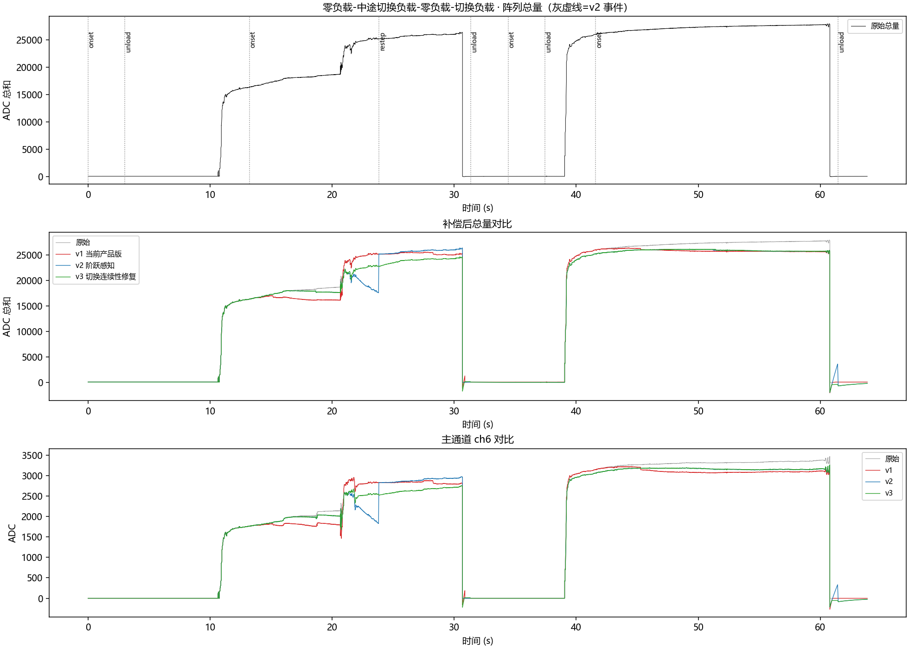
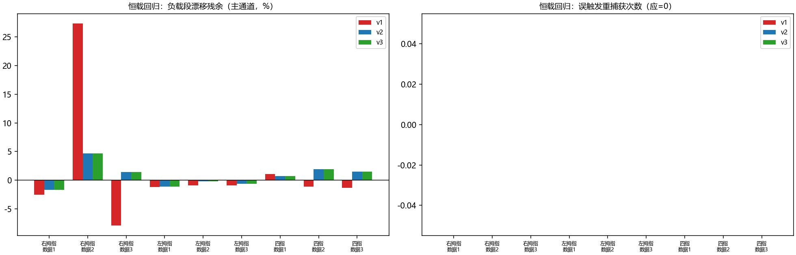

# 变化负载分析与 v3 方案（阶跃感知 + 切换连续性修正）

> 数据：`temp/变化负载/`（四指指尖 8×5/21 通道，ADC 显示域，~100fps，录制时补偿关闭）
> 脚本：`GLM53/scripts/f_varying_load.py`（v1=当前 C++ 产品版忠实复刻；v2=阶跃感知新方案；v3=v2+切换连续性修正，即本文最终方案）
> 结果：`GLM53/figures/e1_varying_a/b.png`、`e2_regression.png`、`j1_v3_zoom_a/b.png`；`GLM53/results/e_varying_metrics.csv`、`e_regression_metrics.csv`、`j_v3_jump_metrics.csv`

---

## 1. 现象确认（你观察到的差距，数据完全复现）

两组数据的真实结构（比文件名描述更复杂）：

- **数据A（零负载-切换负载-零负载-再切换负载，70.9s）**：空载(0-12s) → 负载A≈15k(12-30s) → **空载(30-32s)** → 负载B≈22k(32-51s) → 空载(51-54s) → 负载C≈25k(54-71s)
- **数据B（零负载-中途切换负载-零负载-切换负载，63.9s）**：空载(0-11s) → 负载A≈17k(11-23s) → **负载中途加重至≈25k(23.8s，真正的"中途切换")** → 空载(30-38s) → 负载C≈26.5k(38-61s) → 空载

图 `e1_varying_b.png` 中部面板清晰显示 **v1（当前产品版）在 23.8s 中途加重后的失效**：红色轨迹不升反降（18500 → 16000，与真实负载反向 ~9000 的误差），并伴随振荡；卸载瞬间出现 500 级负向尖峰。原因：v1 的蠕变场假设幅度 A 恒定，负载加重被当作蠕变"扣除"（受 ±限幅），显示被钉死在旧幅度附近。

## 2. 根因分析（v1 的四个缺陷）

| # | 缺陷 | 机制 | 后果 |
|---|------|------|------|
| 1 | **幅度 A 恒定假设** | 蠕变模型 `γ·A·g(t)` 的 A 在 onset 时一次性捕获；中途负载变化 → A 过期 | 阶跃被当蠕变扣除：加重时显示钉在旧值附近振荡；真实缓变力也被部分吃掉（原理性局限） |
| 2 | **部分卸载误判为完全卸载** | 卸载判据 `ts < 0.5×level_ref`；负载降到一半即触发"卸载" → 补偿直接丢失（直通），且可能随即误进基线跟踪 | 变轻后的负载段完全无补偿 |
| 3 | **跳变锁存卡死（隐蔽 bug）** | 空载期 `ts(τ=0.3)` 相对 `level(τ=10)` 持续领先，`ts > 1.8×level` 长期成立 → 锁存无法释放 → 真实加载 onset 不触发 | 在空载总量极小的域（右拇指 N 域 ~0.15）补偿完全失效——恒载回归中 v1 在 右拇指/数据2 残余 27.3% 即此因 |
| 4 | **dt==0 快照缺陷（隐蔽 bug，C++ 同源）** | 时间戳重复帧（ADC 传感器约 3/4 的帧）触发 EMA"快照到当前值"（注释本意是首帧初始化） | fast/slow 类检测器在阶跃处瞬间同时收敛、发散恒为 0；详见 v2 修复说明 |

## 3. v2 方案：阶跃感知混合算法

**核心思想**：不再假设 A 恒定——用双 EMA 发散检测负载阶跃，阶跃统一驱动三种迁移（空载→负载 / 负载→负载 / 负载→空载），蠕变场在每次迁移后重新捕获幅度。

### 3.1 阶跃检测器（新增）

对阵列总量维护快慢两个 EMA：`fast(τ=0.7s)`、`slow(τ=6s)`，发散 `div = |fast − slow|`：

| 场景 | 阈值 | 依据 |
|------|------|------|
| 空载→负载 | `div > 0.5×slow`（高阈） | 负载总量通常远大于空载偏置（ADC 域 230×，N 域 130×），高阈免疫近零空载域噪声 |
| 负载内阶跃 | `div > max(0.18×slow, 0.01×历史最大电平)` | 对数蠕变造成的发散理论上界 ≈ 蠕变速率×(τ_slow−τ_fast) ≈ **6~11%**，与真实阶跃（本数据 ≥83%）可分 |

**瞬态拒绝**：发散须**持续 2.5s** 才确认（手指调整/短暂磕碰 1-2s 内回落 → 取消，不重捕获）。
**抑制窗**：onset 后 6s 内不检测负载内阶跃（避开蠕变快相，实测蠕变发散在抑制窗后 ≤11%）。
**绝对下限**：`1%×历史最大电平` 兼容近零空载域（空载期 max_ts 尚未达到负载量级时不误触发）。

### 3.2 统一迁移语义

- 阶跃确认 + 电平回落到 `≤10%×电平参考` 或 `≤1.5×历史最小` → **卸载**（armed，允许基线跟踪）
- 阶跃确认 + 电平仍在高位 → **重捕获**（重置 onset/A/g/γ，快慢 EMA 对齐当前值）
- 快速卸载（u>3s 即可判定，不等发散）：电平跌破空载带 → 卸载
- 基线跟踪门控改为 `电平 < 20%×历史最大`（替代失效的 `1.5×min_ts`——近零空载域下空载噪声可超过其自身最小值的 2 倍）

### 3.3 dt==0 快照修复

EMA 初始化只在首帧；后续 `dt==0`（时间戳重复帧）仅跳过状态更新。**该修复需同步回 C++**（`drift_compensator.cpp` 中 `else ts_smooth_ = total;` 分支）。

## 4. 验证结果

### 4.1 变化负载（本数据，v2 实测）

- v2 能检出数据B 的真实中途切换（onset@13.2 → restep@23.8 → unload@31.4），但**存在严重切换跳变缺陷**（用户实测反馈，§5.1 已量化确认）；
- v2 另有两类误触发：数据A 恒载段误 restep（41.0s、60.3s，根因是卸载后 fast/slow 回落 settling 被误判为加载 → 假 onset@35.0/54.3，其后续效应又触发了 restep）；数据B 空载期假事件对 onset@34.4/unload@37.4；
- 分段平坦度（去趋势 std/电平）：v2 3.3~7.5%；数据B 含切换段 v2 7.5%、**v3 5.0%**（raw 6.5%、v1 9.7%）。

### 4.2 恒载回归（9 组，参数零重调）

| 数据 | v1 漂移 | **v2 漂移** | v2 误触发 restep |
|---|:---:|:---:|:---:|
| 右拇指/数据1 | -2.5% | **-1.7%** | 0 |
| 右拇指/数据2 | **27.3%（缺陷#3）** | **4.7%** | 0 |
| 右拇指指尖/数据3 | -7.9% | **1.4%** | 0 |
| 左拇指/数据1~3 | -1.2/-0.9/-0.9% | -1.1/-0.2/-0.6% | 0 |
| 四指/数据1~3 | 1.1/-1.1/-1.3% | 0.7/1.9/1.5% | 0 |

v2 不仅没有劣化恒载表现，还顺带修复了缺陷#3（右拇指/数据2：27.3% → 4.7%）、缺陷#4，且 9 组数据**零误触发**。**v3 与 v2 同表（漂移逐项相同、restep 均为 0、事件数更少）——切换连续性修正未劣化恒载。**

### 4.3 v3 修正方案（已验证，`f_varying_load.py::CompV3`）

针对 §5.1 确认的跳变（+7561 ADC）与 §4.1 的误触发，v3 在 v2 基础上加四项修正：

1. **pending 期冻结蠕变补偿**：阶跃待确认期间不积分 g/γ，补偿保持 pend 起始值 → 显示立即跟随真实阶跃，不再被反向拖低；
2. **restep 原子迁移 + 补偿连续性锚定**：A 当帧取 pending 期 Z(=v−b) 的逐通道均值（无 1~3s 直通黑障）；g 锚定为 `median(冻结补偿/(γ·A_new))`；**γ 与 g2/g_rel 累加器保留不重置**（否则新段 rel 从 0 起步、首帧 rel/g≈0.3 会把 γ 一帧砸到下限 0.3，补偿坍缩 2365→638——实测踩坑后修正）；
3. **onset 方向门（fast>slow，仅上升沿）+ 绝对下限（1%×历史最大电平）**：卸载后 fast 快于 slow 回落的 settling 发散(slow>fast)不再误判为加载 → 数据A 两次假 onset/restep、数据B 假事件对全部消失；
4. 抑制窗(6s)保留 v2 值；因 1)+2)，即使 restep 误触发也只会重锚 A 且补偿连续，无显示跳变。

**验收（`j_verify_v3.py`，事件窗口单帧 |Δ显示−Δ原始|）：**

| 指标 | v2 | v3 |
|---|---|---|
| 数据B restep@23.8s 单帧跳变 | 7552（raw 9，**excess 7543**） | 182（raw 182，**excess 0**） |
| 数据A 误 restep | 2 次（excess 1840/310） | **0 次** |
| 假 onset（空载期/卸载后） | 3 次 | **0 次** |
| 恒载 9 组漂移/误 restep | 同 v2 | 与 v2 相同、restep 0 |

**已知残余（可接受）**：pending 期显示 = raw − 冻结补偿（数据B 偏移 ~2.4k，随 raw 同步、无跳变）；restep 后携带的旧段补偿按 τ≈3s 平滑衰减（事件后 4s 窗内 显示−原始 漂移率 ≈ +57 ADC/s），显示在 ~10s 内平滑收敛到新电平。

## 5. C++ 落地清单（按 v3，待你确认后实施）

`src/domain/drift/drift_compensator.{h,cpp}` 改动点（Python 原型 `f_varying_load.py` 的 CompV3 可 1:1 平移）：

1. **修复 dt==0 快照**：EMA 初始化仅首帧，后续重复时间戳帧只跳过更新（缺陷#4，必改）；
2. **新增 fast/slow 双 EMA + 阶跃状态机**（pending 确认 2.5s / 抑制窗 6s / 瞬态取消），替换 jump/drop 两个锁存分支；
3. **三种迁移统一**：restep（重捕获 A）替代"部分卸载丢补偿"；卸载判据改为电平参考 10% ∨ 1.5×min_ts；
4. **pending 期冻结蠕变补偿**（v3 #1）：待确认期间不积分 g/γ，补偿保持 pend 起始值；
5. **restep 原子迁移 + 连续性锚定**（v3 #2）：A 当帧取 pending 期 Z 均值，g 按 `median(冻结补偿/(γ·A_new))` 锚定，γ 与 g2/g_rel 不重置；
6. **onset 方向门 + 绝对下限**（v3 #3）：空载→负载仅上升沿（fast>slow）且 `div > max(0.5×slow, 1%×历史最大)`；
7. 基线跟踪门控改 `电平 < 20%×历史最大`；
8. 其余（A 捕获窗、g/γ、限幅、自动归零基座）不变。

**验收指标：切换事件单帧 `|Δ显示−Δ原始|` < 300 ADC（Python 原型实测 0）。** 预计改动 ~80 行，风险集中在状态机迁移与补偿连续性（已由变化负载 2 组 + 恒载 9 组回归覆盖）。是否现在实施？

## 5.1 复算补充（独立探针）：切换瞬间存在 7561 ADC 的纯算法跳变（v2 未解决）

> 本节为对 §4/§5 的独立复算结论，探针脚本 `GLM53/scripts/g_probe_varying.py`、`g_probe_jump.py`、`g_probe_summary.py`；
> 产物 `figures/g1_probe_A.png`、`g1_probe_B.png`，`results/g_events.csv`、`g_segments.csv`、`g_jump_summary.csv`、`g_trace_*.csv`。

**结论：§4 的"无跳变"结论不成立。** 中途切换负载时，v2 显示总量出现**单帧 7561 ADC 的跳变**（原始同帧仅变化 19 ADC），约为该负载电平的 29%，与 §1 批评 v1 的"钉死"属同一类现象，只是方向相反。

数据B 时间线（`results/g_trace_B.csv`）：

| 时刻 | 真实负载 | 显示总量 | 偏差(显示−原始) | 算法状态 |
|---|---|---|---|---|
| 18.7s | 18,674 | 17,674 | −1000 | 蠕变项正常增长 |
| **20.7s** | **23,227（+4553，真实中途加重）** | 19,190 | −1076 | A 过期，加重被当作蠕变 |
| 21.4s | 23,908 | 21,351 | −2557 | 发散>阈，`pend` 开始计时 |
| 23.0s | 25,096 | 18,800 | **−6296** | 2.5s 确认期内显示持续下滑 |
| 23.8s | 25,164 | **17,586** | **−7578** | restep 确认前一帧（最低点） |
| **23.838s** | 25,146 | **25,146** | **0** | restep 触发：蠕变场整体清零并重捕获 |
| 24.0–25.0s | ≈25,200 | ≈25,200 | 0 | A 重捕获窗内补偿直通（黑障） |

- 单帧跳变：`25,146 − 17,586 = +7560 ADC`（原始同帧 +19）→ **纯算法跳变 ≈ +7561 ADC**；
- 同一现象在数据A 的 restep（40.98s、60.33s）同样出现，量级 +1840 / +350 ADC（`results/g_jump_summary.csv`）；
- 因此 §4 所称"无 v1 的钉死、反向漂移与卸载尖峰"只对**卸载**成立；**切换负载（restep）**路径仍带钉死与反向漂移，只是最终欠下的偏差以一次性跳变方式还账。

**机制（两个缺陷，均由探针逐帧确认）：**

1. **检测滞后期的偏差被记成蠕变，再被一次性清零**：A 在 16s 捕获后即冻结（826.6/通道）；20.7s 真实加重 ~+4553（+27%）后，`rel=(Z−A)/A` 把这个真实增量全部算成蠕变，`g` 由 0.1 涨到 0.3、蠕变补偿累积到 7561 ADC；restep 一帧内把 `g/gamma/蠕变场` 全部归零 → 显示瞬间回弹到真实电平。等价关系（逐帧验证）：`显示−原始 = −(蠕变补偿+基线补偿)`，即**切换瞬间的跳变量 = 切换前累积的虚假蠕变补偿量**。
2. **重捕获窗内补偿黑障**：restep 时 `A` 被清零（`a_acc` 也被清零），`a_w0≤u≤a_w1`（1~3s）窗口内 `n_loaded=0` → 蠕变补偿关闭、显示直通原始值约 2~3s；而窗口内负载仍在变化，且**旧累加器在 restep 时未清零**，窗口内采集的是"真实加重 + 检测滞后"的混合样本，新 A 偏离真实电平（数据B 后段残余 −3~−4%，见 §4.2 之外的 `g_segments.csv`）。

**对 §5 落地清单的影响（已由 §4.3 的 v3 解决）：**

- §5 第 3 条"restep 替代部分卸载丢补偿"沿用 `a_w0..a_w1` 重捕获窗，**不能消除上面的跳变**；restep 已改为**原子迁移**：当帧取 pending 期 Z 均值给出 `A`，不再经过 1~3s 直通窗，且补偿按 §4.3 #2 连续性锚定（γ/g2/g_rel 保留）；
- 检测滞后（`step_persist=2.5s`）会在此期间累积虚假蠕变；v3 的做法是 **pending 期冻结补偿**（§4.3 #1），使滞后期的显示直接跟随真实阶跃，restep 时无需"还账"、跳变归零（数据B 实测 7543 → 0）；
- 建议验收指标已落地：`j_verify_v3.py` 输出 `j_v3_jump_metrics.csv`，事件单帧 `|Δ显示−Δ原始|` 的 v3 实测值为 **0**（目标 < 300 ADC）。

## 6. 遗留与建议

- **缓变力原理性边界**：≥10s 尺度的缓慢加/卸力与蠕变仍不可分（v2 的 0.18×阈值会放过缓慢变化）。若工况存在此类信号，需结合操作上下文（如称重模式的保持判定）另行处理；
- 建议补充采集：**1~2 档中途切换**（本数据 B 只有一档切换）+ 更快/更慢切换节奏，用于标定 `step_persist`/`step_suppress` 的最优值；
- `elapsed` 列在此类录制中不可用（大量重复），分析一律用 `timestamp` 列。
