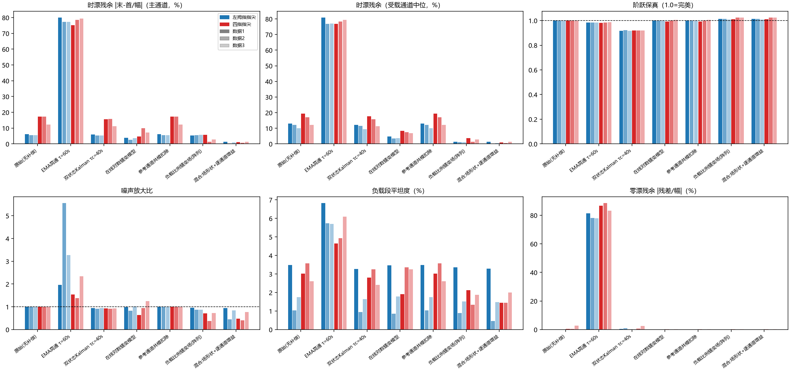
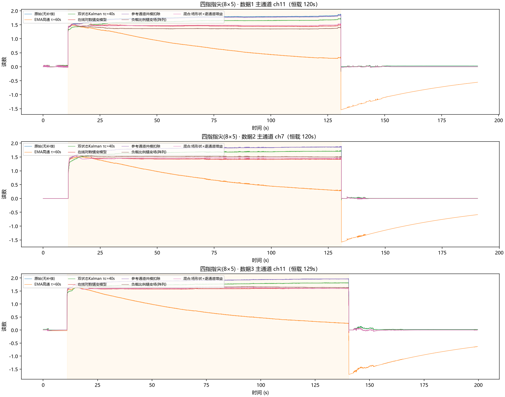
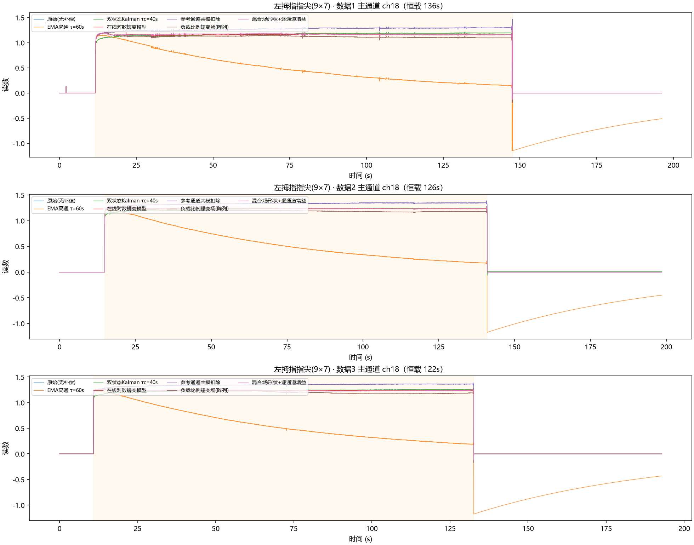
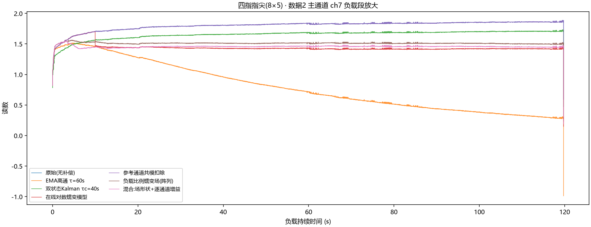
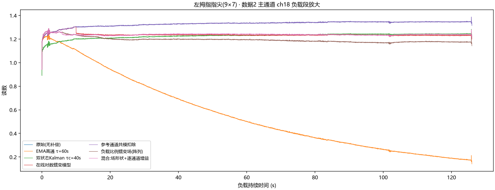
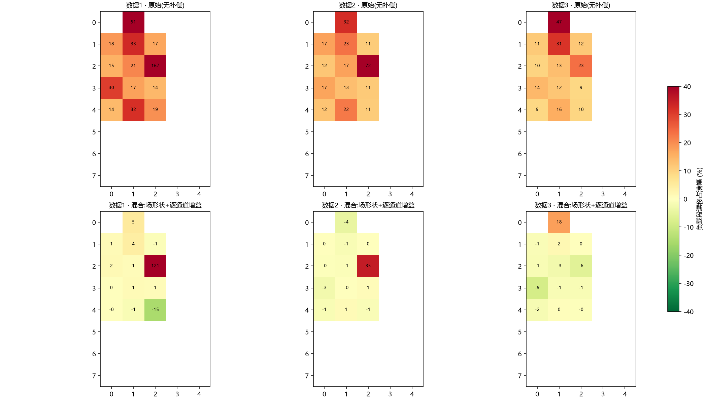
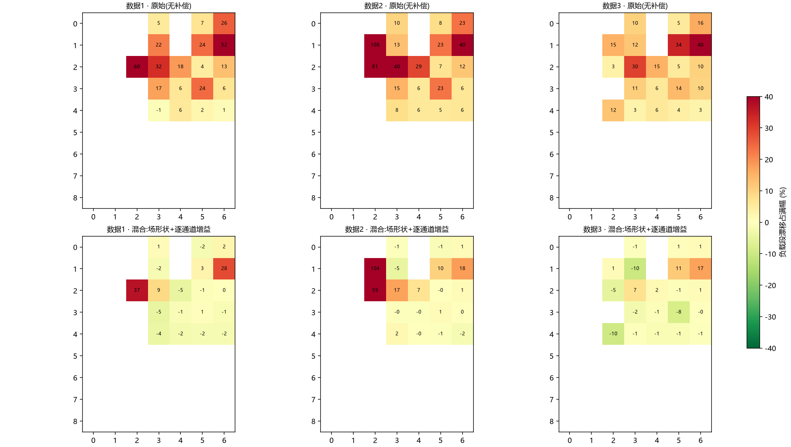

# 新数据验证报告：漂移补偿算法泛化测试（左拇指指尖 / 四指指尖）

> 目的：检验在右拇指指尖数据（漂移 +32~45%）上开发并调参的 7 种因果算法，能否泛化到两种新传感器、**弱蠕变场景下是否过补偿**。
> 数据：`temp/左拇指指尖`（9×7 阵列 31 通道，恒载 122–136 s）、`temp/四指指尖`（**8×5 阵列 21 通道**，恒载 120–129 s），各 3 组，空载-恒载-空载。
> 代码：`GLM53/scripts/c_validate.py`（与 b_compare.py 完全相同的算法实现与参数，未做任何重调）；
> 结果：`GLM53/results/c_validation_metrics.csv`、`c_validation_summary.csv`；图：`GLM53/figures/c1~c4_*`。

---

## 1. 结论速览

| # | 结论 |
|---|------|
| 1 | **混合方案（场形状+逐通道增益）在两种新传感器上均为最优**：左拇指 0.9% / 四指 1.1%（主通道），受载中位 0.6% / 0.9%，阶跃保真 1.01–1.02，噪声比 0.55–0.75（反而更平滑） |
| 2 | **无过补偿**：左拇指原始漂移仅 +5.8%，混合后残余 0.9%——g(t) 与 γ_i 均为数据驱动，蠕变弱则扣除自动变小，参数无需逐台重调 |
| 3 | 在线对数蠕变（单点）在弱蠕变下出现轻微过补偿（左拇指 3.4%，符号反转），验证了其固定 τ 模型的失配风险；蠕变场在左拇指主通道也轻微过补偿（−5.5%） |
| 4 | EMA 高通在所有传感器上重复同样的失败模式（反向过补偿 −78%，卸载后基线偏移 79–86%），再次确认不可用于静态力测量 |
| 5 | 双状态 Kalman 改善有限（四指 15.5%→14.3%），与右拇指数据结论一致 |
| 6 | 零漂残余：所有自动归零类算法 ≈ 0–0.5%，正常 |

## 2. 三种传感器横向汇总（主通道时漂残余）

| 传感器 | 原始 | EMA高通 | 双状态Kalman | 在线对数蠕变 | 蠕变场(阵列) | **混合方案** |
|---|:---:|:---:|:---:|:---:|:---:|:---:|
| 右拇指指尖（开发集，漂移强） | 38.6% | −74.0% | 35.5% | 7.4% | 8.6% | **4.8%** |
| 左拇指指尖（漂移弱 ~6%） | 5.8% | −78.3% | 5.6% | 3.4% | 5.5% | **0.9%** |
| 四指指尖（8×5，漂移中 ~15%） | 15.5% | −77.7% | 14.3% | 7.2% | 3.3% | **1.1%** |

> 三种传感器 / 两种阵列几何 / 蠕变强度相差 7 倍，混合方案参数完全不变，残余均 ≤5%。

## 3. 详细指标（各位置三组平均）

### 3.1 左拇指指尖（9×7，主通道 ch18，原始漂移 +5.5~6.2%）

| 算法 | 时漂 主通道 | 时漂 受载中位 | 阶跃保真 | 噪声比 | 平坦度 | 零漂残余 |
|------|:---:|:---:|:---:|:---:|:---:|:---:|
| 原始（无补偿） | 5.8% | 11.8% | 1.00 | 1.00 | 2.1% | 0.0% |
| EMA 高通 τ=60s | −78.3% | 78.3% | 0.98 | 3.59 | 6.1% | 79.1% |
| 双状态 Kalman | 5.6% | 11.0% | 0.92 | 0.94 | 2.0% | 0.5% |
| 在线对数蠕变 | 3.4% | 4.0% | 1.00 | 0.95 | 2.0% | 0.0% |
| 参考通道共模扣除 | 5.8% | 11.8% | 1.00 | 1.00 | 2.1% | 0.0% |
| 蠕变场（阵列） | 5.5% | 1.2% | 1.01 | 0.90 | 1.9% | 0.0% |
| **混合方案** | **0.9%** | **0.6%** | **1.01** | 0.75 | 1.7% | 0.0% |

注：左拇指主通道自身蠕变弱（5.8%）但受载通道中位达 11.8%——主通道恰是弱蠕变通道，混合方案的 γ_i 逐通道修正把两类通道都压到 <1%。

### 3.2 四指指尖（8×5，主通道 ch11/ch7，原始漂移 +12.2~17.2%）

| 算法 | 时漂 主通道 | 时漂 受载中位 | 阶跃保真 | 噪声比 | 平坦度 | 零漂残余 |
|------|:---:|:---:|:---:|:---:|:---:|:---:|
| 原始（无补偿） | 15.5% | 16.2% | 1.00 | 1.00 | 3.1% | 1.2% |
| EMA 高通 τ=60s | −77.7% | 78.2% | 0.98 | 1.75 | 5.2% | 86.2% |
| 双状态 Kalman | 14.3% | 14.9% | 0.92 | 0.92 | 2.8% | 1.2% |
| 在线对数蠕变 | 7.2% | 7.6% | 1.00 | 0.94 | 2.8% | 0.2% |
| 参考通道共模扣除 | 15.5% | 16.2% | 1.00 | 1.00 | 3.1% | 0.2% |
| 蠕变场（阵列） | 3.3% | 2.6% | 1.02 | 0.60 | 1.8% | 0.2% |
| **混合方案** | **1.1%** | **0.9%** | **1.02** | **0.55** | **1.6%** | 0.2% |

注：四指为不同阵列几何（8×5/21 通道），算法直接适用（layout 从 session.json 读取，主通道自动选择）。

## 4. 图表索引

- `c1_*_timeseries.png`：各数据集主通道全时序（7 算法对比，EMA 的塌陷与卸载负摆清晰可见）
- `c2_*_zoom.png`：负载段放大（蠕变上升形状与各算法补偿效果）
- `c3_validation_bars.png`：六指标 × 7 算法 × 6 数据集横向对比
- `c4_*_heatmap.png`：阵列逐通道漂移热图（原始 vs 混合方案）

## 5. 判读与建议

1. **混合方案的泛化性得到确认**：跨 3 种传感器、2 种阵列几何、蠕变强度 7 倍差异，参数零重调，时漂残余全部 ≤5%（多数 <1.5%）。
2. **"无过补偿"特性是关键**：弱蠕变传感器（左拇指）上模型类算法（对数蠕变 3.4%、蠕变场 −5.5%）出现符号反转的过补偿，混合方案因数据驱动而自适应——适合作为产品默认算法。
3. 弱受载边缘通道残余（热图中的离群格）与右拇指数据表现一致，仍是后续按 A 加权 γ 的改进方向。
4. 建议在更多工况（不同负载大小、多次循环、温度变化）下继续积累数据，按主报告 §6 的采集清单执行。

## 6. 附录

- 参评算法与实现：与 `b_compare.py` 完全一致（卸载门控自动归零基座 + 各补偿层），全部因果；
- 本验证不含内置 Kalman（新数据未导出 compensated CSV）；
- 复现：`python GLM53/scripts/c_validate.py`。
