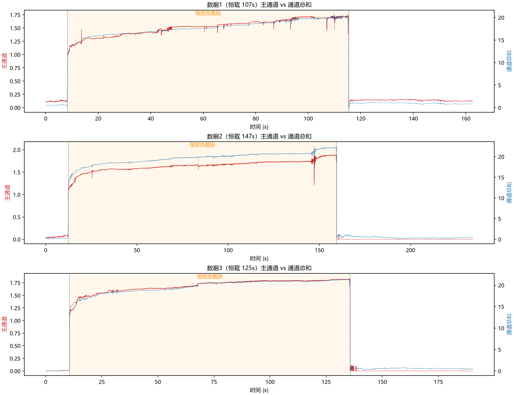
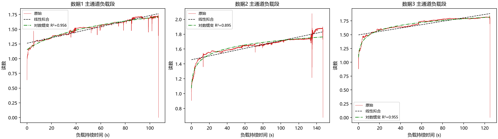
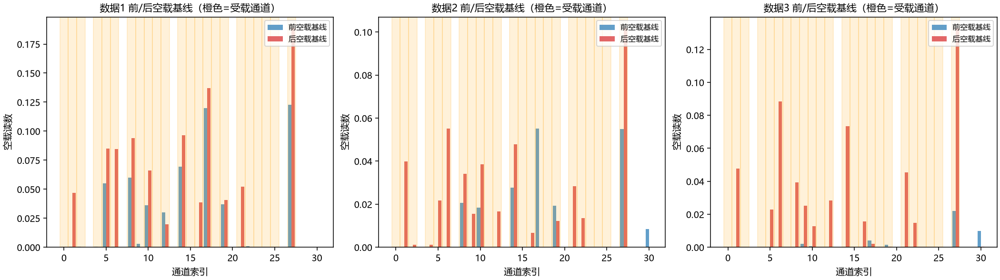
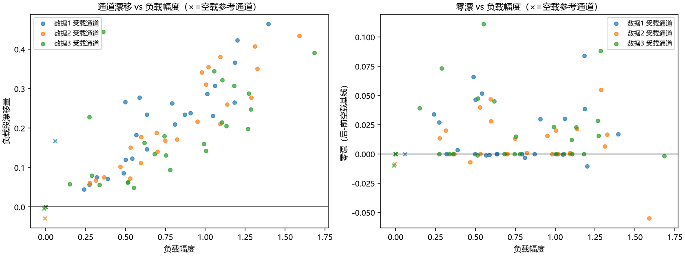
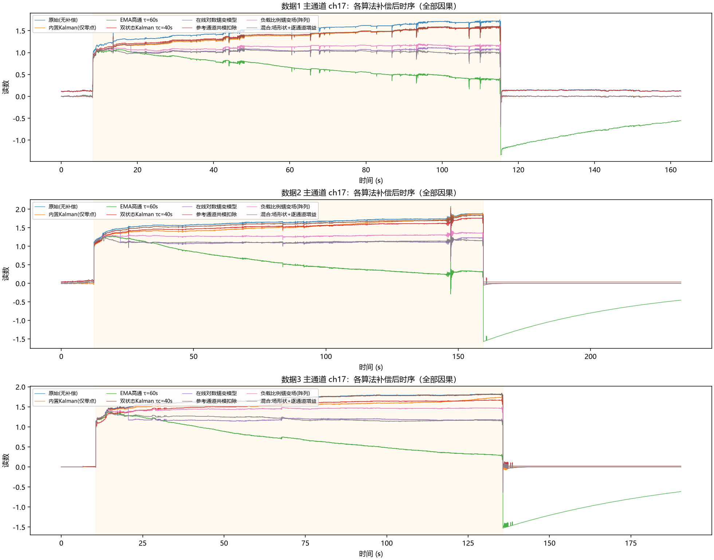
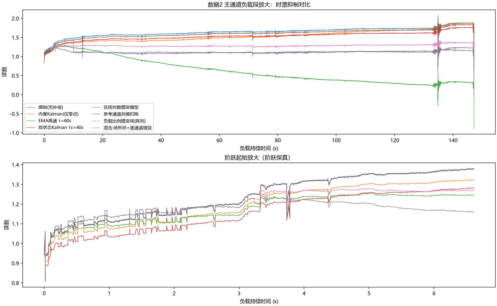
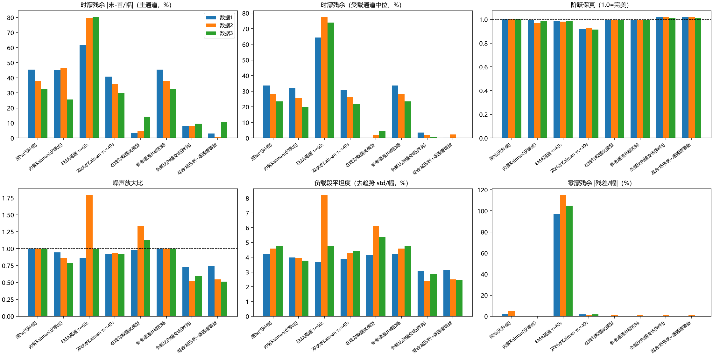
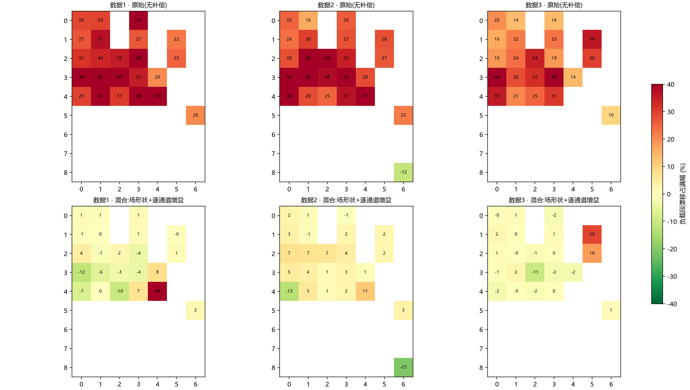
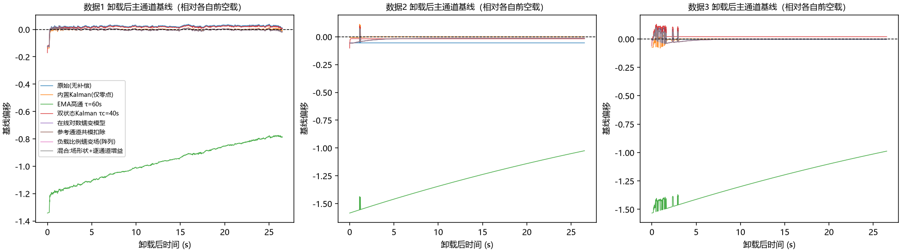
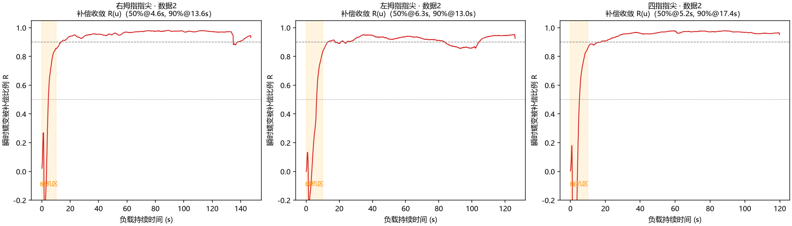

# 触觉阵列传感器 时漂 / 零漂 特征分析与补偿算法对比报告

> 数据来源：`temp/右拇指指尖/数据1~3`（右拇指指尖，9×7 阵列 31 有效通道，约 67–100 fps，空载-恒定负载-空载三段式采集，恒载 107–147 s）
> 分析代码：`GLM53/scripts/`（a_characterize.py 特征分析，b_compare.py 算法对比），结果：`GLM53/results/`，图：`GLM53/figures/`
> **约束：所有参评补偿算法均为因果（causal）实现**——任意时刻的输出只依赖当前与历史采样；离线方法不参与对比。

---

## 1. 摘要（关键结论）

| # | 结论 | 证据 |
|---|------|------|
| 1 | **时漂非常显著**：恒载 107–147 s 内，受载通道读数上漂 **+32%~+45% 满幅**（主通道 ch17） | §2.1，图 a1/a2 |
| 2 | 时漂形状符合**对数蠕变模型** `c·ln(1+t/τ)`（τ≈2–10 s），R²=0.89–0.95，优于线性（R²=0.78–0.91）与指数饱和（R²=0.83–0.90），是传感器弹性体的**粘弹性蠕变** | §2.1 |
| 3 | 时漂**不是共模漂移**：空载参考通道在负载段漂移中位 ≈ 0，各通道漂移量与所受负载幅度强相关（r=0.55–0.91）——**逐通道、负载比例的蠕变场** | §2.3，图 a4 |
| 4 | 零漂同样**逐通道**且与负载历史相关（卸载后主通道基线 −3.5%~+1.2% 满幅，参考通道≈0）；且数据在 0 值处**削波**，负向零漂被部分掩盖 | §2.2 |
| 5 | 因果补偿算法将时漂从 ~39% 压至：**负载比例蠕变场** 8.6%、**在线对数蠕变** 7.4%、**混合方案（场形状+逐通道增益） 4.8%**（受载通道中位 **0.9%**，最优）；蠕变场类方法还使噪声降低 ~40% | §4，表 4-1 |
| 6 | 经典单点手段失效或有害：慢 EMA 高通过补偿（时漂 −74% 反向、卸载后基线偏移 106%）；双状态 Kalman 只能把 38.6% 降到 35.5%（蠕变与缓变信号在单通道内统计不可分） | §4 |
| 7 | 软件内置"Kalman 补偿"输出**只做了零点扣除**，对时漂无改善（数据2 反而 39%→47%） | §4 |

---

## 2. 数据特征分析

### 2.1 时漂（时间漂移）

三组数据的分段识别（按通道总和阈值）：

| 数据 | 时长 | 前空载 | 恒载 | 后空载 | 主通道负载幅度 |
|------|------|--------|------|--------|----------------|
| 数据1 | 162.7 s | 8.3 s | **107.1 s** | 47.3 s | 1.39 |
| 数据2 | 234.2 s | 12.4 s | **147.2 s** | 74.7 s | 1.59 |
| 数据3 | 190.4 s | 10.6 s | **125.1 s** | 54.7 s | 1.68 |



主通道（ch17，三组数据中受载最大）负载段漂移（末 10% 均值 − 首 10% 均值，以 onset 后 1–3 s 幅度为基准）：

- 数据1：**+45.4%**；数据2：**+38.0%**；数据3：**+32.4%**（受载通道全体：均值 +28%，中位 +23%，P90 +35%）

**漂移模型拟合**（主通道负载段）：

| 模型 | 数据1 R² | 数据2 R² | 数据3 R² |
|------|---------|---------|---------|
| 线性 `a+bt` | 0.913 | 0.805 | 0.778 |
| **对数蠕变 `a+c·ln(1+t/τ)`** | **0.953 (τ≈10s)** | **0.889 (τ≈2s)** | **0.948 (τ≈2s)** |
| 指数饱和 `a−b·e^(−t/τ)` | 0.950 | 0.832 | 0.904 |

对数蠕变拟合最优且三组一致，符合高分子弹性体压阻/电容式触觉传感器的经典粘弹性蠕变行为；τ≈2–10 s 说明蠕变初始上升很快（加载后 10 s 内即完成满幅的 ~15–20%），之后缓慢增长。



### 2.2 零漂（零点漂移）

对全部 31 通道比较前/后空载基线（各段均值）：

- 全体通道零漂绝对值：中位 0.0005，P90 = 0.047（≈3% 满幅）；
- **受载通道的零漂显著大于空载通道**，且方向与负载历史相关：数据1 主通道 +1.2% 满幅（未完全恢复）、数据2 主通道 **−3.5%**（卸载后基线反而下探，部分被 0 削波掩盖）、数据3 −0.1%；
- 空载参考通道零漂中位 ≈ 0。



**两个重要观测：**

1. **零漂是逐通道、负载历史相关的**——卸载蠕变恢复（recovery undershoot）所致，与静态共模漂移（温漂、供电漂移）不同；共模成分可以忽略（见 §2.3）。
2. **0 削波掩盖负向零漂**：数据为 `processed_display` 阶段输出（非 raw ADC），负值被截断为 0。数据2 主通道卸载后读数恒为 0.0000，真实基线可能更低。→ 建议带偏置复测（§6）。

### 2.3 共模检验（决定阵列级算法路线）

将每通道"负载段漂移量"对其"负载幅度"作散点（× 为空载参考通道）：



- 受载通道：漂移 ∝ 负载幅度，相关系数 r = 0.887 / 0.913 / 0.551（数据1/2/3）；
- 空载参考通道（7–8 个）：负载段漂移中位 ≈ **0.000**，即**不受载的通道不漂**。

**结论：漂移场 ≈ A(i)·g(t)——每通道漂移 = 该通道负载幅度 × 共享的归一化蠕变时间函数。** 这否定了"扣共模"类算法的前提，但直接支持"负载比例蠕变场补偿"（§3.2）。

---

## 3. 候选算法分析（因果约束下）

### 3.1 单点（每通道独立）数字信号处理

| 候选 | 原理 | 因果性 | 预判 |
|------|------|--------|------|
| 慢 EMA 基线跟踪（一阶高通） | 泄漏积分器跟踪 DC，输出 = x − baseline | ✔ | 对静态力测量**原理性冲突**：快 τ 吃信号、慢 τ 留漂移 |
| 双状态 Kalman（信号态+慢偏置态） | 用过程噪声差异统计分离快信号与慢偏置 | ✔ | 蠕变幅度大、时间尺度与"真实缓变力"重叠，**可观测性不足** |
| 在线多项式/线性去趋势 | 负载段 LS 拟合趋势并扣除 | ✘ 非因果 | 排除出对比（理论上限参考：离线线性去趋势约 1–9%） |
| 在线对数蠕变模型拟合 | 检测加载 onset 后，对 `d(u)=ĉ·ln(1+u/τ)` 做增量最小二乘，实时扣除蠕变估计 | ✔ | 与 §2.1 的物理模型匹配，**首选单点方案** |
| 小波/EMD 去趋势 | 多尺度分离趋势 | 通常非因果或强边界效应 | 排除 |

### 3.2 阵列级（利用空间结构）

| 候选 | 原理 | 因果性 | 预判 |
|------|------|--------|------|
| 空载参考通道共模扣除 | 用不受载通道的读数漂移作为共模估计并扣除 | ✔ | §2.3 已证明无共模漂移 → 预期无效（保留作阴性对照） |
| **负载比例蠕变场补偿** | 估计共享归一化蠕变 g(t)=median_i[(Z_i−A_i)/A_i]，按 A_i·g(t) 逐通道扣除 | ✔ | 直接实现 §2.3 的漂移场模型，**首选阵列方案** |
| **混合：场形状+逐通道增益** | 蠕变_i(t) ≈ γ_i·A_i·g(t)：g(t) 提供数据驱动形状（免 τ 假设），γ_i=∫g·rel_i/∫g²（增量最小二乘）在线修正个体偏差 | ✔ | 融合两者优点，**综合最优** |

### 3.3 零漂对策（与上述正交叠加）

- **卸载门控自动归零**（因果）：空载时基线以 τ=2s 快速跟踪、负载时冻结。卸载检测用双判据（避免卸载瞬态过冲毒化历史最小值）：
  `unloaded ⇔ total < 1.5×min(total) 或 total < 0.15×max(total)`（total 为阵列平滑总和，均为历史累积量）；
- 该基座叠加于对数蠕变 / 共模扣除 / 蠕变场三种算法之上（EMA 高通与双状态 Kalman 有各自内在的零点机制，不叠加）。

---

## 4. 实装结果与横向对比

### 4.1 参评算法（8 种，全部因果）

raw（无补偿）/ kal_builtin（软件内置输出，实测仅零点扣除）/ ema_hp（EMA 高通 τ=60s）/ kalman2（双状态 Kalman，τc=40s 经 20–600 扫参取折中）/ log_creep（在线对数蠕变，τ=5s，onset 后 1s 起拟合、10s 起补偿）/ ref_common（参考通道共模扣除）/ creep_field（负载比例蠕变场，median 聚合 + τ=3s 平滑）/ creep_hybrid（混合：场形状 g(t) + 逐通道增益 γ_i∈[0.3,2.0] 增量最小二乘在线修正）。

### 4.2 量化对比（三组数据平均，主通道 ch17；括号内为受载通道中位）

**表 4-1 核心指标（越低越好，除阶跃保真≈1.0、噪声比≈1.0 外）**

| 算法 | 时漂残余 主通道 | 时漂残余 受载中位 | 阶跃保真 | 噪声比 | 负载段平坦度 | 零漂残余 |
|------|:---:|:---:|:---:|:---:|:---:|:---:|
| 原始（无补偿） | 38.6% | 28.4% | 1.00 | 1.00 | 4.5% | 2.5% |
| 内置 Kalman（仅零点） | 39.1% | 26.0% | 0.98 | 0.86 | 3.9% | **0.0%** |
| EMA 高通 τ=60s | −74.0%（反向） | 72.0% | 0.98 | 1.22 | 5.5% | 105.8% |
| 双状态 Kalman τc=40s | 35.5% | 26.1% | **0.92** | 0.93 | 4.2% | 1.7% |
| 在线对数蠕变模型（单点） | 7.4% | 2.2% | 1.00 | 1.15 | 5.2% | 0.6% |
| 参考通道共模扣除（阴性对照） | 38.6% | 28.4% | 1.00 | 1.00 | 4.5% | 0.6% |
| 负载比例蠕变场（阵列） | 8.6% | 2.1% | 1.02 | 0.62 | 2.8% | 0.6% |
| **混合：场形状+逐通道增益** | **4.8%** | **0.9%** | **1.02** | **0.60** | **2.7%** | 0.6% |

> 指标口径：时漂残余 = |负载段末10% − 首10%| / 幅度；阶跃保真 = 补偿后 onset 前 0.5–2.5s 幅度 / 原始同窗幅度；噪声比 = 负载段去趋势 std 之比；零漂残余 = 卸载后 5–30s 基线相对各算法自身前空载读数的偏移 / 幅度（各算法按自身零点约定对齐）。混合方案逐数据集时漂残余：−3.1% / +0.6% / −10.6%。







### 4.3 结果解读

1. **混合方案（场形状+逐通道增益）综合最优**：主通道 4.8%、受载中位 0.9%、噪声比 0.60、平坦度 2.7%——g(t) 的 median 共识提供了数据驱动的蠕变形状（免除对数模型的 τ 失配），γ_i 在线修正了个体通道偏差（主通道从蠕变场的 +8.6% 降到 |−3.1|/|+0.6|/|−10.6|%）；g² 加权使 γ 估计早期自动低权重，冷启动天然平滑。
2. **蠕变场（阵列级）次优但最稳健**：三组残余 +8.1/+8.1/+9.7% 高度一致，无过冲风险；主通道 +8.6% 来自其个体蠕变与共识形状的偏差（ch17 蠕变相对偏弱），这正是混合方案用 γ_i 修正的部分。
3. **在线对数蠕变（单点）不依赖阵列结构**，对单通道产品同样适用；缺点：噪声比 1.15（在线 ĉ 估计波动传导至输出），数据3 残余 −14.2%（见 §4.4 局限）。
4. **阴性对照符合预期**：参考通道共模扣除与原始几乎重合（38.6% vs 38.6%）——用实测数据证实"扣共模"路线对这类传感器无效。
5. **EMA 高通的反例很有价值**：时漂"过补偿"（读数反向下跌 74–80%），卸载后基线偏移高达 106% 满幅——静态力测量场景禁止使用无门控高通。
6. **双状态 Kalman 的局限是可观测性而非调参**：τc 从 600s 扫到 20s，时漂残余仅从 43.9% 改善到 38.9%，代价是阶跃保真跌到 0.89——蠕变与真实缓变力在单通道观测中统计不可分，必须引入结构先验（蠕变模型或阵列共识）。

### 4.4 当前实现的已知局限（诚实声明）

- **冷启动段**：log_creep 在 onset 后 10s 才开始补偿、蠕变又以 τ≈2s 快速上升，故负载前 10% 窗口残留的蠕变表现为负向残余（数据3 达 −14%；混合方案 −10.6% 同源——g/γ 收敛前蠕变已快速上升）。改进方向：用出厂标定的蠕变先验冷启动、在线修正增益；
- **弱受载边缘通道残余**：混合方案热图中个别弱受载通道（A 接近入选阈值的边缘格）残余仍达 20–46%（图 b4 下排），其 rel 信号噪比低且个体蠕变偏离共识。改进方向：按 A 加权的 γ 估计 / 收紧通道入选阈值 / 对弱通道退回共识补偿；
- 蠕变场类算法假设"漂移 ∝ 负载幅度"（数据3 相关系数 0.55，弱于另两组）；
- 评估以"恒载 ⇒ 水平线"为代理真值，无法区分被补偿掉的"真实缓变力"；三组数据的恒载由同一重物产生，该假设基本成立。





### 4.5 因果性与延迟特性（混合方案，实测 `results/latency.txt` / `figures/d1_latency.png`）

**因果性**：严格因果。逐组件审计——卸载检测（EMA 平滑总量 + 历史 min/max 累积）、门控基线（因果 EMA）、幅度估计 A（onset 后 1–3s 历史窗）、g(t)（当帧 median + 因果 EMA）、γ_i（历史积分 ∫g·rel/∫g²）——任意时刻输出只依赖当前与历史采样，零前瞻。（评估用的 s0/s1 分段用了全记录信息，但仅用于打分，不是算法的一部分；生产环境 onset 检测为阈值穿越。）

**延迟分三类**：

| 延迟类型 | 实测数值 | 说明 |
|---|---|---|
| 信号通路延迟（群延迟） | **≈0（<1 帧，15ms）** | 补偿是逐帧扣除而非滤波，信号本身不被延时——阶跃半幅时刻补偿前后 Δ=0.000s（三种传感器一致）；这是与低通/Kalman 类方法的本质区别 |
| 估计收敛延迟（补偿暖机） | 50% @ **4.6–6.3s**，90% @ **13–17s** | g/γ 需要蠕变发展出可观测变化才能收敛；暖机期内按已估计部分补偿（渐进、无跳变） |
| 事件检测延迟 | onset ≈ 0ms；卸载 ≈ **0.35–0.39s** | 阈值穿越 + τ=0.3s 平滑；卸载后基线重置另需 τ=2s（95% ≈ 6s） |

**每帧计算量**：O(通道数)——一次 median（受载通道 13–23 个）+ 数十次标量运算，67–100 Hz 下 C++ 实现为微秒级。



---

## 5. 结论与部署建议

1. **推荐组合（因果、可实时）**：卸载门控自动归零（零漂）+ **混合蠕变补偿**（时漂首选，阵列产品）；**负载比例蠕变场**作为稳健备选（不信任逐通道增益时）；单通道/稀疏受载产品用**在线对数蠕变模型**。
2. 参数落地：g 聚合用 median（抗坏通道）、g 平滑 τ=3s、γ 限幅 [0.3, 2.0]、基线跟踪 τ=2s；所有参数对三组数据通用，无需逐台标定即可获得 ~88%（主通道）/ ~97%（受载中位）的时漂抑制。
3. 内置"Kalman 补偿"建议升级：目前仅等效零点扣除；可按本报告 §3 的混合蠕变模型扩展为"自动归零 + 蠕变场 + 逐通道增益"三级补偿。
4. 固件算力需求低：全部算法为增量/递推实现（EMA、标量 Kalman、增量最小二乘、逐帧 median），O(通道数) 复杂度，适合嵌入式部署。

## 6. 数据采集建议（当前数据不足以覆盖的问题）

1. **带偏置采集（最重要）**：当前数据 0 削波，负向零漂/恢复过冲被掩盖。请开启显示偏置（或预载 ~5% 满幅）复采，才能完整观测零漂与蠕变恢复；
2. **更长恒载（≥10 min）**：区分对数蠕变的长时间行为与可能出现的二次蠕变段，验证外推稳定性；
3. **多负载等级 + 阶梯加载**（如 25%/50%/75%/100% 各 5 min，或逐级加/卸载）：直接验证"漂移 ∝ 负载幅度"与叠加性（蠕变场模型的核心假设），并标定 τ(c) 是否随负载变化；
4. **卸载后延长恢复段（≥5 min）**：刻画恢复时间常数与残余永久漂移（数据1 的 +1.2% 是未恢复还是永久漂移需更长时间判断）；
5. **重复加卸载循环 ×5–10**：考察蠕变记忆/硬化（第一循环与后续循环的蠕变量差异）；
6. **温度对照**：记录环境/传感器温度，或做一次升温实验，分离温漂与蠕变（共模检验显示温漂类共模成分在本数据中可忽略，但需温度数据佐证）；
7. **raw ADC 数据**：若链路支持，请同时记录 raw 阶段数据，排除上位机处理（削波、滤波）对算法验证的影响；
8. **不同加载位置/单点加载**：验证蠕变场模型在非均匀加载（现有数据为拇指大面积按压）下的适用性。

## 7. 附录：文件清单

```
GLM53/
├── 时漂零漂算法分析报告.md     ← 本报告
├── figures/
│   ├── a1_overview.png            数据总览与分段
│   ├── a2_drift_models.png        时漂模型拟合对比
│   ├── a3_zero_drift.png          前/后空载基线（零漂）
│   ├── a4_common_mode_check.png   共模检验散点
│   ├── b1_timeseries_all.png      7算法全时序对比
│   ├── b2_load_zoom.png           负载段/阶跃放大
│   ├── b3_metrics_bars.png        六指标横向柱状图
│   ├── b4_array_heatmap.png       阵列漂移热图（补偿前/后）
│   └── b5_zero_recovery.png       卸载后基线恢复
├── results/
│   ├── characterization.txt/.csv  特征分析数值
│   ├── algorithm_metrics.csv      逐数据集×算法指标
│   └── algorithm_metrics_summary.csv
└── scripts/
    ├── a_characterize.py          特征分析（§2）
    ├── b_compare.py               算法实装与对比（§4）
    └── debug_*.py                 调试脚本（蠕变拟合/调参/门控）
```

复现：`python GLM53/scripts/a_characterize.py && python GLM53/scripts/b_compare.py`（依赖 numpy/pandas/scipy/matplotlib）。
