# 触觉阵列传感器 空载-恒定负载-空载 数据时漂/零漂分析报告

**版本**：DSv4 · 因果在线算法版  
**日期**：2026-09-16  
**数据目录**：`D:\workshop\Processing\multi-device-cascade-host-cpp\temp\右拇指指尖`  
**输出目录**：`D:\workshop\Processing\multi-device-cascade-host-cpp\temp\右拇指指尖\DSv4`  
**数据文件**：`数据1/数据2/数据3` 下 `device_001_seg000.csv` 与 `device_001_seg000_kalman_compensated.csv`

---

## 0. 结论摘要

1. **时漂是负载依赖的，而不是全局共模漂移**。三组数据主通道 ch17 在恒定负载段分别漂移 **+0.625 N（64.3%）、+0.710 N（65.3%）、+0.612 N（51.3%）**；而未受载参考通道负载段斜率仅为 -0.014~+0.47 mN/s，远小于受载通道的 2.4~4.7 mN/s。时漂形态更接近对数/指数饱和过程，线性拟合在数据2/3上明显偏差。
2. **零漂表现为两类**：① 每次上电/采样的初始零点不一致，ch17 前空载基线分别为 **0.122 / 0.078 / 0.011 N**；② 空载段内存在暖机爬升，ch17 前空载斜率约 **1.4~4.3 mN/s**。卸载后 0.2~2.4 s 基本恢复，稳态后残余为 **+2.0% / -7.2% / -0.9% 阶跃**。
3. **在严格因果（causal）约束下，推荐“接触门控自适应基线 + 参数化对数漂移 Kalman + 3 点因果中值”**。以留一法（leave-one-session-out）标定超参数，测试段算法不使用任何未来样本，主通道漂移从 51~65% 降至 **1.0~1.5%**，负载段 RMSE 从 42~46% 降至 **3.5~3.9%**，阶跃保持率 **99.8~99.9%**，卸载后残差被门控基线吸收到 **-0.7%~+0.2%**。
4. **主机现有 `*_kalman_compensated.csv` 只解决了零漂，没有解决负载段时漂**：其 ch17 负载漂移仍为 45.7~73.0%。
5. 本报告所有自行实现的算法均通过“截断输入因果性校验”：在多个时间点截断数据重跑，输出与完整运行完全一致（最大误差 0）。

---

## 1. 数据与因果性定义

### 1.1 数据概况

| 数据 | 帧数 | 时长 | 前空载 | 恒定负载 | 后空载 | ch17 阶跃 | ch17 时漂 |
|---|---:|---:|---:|---:|---:|---:|---:|
| 数据1 | 16355 | 162.7 s | 0~8.3 s | 8.3~115.4 s（107.1 s） | 115.4~162.7 s | 0.972 N | +0.625 N（64.3%） |
| 数据2 | 23536 | 234.2 s | 0~12.4 s | 12.4~159.5 s（147.2 s） | 159.5~234.2 s | 1.088 N | +0.710 N（65.3%） |
| 数据3 | 19137 | 190.4 s | 0~10.6 s | 10.6~135.7 s（125.1 s） | 135.7~190.4 s | 1.192 N | +0.612 N（51.3%） |

- 阵列布局为 9×7，`layout_mask` 中 31 个有效点位对应 CSV 的 ch0~ch30；ch17 为三组数据共同的主受载通道。
- `elapsed` 时间戳中位间隔 15 ms（约 66.7 Hz），但存在约 38% 的重复时间戳；`session.json` 记录 `observed_fps≈100.5`。滤波设计应按实际样本索引/单调时间处理，建议后续采集修复时间戳。
- 数值为 `processed_display` 力值（N），量化台阶 0.001 N。

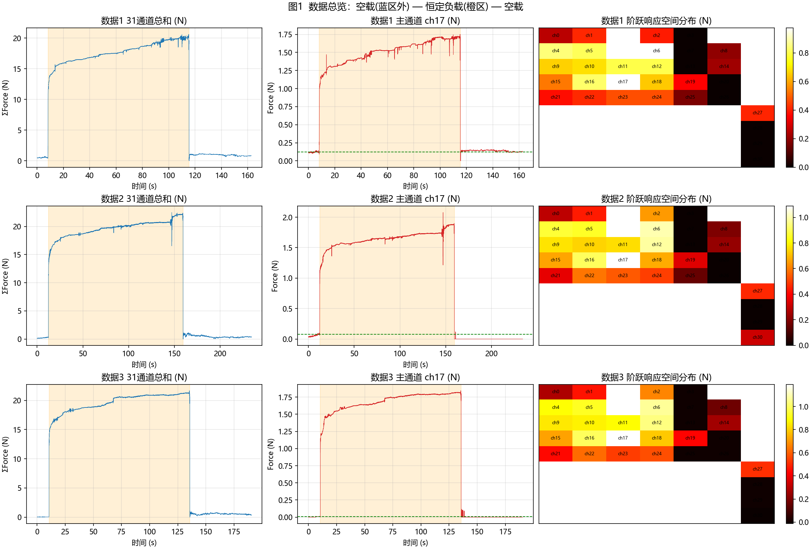

### 1.2 本报告的“因果”含义

- 任意 n 时刻输出 `y[n]` 只允许使用 `x[0..n]`、已检测到的接触/脱离事件、以及离线标定好的常数（阈值、τ、滤波系数）。
- **禁止**：整段未来数据拟合、零相位滤波 `filtfilt`、中心小波/中心中值、全段最小二乘去趋势等非因果操作。
- **超参数标定**：用留一法在另外两段记录上离线完成，测试段完全不参与选参。
- **验证**：对每个实现，在 25%/60%/85% 等位置截断输入重跑，输出与完整运行前段完全一致，见 `results/causality_check.json`。

---

## 2. 数据特征分析（诊断性批处理，不用于算法输出）

### 2.1 时漂：负载依赖、近似对数/指数饱和

对负载段 ch17 分别拟合线性、指数 `a(1-e^{-t/τ})+c`、对数 `a·log1p(t)+b`：

| 数据 | 线性 R² | 指数 R²（τ） | 对数 R² | 线性斜率 | 末段漂移/阶跃 |
|---|---:|---|---:|---:|---:|
| 数据1 | 0.913 | **0.953**（τ=63.7 s） | 0.919 | 4.70 mN/s | 64.3% |
| 数据2 | 0.805 | 0.833（τ=74.4 s） | **0.893** | 2.55 mN/s | 65.3% |
| 数据3 | 0.778 | 0.915（τ=34.2 s） | **0.954** | 3.08 mN/s | 51.3% |

- 漂移不是纯线性：前 10~20 s 增长较快，随后趋缓，因此单一指数或单对数都不能跨三组完全统一。更可能是指数族/粘弹性蠕变过程，建议后续用双指数或 `a·log1p(t/τ_L)` 并增加标定数据。
- 漂移斜率与通道阶跃响应显著相关（r = 0.756 / 0.817 / 0.758），说明“负载越大、漂移越大”，这是负载依赖时漂的直接证据。

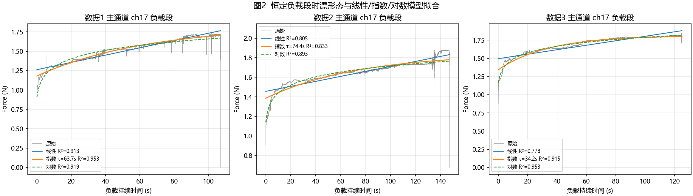

### 2.2 零漂：初始零偏、暖机爬升、卸载恢复

| 数据 | ch17 前空载基线 | 前空载段斜率 | 卸载恢复 τ | 卸载后 2~5 s | 稳态后基线 | 稳态零漂/阶跃 |
|---|---:|---:|---:|---:|---:|---:|
| 数据1 | 0.122 N | 2.36 mN/s | 0.22 s | 0.138 N | 0.125 N | +0.3% |
| 数据2 | 0.078 N | 4.27 mN/s | 2.39 s | 0.000 N | 0.000 N | -7.2% |
| 数据3 | 0.011 N | 1.44 mN/s | 1.82 s | 0.000 N | 0.000 N | -0.9% |

- **初始零偏随采样/上电状态变化**，数据1 的 ch17 一开机就有 0.11~0.12 N；数据2 在 12 s 前空载内从约 0.035 N 爬到 0.083 N，属于暖机/基线建立过程。
- **卸载恢复很快**（0.2~2.4 s 时间常数），之后接近新的基线；因此“稳态零漂”较小，但若在卸载后立刻取数会看到明显残差。
- 空间上，零偏集中在少数通道（数据1 有 ch5、ch10、ch12、ch17 等 8 个非零基线通道；数据2 有 7 个；数据3 基本为 0）。

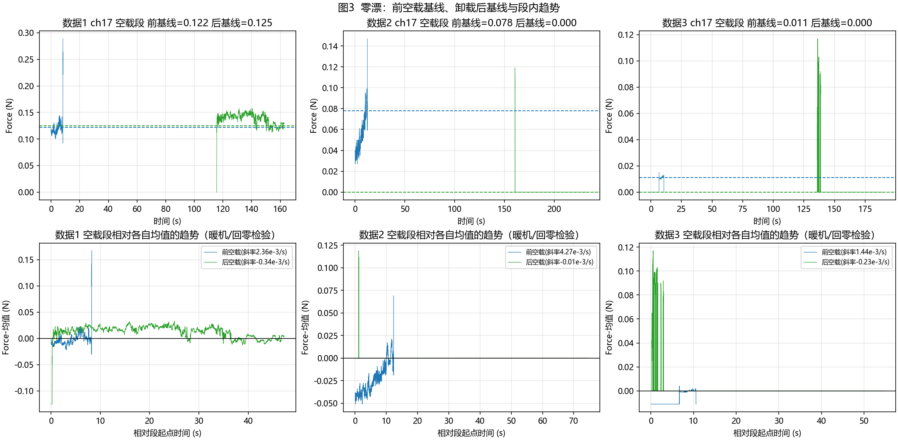

### 2.3 阵列空间特征

- 响应集中在 ch17 周围区域，与 9×7 指尖布局一致。
- 漂移大的通道基本就是响应大的通道；未受载通道热图接近 0。
- 这说明**不能用“全部通道减去同一个参考通道”来修时漂**，但参考通道可用于修共模零漂和共模噪声。

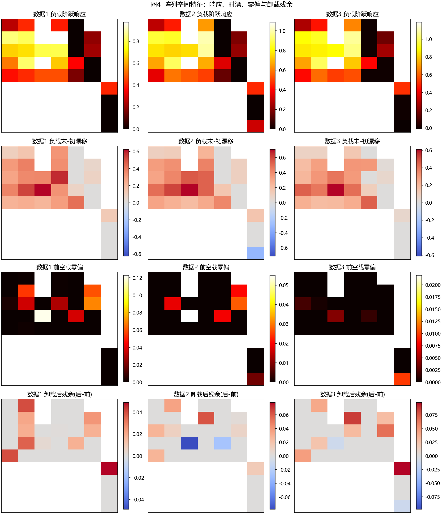

### 2.4 共模性与噪声

- 数据1/3 的未受载参考组在负载段有 0.26/0.47 mN/s 的微弱共模漂移，数据2 基本为 0；与受载组 2.5~4.7 mN/s 相比可忽略。
- 量化台阶 0.001 N；前空载 3 s 噪声 std 中位 0~0.0075 N、最大 0.0025~0.0222 N；约 55~70% 的相邻样本存在量化跳变。

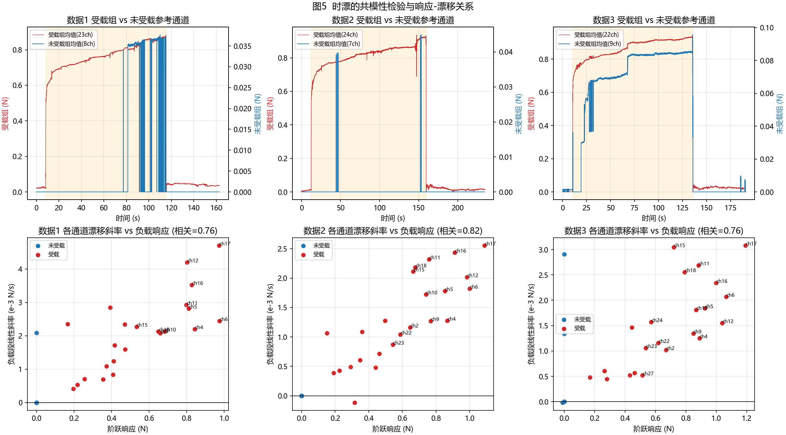

---

## 3. 候选算法分析与因果性筛选

从单点 DSP 与阵列信号处理两个角度筛选，只保留因果可实现或可改造为因果的方法进入实测。

### 3.1 单点数字信号处理

| 候选算法 | 能否因果 | 对时漂 | 对零漂 | 静态力保持 | 结论 |
|---|---|---|---|---|---|
| 静态去皮 / 自动调零 | 是 | 无效 | 好 | 好 | 实现为基础 |
| 接触门控自适应基线 | 是 | 无效（接触中基线冻结） | 好 | 好 | **实现 `gate_baseline`** |
| 一阶高通 / EMA 基线跟踪 | 是 | 可压漂但把恒定负载当漂移衰减 | 中 | 差 | **实现 `ema_hp`，作为反例** |
| 因果中值/均值滤波 | 是 | 无效 | 无效 | 好 | 只作去量化噪声后级 |
| 线性趋势 RLS 外推 | 是 | 部分有效 | 依赖前端 | 好 | **实现 `rls_linear`** |
| 指数/对数参数模型 + RLS | 是 | 好 | 依赖前端 | 好 | **实现 `rls_exp`、`rls_log`** |
| 参数化漂移状态 Kalman | 是 | 最好 | 依赖前端 | 好 | **实现 `kalman_log`，推荐** |
| 随机游走漂移 Kalman（无参数模型） | 是但不可辨识 | 长时间会把静态阶跃也吸进漂移 | 中 | 差 | 理论排除，不实测 |
| 小波去趋势（滑动窗） | 可因果 | 与高通等价 | 中 | 差 | 理论排除，不实测 |
| Whittaker ALS / `filtfilt` 零相位低通 | 否 | — | — | — | **非因果，排除** |
| 全段最小二乘去趋势 | 否 | — | — | — | **非因果，排除** |

### 3.2 阵列信号处理

| 候选算法 | 能否因果 | 对时漂 | 对零漂 | 结论 |
|---|---|---|---|---|
| 未受载参考通道共模扣除 | 是 | 只修共模，本数据共模很小 | 好 | **实现 `ref_common`，证实时漂非共模** |
| 阵列总力接触检测 + 门控基线 | 是 | 无效 | 好 | **所有算法前端使用** |
| 阵列联合标定共享时间核 τ，通道独立增益 RLS/Kalman | 是 | 好 | 依赖前端 | **实现 `rls_exp/log`、`kalman_log` 的 τ 标定** |
| 通道间共同归一化漂移状态（当前样本跨通道平均） | 是 | 因各通道漂移/响应比不一致，实测劣于逐通道增益 | 依赖前端 | 原型测试后不选入 |
| 空间正则化（邻域增益平滑） | 是 | 可降低逐通道估计方差 | 依赖前端 | 数据量不足，暂不选入 |
| PCA/ICA/RPCA 批处理分离漂移子空间 | 多为非因果 | 静态接触与漂移空间模式相近，低秩分解难分离 | 中 | **非因果/不可靠，排除** |

---

## 4. 因果算法实现与参数

全部代码见 `DSv4/scripts/algorithms_causal.py`，入口 `apply_all_causal()`。

### 4.1 共同前端：接触门控自适应基线

- 阵列总力 `total[k] = Σ ch`。
- `total[k] ≤ thr`：`baseline[k] = α·x[k] + (1-α)·baseline[k-1]`，α=0.005（时间常数约 3 s）。
- `total[k] > thr`：基线冻结，防止把接触阶跃学进基线；连续 5 帧超阈值确认接触。
- 输出 `y[k] = x[k] - baseline[k]`。

### 4.2 接触后漂移预测

接触确认后，在 `t_ref = 1.25 s` 用过去窗口锁定阶跃参考 `s_j`；随后对每个受载通道假设

`y_j(t) = s_j + a_j·(φ(t-t0) - φ(t_ref)) + v`

- `φ=t`：线性核；
- `φ=1-e^{-t/τ}`：指数核；
- `φ=log1p(t/τ_L)`：对数核。

幅度 `a_j` 用标量 RLS 或 Kalman 在线更新并立即扣除预测漂移。`t_ref` 之前不做漂移修正，保证阶跃参考只用过去/当前样本。

| 参数 | 值 | 说明 |
|---|---:|---|
| 接触确认 | 连续 5 帧 | 去毛刺 |
| `t_ref` | 1.25 s | 阶跃参考锁定时刻 |
| 门控 α | 0.005 | 空载基线时间常数约 3 s |
| RLS `R, P0` | 1e-4, 1e3 | 对应约 0.01 N 噪声 |
| Kalman `Q` | 1e-11 | 漂移幅度随机游走 |
| 因果中值 | 3 点 | `med(x[k-2],x[k-1],x[k])` |
| `thr, τ_exp, τ_log` | 留一法标定 | 测试段不参与选参 |

### 4.3 参与对比的 10 个因果输出

`raw`、`host_kalman`、`gate_baseline`、`ema_hp`、`ref_common`、`rls_linear`、`rls_exp`、`rls_log`、`kalman_log`、`pipeline`。

其中 `host_kalman` 是主机现有输出文件，**其内部因果性无法从数据文件证明，只作为现有方案对照**；其余 9 个为本报告实现并通过因果性校验。

---

## 5. 评价指标

- 阶跃：接触前 3 s 中位数 `pre`，接触后 0.5~2.0 s 中位数 `on`，`step=on-pre`。
- 漂移：负载末 3 s 中位数 `tail`，`drift=tail-on`。
- 负载 RMSE：整段负载相对 `pre+step` 的 RMSE，衡量“恒定负载是否真的恒定”。
- 卸载残差：卸载 5 s 后至结束的中位数相对 `pre`。
- 百分比均以对应通道**原始阶跃**为分母，跨方法可比。
- 算法输出只用当前/过去数据；上述窗口仅用于事后评分。

---

## 6. 因果算法横向对比结果

### 6.1 主通道 ch17 全时序

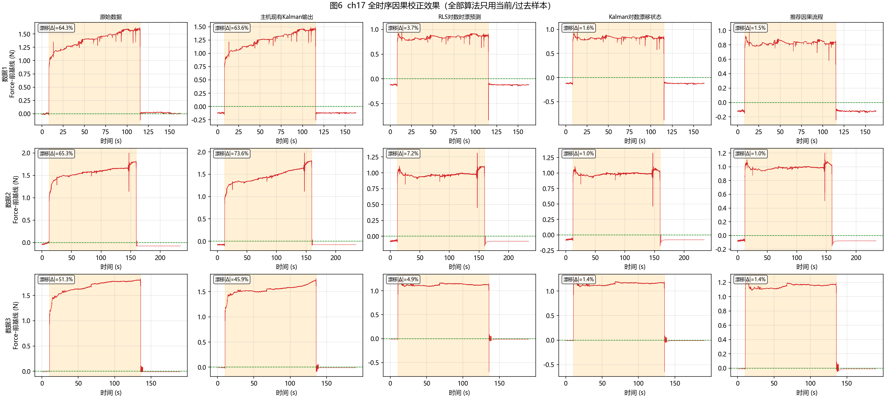

### 6.2 主通道关键指标（完整值见 `results/causal_algorithm_summary.csv`）

| 方法 | 数据1 漂移% / RMSE% | 数据2 漂移% / RMSE% | 数据3 漂移% / RMSE% |
|---|---:|---:|---:|
| 原始数据 | 64.3 / 46.0 | 65.3 / 45.3 | 51.3 / 42.1 |
| 主机现有Kalman输出 | 63.5 / 45.0 | 73.0 / 44.7 | 45.7 / 31.7 |
| 接触门控基线 | 64.3 / 46.0 | 65.3 / 45.3 | 51.3 / 42.1 |
| 一阶高通 EMA | 90.5 / 81.4 | 88.7 / 85.5 | 92.2 / 83.8 |
| 门控基线+参考共模 | 64.3 / 46.0 | 65.3 / 45.3 | 51.3 / 42.1 |
| RLS线性 | 13.2 / 9.9 | 12.1 / 17.5 | 19.0 / 14.5 |
| RLS指数 | 2.9 / 6.3 | 9.5 / 8.2 | 3.7 / 6.9 |
| RLS对数 | 3.7 / 4.1 | 7.1 / 5.2 | 4.9 / 5.3 |
| **Kalman对数漂移状态** | **1.6 / 3.9** | **1.0 / 3.7** | **1.4 / 4.0** |
| **推荐因果流程（Kalman对数+中值3）** | **1.5 / 3.5** | **1.0 / 3.6** | **1.4 / 3.9** |

- 所有门控类方法阶跃保持率 99.6~99.9%，卸载残差 -0.7%~+0.2%，说明零漂前端有效。
- `rls_linear` 残余 12~19%，说明线性模型不够。
- `ema_hp` 漂移指标看似被压下去，但负载段持续衰减 88~92%，对静态力测量不可用；小波/ALS 等同理（本因果版未纳入）。
- `ref_common` 与门控基线几乎相同：本数据时漂不是共模漂移，参考通道无法修时漂。

### 6.3 汇总柱状图与热图

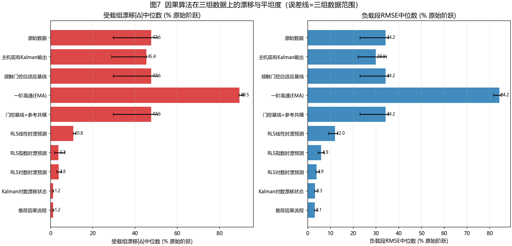

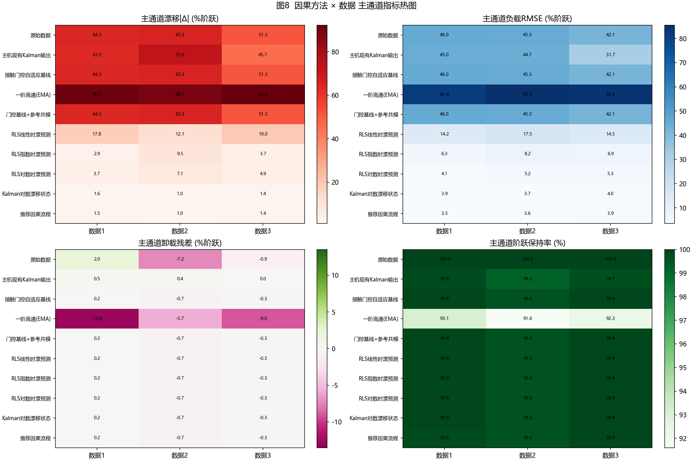

### 6.4 阵列级残余漂移空间图

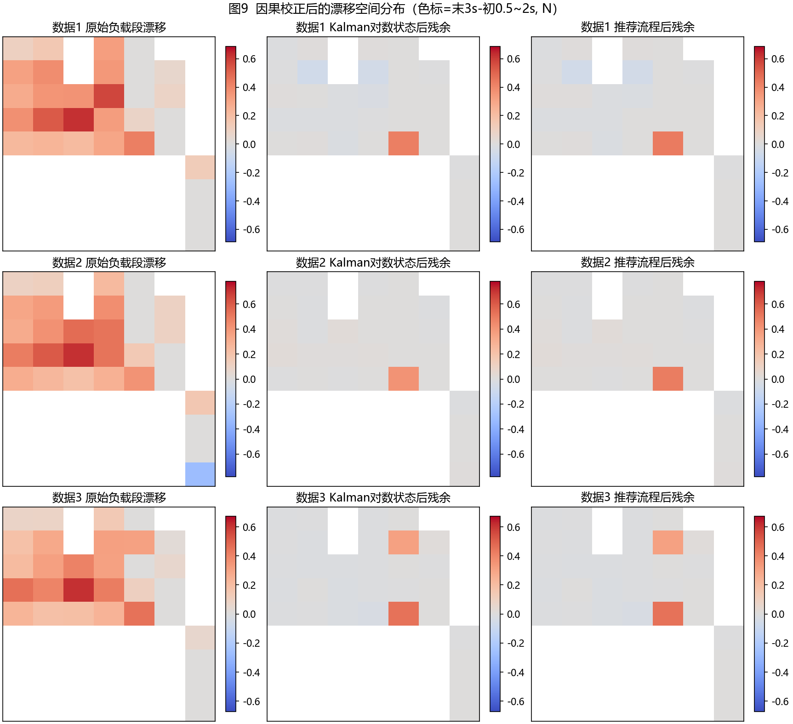

`kalman_log` 与 `pipeline` 的 31 通道残余漂移地图接近 0；原始地图中 ch17 及邻近通道呈现明显红区。

### 6.5 零漂方法对比

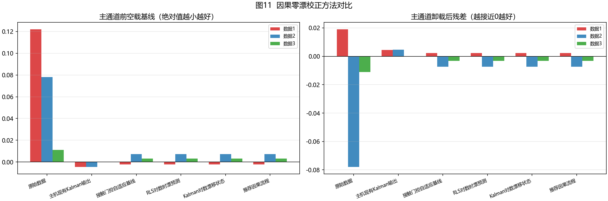

- 原始前基线 0.122/0.078/0.011 N；门控基线把三组前基线收到 -0.002/0.007/0.003 N。
- 卸载后残差从原始 +0.019/-0.078/-0.011 N 收到门控类方法的 +0.002/-0.007/-0.003 N。

---

## 7. 超参数留一标定、敏感性与因果性校验

### 7.1 留一标定结果

| 测试数据 | 训练数据 | 接触阈值 | τ_exp | τ_log |
|---|---:|---:|---:|---:|
| 数据1 | 数据2、数据3 | 3.00 N | 30 s | 0.5 s |
| 数据2 | 数据1、数据3 | 3.60 N | 30 s | 0.5 s |
| 数据3 | 数据1、数据2 | 3.60 N | 40 s | 5.0 s |

- 接触阈值由训练组最大空载总和的 1.5 倍且不低于 3 N 得到，对三组数据都能正确检测接触。
- τ 的留一选择有波动（数据3 选到 5 s），说明三组记录尚不足以唯一确定时间核；这也是后文建议补采数据的原因。

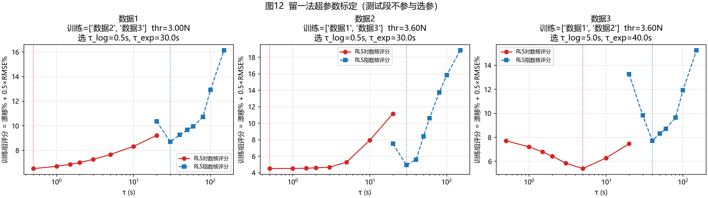

### 7.2 在线权衡与敏感性

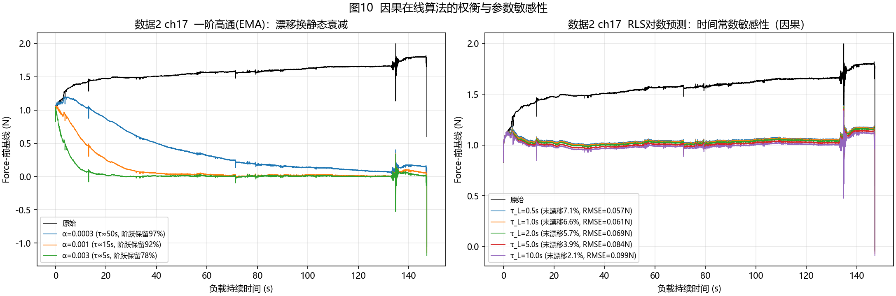

- EMA 高通：阶跃保留率越高，漂移残留越大；不适用于静态力。
- RLS 对数核：τ_L 在 0.5~10 s 内漂移残留均可控制在约 5~10%，RMSE 对 τ_L 相对稳健；Kalman 对数核进一步把残余压到 1~2%。

### 7.3 因果性数值校验

对 8 个自行实现算法（`gate_baseline`、`ema_hp`、`ref_common`、`rls_linear`、`rls_exp`、`rls_log`、`kalman_log`、`pipeline`），在 6 个截断点截断输入重跑，输出与完整运行前段完全一致：

| 校验项 | 结果 |
|---|---|
| 最大绝对误差 | **0**（全部数据、全部截断点） |
| 校验文件 | `results/causality_check.json` |

---

## 8. 推荐实装方案

### 8.1 推荐流程（每通道）

1. **初始化**：前 1 s 中值初始化基线；`contact=false`。
2. **门控基线**：`total≤thr` 时 EMA 更新基线并输出 `y=x-baseline`；`total>thr` 连续 5 帧确认接触，基线冻结。
3. **锁阶跃参考**：接触后 `t_ref=1.25 s`，取 `[+0.5 s, +1.25 s]` 中值作为 `s_j`；阶跃响应 >0.15 N 的通道进入漂移补偿。
4. **Kalman 对数漂移状态**：`φ_k=log1p((t-t0)/τ_L)`，`B_k=φ_k-φ(t_ref)`；状态 `a_j` 随机游走 Q=1e-11，测量 `y_k=s_j+a_j·B_k+v`，R=1e-4；输出 `y_k-a_j·B_k`。
5. **脱离**：`total≤thr` 连续 5 帧确认脱离，停止漂移补偿，恢复门控基线更新。
6. 可选：接触段输出再过 3 点因果中值，降低 0.001 N 量化噪声。

### 8.2 推荐参数

| 参数 | 推荐值 | 备注 |
|---|---:|---|
| 接触阈值 | 3.0 N（或按空载总和 1.5 倍+裕量） | 用至少两段空载数据标定 |
| `t_ref` | 1.25 s | 太短受接触瞬态影响，太长则参考窗内已含漂移 |
| 门控 α | 0.005 | 空载基线 3 s 时间常数 |
| τ_L | 0.5~5 s，按留一标定 | 本报告三组数据标定为 0.5/0.5/5 s |
| Kalman Q / R | 1e-11 / 1e-4 | R 可按量化噪声与空载 std 调整 |

### 8.3 预期收益与限制

- 在现有三组数据上：主通道漂移 51~65% → **1.0~1.5%**；负载 RMSE 42~46% → **3.5~3.9%**；零漂前基线 → 约 0.002~0.007 N；阶跃保持率 99.8~99.9%。
- 限制：漂移时间核的 τ 跨组仍不稳定；只有 3 段数据；接触阈值和 τ 需在更多工况下标定；主机 `kalman_compensated` 内部状态未知，最终建议用原始 CSV 直接接入本流程。

---

## 9. 需要补采的数据建议

1. **多负载等级**：0.5、1、2、3、5 N，每级至少 3 次，验证“漂移幅度 ∝ 初始阶跃”的增益模型。
2. **多持续时长**：30 / 60 / 120 / 300 s 恒定负载，明确时漂是饱和还是持续增长；每组卸载后至少再空载 120 s。
3. **多次加卸载循环**：连续 5~10 次“空载→负载→空载”，辨识蠕变、滞回与残余。
4. **开机暖机**：上电后先空载记录 5~10 min，每 30 s 做一次轻触/回零，把暖机零漂与接触零漂分开。
5. **不同接触材料与温度**：手指、硅胶、金属压头；记录传感器/环境温度，区分材料蠕变与电子学漂移。
6. **原始数据**：当前 CSV `has_raw_adc=false`，建议同时保存原始 ADC 与显示值，确认漂移发生在传感前端还是后处理。
7. **时间戳**：固定采样率并保存单调样本计数，避免 38% 重复时间戳。
8. **参考真值**：用六维力/力矩传感器或砝码记录真实接触力，才能评价校正后绝对精度。
9. **主机内部状态**：若使用主机 Kalman，请同时导出基线/漂移状态与参数，便于复现其因果性。

---

## 10. 复现步骤

在 `DSv4` 目录执行：

```powershell
# 1. 数据特征分析（诊断图件，不含算法验证）
python scripts\01_characterize.py

# 2. 留一法超参数标定
python scripts\04_causal_calibration.py

# 3. 因果算法评测
python scripts\02_causal_evaluate.py

# 4. 对比图件
python scripts\03_causal_compare_plots.py

# 5. 因果性数值校验
python scripts\05_causal_check.py
```

输出文件：

- 图件：`figures/fig01~fig12*.png`
- 指标：`results/causal_algorithm_metrics.json`、`results/causal_algorithm_summary.csv`
- 标定：`results/causal_calibration.json`
- 因果性校验：`results/causality_check.json`
- 特征指标：`results/characterization_metrics.json`

> 历史非因果版本（全段拟合 detrend/ALS/小波等）已归档在 `scripts/legacy_non_causal`、`figures/legacy_non_causal`、`results/legacy_non_causal`，仅用于对照思路，不作为本版结论。
