# 右拇指指尖 触觉阵列漂移（时漂/零漂）分析与算法对比报告

- 数据：`temp/右拇指指尖/数据1~3`（空载 → 恒定负载 → 空载，31 通道，9×7 布局，标称 100Hz、实测中位约 66.7Hz）
- 分析脚本：`scripts/analyze_characterize.py`、`scripts/compare_algorithms.py`、`scripts/cross_generalization.py`
- 指标明细：`results/metrics.csv`、`results/metrics_summary.csv`、`results/cross_calibration.csv`
- 日期：2026-09-16

---

## 1. 数据概况

| 数据集 | 帧数 | 总时长 | 前空载 | 恒定负载段 | 后空载 | 主通道 | 初始阶跃 | 负载段漂移量 |
|---|---|---|---|---|---|---|---|---|
| 数据1 | 16355 | 162.7s | 0~8.3s | 8.3~115.4s（107.1s） | 115.4~162.7s | ch17 | 1.111 N | **+0.464 N（41.7%）** |
| 数据2 | 23536 | 234.2s | 0~12.4s | 12.4~159.5s（147.2s） | 159.5~234.2s | ch17 | 1.344 N | **+0.434 N（32.3%）** |
| 数据3 | 19137 | 190.4s | 0~10.6s | 10.6~135.7s（125.1s） | 135.7~190.4s | ch17 | 1.412 N | **+0.391 N（27.7%）** |

三组数据结构一致：短暂前空载 → 约 2 分钟恒定负载 → 约 1 分钟后空载。恒定负载下输出持续增长，漂移量占阶跃幅度 28%~42%，量级上已经不能当作"小误差"忽略。

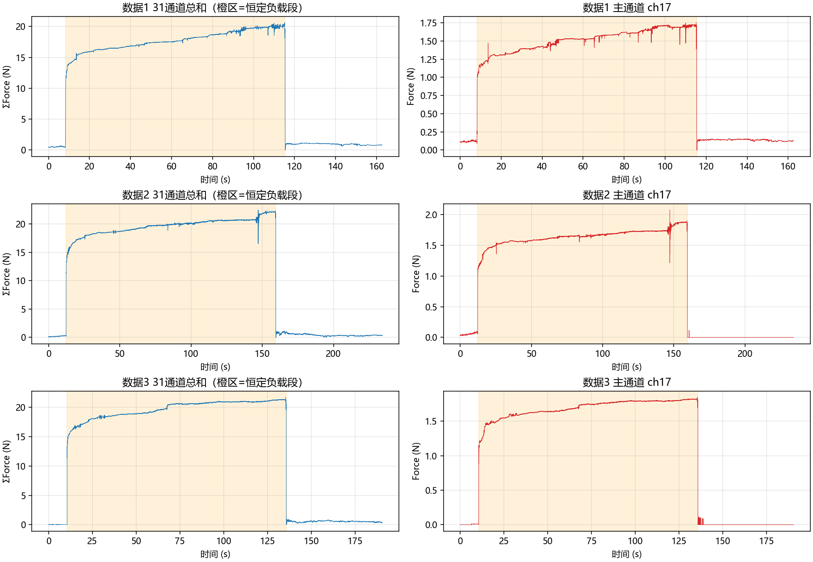

---

## 2. 漂移特征分析（决定算法选型的关键事实）

### 2.1 时漂形态：蠕变型（非线性）

对主通道负载段分别拟合三种模型：

| 数据集 | 线性 R² | 指数 a(1−e^(−t/τ))+c R² | 对数 a·ln(1+t)+b R² | 指数 τ |
|---|---|---|---|---|
| 数据1 | 0.913 | **0.953** | 0.919 | 63.7s |
| 数据2 | 0.805 | 0.833 | **0.893** | 74.4s |
| 数据3 | 0.778 | 0.916 | **0.954** | 34.2s |

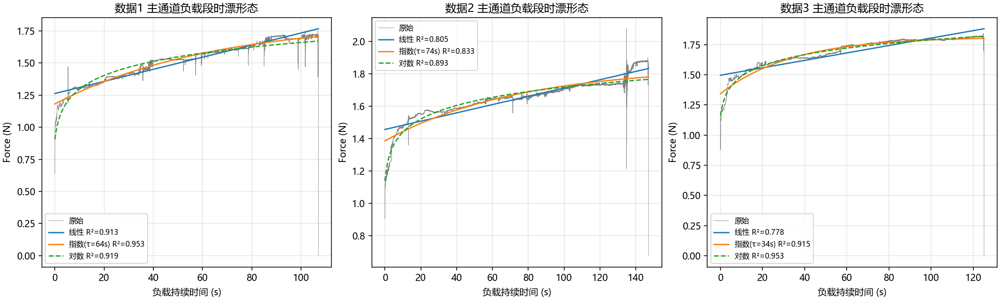

结论：漂移呈**先快后慢、逐渐饱和**的形态，指数/对数模型整体优于线性模型——这是典型的**粘弹性蠕变（creep）**特征（压阻材料在恒定应力下电阻随时间缓慢变化），而非恒定速率的电子学漂移。这直接决定了"按比例扣线性斜率"类方法必然欠拟合。

### 2.2 零漂：存在但量级较小，且空载段本身也在漂

| 数据集 | 前空载均值 | 后空载均值 | 零漂（占阶跃） | 前空载段自身斜率 | 后空载段自身斜率 |
|---|---|---|---|---|---|
| 数据1 | 0.120 N | 0.137 N | +0.017 N（+1.5%） | +2.40e-3 N/s | −0.34e-3 N/s |
| 数据2 | 0.055 N | 0.000 N | −0.055 N（−4.1%） | +4.27e-3 N/s | −0.01e-3 N/s |
| 数据3 | 0.004 N | 0.002 N | −0.002 N（−0.1%） | +1.45e-3 N/s | −0.22e-3 N/s |

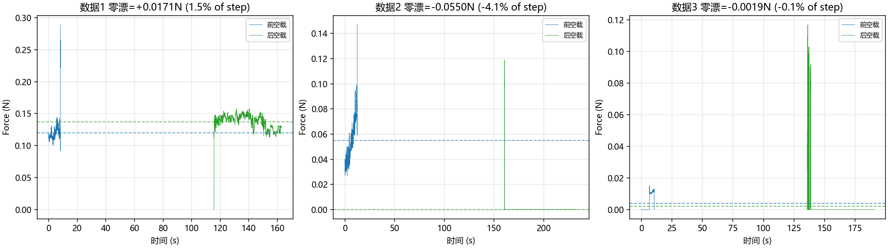

三个要点：

1. **前后空载基线不完全重合**（零漂 −4.1%~+1.5%），卸载后基线还带有缓慢恢复的"尾巴"（粘弹性恢复）。
2. **前空载段自身就在向上漂**（最大 4.3e-3 N/s）——这是上电预热/温度平衡过程，意味着"开机立刻采零点"不可靠，零点校准需要等预热稳定。
3. 部分通道空载时基线不是 0（最大 0.12 N 固定偏移），需要逐通道零点。

### 2.3 共模性检验：漂移不是共模的（阵列盲方法的判决性证据）

把通道按负载段响应分为受载组（19 ch）与未受载组（7~8 ch）：

| 数据集 | 受载通道负载段斜率 | **未受载通道负载段斜率** |
|---|---|---|
| 数据1 | +4.70e-3 N/s（主通道） | **+0.26e-3 N/s** |
| 数据2 | +2.55e-3 N/s | **−0.014e-3 N/s** |
| 数据3 | +3.08e-3 N/s | **−0.002e-3 N/s** |

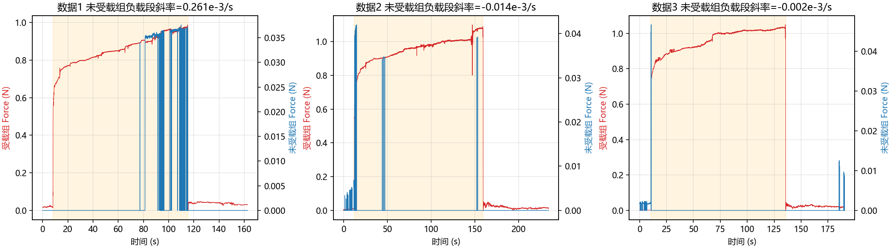

**未受载通道在负载段几乎不漂**。漂移严格跟随"是否受载"，是**负载相关蠕变**，不是全阵列共模的温度/电源漂移。空间分布图也印证这一点：漂移斜率热图与负载响应热图形状一致，漂移集中在受压区域。

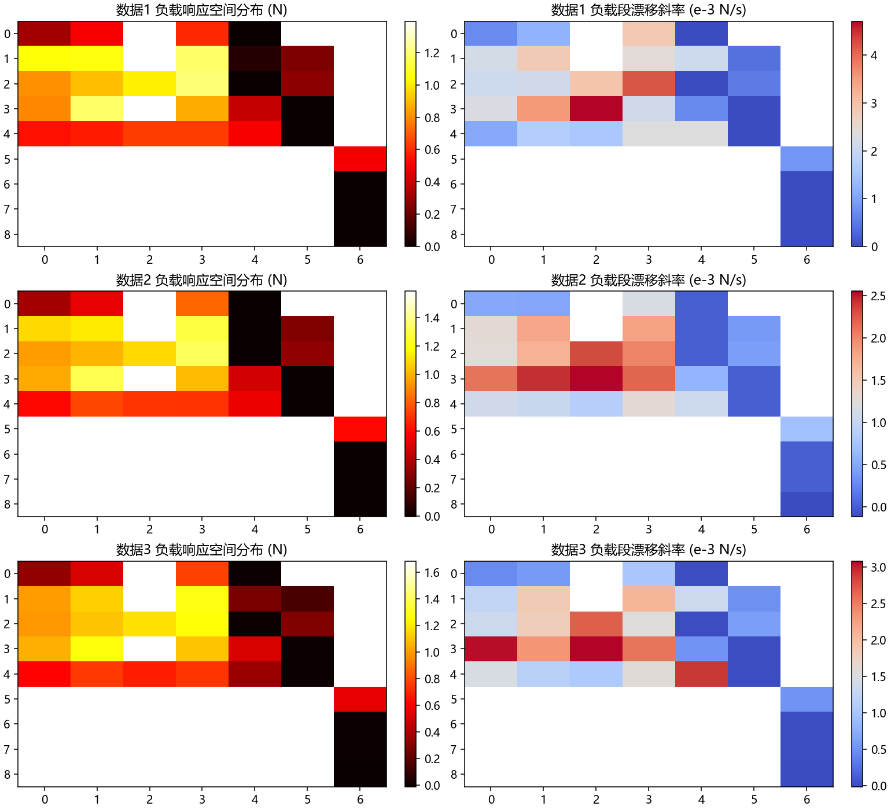

> 这一事实的推论：**参考通道共模扣除、PCA 去共模等阵列盲源方法对本数据的时漂本质上无效**（§4 实测 confirm）；漂移必须在单通道层面建模。

### 2.4 噪声水平

前空载段各通道 std 中位数 0~0.0037 N、最大 0.018 N；信噪比良好，噪声不是主要矛盾，漂移才是。

---

## 3. 候选算法梳理

### 3.1 单点数字信号处理（每通道独立）

| 算法 | 机理 | 在线? | 预期作用 | 预期风险 |
|---|---|---|---|---|
| 固定基线扣除 | 减去前空载均值 | ✓（需校准） | 消除固定零偏 | 对时漂无能为力 |
| EMA 基线跟踪 | 慢指数平均估计基线，x−baseline | ✓ | 跟踪慢漂 | **恒定负载会被当作"基线"吃掉**，卸载后出现深负冲 |
| 一阶高通滤波 | 滤除 DC~极低频 | 离线/在线 | 去慢漂 | 恒载是 DC 信号，必然被衰减；瞬态失真、噪声放大 |
| 卡尔曼平滑（随机游走模型） | 最优状态估计降噪 | ✓ | 平滑测量噪声 | 只是平滑器，**物理上不区分蠕变与真信号** |
| 自动零点跟踪 | 检测空载→EMA 更新零点，负载时冻结 | ✓ | 治零漂 | 不碰负载段，时漂保留（设计如此） |
| 空载锚点线性基线 | 前后空载均值连线作基线 | ✗ 离线 | 治零漂/慢线性漂 | 对蠕变形态欠拟合 |
| 指数/对数蠕变拟合扣除 | 负载段拟合蠕变模型并减去 | ✗ 离线 oracle | **直接对治时漂成因** | 需已知负载段边界；在线化需预标定参数 |
| 蠕变逆模型补偿（r(t) 反卷积） | 用标定的蠕变增长比除回去 | ✓（需标定） | 在线治时漂 | 参数组间有差异，需验证泛化 |

### 3.2 阵列信号处理（利用通道间信息）

| 算法 | 机理 | 预期 |
|---|---|---|
| 参考通道共模扣除 | 减去未受载通道均值 | §2.3 已证明未受载通道不漂 → 预计无效（仅对共模温漂有用） |
| PCA 去第一主成分 | 去掉跨通道最强相关成分 | **负载阶跃本身就是最强主成分**，预计连同真实负载一起被抹掉 |
| 空间回归/背景减除 | 用周边未受载点回归本底 | 同上，本数据无共模本底可回归 |

阵列方法里值得保留的思路只有"空载检测"（用全阵列总力判空载，驱动自动零点），其余盲共模方法对本数据不对路。

---

## 4. 算法实装与横向对比

全部算法对 3 组数据的 31 通道逐一处理，在主通道 ch17 上以四个统一指标评估（3 组平均；完整分数据集数据见 `results/metrics.csv`）：

| 算法 | 类型 | 负载段残余漂移% ↓ | 阶跃保真度%（→100%） | 零漂残余% ↓ | 噪声比 ↓ |
|---|---|---|---|---|---|
| **指数蠕变拟合扣除** | 离线 | **2.5** | **95.6** | 1.9 | 1.0 |
| **对数蠕变拟合扣除** | 离线 | **2.3** | 79.8 | 1.9 | 1.0 |
| PCA 去第一主成分 | 阵列 | 1.9 | **−4.1（信号被毁）** | 2.8 | 0.7 |
| 一阶高通 0.005Hz | 离线 | 21.0 | 74.5 | 21.3 | 8.1（噪声放大） |
| 原始 / 固定基线扣除 | — | 33.9 | 100.0 | 1.9 | 1.0 |
| 参考通道共模扣除 | 阵列 | 33.4 | 100.0 | 1.9 | 1.0 |
| 应用内 Kalman 补偿 | 在线 | 34.3 | 97.6 | **0.0** | **0.5** |
| 空载锚点线性基线 | 离线 | 34.5 | 100.1 | **0.0** | 1.0 |
| 卡尔曼平滑 | 在线 | 34.8 | 99.2 | 1.9 | 0.9 |
| **自动零点跟踪** | 在线 | 33.9 | 99.1 | **0.4** | 0.7 |
| EMA 基线跟踪 τ=30s | 在线 | **74.0（更差）** | 81.4 | **56.3（严重负漂）** | 0.9 |

### 主通道全时长对比（数据1 代表）

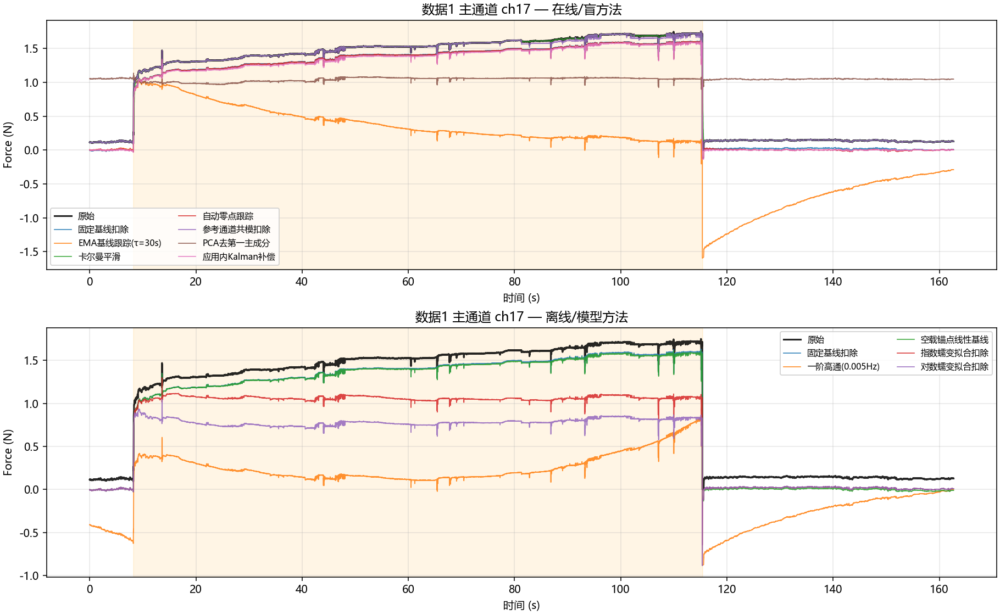

- 上图（在线/盲方法）：EMA 基线（橙）在恒载段持续下滑、卸载后出现 −1.5N 深负冲——盲跟踪把恒载当漂移；PCA（灰紫）把信号拉到全程均值附近，负载阶跃被完全抹除；卡尔曼/应用内 Kalman 与原始几乎重合。
- 下图（离线/模型方法）：**指数蠕变扣除（红）在负载段近似一条水平线**，且阶跃高度保留 95%+；高通（橙）缓慢衰减、严重失真；锚点线性基线（绿）只修正了零漂。

### 负载段放大（残余漂移直观对比）

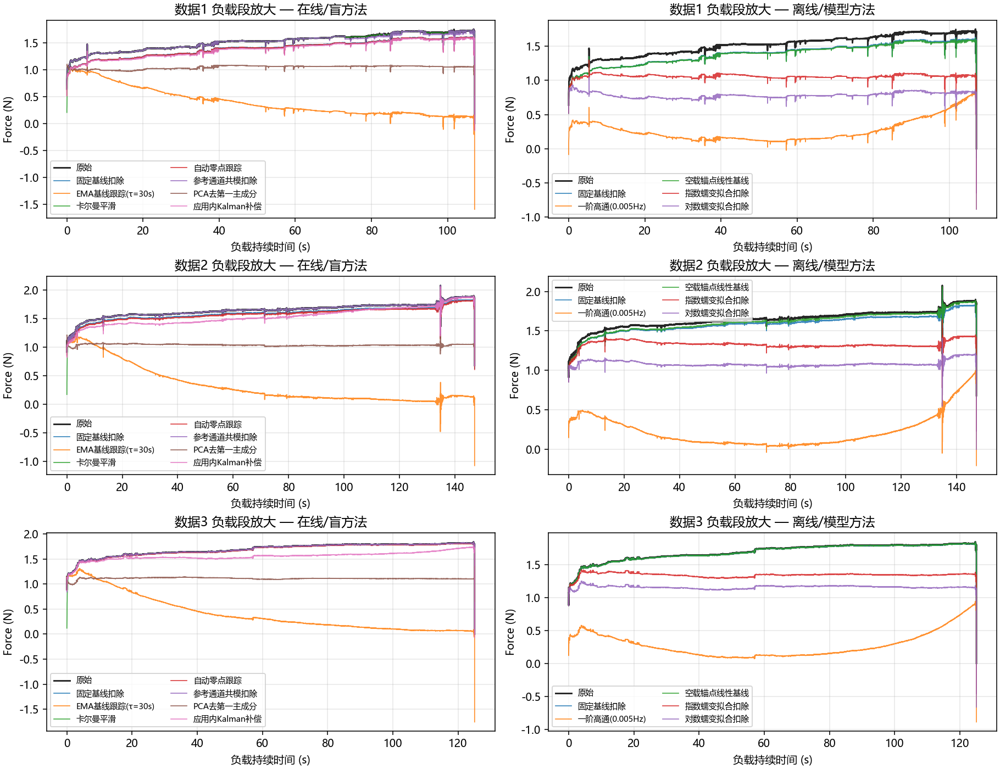

### 指标条形图与热图

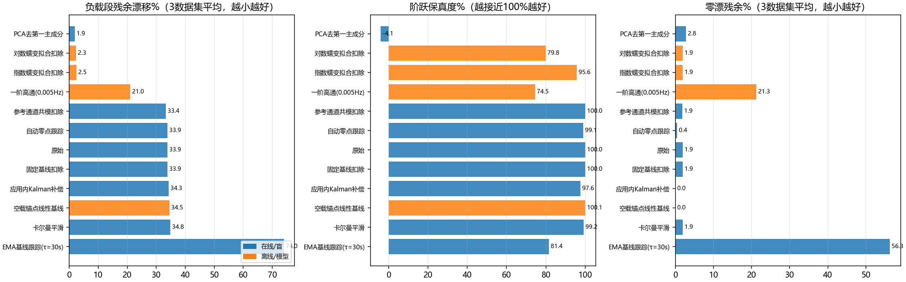

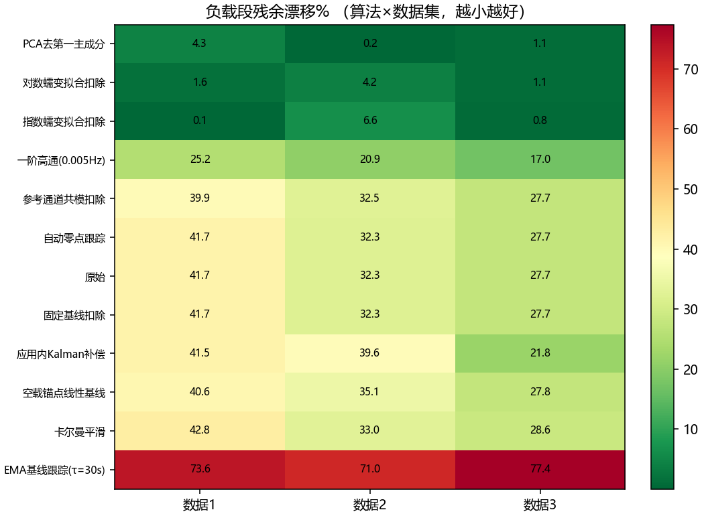

### 全阵列漂移：原始 vs 指数蠕变扣除

负载段"末段−首段"漂移量的空间分布：扣除前受压区普遍 +0.2~+0.4N，扣除后大部分区域回到 ≈0（数据3 有一格拟合受扰动影响残留，该通道在负载末段受到触碰尖峰干扰）。

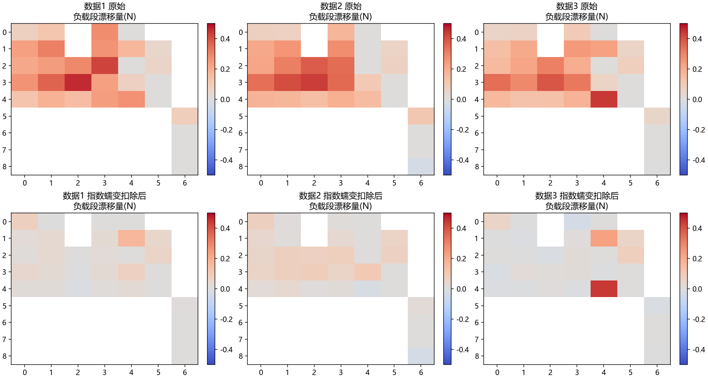

### 结论性发现

1. **时漂只能被"模型"治好，不能被"盲滤波"治好。** 蠕变在频域/时域上与真实恒载不可分，任何不利用蠕变形态先验的方法（EMA、高通、卡尔曼、参考通道、PCA）要么无效、要么破坏真实信号。
2. **现有应用内 Kalman 补偿：零漂→0、噪声减半，但时漂完全保留（34.3% vs 原始 33.9%）**——它对得起"补偿零漂"的名字，但别指望它管时漂。
3. **PCA 去共模对本数据是灾难**：负载阶跃是最强主成分，去 PC1 = 去掉负载本身（保真度 −4%）。阵列盲方法在此场景集体出局。
4. **自动零点跟踪是在线治零漂的最优解**：零漂 1.9%→0.4%、保真度 99.1%、还顺带降噪，且不碰负载段。

---

## 5. 在线化验证：蠕变模型跨数据泛化（留一法）

离线拟合扣除效果再好，在线也无法先知负载段全程。可行路线是**预标定蠕变模型 + 在线反演**：r(t)=1+a(1−e^(−t/τ))，corrected = measured / r(t−t_load)。用"其余两组"的标定参数补偿"本组"：

| 被补偿数据 | 自身蠕变参数 | 标定参数（来自另两组） | 主通道残余漂移 |
|---|---|---|---|
| 数据1 | a/c=0.61, τ=64s | a=0.35, τ=54s | **12.7%** |
| 数据2 | a/c=0.34, τ=74s | a=0.48, τ=49s | **2.7%** |
| 数据3 | a/c=0.35, τ=34s | a=0.48, τ=69s | **4.2%** |

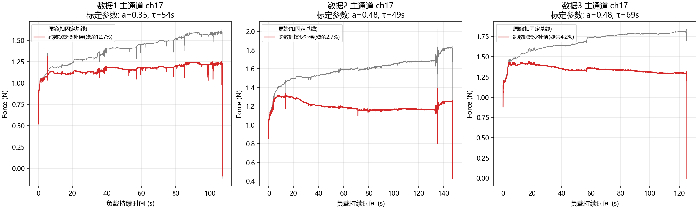

残余漂移从 28%~42% 降到 3%~13%。**路线验证可行**，但注意：

- 蠕变幅度比 a 的组间差异较大（0.34~0.61），数据1 明显更"粘"——可能与负载大小、接触状态、温度或上次加载后的恢复程度有关；
- 3 组数据太少，无法建立 a、τ 对负载/温度的依赖关系。要上线，需要系统的阶梯标定数据（见 §7）。

---

## 6. 工程建议（推荐方案）

**在线实时（应用内）**：
1. **自动零点跟踪**治零漂：全阵列总力低于阈值判定空载 → EMA 逐通道更新零点，检测到加载立即冻结零点（τ≈3s，注意避开卸载后的恢复尾巴，可加"卸载后 N 秒内不更新"保护）。
2. **预标定蠕变补偿**治时漂：加载沿检测 → 按 r(t) 反演。参数先用全局标定值，条件成熟后升级为递归在线辨识（递推最小二乘/卡尔曼联合估计 a、τ），把残余压到 5% 以内。
3. 保留现有 Kalman 降噪（它的零漂归零和降噪功能已被自动零点覆盖，可评估去留）。

**离线分析**：
- 固定基线扣除 + 指数蠕变拟合扣除（残余 <7%、保真 >94%），用于标定数据处理与算法验证的 ground truth。

**明确避免**：EMA 基线跟踪、高通滤波（毁恒载信号）；PCA 去共模、参考通道扣除（对本数据无效甚至有害）。

---

## 7. 现有数据的不足与补充采集建议

当前 3 组数据只有"单一负载、单次恒载、短前空载"，不足以标定蠕变模型。建议按优先级补采：

| 优先级 | 数据 | 采集方式 | 用途 |
|---|---|---|---|
| ★★★ | **阶梯加载** | 0→0.5→1.0→1.5→2.0N 逐级各保持 60~120s（可用砝码/标定重物） | 标定蠕变参数 a(F)、τ(F) 的负载依赖，建蠕变逆模型；验证线性叠加性 |
| ★★★ | **长时纯空载** | 上电后空载连续采 20~30min | 零漂/预热特性：确定"预热多久才能采零点"、空载漂是温漂还是电漂 |
| ★★☆ | **加载-卸载循环** | 同一负载反复加载 60s/卸载 60s ×5~10 次 | 蠕变可重复性、恢复特性（卸载恢复模型对自动零点保护时间很关键） |
| ★★☆ | **多级恒载**（同本次但不同负载） | 3~5 个不同负载各采一组（同本次协议） | 蠕变幅度比 a 是否随负载变化（本次 a: 0.34~0.61 差异来源） |
| ★☆☆ | **卸载后长恢复** | 恒载 2min 后卸载，继续采 5~10min | 粘弹性恢复时间常数；决定零点更新保护窗口 |
| ★☆☆ | **温度同步记录** | 采力数据同时记录环境温度/传感器附近温度 | 区分温漂与蠕变（若空载长漂与温度强相关，则需温度补偿通道） |
| ★☆☆ | **已知重量标定** | 用标准砝码施加已知力 | 蠕变补偿后的绝对精度验证 |

采集协议小改进：前空载段从现在的 8~12s 延长到 **≥60s**（预热稳定后再开始正式记录更好）；记录中标注每次负载的实际重量/接触位置。

---

## 8. 因果（在线）抗蠕变算法研究（2026-09-16 补充）

§5 的留一法验证了"预标定+在线反演"可行，本节系统对比五条因果路线（全部逐帧推进、不使用未来数据；分段只用加载沿/卸载沿检测，不使用全段信息）。

### 8.1 候选路线与原理

| 方法 | 原理 | 先验需求 |
|---|---|---|
| **lead-lag 逆滤波** | 蠕变是 LTI 系统：H(s)=(s+β)/(s+α)，α=1/τ、β=(1+k)/τ；其逆 (s+α)/(s+β) 是稳定一阶 lead-lag，一个差分方程因果实现，高频增益=1（不放噪），卸载恢复自动按叠加原理反演 | k、τ（留一法标定） |
| **卡尔曼状态增广** | 状态 [F, c]：Ḟ=w_F、ċ=(kF−c)/τ、y=F+c+v，在线分离真实力与蠕变 | k、τ + 噪声协方差 |
| **扩展窗在线拟合** | 每 ~1s 用 [t₀, now] 重拟合单指数（暖启动），即时扣除；§4 已证需 ~1τ 才能定准 τ，但持续重拟合使其随时间收敛到离线质量 | 无（纯盲） |
| **RLS 幅度自适应** | 固定 τ 后模型线性化：y=c₀+a·g(t)，g=1−e^(−t/τ)；RLS（遗忘因子 0.9995）在线估蠕变幅度，先验初始化 | τ + 初始 a |
| **自动零点+lead-lag 管线** | 零漂由自动零点跟踪处理，时漂由 lead-lag 处理 | k、τ |

### 8.2 对比结果（3 数据集平均，主通道；明细 `results/causal_metrics.csv`）

| 算法 | 负载段残余漂移% ↓ | 阶跃保真度% | 零漂残余% ↓ | 噪声比 ↓ |
|---|---|---|---|---|
| **自动零点+lead-lag 管线** | **6.5** | 94.7 | 19.1 | **0.7** |
| **预标定 lead-lag 逆滤波** | **6.6** | **95.6** | 19.4 | 1.0 |
| 扩展窗在线拟合（纯盲） | 7.2 | 90.8 | 23.7 | 1.0 |
| RLS 幅度自适应（先验τ） | 7.8 | **96.3** | 28.6 | 1.0 |
| 卡尔曼联合估计 [F,c] | 19.2 | 75.2 | 37.4 | 1.0 |
| 原始（扣固定基线） | 33.9 | 100.0 | **1.9** | 1.0 |

阵列级（19 受载通道平均残余漂移）：lead-lag 5.8%~10.4%，与主通道一致，说明参数空间泛化尚可。

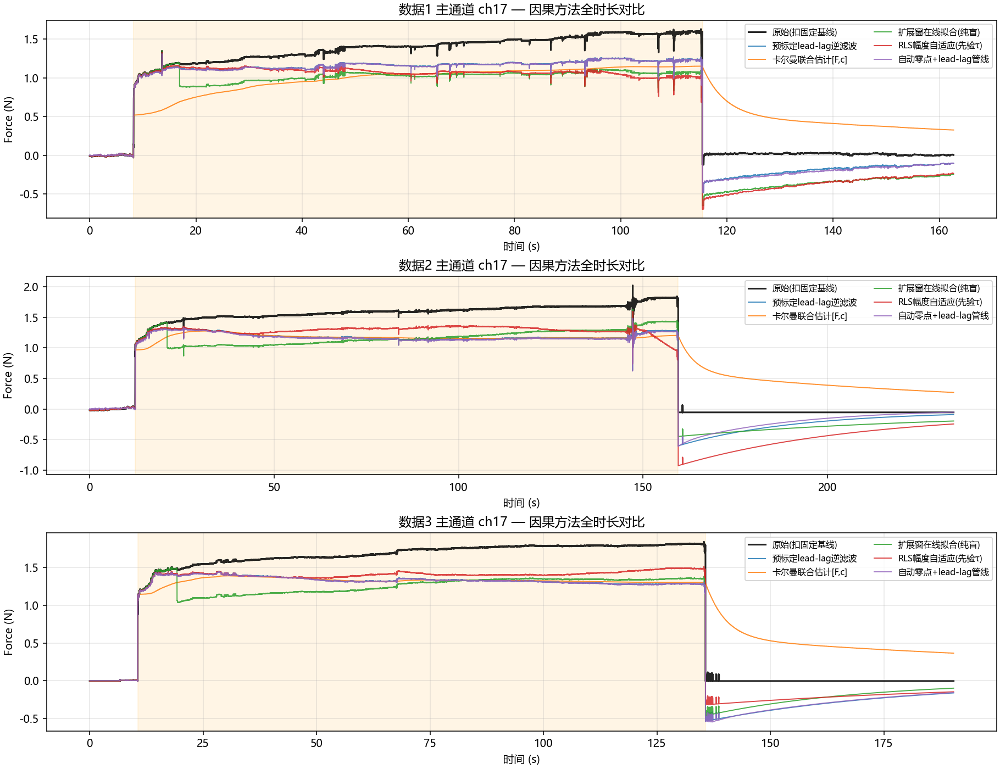

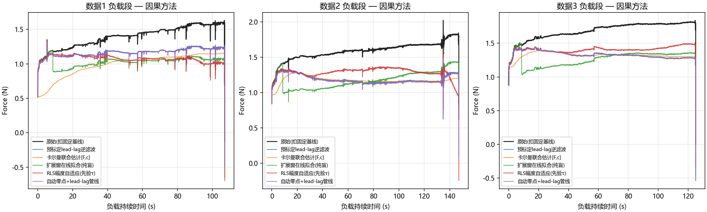

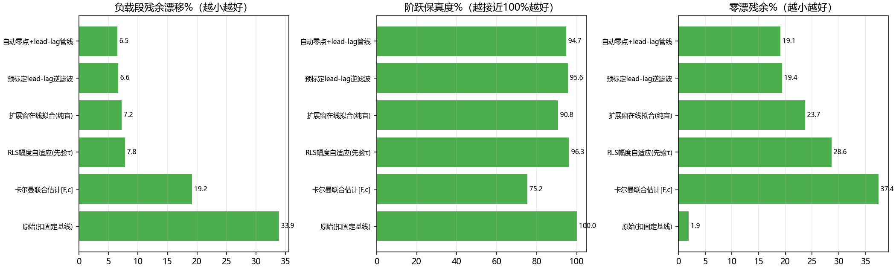

### 8.3 关键发现

1. **lead-lag 逆滤波是因果场景的首选**：解析逆、无迭代、无优化器、无调参（k、τ 来自标定），残余 33.9%→6.6%、保真 95.6%，且每通道每帧只需 2 次乘加——MCU 级成本。
2. **卡尔曼状态增广展示了可辨识性两难**（值得记录的失败）：qF 稍大（1e-6）时蠕变增长被 F 吸收，保真度冲到 155%、补偿失效；qF 钉死+高置信初始化后，参数失配大的数据1 又把 F 低估到 54.5%。根源：y=F+c 单观测无法唯一分解 F 与 c，只能依赖先验钉死一边——而钉死之后它就退化成 lead-lag 的等价物，还多了一簇敏感增益。**不推荐作为首选**，但作为"先验+在线小幅修正"框架仍有价值。
3. **纯盲因果也能用**：扩展窗在线拟合不需要任何标定，残余 7.2%（末端收敛到接近离线质量），代价是前 ~8s 无补偿、保真度略低（90.8%）、每秒一次重拟合的算力。
4. **RLS（固定τ）在可辨识性与适应性间平衡最好**：τ 先验化后参数线性，在线估幅度稳定收敛，残余 7.8%、保真 96.3%——适合"参数随接触状态缓慢变化"的长期在线场景。
5. **卸载恢复与加载蠕变不对称**（重要物理发现）：真实传感器卸载后自然回零很好（原始零漂仅 1.9%），但 LTI 叠加原理预测的恢复尾巴比实测大——所有补偿方法在卸载段反而引入 16%~37% 的人为残余。**工程结论：检测到卸载沿后应立即停止/快速淡出补偿，补偿只在负载段激活。**

### 8.4 推荐在线管线（最终方案）

```
原始信号 → 自动零点跟踪（空载时更新零点，负载时冻结）
        → 加载沿检测（总力上穿阈值）
        → [仅负载段] lead-lag 逆滤波（k、τ 预标定；或 RLS 在线修正 k）
        → 卸载沿检测 → 立即停止补偿（传感器自然回零）
```

预期指标（本数据实测）：负载段残余漂移 ~6%、阶跃保真 ~95%、零漂 ~1~2%（卸载即停补偿后回到原始水平）、噪声比 ~0.7。剩余提升空间依赖阶梯标定数据把 k(F)、τ(F) 定准（§7）。

---

## 附：复现方式

```bash
cd temp/右拇指指尖
python scripts/analyze_characterize.py    # 数据特征 + c1~c5 图
python scripts/compare_algorithms.py      # 11 种算法对比 + d1~d5 图 + metrics.csv
python scripts/cross_generalization.py    # 跨数据泛化 + d6 图
python scripts/sensitivity_creep.py       # 初值鲁棒性/因果化代价 + e1 图
python scripts/causal_methods.py          # 因果算法对比 + f1~f4 图 + causal_metrics.csv
```
（依赖 numpy/pandas/matplotlib/scipy；CSV 读取跳过 24 行 ##Session 头）
